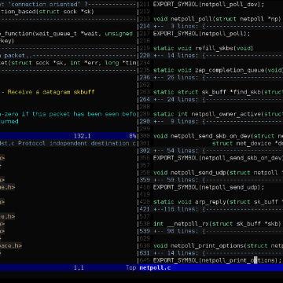

A Look at Vim, a Text Editor for the Ages - The New Stack

A Look at Vim, a Text Editor for the Ages - The New Stack

https://thenewstack.io/a-look-at-vim-a-text-editor-for-the-ages/

When it comes to the most popular text editor on Linux systems, some history is hidden in plain sight. In text files scattered around the web — and through the occasional YouTube video — it’s possible to trace the early history of the Unix-based text editors that went on to become Vim, still in wide …