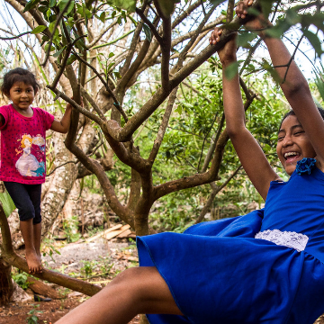

A Lost Secret: How To Get Kids To Pay Attention

A Lost Secret: How To Get Kids To Pay Attention

https://www.npr.org/sections/goatsandsoda/2018/06/21/621752789/a-lost-secret-how-to-get-kids-to-pay-attention

Maya kids do better on tests measuring attention, researchers say it's because these kids have something that many American kids have lost.