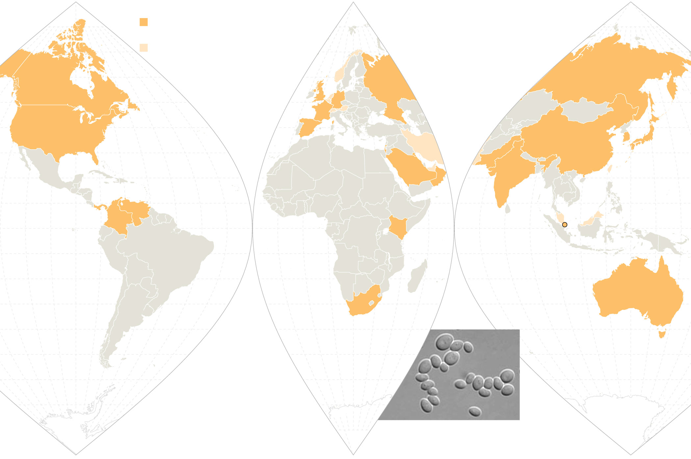

A Mysterious Infection, Spanning the Globe in a Climate of Secrecy

Advertisement

Deadly germs, Lost cures

# A Mysterious Infection, Spanning the Globe in a Climate of SecrecyA Mysterious Infection, Spanning the Globe in a Climate of Secrecy

The rise of Candida auris embodies a serious and growing public health threat: drug-resistant germs.

Video

9:02Revenge of the Bacteria: Why We’re Losing the War

Bacteria are rebelling. They’re turning the tide against antibiotics by outsmarting our wonder drugs. This video explores the surprising reasons.CreditCreditMelissa Golden for The New York Times

By [Matt Richtel](https://www.nytimes.com/by/matt-richtel) and [Andrew Jacobs](https://www.nytimes.com/by/andrew-jacobs)

- April 6, 2019

-

    - 
    - 
    - [](https://www.nytimes.com/2019/04/06/health/drug-resistant-candida-auris.html?action=click&module=Top%20Stories&pgtype=Homepagemailto:?subject=NYTimes.com%3A%20A%20Mysterious%20Infection%2C%20Spanning%20the%20Globe%20in%20a%20Climate%20of%20Secrecy&body=From%20The%20New%20York%20Times%3A%0A%0AA%20Mysterious%20Infection%2C%20Spanning%20the%20Globe%20in%20a%20Climate%20of%20Secrecy%0A%0AThe%20rise%20of%20Candida%20auris%20embodies%20a%20serious%20and%20growing%20public%20health%20threat%3A%20drug-resistant%20germs.%0A%0Ahttps%3A%2F%2Fwww.nytimes.com%2F2019%2F04%2F06%2Fhealth%2Fdrug-resistant-candida-auris.html)

    -
    -
    -

Last May, an elderly man was admitted to the Brooklyn branch of Mount Sinai Hospital for abdominal surgery. A blood test revealed that he was infected with a newly discovered germ as deadly as it was mysterious. Doctors swiftly isolated him in the intensive care unit.

The germ, a fungus called Candida auris, preys on people with weakened immune systems, and it is quietly spreading across the globe. Over the last five years, it has hit a neonatal unit in Venezuela, [swept through a hospital](https://onlinelibrary.wiley.com/doi/epdf/10.1111/myc.12781) in Spain, forced a prestigious British medical center to shut down its intensive care unit, and taken root in India, Pakistan and [South Africa](https://www.ncbi.nlm.nih.gov/pmc/articles/PMC4073876/).

Recently C. auris reached [New York](https://wwwnc.cdc.gov/eid/article/24/10/18-0649_article#tnF2),[New Jersey](https://www.cdc.gov/fungal/candida-auris/tracking-c-auris.html) and Illinois, leading the federal Centers for Disease Control and Prevention to [add it to a list](https://www.cdc.gov/drugresistance/biggest_threats.html) of germs deemed “urgent threats.”

***[*****[*Like the Science Times page on Facebook.*](http://on.fb.me/1paTQ1h)*****  ****| Sign up for the ***[*Science Times newsletter.*](http://nyti.ms/1MbHaRU)*****]***

The man at Mount Sinai died after 90 days in the hospital, but C. auris did not. Tests showed it was everywhere in his room, so invasive that the hospital needed special cleaning equipment and had to rip out some of the ceiling and floor tiles to eradicate it.

Advertisement

“Everything was positive — the walls, the bed, the doors, the curtains, the phones, the sink, the whiteboard, the poles, the pump,” said Dr. Scott Lorin, the hospital’s president. “The mattress, the bed rails, the canister holes, the window shades, the ceiling, everything in the room was positive.”

C. auris is so tenacious, in part, because it is impervious to major antifungal medications, making it a new example of one of the world’s most intractable health threats: the rise of drug-resistant infections.

Dr. Shawn Lockhart, a fungal disease expert at the Centers for Disease Control and Prevention, holding a microscope slide with inactive Candida auris collected from an American patient.CreditMelissa Golden for The New York Times

Image

Dr. Shawn Lockhart, a fungal disease expert at the Centers for Disease Control and Prevention, holding a microscope slide with inactive Candida auris collected from an American patient.CreditMelissa Golden for The New York Times

For decades, public health experts have warned that the overuse of antibiotics was reducing the effectiveness of drugs that have lengthened life spans by curing bacterial infections once commonly fatal. But lately, there has been an explosion of resistant fungi as well, adding a new and frightening dimension to a phenomenon that is undermining a pillar of modern medicine.

“It’s an enormous problem,” said Matthew Fisher, a professor of fungal epidemiology at Imperial College London, who was a co-author of [a recent scientific review](http://science.sciencemag.org/content/360/6390/739) on the rise of resistant fungi. “We depend on being able to treat those patients with antifungals.”

Advertisement

Simply put, fungi, just like bacteria, are evolving defenses to survive modern medicines.

Yet even as world health leaders have pleaded for more restraint in prescribing antimicrobial drugs to combat bacteria and fungi — convening the United Nations General Assembly in 2016 to manage an emerging crisis — gluttonous overuse of them in hospitals, clinics and farming has continued.

Resistant germs are often called “superbugs,” but this is simplistic because they don’t typically kill everyone. Instead, they are most lethal to people with immature or compromised immune systems, including newborns and the elderly, smokers, diabetics and people with autoimmune disorders who take steroids that suppress the body’s defenses.

Scientists say that unless more effective new medicines are developed and unnecessary use of antimicrobial drugs is sharply curbed, risk will spread to healthier populations. A study the British government funded [projects](https://amr-review.org/) that if policies are not put in place to slow the rise of drug resistance, 10 million people could die worldwide of all such infections in 2050, eclipsing the eight million expected to die that year from cancer.

Dr. Johanna Rhodes, an infectious disease expert at Imperial College London. "We are driving this with the use of antifungicides on crops," she said of drug-resistant germs.CreditTom Jamieson for The New York Times

Image

Dr. Johanna Rhodes, an infectious disease expert at Imperial College London. "We are driving this with the use of antifungicides on crops," she said of drug-resistant germs.CreditTom Jamieson for The New York Times

In the United States, two million people contract resistant infections annually, and 23,000 die from them, according to the official C.D.C. estimate. That number was based on 2010 figures; more recent estimates [from researchers at Washington University School of Medicine](https://www.cambridge.org/core/journals/infection-control-and-hospital-epidemiology/article/reestimating-annual-deaths-due-to-multidrugresistant-organism-infections/C9B09A787FCCA1EA992AF45066F3FF7C) put the death toll at 162,000. Worldwide fatalities from resistant infections are [estimated at 700,000](https://amr-review.org/).

Antibiotics and antifungals are both essential to combat infections in people, but antibiotics are also used widely to prevent disease in farm animals, and antifungals are also applied to prevent agricultural plants from rotting. Some scientists cite evidence that rampant use of fungicides on crops is contributing to the surge in drug-resistant fungi infecting humans.

[ What You Need to Know About Candida Auris  C. auris is a mysterious and dangerous fungal infection that is among a growing number of germs that have evolved defenses against common medicines. Here are some basic facts about it. April 6, 2019  ](https://www.nytimes.com/2019/04/06/health/candida-auris-facts.html?action=click&module=RelatedLinks&pgtype=Article)

Yet as the problem grows, it is little understood by the public — in part because the very existence of resistant infections is often cloaked in secrecy.

Advertisement

With bacteria and fungi alike, hospitals and local governments are reluctant to disclose outbreaks for fear of being seen as infection hubs. Even the C.D.C., under its agreement with states, is not allowed to make public the location or name of hospitals involved in outbreaks. State governments have in many cases declined to publicly share information beyond acknowledging that they have had cases.

All the while, the germs are easily spread — carried on hands and equipment inside hospitals; ferried on meat and manure-fertilized vegetables from farms; transported across borders by travelers and on exports and imports; and transferred by patients from nursing home to hospital and back.

C. auris, which infected the man at Mount Sinai, is one of [dozens](https://www.cdc.gov/drugresistance/biggest_threats.html) of dangerous bacteria and fungi that have developed resistance. Yet, like most of them, it is a threat that is virtually unknown to the public.

A projection of the C. auris fungus on a microscope slide.CreditMelissa Golden for The New York Times

Image

A projection of the C. auris fungus on a microscope slide.CreditMelissa Golden for The New York Times

Other prominent strains of the fungus Candida — one of the most common causes of bloodstream infections in hospitals — have not developed significant resistance to drugs, but more than 90 percent of C. auris infections are resistant to at least one drug, and 30 percent are resistant to two or more drugs, the C.D.C. said.

Dr. Lynn Sosa, Connecticut’s deputy state epidemiologist, said she now saw C. auris as “the top” threat among resistant infections. “It’s pretty much unbeatable and difficult to identity,” she said.

Advertisement

Nearly half of patients who contract C. auris die within 90 days, according to the C.D.C. Yet the world’s experts have not nailed down where it came from in the first place.

“It is a creature from the black lagoon,” said Dr. Tom Chiller, who heads the fungal branch at the C.D.C., which is spearheading a global detective effort to find treatments and stop the spread. “It bubbled up and now it is everywhere.”

## Candida Auris

A deadly, drug-resistant fungus is infecting patients in hospitals and nursing homes around the world. The fungus seems to have emerged in several locations at once, not from a single source.

EUROPE

The first large outbreak in Europe involved 72 cases in a London hospital in 2015–16.

COUNTRIES WITH
Multiple cases of
Candida auris infection
One reported case
BRITAIN
RUSSIA
CANADA
FRANCE
GERMANY
UNITED
STATES
UNITED STATES
The country has had at least 587 Candida auris infections since 2013.
SPAIN
JAPAN
CHINA
ISRAEL
KUWAIT
PAKISTAN
SOUTH
KOREA
SAUDI
ARABIA
INDIA
OMAN
PANAMA
VENEZUELA
SINGAPORE
COLOMBIA
KENYA
INDIA AND PAKISTAN

The two countries have some of the highest case counts in the world. A distinct strain appeared in Pakistan as early as 2008 and in Delhi by 2009.

CENTRAL AND
SOUTH AMERICA

The first documented outbreak in the Americas was from 2012–13 at a medical center in Venezuela. Five of 18 infected patients died.

AUSTRALIA
SOUTH
AFRICA
SOUTH AFRICA

A genetically distinct strain of Candida auris in South Africa infected at least 451 patients from 2012–16.

JAPAN

Candida auris (left) was discovered in 2009 in the infected ear of a 70-year-old Japanese woman.

Candida
auris

By The New York Times | Sources: Centers for Disease Control and Prevention; Emerging Infectious Diseases; Emerging Microbes & Infections; Clinical Infectious Diseases; Journal of Infection; Mycoses; Doherty Institute. Image from Kazuo Satoh et al., Microbiology and Immunology

## ‘No need’ to tell the public

In late 2015, Dr. Johanna Rhodes, an infectious disease expert at Imperial College London, got a panicked call from the Royal Brompton Hospital, a British medical center outside London. C. auris had taken root there months earlier, and the hospital couldn’t clear it.

“‘We have no idea where it’s coming from. We’ve never heard of it. It’s just spread like wildfire,’” Dr. Rhodes said she was told. She agreed to help the hospital identify the fungus’s genetic profile and clean it from rooms.

Under her direction, hospital workers used a special device to spray aerosolized hydrogen peroxide around a room used for a patient with C. auris, the theory being that the vapor would scour each nook and cranny. They left the device going for a week. Then they put a “settle plate” in the middle of the room with a gel at the bottom that would serve as a place for any surviving microbes to grow, Dr. Rhodes said.

Only one organism grew back. C. auris.

It was spreading, but word of it was not. The hospital, a specialty lung and heart center that draws wealthy patients from the Middle East and around Europe, alerted the British government and told infected patients, but made no public announcement.

Advertisement

“There was no need to put out a news release during the outbreak,” said Oliver Wilkinson, a spokesman for the hospital.

This hushed panic is playing out in hospitals around the world. Individual institutions and national, state and local governments have been reluctant to publicize outbreaks of resistant infections, arguing there is no point in scaring patients — or prospective ones.

"Somehow, it made a jump almost seemingly simultaneously, and seemed to spread and it is drug resistant, which is really mind-boggling," said Dr. Snigdha Vallabhaneni, a fungal expert and epidemiologist at the C.D.C.CreditMelissa Golden for The New York Times

Image

"Somehow, it made a jump almost seemingly simultaneously, and seemed to spread and it is drug resistant, which is really mind-boggling," said Dr. Snigdha Vallabhaneni, a fungal expert and epidemiologist at the C.D.C.CreditMelissa Golden for The New York Times

Dr. Silke Schelenz, Royal Brompton’s infectious disease specialist, found the lack of urgency from the government and hospital in the early stages of the outbreak “very, very frustrating.”

“They obviously didn’t want to lose reputation,” Dr. Schelenz said. “It hadn’t impacted our surgical outcomes.”

By the end of June 2016, a scientific paper [reported “an ongoing outbreak of 50 C. auris cases”](https://aricjournal.biomedcentral.com/articles/10.1186/s13756-016-0132-5) at Royal Brompton, and the hospital took an extraordinary step: It shut down its I.C.U. for 11 days, moving intensive care patients to another floor, again with no announcement.

Days later the hospital finally acknowledged to a newspaper that it had a problem. A [headline](https://www.telegraph.co.uk/news/2016/07/08/intensive-care-unit-closed-as-three-people-die-from-new-superbug/) in The Daily Telegraph warned, “Intensive Care Unit Closed After Deadly New Superbug Emerges in the U.K.” (Later research said there were eventually 72 total cases, though some patients were only carriers and were not infected by the fungus.)

Advertisement

Yet the issue remained little known internationally, while an even bigger outbreak had begun in Valencia, Spain, at the 992-bed Hospital Universitari i Politècnic La Fe. There, unbeknown to the public or unaffected patients, 372 people were colonized — meaning they had the germ on their body but were not sick with it — and 85 developed bloodstream infections. A [paper in the journal Mycoses](https://onlinelibrary.wiley.com/doi/full/10.1111/myc.12781) reported that 41 percent of the infected patients died within 30 days.

A statement from the hospital said it was not necessarily C. auris that killed them. “It is very difficult to discern whether patients die from the pathogen or with it, since they are patients with many underlying diseases and in very serious general condition,” the statement said.

As with Royal Brompton, the hospital in Spain did not make any public announcement. It still has not.

One author of the article in Mycoses, a doctor at the hospital, said in an email that the hospital did not want him to speak to journalists because it “is concerned about the public image of the hospital.”

The secrecy infuriates patient advocates, who say people have a right to know if there is an outbreak so they can decide whether to go to a hospital, particularly when dealing with a nonurgent matter, like elective surgery.

Outside the Royal Brompton Hospital near London. By June 2016, the hospital had seen at least 50 “proven or possible” cases of C. auris, and decided to shut down its intensive care unit for 11 days to address the contamination.CreditTom Jamieson for The New York Times

Image

Outside the Royal Brompton Hospital near London. By June 2016, the hospital had seen at least 50 “proven or possible” cases of C. auris, and decided to shut down its intensive care unit for 11 days to address the contamination.CreditTom Jamieson for The New York Times

“Why the heck are we reading about an outbreak almost a year and a half later — and not have it front-page news the day after it happens?” said Dr. Kevin Kavanagh, a physician in Kentucky and [board chairman of Health Watch USA](http://www.healthwatchusa.org/HWUSA-Officers/bios/_Kavanagh.htm), a nonprofit patient advocacy group. “You wouldn’t tolerate this at a restaurant with a food poisoning outbreak.”

Advertisement

Health officials say that disclosing outbreaks frightens patients about a situation they can do nothing about, particularly when the risks are unclear.

“It’s hard enough with these organisms for health care providers to wrap their heads around it,” said Dr. Anna Yaffee, a former C.D.C. outbreak investigator who dealt with resistant infection outbreaks in Kentucky in which the hospitals were not publicly disclosed. “It’s really impossible to message to the public.”

Officials in London did alert the C.D.C. to the Royal Brompton outbreak while it was occurring. And the C.D.C. realized it needed to get the word to American hospitals. On June 24, 2016, the C.D.C. blasted a nationwide warning to hospitals and medical groups and set up an email address, [candidaauris@cdc.gov](https://www.nytimes.com/2019/04/06/health/drug-resistant-candida-auris.html?action=click&module=Top%20Stories&pgtype=Homepagemailto:candidaauris@cdc.gov), to field queries. Dr. Snigdha Vallabhaneni, a key member of the fungal team, expected to get a trickle — “maybe a message every month.”

Instead, within weeks, her inbox exploded.

## Coming to America

In the United States, 587 cases of people having contracted C. auris have been reported, concentrated with 309 in New York, 104 in New Jersey and 144 in Illinois, according to the C.D.C.

The symptoms — fever, aches and fatigue — are seemingly ordinary, but when a person gets infected, particularly someone already unhealthy, such commonplace symptoms can be fatal.

The earliest known case in the United States involved a woman who arrived at a New York hospital on May 6, 2013, seeking care for respiratory failure. She was 61 and from the United Arab Emirates, and she died a week later, after testing positive for the fungus. At the time, the hospital hadn’t thought much of it, but three years later, it sent the case to the C.D.C. after reading the agency’s June 2016 advisory.

## Candida Auris by State

Most cases in the United States have been in nursing homes in New York City, Chicago and New Jersey.

Mass.
N.Y.
Conn.
N.J.
Ill.
Ind.
Md.
Calif.
Va.
Okla.
200
Tex.
100
Fla.
25
Confirmed and
probable cases,
2013–19
1
By The New York Times | Source: Centers for Disease Control and Prevention
Advertisement

[      The truth is worth it.        See the stories](https://adclick.g.doubleclick.net/pcs/click?xai=AKAOjstZrgPPGUv8LNEP1tTEdyot6FwfZiVgyC1CkOGgBl3WzNXmqbUOiMigNTcMRx5oWNNZbGiNI8AI2wwTUixHbYcR4NIYKU9DUGklsHFFPn799JAigu9qIxpUdGKhiiV_Y3O_l_vnWDrHoivEYIQZoxjHyRUByxkFS1M-RgqMqD8PFJrUfpM4tS9HRUqEFHSVG1OhT2ayqXZDNWP_z3h5SE__EWsBIKfh5LGqGaSIbarKpPsbxqvu00Ab7XeQyS38&sig=Cg0ArKJSzKnYXqRICiskEAE&urlfix=1&adurl=https://ad.doubleclick.net/ddm/trackclk/N296811.6440THENEWYORKTIMESCOMPA/B22187340.237970964%3Bdc_trk_aid%3D435228218%3Bdc_trk_cid%3D111025435%3Bdc_lat%3D%3Bdc_rdid%3D%3Btag_for_child_directed_treatment%3D%3Btfua%3D)

This woman probably was not America’s first C. auris patient. She carried a strain different from the South Asian one most common here. It killed a 56-year-old American woman who had traveled to India in March 2017 for elective abdominal surgery, contracted C. auris and was airlifted back to a hospital in Connecticut that officials will not identify. She was later transferred to a Texas hospital, where she died.

The germ has spread into long-term care facilities. In Chicago, 50 percent of the residents at some nursing homes have tested positive for it, the C.D.C. has reported. The fungus can grow on intravenous lines and ventilators.

Workers who care for patients infected with C. auris worry for their own safety. Dr. Matthew McCarthy, who has treated several C. auris patients at Weill Cornell Medical Center in New York, described experiencing an unusual fear when treating a 30-year-old man.

“I found myself not wanting to touch the guy,” he said. “I didn’t want to take it from the guy and bring it to someone else.” He did his job and thoroughly examined the patient, but said, “There was an overwhelming feeling of being terrified of accidentally picking it up on a sock or tie or gown.”

Dr. Tom Chiller, head of the fungal branch at the C.D.C. “It is a creature from the black lagoon,” he said of C. auris.CreditMelissa Golden for The New York Times

Image

Dr. Tom Chiller, head of the fungal branch at the C.D.C. “It is a creature from the black lagoon,” he said of C. auris.CreditMelissa Golden for The New York Times

## The role of pesticides?

As the C.D.C. works to limit the spread of drug-resistant C. auris, its investigators have been trying to answer the vexing question: Where in the world did it come from?

The first time doctors encountered C. auris was [in the ear](https://www.ncbi.nlm.nih.gov/pubmed/19161556) of a woman in Japan in 2009 (auris is Latin for ear). It seemed innocuous at the time, a cousin of common, easily treated fungal infections.

Advertisement

Three years later, it appeared in an unusual test result in the lab of [Dr. Jacques Meis](https://www.ecmm.info/fecmm/fellows/meis-jacques/), a microbiologist in Nijmegen, the Netherlands, who was analyzing a bloodstream infection in 18 patients from four hospitals in India. Soon, new clusters of C. auris seemed to emerge with each passing month in different parts of the world.

The C.D.C. investigators theorized that C. auris started in Asia and spread across the globe. But when the agency compared the entire genome of auris samples from India and Pakistan, Venezuela, South Africa and Japan, it found that its origin was not a single place, and there was not a single auris strain.

The C.D.C. in miniature. In the United States, two million people contract resistant infections each year, and 23,000 die from them, according to the official C.D.C. estimate.CreditMelissa Golden for The New York Times

Image

The C.D.C. in miniature. In the United States, two million people contract resistant infections each year, and 23,000 die from them, according to the official C.D.C. estimate.CreditMelissa Golden for The New York Times

The genome sequencing showed that there were four distinctive versions of the fungus, with differences so profound that they suggested that these strains had diverged thousands of years ago and emerged as resistant pathogens from harmless environmental strains in four different places at the same time.

“Somehow, it made a jump almost seemingly simultaneously, and seemed to spread and it is drug resistant, which is really mind-boggling,” Dr. Vallabhaneni said.

There are different theories as to what happened with C. auris. Dr. Meis, the Dutch researcher, said he believed that drug-resistant fungi were developing thanks to heavy use of fungicides on crops.

Dr. Meis became intrigued by resistant fungi when he heard about the case of a 63-year-old patient in the Netherlands who died in 2005 from a fungus called Aspergillus. It proved resistant to a front-line antifungal treatment called itraconazole. That drug is a virtual copy of the azole pesticides that are used to dust crops the world over and account for more than [one-third of all fungicide sales](https://www.ncbi.nlm.nih.gov/pmc/articles/PMC3812019/).

Advertisement

A 2013 [paper](https://journals.plos.org/plospathogens/article?id=10.1371/journal.ppat.1003633) in Plos Pathogens said that it appeared to be no coincidence that drug-resistant Aspergillus was showing up in the environment where the azole fungicides were used. The fungus appeared in 12 percent of Dutch soil samples, for example, but also in “flower beds, compost, leaves, plant seeds, soil samples of tea gardens, paddy fields, hospital surroundings, and aerial samples of hospitals.”

Dr. Meis visited the C.D.C. last summer to share research and theorize that the same thing is happening with C. auris, which is also found in the soil: Azoles have created an environment so hostile that the fungi are evolving, with resistant strains surviving.

This is similar to concerns that resistant bacteria are growing because of excessive use of antibiotics in livestock for health and growth promotion. As with antibiotics in farm animals, azoles are used widely on crops.

“On everything — potatoes, beans, wheat, anything you can think of, tomatoes, onions,” said Dr. Rhodes, the infectious disease specialist who worked on the London outbreak. “We are driving this with the use of antifungicides on crops.”

Dr. Chiller theorizes that C. auris may have benefited from the heavy use of fungicides. His idea is that C. auris actually has existed for thousands of years, hidden in the world’s crevices, a not particularly aggressive bug. But as azoles began destroying more prevalent fungi, an opportunity arrived for C. auris to enter the breach, a germ that had the ability to readily resist fungicides now suitable for a world in which fungi less able to resist are under attack.

The mystery of C. auris’s emergence remains unsolved, and its origin seems, for the moment, to be less important than stopping its spread.

An empty hospital bed at Mount Sinai.CreditHilary Swift for The New York Times

Image

An empty hospital bed at Mount Sinai.CreditHilary Swift for The New York Times
Advertisement

## Resistance and denial

For now, the uncertainty around C. auris has led to a climate of fear, and sometimes denial.

Last spring, Jasmine Cutler, 29, went to visit her 72-year-old father at a hospital in New York City, where he had been admitted because of complications from a surgery the previous month.

When she arrived at his room, she discovered that he had been sitting for at least an hour in a recliner, in his own feces, because no one had come when he had called for help to use the bathroom. Ms. Cutler said it became clear to her that the staff was afraid to touch him because a test had shown that he was carrying C. auris.

“I saw doctors and nurses looking in the window of his room,” she said. “My father’s not a guinea pig. You’re not going to treat him like a freak at a show.”

He was eventually discharged and told he no longer carried the fungus. But he declined to be named, saying he feared being associated with the frightening infection.

Matt Richtel is a best-selling author and Pulitzer Prize-winning reporter based in San Francisco. He joined The Times staff in 2000, and his work has focused on science, technology, business and narrative-driven storytelling around these issues.

    [@mrichtel](https://twitter.com/mrichtel)

Andrew Jacobs is a reporter with the Health and Science Desk, based in New York. He previously reported from Beijing and Brazil and had stints as a Metro reporter, Styles writer and National correspondent, covering the American South.   [@AndrewJacobsNYT](https://twitter.com/AndrewJacobsNYT)

- 
- 
- [](https://www.nytimes.com/2019/04/06/health/drug-resistant-candida-auris.html?action=click&module=Top%20Stories&pgtype=Homepagemailto:?subject=NYTimes.com%3A%20A%20Mysterious%20Infection%2C%20Spanning%20the%20Globe%20in%20a%20Climate%20of%20Secrecy&body=From%20The%20New%20York%20Times%3A%0A%0AA%20Mysterious%20Infection%2C%20Spanning%20the%20Globe%20in%20a%20Climate%20of%20Secrecy%0A%0AThe%20rise%20of%20Candida%20auris%20embodies%20a%20serious%20and%20growing%20public%20health%20threat%3A%20drug-resistant%20germs.%0A%0Ahttps%3A%2F%2Fwww.nytimes.com%2F2019%2F04%2F06%2Fhealth%2Fdrug-resistant-candida-auris.html)

-

Advertisement