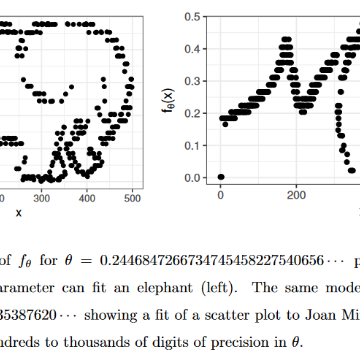

A One Parameter Equation That Can Exactly Fit Any Scatter Plot - Marginal REVOLUTION

A One Parameter Equation That Can Exactly Fit Any Scatter Plot - Marginal REVOLUTION

https://marginalrevolution.com/marginalrevolution/2018/05/one-parameter-equation-can-exactly-fit-scatter-plot.html

In a very surprising paper Steven Piantadosi shows that a simple function of one parameter (θ) can fit any collection of ordered pairs {Xi,Yi} to arbitrary precision. In other words, the same simple function can fit any scatter plot exactly, just by choosing the right θ. The intuition comes from chaos theory. We know from …