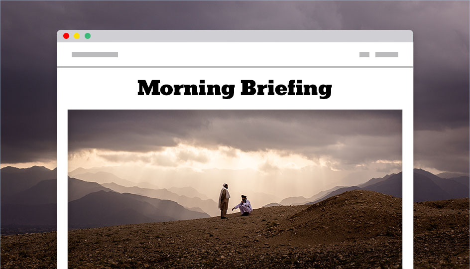
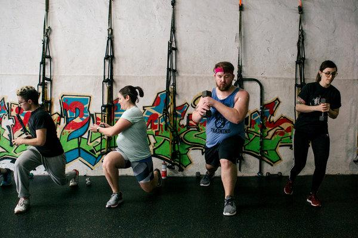
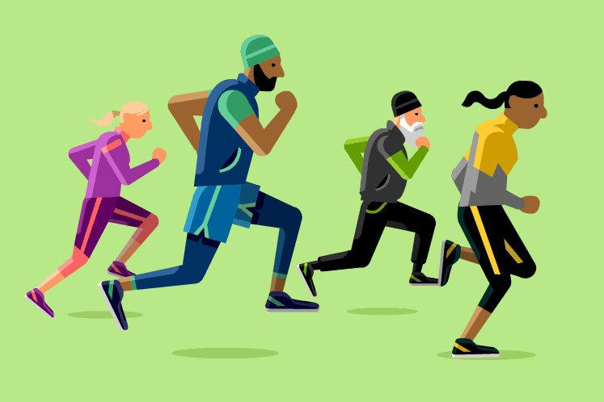
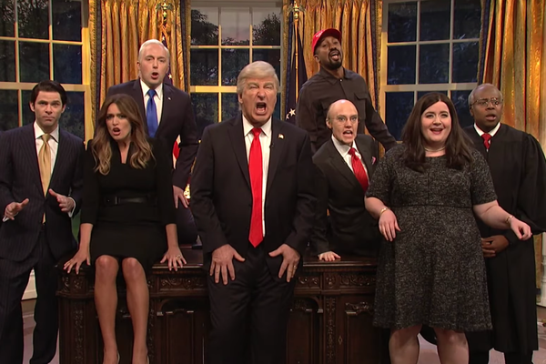

A Possible Weight Loss Strategy: Skip Breakfast Before Exercise

Advertisement

[](https://adclick.g.doubleclick.net/pcs/click?xai=AKAOjssyry23SfCG27MDPyvxnQdz81c-HpglRgMIDSawU2a_bjbtns3GJ1C97rtVYql6M2Y12aJkWA0LV-X6aS4YfD1a9Pj4HxF_ryT45fDw7c_sDH0NiHTOjkoO2-NyhTH5Jel5aNVPOWNPQkLifpAwic38cN9a6AuRliOashtyXA5rA6g4loxV0-8h9FX9sR70TIcRXlOqhfMyJonBkqZOjfVRXUP9ox8a7AtUcYTswXMC4poxwO84QHc4-WS6_vol5g&sig=Cg0ArKJSzGEDul2C0j-8EAE&urlfix=1&adurl=https://ad.doubleclick.net/ddm/trackclk/N296811.6440THENEWYORKTIMESCOMPA/B22187340.237970964%3Bdc_trk_aid%3D435228218%3Bdc_trk_cid%3D111025435%3Bdc_lat%3D%3Bdc_rdid%3D%3Btag_for_child_directed_treatment%3D%3Btfua%3D)

[      The truth is worth it.         See the stories](https://adclick.g.doubleclick.net/pcs/click?xai=AKAOjssyry23SfCG27MDPyvxnQdz81c-HpglRgMIDSawU2a_bjbtns3GJ1C97rtVYql6M2Y12aJkWA0LV-X6aS4YfD1a9Pj4HxF_ryT45fDw7c_sDH0NiHTOjkoO2-NyhTH5Jel5aNVPOWNPQkLifpAwic38cN9a6AuRliOashtyXA5rA6g4loxV0-8h9FX9sR70TIcRXlOqhfMyJonBkqZOjfVRXUP9ox8a7AtUcYTswXMC4poxwO84QHc4-WS6_vol5g&sig=Cg0ArKJSzGEDul2C0j-8EAE&urlfix=1&adurl=https://ad.doubleclick.net/ddm/trackclk/N296811.6440THENEWYORKTIMESCOMPA/B22187340.237970964%3Bdc_trk_aid%3D435228218%3Bdc_trk_cid%3D111025435%3Bdc_lat%3D%3Bdc_rdid%3D%3Btag_for_child_directed_treatment%3D%3Btfua%3D)

Phys Ed

# A Possible Weight Loss Strategy: Skip Breakfast Before ExerciseA Possible Weight Loss Strategy: Skip Breakfast Before Exercise

A new study finds that the choice to eat or omit a meal before an early workout could affect our relationship to food for the rest of the day.

CreditGetty Images

Image

CreditCreditGetty Images

By [Gretchen Reynolds](https://www.nytimes.com/by/gretchen-reynolds)

- May 22, 2019

-

    - 
    - 
    - [](https://www.nytimes.com/2019/05/22/well/move/a-possible-weight-loss-strategy-skip-breakfast-before-exercise.html?action=click&module=Discovery&pgtype=Homepagemailto:?subject=NYTimes.com%3A%20A%20Possible%20Weight%20Loss%20Strategy%3A%20Skip%20Breakfast%20Before%20Exercise&body=From%20The%20New%20York%20Times%3A%0A%0AA%20Possible%20Weight%20Loss%20Strategy%3A%20Skip%20Breakfast%20Before%20Exercise%0A%0AA%20new%20study%20finds%20that%20the%20choice%20to%20eat%20or%20omit%20a%20meal%20before%20an%20early%20workout%20could%20affect%20our%20relationship%20to%20food%20for%20the%20rest%20of%20the%20day.%0A%0Ahttps%3A%2F%2Fwww.nytimes.com%2F2019%2F05%2F22%2Fwell%2Fmove%2Fa-possible-weight-loss-strategy-skip-breakfast-before-exercise.html)

    -
    -
    -

Skipping breakfast before exercise might reduce how much we eat during the remainder of the day, according to a small but intriguing new study of fit young men.

The study finds that the choice to eat or omit a meal before an early workout could affect our relationship to food for the rest of the day, in complicated and sometimes unexpected ways.

Weight management is, of course, one of the great public — and private — health concerns of our time. But the role of exercise in helping people to maintain, lose or, in some instances, add pounds is problematic. Exercise burns calories, but in many past studies, people who begin a new exercise program do not lose as much weight as would be expected, because they often compensate for the energy used during exercise by eating more later or moving less.

These compensations, usually subtle and unintended, indicate that our brains are receiving internal communiqués detailing how much energy we used during that last workout and, in response, sending biological signals that increase hunger or reduce our urge to move. Our helpful brains do not wish us to sustain an energy deficit and starve.

Advertisement

[](https://adclick.g.doubleclick.net/pcs/click?xai=AKAOjstMpYzMZB56q7gdZ2De-KcNa-5AFZvXTMTxpeuDygcmdvePFpiy_jOIoqJXG0wqg2Jmvkbj90_GHI725L0CBbyr-r0I5wEDgnaDrJpmZrCNGpxTCixB4eoMuNJjh9JARvXDrJ6cTON21q_ZIS4Tm8H77UCYILolT9c7-6iOGu-EQv4CtN7JSEK96QRVBon-Wxo1Nmf3qGPJf-6G7pKm1ytWYmEk3bpMuPU7WPf3UXYzdUAoG6siXmUa_M8-RvNFAw&sig=Cg0ArKJSzPisndIjrQmSEAE&urlfix=1&adurl=https://ad.doubleclick.net/ddm/trackclk/N296811.6440THENEWYORKTIMESCOMPA/B22187340.237970964%3Bdc_trk_aid%3D435228218%3Bdc_trk_cid%3D111025435%3Bdc_lat%3D%3Bdc_rdid%3D%3Btag_for_child_directed_treatment%3D%3Btfua%3D)

[      The truth is worth it.         See the stories](https://adclick.g.doubleclick.net/pcs/click?xai=AKAOjstMpYzMZB56q7gdZ2De-KcNa-5AFZvXTMTxpeuDygcmdvePFpiy_jOIoqJXG0wqg2Jmvkbj90_GHI725L0CBbyr-r0I5wEDgnaDrJpmZrCNGpxTCixB4eoMuNJjh9JARvXDrJ6cTON21q_ZIS4Tm8H77UCYILolT9c7-6iOGu-EQv4CtN7JSEK96QRVBon-Wxo1Nmf3qGPJf-6G7pKm1ytWYmEk3bpMuPU7WPf3UXYzdUAoG6siXmUa_M8-RvNFAw&sig=Cg0ArKJSzPisndIjrQmSEAE&urlfix=1&adurl=https://ad.doubleclick.net/ddm/trackclk/N296811.6440THENEWYORKTIMESCOMPA/B22187340.237970964%3Bdc_trk_aid%3D435228218%3Bdc_trk_cid%3D111025435%3Bdc_lat%3D%3Bdc_rdid%3D%3Btag_for_child_directed_treatment%3D%3Btfua%3D)

Previous studies show that many aspects of eating and exercise can affect how much people compensate for the calories burned during exercise, including the type and length of the exercise and the fitness and weight of the exercisers.

Skipping or consuming breakfast also can matter. When we eat a meal, our bodies rely on the carbohydrates in those foods as a primary source of energy. Some of those carbohydrates are stored in our bodies, but those internal stores of carbohydrates are small compared to the stores of fat. Some researchers believe that our brains may pay particular attention to any reductions in our carbohydrate levels and rush to replace them.

This is where breakfast comes in. If we skip eating in the morning, we have no calories from a meal available for fuel during exercise and instead will rely on — and reduce — our internal carbohydrate stores, along with some of our fat.

Some researchers have speculated that we might then wind up overcompensating later, eating more calories than we burned during the workout and undermining our efforts to maintain or lose weight.

But that possibility had not been investigated. So, for the new study, which was [published in April](https://academic.oup.com/jn/advance-article/doi/10.1093/jn/nxz018/5440571)[in The Journal of Nutrition](https://academic.oup.com/jn/advance-article/doi/10.1093/jn/nxz018/5440571), scientists from the University of Bath in England and other institutions decided to look more closely at how breakfast and exercise interact.

## Editors’ Picks

[### Emma Thompson Gets a Shock at 60](https://www.nytimes.com/2019/05/23/movies/emma-thompson.html?fallback=0&recId=1Ldljf345pvdqCpWGz6a30N2DlY&locked=0&geoContinent=EU&geoRegion=CMD&recAlloc=story&geoCountry=GB&blockId=home-featured&imp_id=261848801&action=click&module=editorContent&pgtype=Article&region=CompanionColumn&contentCollection=Trending)

[### What Is a Reward Point Worth? It Depends](https://www.nytimes.com/2019/05/20/business/loyalty-programs-airlines-hotels.html?fallback=0&recId=1Ldljf345pvdqCpWGz6a30N2DlY&locked=0&geoContinent=EU&geoRegion=CMD&recAlloc=story&geoCountry=GB&blockId=home-featured&imp_id=796638308&action=click&module=editorContent&pgtype=Article&region=CompanionColumn&contentCollection=Trending)

[### How Much Alcohol Can You Drink Safely?](https://www.nytimes.com/2019/05/16/magazine/how-much-alcohol-can-you-drink-safe-health.html?fallback=0&recId=1Ldljf345pvdqCpWGz6a30N2DlY&locked=0&geoContinent=EU&geoRegion=CMD&recAlloc=story&geoCountry=GB&blockId=home-featured&imp_id=551655295&action=click&module=editorContent&pgtype=Article&region=CompanionColumn&contentCollection=Trending)

 [ PAID POST: Kuwait Fund for Arab Economic Development](https://adclick.g.doubleclick.net/pcs/click?xai=AKAOjst56QKvHIcnrD4R-hyZQLeA0fvVKBp9wZBHCrN-BGBXBP-W0pBNSnixtfSNIkVz4EhxlewkW-M2R75mYccOp_B3fzGiyoiWSPlr9hPs54Vmf2W1tDJXBTdRbPZ_Z0PXq1oVTegSetQm7jiE8Q8fLFfwOyYFPDj3xDmm5nrVvPQeKdGOJuSku-ENRuCXE0m1JCT-10A_nS0jpgOEWmcHGxlA5CcwOQ2rq8wsRv9_YETxogTFTbEVBz8TLgBUK20&sig=Cg0ArKJSzAkPalFmyW1rEAE&urlfix=1&adurl=https://www.nytimes.com/paidpost/kuwait-fund/lending-support-to-the-world.html%3Fcpv_ap_id%3D50005736%26sr_source%3Dlift_ed%26tbs_nyt%3D2019-april-nytnative_ed)[ In Belgrade, Watch How a Stalled Rail Station Got Rolling](https://adclick.g.doubleclick.net/pcs/click?xai=AKAOjst56QKvHIcnrD4R-hyZQLeA0fvVKBp9wZBHCrN-BGBXBP-W0pBNSnixtfSNIkVz4EhxlewkW-M2R75mYccOp_B3fzGiyoiWSPlr9hPs54Vmf2W1tDJXBTdRbPZ_Z0PXq1oVTegSetQm7jiE8Q8fLFfwOyYFPDj3xDmm5nrVvPQeKdGOJuSku-ENRuCXE0m1JCT-10A_nS0jpgOEWmcHGxlA5CcwOQ2rq8wsRv9_YETxogTFTbEVBz8TLgBUK20&sig=Cg0ArKJSzAkPalFmyW1rEAE&urlfix=1&adurl=https://www.nytimes.com/paidpost/kuwait-fund/lending-support-to-the-world.html%3Fcpv_ap_id%3D50005736%26sr_source%3Dlift_ed%26tbs_nyt%3D2019-april-nytnative_ed)

Advertisement

[      The truth is worth it.        See the stories](https://adclick.g.doubleclick.net/pcs/click?xai=AKAOjst7mBMXFpU88rMFPB-RQgpUdaEC6DhfUeK-nryGc1YC9N-U16fgJzDwcnjxiYX42gfl6WDqHwukm77SrEayvh3U6-UIa0H-hnaOSXuACG8J-91WFwEgxA1ihGN92zoS_fzL4_Y0QmIcwsQ1udVJxYE-S0ffZZ-7daaV8P4i4tXkhbUVbVqDsCODlbG6VbXn-BZDTw8Kjg7hnJMVUNSDFCCcoXmEAu5xMATLOXJgtQXXeP0jUu99cCwfTlb3hCfPug&sig=Cg0ArKJSzCq1MFJU5z-IEAE&urlfix=1&adurl=https://ad.doubleclick.net/ddm/trackclk/N296811.6440THENEWYORKTIMESCOMPA/B22187340.237970964%3Bdc_trk_aid%3D435228218%3Bdc_trk_cid%3D111025435%3Bdc_lat%3D%3Bdc_rdid%3D%3Btag_for_child_directed_treatment%3D%3Btfua%3D)

They first recruited 12 healthy, active young men and asked them to report to the university’s exercise lab on three separate mornings. On one morning, the men ate a hearty, 430-calorie bowl of oatmeal and rested for several hours.

Another morning, they swallowed the same porridge before riding a bike moderately for an hour.

On a third visit, they skipped the porridge but rode the bike, not eating at all until lunch.

Each time, the men stayed at the lab through lunch, eating as much or little at that meal as they wished. The scientists also handed the men food baskets to take home, asking them to eat only from the basket and return uneaten portions, so the researchers could track their daily calories. They also used respiratory masks and mathematical formulas to estimate their 24-hour energy expenditure.

Then the scientists compared numbers, with some results they had not predicted.

Least surprising, the men wound up with an energy surplus when they had breakfasted and then sat, taking in about 490 more calories that day than they burned.

When they downed porridge and then worked out, though, they maintained their energy balance with fine precision, burning and consuming almost exactly the same number of calories that day.

It was when they had skipped breakfast before exercise that their eating became most interesting. Having presumably depleted most of their bodies’ stored carbohydrates during the cycling that day, the men seemed ravenous at lunch, consuming substantially more calories than during either of their other lab visits.

But afterward their eating tailed off and at the end of the day, they maintained an energy deficit of nearly 400 calories, meaning they had replenished few of the calories they had burned while riding.

## Sign Up for NYT Parenting

From the team at NYT Parenting: Get the latest news and guidance for parents. We'll celebrate the little parenting moments that mean a lot — and share stories that matter to families.

Advertisement

 [(L)](https://adclick.g.doubleclick.net/pcs/click%253Fxai%253DAKAOjsusM4EnraeDBPWBDKLl_iacfKINtsyzmtyVhilmEQbigTXxcXd3nwH31BR2ftIUavtmr4rPVPEU_rgKtrE0v5dS7-x1fI2EDr3ST-rTNm5KTvCXyo4kXJp9m98X51R763wYlvhLtYlZC4qeNz85YxhsI_zabmMX_1_5wq9B7MQiStrROxNXANfqgn2LoFIPXxm5FZrJxR0lYurJRS5ofAi9qqO-QRis_MCUTzWv_GkLRMuHnhxd9MAGdFzW3vmOOQ%2526sig%253DCg0ArKJSzBD_mZKt75kVEAE%2526urlfix%253D1%2526adurl%253Dhttps://ad.doubleclick.net/ddm/trackclk/N296811.6440THENEWYORKTIMESCOMPA/B22283637.240760403%3Bdc_trk_aid%3D437790116%3Bdc_trk_cid%3D112659738%3Bdc_lat%3D%3Bdc_rdid%3D%3Btag_for_child_directed_treatment%3D%3Btfua%3D)

[                  Set the course for the day ahead.           Prepare for the day’s conversations with a newsletter from our journalists, delivered to your inbox weekday mornings.        sign up      ](https://adclick.g.doubleclick.net/pcs/click%253Fxai%253DAKAOjsusM4EnraeDBPWBDKLl_iacfKINtsyzmtyVhilmEQbigTXxcXd3nwH31BR2ftIUavtmr4rPVPEU_rgKtrE0v5dS7-x1fI2EDr3ST-rTNm5KTvCXyo4kXJp9m98X51R763wYlvhLtYlZC4qeNz85YxhsI_zabmMX_1_5wq9B7MQiStrROxNXANfqgn2LoFIPXxm5FZrJxR0lYurJRS5ofAi9qqO-QRis_MCUTzWv_GkLRMuHnhxd9MAGdFzW3vmOOQ%2526sig%253DCg0ArKJSzBD_mZKt75kVEAE%2526urlfix%253D1%2526adurl%253Dhttps://ad.doubleclick.net/ddm/trackclk/N296811.6440THENEWYORKTIMESCOMPA/B22283637.240760403%3Bdc_trk_aid%3D437790116%3Bdc_trk_cid%3D112659738%3Bdc_lat%3D%3Bdc_rdid%3D%3Btag_for_child_directed_treatment%3D%3Btfua%3D)

These findings have implications for people hoping to use exercise for weight control, says Javier Gonzalez, a senior lecturer at the University of Bath, who oversaw the new study. They suggest that working out on an empty stomach in the morning may not prompt us to overeat later and might, instead, lead to calorie deficits.

Should that situation continue beyond a single workout and single day, we would probably lose weight, he says.

Still, this study was small, short-term and involved only fit, young men eating oatmeal for breakfast. Whether the results would be comparable for those of us who are older, overweight, out of shape, female or swallow eggs and bacon in the morning remains unknown.

It also does not explain why the men who had skipped breakfast before exercise did not continue to shovel in food all day, but it is likely that the messages from the brain about replacing the lost carbohydrates may have been urgent but also transient.

Dr. Gonzalez and his colleagues hope to study those questions in coming trials.

- 
- 
- [](https://www.nytimes.com/2019/05/22/well/move/a-possible-weight-loss-strategy-skip-breakfast-before-exercise.html?action=click&module=Discovery&pgtype=Homepagemailto:?subject=NYTimes.com%3A%20A%20Possible%20Weight%20Loss%20Strategy%3A%20Skip%20Breakfast%20Before%20Exercise&body=From%20The%20New%20York%20Times%3A%0A%0AA%20Possible%20Weight%20Loss%20Strategy%3A%20Skip%20Breakfast%20Before%20Exercise%0A%0AA%20new%20study%20finds%20that%20the%20choice%20to%20eat%20or%20omit%20a%20meal%20before%20an%20early%20workout%20could%20affect%20our%20relationship%20to%20food%20for%20the%20rest%20of%20the%20day.%0A%0Ahttps%3A%2F%2Fwww.nytimes.com%2F2019%2F05%2F22%2Fwell%2Fmove%2Fa-possible-weight-loss-strategy-skip-breakfast-before-exercise.html)

-

## [Phys Ed](https://www.nytimes.com/column/phys-ed)

[## To Move Is to Thrive. It’s in Our Genes.](https://www.nytimes.com/2019/05/15/well/move/to-move-is-to-thrive-its-in-our-genes.html?action=click&module=Associated&pgtype=Article&region=Footer&contentCollection=Phys%20Ed)May 15

[## The Stoner as Gym Rat](https://www.nytimes.com/2019/05/08/well/mind/exercise-marijuana-cannabis-pot-workout.html?action=click&module=Associated&pgtype=Article&region=Footer&contentCollection=Phys%20Ed)May 8

[## How Exercise Affects Our Memory](https://www.nytimes.com/2019/05/01/well/move/how-exercise-affects-our-memory.html?action=click&module=Associated&pgtype=Article&region=Footer&contentCollection=Phys%20Ed)May 1

## [More in Move](https://www.nytimes.com/section/well/move)

[   Michelle Gustafson for The New York Times](https://www.nytimes.com/2019/05/16/well/move/transgender-fitness.html?action=click&module=MoreInSection&pgtype=Article&region=Footer&contentCollection=Move)

[## Fitness for Bodies That Don’t Fit the Mainstream](https://www.nytimes.com/2019/05/16/well/move/transgender-fitness.html?action=click&module=MoreInSection&pgtype=Article&region=Footer&contentCollection=Move)May 16

[   Lynsey Weatherspoon for The New York Times](https://www.nytimes.com/2019/05/14/well/move/girls-enter-the-boys-world-of-flipping.html?action=click&module=MoreInSection&pgtype=Article&region=Footer&contentCollection=Move)

[## Girls Enter the Boys’ World of Flipping](https://www.nytimes.com/2019/05/14/well/move/girls-enter-the-boys-world-of-flipping.html?action=click&module=MoreInSection&pgtype=Article&region=Footer&contentCollection=Move)May 14

 [   PAID POST: CARTIER WOMEN'S INITIATIVE](https://adclick.g.doubleclick.net/pcs/click?xai=AKAOjssnSbMk8UpHzP__pr5qwsd0pwX_pHZOqgx13Xv1r5Ouo1F_FpeDm0d9ftete-GRui-gmdvt3CUiiIo7t1MKaeU6RWp_aWzHEsz29pQVY2s1a-tVGc69PuEwhwSq9mfkB6PuCyurJGNi5xVdA4YscoXUr-sRIiUMwKTnxdAB7AmwoM-Er7WzR6B1DHfHN4nLXKIJAuG_pJenBY95mY4f3HZ2av0Xtq6kvVkqv5x32QzOj8D53SXgOhTwVFuLz-4&sig=Cg0ArKJSzNF0j9LgKtUVEAE&urlfix=1&adurl=https://www.nytimes.com/paidpost/cartier/women-making-waves-in-business.html%3Fcpv_ap_id%3D50006640%26sr_source%3Dlift_morein%26tbs_nyt%3D2019-april-nytnative_morein)  [Meet the Women Changing the World Through Business](https://adclick.g.doubleclick.net/pcs/click?xai=AKAOjssnSbMk8UpHzP__pr5qwsd0pwX_pHZOqgx13Xv1r5Ouo1F_FpeDm0d9ftete-GRui-gmdvt3CUiiIo7t1MKaeU6RWp_aWzHEsz29pQVY2s1a-tVGc69PuEwhwSq9mfkB6PuCyurJGNi5xVdA4YscoXUr-sRIiUMwKTnxdAB7AmwoM-Er7WzR6B1DHfHN4nLXKIJAuG_pJenBY95mY4f3HZ2av0Xtq6kvVkqv5x32QzOj8D53SXgOhTwVFuLz-4&sig=Cg0ArKJSzNF0j9LgKtUVEAE&urlfix=1&adurl=https://www.nytimes.com/paidpost/cartier/women-making-waves-in-business.html%3Fcpv_ap_id%3D50006640%26sr_source%3Dlift_morein%26tbs_nyt%3D2019-april-nytnative_morein)

[](https://adclick.g.doubleclick.net/pcs/click?xai=AKAOjssnSbMk8UpHzP__pr5qwsd0pwX_pHZOqgx13Xv1r5Ouo1F_FpeDm0d9ftete-GRui-gmdvt3CUiiIo7t1MKaeU6RWp_aWzHEsz29pQVY2s1a-tVGc69PuEwhwSq9mfkB6PuCyurJGNi5xVdA4YscoXUr-sRIiUMwKTnxdAB7AmwoM-Er7WzR6B1DHfHN4nLXKIJAuG_pJenBY95mY4f3HZ2av0Xtq6kvVkqv5x32QzOj8D53SXgOhTwVFuLz-4&sig=Cg0ArKJSzNF0j9LgKtUVEAE&urlfix=1&adurl=https://www.nytimes.com/paidpost/cartier/women-making-waves-in-business.html%3Fcpv_ap_id%3D50006640%26sr_source%3Dlift_morein%26tbs_nyt%3D2019-april-nytnative_morein)

[## How to Run Like a Girl](https://www.nytimes.com/interactive/2016/well/move/well-runningforwomen-guide-interactive.html?&action=click&module=MoreInSection&pgtype=Article&region=Footer&contentCollection=Move)Nov. 17, 2016

[## How to Feed a Runner](https://www.nytimes.com/interactive/2016/11/29/well/move/well-how-to-feed-a-runner-guide-interactive.html?&action=click&module=MoreInSection&pgtype=Article&region=Footer&contentCollection=Move)Nov. 29, 2016

[   Chi Birmingham](https://www.nytimes.com/interactive/2016/well/move/well-howtostartrunning-guide-interactive.html?&action=click&module=MoreInSection&pgtype=Article&region=Footer&contentCollection=Move)

[## How to Start Running](https://www.nytimes.com/interactive/2016/well/move/well-howtostartrunning-guide-interactive.html?&action=click&module=MoreInSection&pgtype=Article&region=Footer&contentCollection=Move)Aug. 23, 2016

## Editors’ Picks

[   Paul Miller](https://www.nytimes.com/2019/05/11/books/review/megan-stack-womens-work.html?fallback=0&recId=1LdnWGxG4OxNyKldgAm60McmEMl&locked=0&geoContinent=EU&geoRegion=CMD&recAlloc=story&geoCountry=GB&blockId=home-featured&imp_id=714065558&action=click&module=editorsPicks&pgtype=Article&region=Footer)

[## A New Mom, Her Nannies and the Often Exploitive Labor of Motherhood](https://www.nytimes.com/2019/05/11/books/review/megan-stack-womens-work.html?fallback=0&recId=1LdnWGxG4OxNyKldgAm60McmEMl&locked=0&geoContinent=EU&geoRegion=CMD&recAlloc=story&geoCountry=GB&blockId=home-featured&imp_id=714065558&action=click&module=editorsPicks&pgtype=Article&region=Footer)May 11

[   NBC](https://www.nytimes.com/2019/05/19/arts/television/snl-trump-abortion-ban-dj-khaled.html?fallback=0&recId=1LdnWGxG4OxNyKldgAm60McmEMl&locked=0&geoContinent=EU&geoRegion=CMD&recAlloc=story&geoCountry=GB&blockId=home-featured&imp_id=162871653&action=click&module=editorsPicks&pgtype=Article&region=Footer)

[## ‘S.N.L.,’ Hosted by Paul Rudd, Takes On Trump and the Abortion Bans](https://www.nytimes.com/2019/05/19/arts/television/snl-trump-abortion-ban-dj-khaled.html?fallback=0&recId=1LdnWGxG4OxNyKldgAm60McmEMl&locked=0&geoContinent=EU&geoRegion=CMD&recAlloc=story&geoCountry=GB&blockId=home-featured&imp_id=162871653&action=click&module=editorsPicks&pgtype=Article&region=Footer)May 19

[   David Williams for The New York Times](https://www.nytimes.com/2019/05/19/arts/robert-mnuchin-steven-cohen-koons.html?fallback=0&recId=1LdnWGxG4OxNyKldgAm60McmEMl&locked=0&geoContinent=EU&geoRegion=CMD&recAlloc=story&geoCountry=GB&blockId=home-featured&imp_id=530345809&action=click&module=editorsPicks&pgtype=Article&region=Footer)

[## Robert Mnuchin Would Rather Not Discuss His Client (or His Son)](https://www.nytimes.com/2019/05/19/arts/robert-mnuchin-steven-cohen-koons.html?fallback=0&recId=1LdnWGxG4OxNyKldgAm60McmEMl&locked=0&geoContinent=EU&geoRegion=CMD&recAlloc=story&geoCountry=GB&blockId=home-featured&imp_id=530345809&action=click&module=editorsPicks&pgtype=Article&region=Footer)May 19

Most Popular

- [Brad Pitt and Leonardo DiCaprio Talk Tarantino, Stardom and What Might Have Been](https://www.nytimes.com/2019/05/22/movies/dicaprio-pitt.html?fallback=0&recId=1LdnWKCIOvGovnJFfAH3grVF2pG&locked=0&geoContinent=EU&geoRegion=CMD&recAlloc=top_conversion&geoCountry=GB&blockId=most-popular&imp_id=206231383&action=click&module=trending&pgtype=Article&region=Footer)
- [Emma Thompson Gets a Shock at 60](https://www.nytimes.com/2019/05/23/movies/emma-thompson.html?fallback=0&recId=1LdnWKCIOvGovnJFfAH3grVF2pG&locked=0&geoContinent=EU&geoRegion=CMD&recAlloc=top_conversion&geoCountry=GB&blockId=most-popular&imp_id=765820248&action=click&module=trending&pgtype=Article&region=Footer)
- [Opinion: China Deserves Donald Trump](https://www.nytimes.com/2019/05/21/opinion/china-trump-trade.html?fallback=0&recId=1LdnWKCIOvGovnJFfAH3grVF2pG&locked=0&geoContinent=EU&geoRegion=CMD&recAlloc=top_conversion&geoCountry=GB&blockId=most-popular&imp_id=7873171&action=click&module=trending&pgtype=Article&region=Footer)
- [Who Is Sophie Turner Without Sansa Stark? We’re About to Find Out](https://www.nytimes.com/2019/05/22/arts/television/sophie-turner-game-of-thrones-dark-phoenix.html?fallback=0&recId=1LdnWKCIOvGovnJFfAH3grVF2pG&locked=0&geoContinent=EU&geoRegion=CMD&recAlloc=top_conversion&geoCountry=GB&blockId=most-popular&imp_id=232605098&action=click&module=trending&pgtype=Article&region=Footer)
- [Russia’s Youth Found Rap. The Kremlin Is Worried.](https://www.nytimes.com/2019/05/21/arts/music/russia-rap-hip-hop.html?fallback=0&recId=1LdnWKCIOvGovnJFfAH3grVF2pG&locked=0&geoContinent=EU&geoRegion=CMD&recAlloc=top_conversion&geoCountry=GB&blockId=most-popular&imp_id=820772161&action=click&module=trending&pgtype=Article&region=Footer)
- [Road Tripping With Diana Kennedy](https://www.nytimes.com/2019/05/21/dining/diana-kennedy.html?fallback=0&recId=1LdnWKCIOvGovnJFfAH3grVF2pG&locked=0&geoContinent=EU&geoRegion=CMD&recAlloc=top_conversion&geoCountry=GB&blockId=most-popular&imp_id=624396736&action=click&module=trending&pgtype=Article&region=Footer)
- [Spend Some Time With the Winklevii](https://www.nytimes.com/2019/05/21/books/review/ben-mezrich-bitcoin-billionaires.html?fallback=0&recId=1LdnWKCIOvGovnJFfAH3grVF2pG&locked=0&geoContinent=EU&geoRegion=CMD&recAlloc=top_conversion&geoCountry=GB&blockId=most-popular&imp_id=682229624&action=click&module=trending&pgtype=Article&region=Footer)
- [A Possible Weight Loss Strategy: Skip Breakfast Before Exercise](https://www.nytimes.com/2019/05/22/well/move/a-possible-weight-loss-strategy-skip-breakfast-before-exercise.html?fallback=0&recId=1LdnWKCIOvGovnJFfAH3grVF2pG&locked=0&geoContinent=EU&geoRegion=CMD&recAlloc=top_conversion&geoCountry=GB&blockId=most-popular&imp_id=628883429&action=click&module=trending&pgtype=Article&region=Footer)
- [The Life and Crimes of America’s Original ‘Welfare Queen’](https://www.nytimes.com/2019/05/20/books/review/josh-levin-queen-linda-taylor.html?fallback=0&recId=1LdnWKCIOvGovnJFfAH3grVF2pG&locked=0&geoContinent=EU&geoRegion=CMD&recAlloc=top_conversion&geoCountry=GB&blockId=most-popular&imp_id=502484745&action=click&module=trending&pgtype=Article&region=Footer)
- [She Had Stage 4 Lung Cancer, and a Mountain to Climb](https://www.nytimes.com/2019/05/22/sports/cancer-mother.html?fallback=0&recId=1LdnWKCIOvGovnJFfAH3grVF2pG&locked=0&geoContinent=EU&geoRegion=CMD&recAlloc=top_conversion&geoCountry=GB&blockId=most-popular&imp_id=401972684&action=click&module=trending&pgtype=Article&region=Footer)

Advertisement