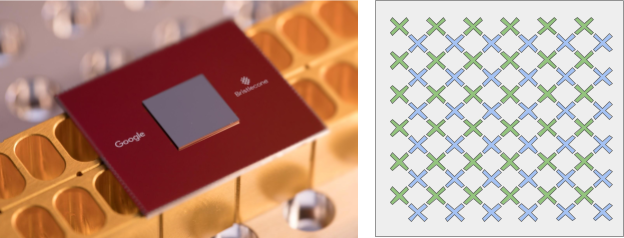
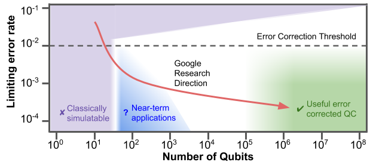
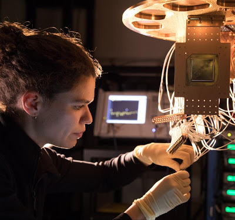

A Preview of Bristlecone, Google’s New Quantum Processor

# A Preview of Bristlecone, Google’s New Quantum Processor

Posted by Julian Kelly, Research Scientist, Quantum AI Lab

The goal of the [Google Quantum AI lab](https://research.google.com/pubs/QuantumAI.html) is to build a quantum computer that can be used to solve real-world problems. Our strategy is to explore near-term applications using systems that are forward compatible to a large-scale universal error-corrected quantum computer. In order for a quantum processor to be able to run algorithms beyond the scope of classical simulations, it requires not only a large number of qubits. Crucially, the processor must also have low error rates on readout and logical operations, such as single and two-qubit gates.

Today we presented Bristlecone, our new quantum processor, at the annual [American Physical Society](https://www.aps.org/) meeting in Los Angeles. The purpose of this gate-based superconducting system is to provide a testbed for research into system error rates and scalability of [our qubit technology](https://research.googleblog.com/2015/03/a-step-closer-to-quantum-computation.html), as well as applications in quantum [simulation](https://research.googleblog.com/2017/10/announcing-openfermion-open-source.html), [optimization](https://research.googleblog.com/2016/06/quantum-annealing-with-digital-twist.html), and [machine learning.](https://arxiv.org/abs/1802.06002)

|     |
| --- |
|  |
| Bristlecone is Google’s newest quantum processor (left). On the right is a cartoon of the device: each “X” represents a qubit, with nearest neighbor connectivity. |

The guiding design principle for this device is to preserve the underlying physics of our previous 9-qubit linear array technology[1](https://www.nature.com/articles/nature14270), [2](https://www.nature.com/articles/nature17658), which demonstrated low error rates for readout (1%), single-qubit gates (0.1%) and most importantly two-qubit gates (0.6%) as our best result. This device uses the same scheme for coupling, control, and readout, but is scaled to a square array of 72 qubits. We chose a device of this size to be able to demonstrate [quantum supremacy](https://arxiv.org/abs/1608.00263) in the future, investigate first and second order error-correction using the [surface code](https://journals.aps.org/pra/abstract/10.1103/PhysRevA.94.032321), and to facilitate quantum algorithm development on actual hardware.

|     |
| --- |
|  |
| 2D conceptual chart showing the relationship between error rate and number of qubits. The intended research direction of the Quantum AI Lab is shown in red, where we hope to access near-term applications on the road to building an error corrected quantum computer. |

Before investigating specific applications, it is important to quantify a quantum processor’s capabilities. Our theory team has developed a benchmarking tool for exactly this task. We can assign a single system error by applying random quantum circuits to the device and checking the sampled output distribution against a classical simulation. If a quantum processor can be operated with low enough error, it would be able to outperform a classical supercomputer on a well-defined computer science problem, an achievement known as [quantum supremacy](https://arxiv.org/abs/1203.5813). These random circuits must be large in both number of qubits as well as computational length (depth). Although no one has achieved this goal yet, we calculate quantum supremacy can be comfortably demonstrated with 49 qubits, a circuit depth exceeding 40, and a two-qubit error below 0.5%. We believe the experimental demonstration of a quantum processor outperforming a supercomputer would be a watershed moment for our field, and remains one of our key objectives.

|     |
| --- |
|  |
| A Bristlecone chip being installed by Research Scientist Marissa Giustina at the Quantum AI Lab in Santa Barbara |

We are looking to achieve similar performance to the best error rates of the 9-qubit device, but now across all 72 qubits of Bristlecone. We believe Bristlecone would then be a compelling proof-of-principle for building larger scale quantum computers. Operating a device such as Bristlecone at low system error requires harmony between a full stack of technology ranging from software and control electronics to the processor itself. Getting this right requires careful systems engineering over several iterations.

We are cautiously optimistic that quantum supremacy can be achieved with Bristlecone, and feel that learning to build and operate devices at this level of performance is an exciting challenge! We look forward to sharing the results and allowing collaborators to run experiments in the future.