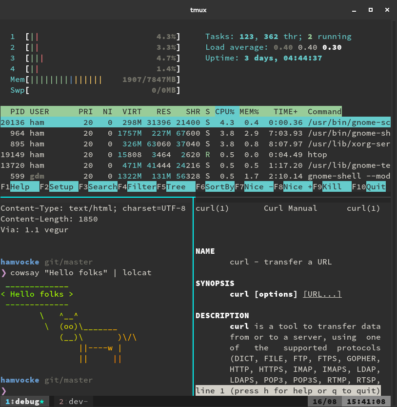
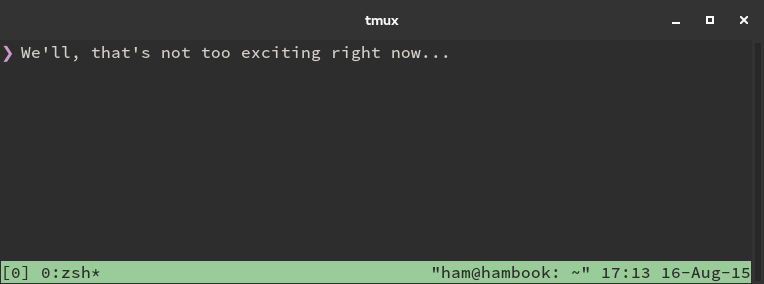
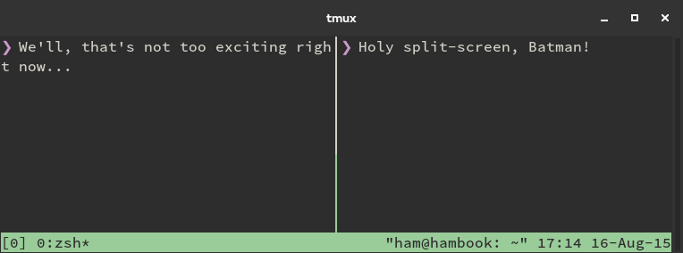
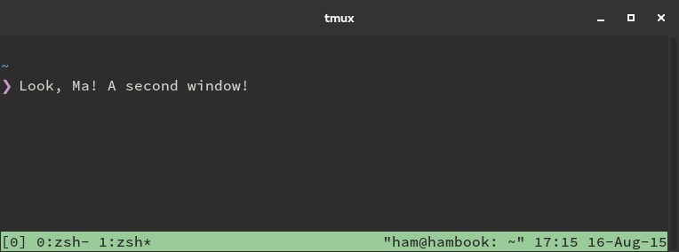

A Quick and Easy Guide to tmux

# A Quick and Easy Guide to tmux

 ** command line

 ** 16 Aug 2015
   ** 13 minutes read

I love working with the command line. Seriously, I think there’s hardly any more productive and more versatile tool for a software developer than the terminal. Maybe it’s the hacker/wizard/neckbeard kind of feeling I get when using a terminal, I don’t know.

At work we do *lots* of pair programming. Everyone’s got their own laptop and can set it up the way they like. And since I love working with the command line I’ve spent quite some time doing (only sane! I swear!) modifications to my terminal environment that make working with the command line more pleasant and streamlined. This is why my pair usually will be greeted by something like this:

If they’ve worked with me before they know what they are up to. But every once in a while there will be a new team member who doesn’t know my environment. Usually this is the point where they will ask something like “WTF am I looking at?” and it’s my time to shine!

Because what they’re looking at is nothing less than the best thing since sliced bread. It’s [tmux](https://tmux.github.io/), a so-called *terminal multiplexer*. Simply speaking, tmux acts as a window manager within your terminal[1](https://www.hamvocke.com/blog/a-quick-and-easy-guide-to-tmux/#fn:1) and allows you to create multiple windows and panes within a single terminal window.

I’ll proceed to give them a two minute tour about what you can do with tmux. After that they’re either hooked and want to try it themselves or they tell me to go away with my ancient neckbeard tools and just use iTerm2. In the former case I’ll usually end up helping them installing tmux on their machine and will give them a 10 minute guide to learn the most important basics.

This post will give you the same two minute introduction about tmux and its possibilities, followed by the typical 10 minute hands-on guide to set up and get to know tmux yourself. If you’ve got 10 minutes to spare and finally want to be more proficient with tmux: read on!

## What’s tmux?

tmux’s authors describe it as a *terminal multiplexer*. Behind this fancy term hides a simple concept: Within one terminal window you can open multiple windows and split-views (called *“panes”* in tmux lingo). Each pane will contain its own, independently running terminal instance. This allows you to have multiple terminal commands and applications running visually next to each other without the need to open multiple terminal emulator windows.

On top of that tmux keeps these windows and panes in a session. You can exit a session at any point. This is called *“detaching”*. tmux will keep this session alive until you kill the tmux server (e.g. when you reboot)[2](https://www.hamvocke.com/blog/a-quick-and-easy-guide-to-tmux/#fn:2). This is incredibly useful because at any later point in time you can pick that session up exactly from where you left it by simply *“attaching”* to that session.

If you’ve ever worked with remote servers or a Raspberry Pi over ssh you can guess where this will be useful: When you lose your ssh connection the tmux session will simply be detached but will keep running on the server in the background including all the processes that run within your session. To continue your session simply ssh to the server again and attach to the running session.

But tmux is not only helpful when working on a remote machine. Not only for its window management features but also for the session handling. Personally I find myself detaching from sessions when I’m switching context. I’ll just start a new session for my new task and attach to the old session whenever I want to continue with my old task.

You see that tmux basically offers two big features: Window management in your terminal and session management. If you are familiar with [GNU Screen](https://www.gnu.org/software/screen) this is nothing new. Think of tmux as an easier-to-use and a little more powerful alternative to Screen (obviously I’m being opinionated here).

Enough with the talking already. Let’s get our hands ready in the hands-on guide!

## Getting Started

This hands-on guide will get you up and running with tmux pretty quickly. It will only cover the basic features which should be more than enough to get started and be productive with tmux. Simply open your terminal and follow the instructions.

### Installation

Fortunately installing tmux is pretty straightforward on most distributions a simple `sudo apt-get install tmux` (Ubuntu and derivatives) or `brew install tmux` (Mac) should be sufficient.

### Starting Your First Session

For your first session simply start tmux with a new session:

	tmux

This will create a new tmux session with a nice all-green status bar at the bottom:

The status bar is an important part of tmux. Apart from the currently opened windows (on the left) it also shows some system information like date and time (on the right). The status bar can also be customized and I’ve seen some really fancy stuff around (upcoming calendar events, battery status, to name a few) but this is something we’ll leave for later.

### Splitting Panes

Now that we’ve created our first session we can get a feeling for panes. When you create a new session, tmux will by default start with one window and a single panel inside. We want a nice split-screen, so let’s split this bad boy.

All commands in tmux are triggered by a **prefix key** followed by a **command key** (quite similar to emacs). By default, tmux uses `C-b` as prefix key. This notation might read a little weird if you’re not used to it. In this emacs notation `C-` means “press and hold the `Ctrl` key”[3](https://www.hamvocke.com/blog/a-quick-and-easy-guide-to-tmux/#fn:3). Thus `C-b` simply means press the `Ctrl` and `b` keys at the same time.

The shortcut to split panes into a left and a right pane is `C-b %`. Remembering what I’ve just told you about tmux’s sequence of **prefix** and **command key** this means to split your single pane into a left and a right pane you press `Ctrl` and `b` at the same time, release both, and then type the `%` key. Voilà! You’ve just invoked your first tmux command and split your pane in two.

Where there’s a split into left and right, there’s also a split into top and bottom pane. To split a pane into top and bottom panes use the `C-b "` shortcut.

### Navigating Panes

Right now we’re trapped in the newly created pane. But we really really want to go back to the left one. Easy peasy: Switching to a different pane uses the `C-b <arrow key>` shortcut, where <arrow key> is the arrow key pointing to the pane you want to switch to. In our case we want to switch to the panel on the left so it’s `C-b left` for us. Just once more, so that we fully understand this: This means you press `Ctrl` and `b` (your prefix) followed by the `left` arrow key to get to the pane on the left.

You can now go ahead and split each of your new panels even further. Feel free to experiment and split your panes like a maniac to get a feeling for it.

### Closing Panes

Closing a pane is as simple as closing a regular terminal session. Either type `exit` or hit `Ctrl-d` and it’s gone.

### Creating Windows

Windows in tmux can be compared to creating new virtual desktops; if you’ve ever worked with one of the major Linux deskop environments (KDE, Gnome) you’ll hopefully find this analogy helpful.

Creating new windows is as easy as typing `C-b c` (one last time: that’s `Ctrl` and `b` at once, then `c`). The new window will then be presented to you in tmux’s status bar.

You can now divide the pane in your new window as you like. Or don’t. That’s up to you.

To switch to the *previous* window (according to the order in your status bar) use `C-b p`, to switch to the *next* window use `C-b n`. If you’ve created many windows you might find it useful to go to a window directly by typing its number (the status bar will tell you which window has which number), just use `C-b <number>` where <number> is the number in front of the window’s name in your status bar.

### Session Handling

If you’re done with your session you can either get rid of it by simply exiting all the panes inside or you can keep the session in the background for later reuse.

To detach your current session use `C-b d`. You can also use `C-b D` to have tmux give you a choice which of your sessions you want to detach. This will detach your session but will leave you’re doing in that session running in the background.

Now that your session is detached you can pick it up from where you left it at any later point in time. To re-attach to a session you need to figure out which session you want to attach to first. Figure out which sessions are running by using

	tmux ls

This will give you a list of all running sessions, which in our example should be something like

>
> 0: 2 windows (created Sat Aug 15 17:55:34 2015) [199x44] (detached)

To connect to that session you start tmux again but this time tell it which session to attach to:

	tmux attach -t 0

Note that the `-t 0` is the parameter that tells tmux which session to attach to. “0” is the first part of your `tmux ls` output.

If you prefer to give your sessions a more meaningful name (instead of a numerical one starting with 0) you can create your next session using

	tmux new -s database

This will create a new session with the name “database”.
You could also rename your existing session:

	tmux rename-session -t 0 database

The next time you attach to that session you simply use `tmux attach -t database`. If you’re using multiple sessions at once this can become an essential feature.

And that’s it! Congratulations, you’ve just completed your first tmux session and got your hands dirty with its window and session management. Yes, there’s more stuff tmux can do. But what you’ve just learned should be everything to start using tmux in the future.

## Why tmux?

A response that I get quite often is: “Great, I get it. But why should I use tmux and its weird key combinations instead of just using iTerm2?”

And you’re right, when it’s only basic window management, [iTerm](http://iterm2.com/) for Mac supports tabs and panes as well. For Linux there’s [Terminator](http://gnometerminator.blogspot.com/p/introduction.html). So why would anyone feel the urge to learn some archaic technology in this day and age?

But you’re missing out. There are a couple of reasons why I favor tmux over iTerm et al.:

- session handling: detaching from and attaching to sessions helps me with context switching and remote working

- platform independence: I can use tmux on my Macbook, my Linux notebook, Cloud servers, Raspberry Pis, BeagleBones, etc.

- customizable: there are many ways I can customize the look and behavior of my tmux environment. And I can sync this across different platforms using a simple dotfile

- street credibility: you don’t want others to call you a lamer, do you? :P

## Moving on

If you’re curious now to learn what else tmux can do that’s a great thing. And luckily most of the stuff is quite simple to discover. Just type `C-b ?` to see a list of all available commands and start experimenting.

Some of the commands that I’m using myself quite often are:

- `C-b z`: make a pane go full screen. Hit `C-b z` again to shrink it back to its previous size

- `C-b C-<arrow key>`: Resize pane in direction of <arrow key>[4](https://www.hamvocke.com/blog/a-quick-and-easy-guide-to-tmux/#fn:4)

- `C-b ,`: Rename the current window

On top of that there are plenty of resources out there that help you getting further with tmux. People like me are blogging about their tmux experience and share what they’ve discovered. You can find people sharing their tmux configurations in their dotfiles repos on Github. There’s even a [book by Brian Hogan](https://pragprog.com/book/bhtmux/tmux) dedicated to tmux.

For now it’s best to discover some stuff on your own. Experiment, fool around and maybe try to use tmux in your daily work. It takes a while to get used to and you’ll probably feel slow in the very beginning. I can only encourage you to keep using it. Get a feeling for its functionality and in no time you’ll find out that your work with the terminal will be pure bliss and insanely fast.

If you’re interested in customizing your tmux experience I recommend that you read my [Guide to Customizing your tmux.conf](https://www.hamvocke.com/blog/a-guide-to-customizing-your-tmux-conf/).

* * *

**Footnotes**

1.   If you’re coming from a Linux background you’re probably familiar with the concept of window managers like [Openbox](http://openbox.org/wiki/Main_Page), [i3](http://i3wm.org/) or [awesome](http://awesome.naquadah.org/wiki/FAQ) [↩](https://www.hamvocke.com/blog/a-quick-and-easy-guide-to-tmux/#fnref:1)

2.   tmux is based on a client-server architecture. While this is rarely relevant, it’s helpful to understand how stuff works. The tmux server keeps track of all the running sessions. You will only ever work with the tmux client and create new sessions or connect to existing ones. [↩](https://www.hamvocke.com/blog/a-quick-and-easy-guide-to-tmux/#fnref:2)

3.   there could also be `M-` which is the same only for the `Meta` key (i.e. `Alt` on most keyboards). [↩](https://www.hamvocke.com/blog/a-quick-and-easy-guide-to-tmux/#fnref:3)

4.   This is an interesting one. Yes, you need `Ctrl` in your prefix and also your command key. I find it easiest to only release the `b` key after the prefix key and keep `Ctrl` pressed all the time while I hit the arrow key repeatedly. Experiment a little bit to get a feeling for it. [↩](https://www.hamvocke.com/blog/a-quick-and-easy-guide-to-tmux/#fnref:4)

 

#### Ham Vocke

Ham is a software developer at [Stack Overflow](https://www.stackoverflow.com/). Previously, he was a consultant at [ThoughtWorks](https://www.thoughtworks.com/). He helps teams deliver software and spreads his excitement about learning new things. If he's not writing code he's probably annoying others with his stupid jokes.

 [**](https://www.hamvocke.com/blog/a-quick-and-easy-guide-to-tmux/mailto:ham@hamvocke.com)   [**](https://github.com/hamvocke)   [**](https://twitter.com/hamvocke)   [**](https://mastodon.social/@hamvocke)   [**](https://www.xing.com/profile/Hermann_Vocke)   [**](https://www.linkedin.com/in/hamvocke/)

## Comments

## Featured Comment

-

 [Matthew L Daniel](https://disqus.com/by/matthewdaniel/)    •  [4 years ago](https://www.hamvocke.com/blog/a-quick-and-easy-guide-to-tmux/#comment-2198517009)

When I saw you mention iTerm2, I thought you were going to offer an olive branch across the two worlds, but it might have slipped your mind. The glorious iTerm2 also has built-in tmux support, invoked by `tmux -CC` and documented fully here: [https://gitlab.com/gnachman...](https://disq.us/url?url=https%3A%2F%2Fgitlab.com%2Fgnachman%2Fiterm2%2Fwikis%2FTmuxIntegration%3A_j7XBUAe6JacLHd3xJFLjVbRP-Q&cuid=3547302)

I recognize it's not exactly what you like, but for others it might offer a more gentle slope into more regular tmux usage, and the tmux -CC sessions are fully attachable by normal command-line tmux.

- [86 comments]()
- [**hamvocke**](https://disqus.com/home/forums/onehamarmy/)
- [Login](https://disqus.com/embed/comments/?base=default&f=onehamarmy&t_u=https%3A%2F%2Fwww.hamvocke.com%2Fblog%2Fa-quick-and-easy-guide-to-tmux%2F&t_d=A%20Quick%20and%20Easy%20Guide%20to%20tmux&t_t=A%20Quick%20and%20Easy%20Guide%20to%20tmux&s_o=default#)
- [](https://disqus.com/home/inbox/)
- [ Recommend  38](https://disqus.com/embed/comments/?base=default&f=onehamarmy&t_u=https%3A%2F%2Fwww.hamvocke.com%2Fblog%2Fa-quick-and-easy-guide-to-tmux%2F&t_d=A%20Quick%20and%20Easy%20Guide%20to%20tmux&t_t=A%20Quick%20and%20Easy%20Guide%20to%20tmux&s_o=default#)
- tTweetfShare
- [Sort by Best](https://disqus.com/embed/comments/?base=default&f=onehamarmy&t_u=https%3A%2F%2Fwww.hamvocke.com%2Fblog%2Fa-quick-and-easy-guide-to-tmux%2F&t_d=A%20Quick%20and%20Easy%20Guide%20to%20tmux&t_t=A%20Quick%20and%20Easy%20Guide%20to%20tmux&s_o=default#)

Join the discussion…

###### Log in with

-
-
-
-

######  or sign up with Disqus

?

### Disqus is a discussion network

- Disqus never moderates or censors. The rules on this community are its own.
- Don't be a jerk or do anything illegal. Everything is easier that way.

[Read full terms and conditions](https://docs.disqus.com/kb/terms-and-policies/)

-

    - [−](https://disqus.com/embed/comments/?base=default&f=onehamarmy&t_u=https%3A%2F%2Fwww.hamvocke.com%2Fblog%2Fa-quick-and-easy-guide-to-tmux%2F&t_d=A%20Quick%20and%20Easy%20Guide%20to%20tmux&t_t=A%20Quick%20and%20Easy%20Guide%20to%20tmux&s_o=default#)
    - [*⚑*](https://disqus.com/embed/comments/?base=default&f=onehamarmy&t_u=https%3A%2F%2Fwww.hamvocke.com%2Fblog%2Fa-quick-and-easy-guide-to-tmux%2F&t_d=A%20Quick%20and%20Easy%20Guide%20to%20tmux&t_t=A%20Quick%20and%20Easy%20Guide%20to%20tmux&s_o=default#)

 [tush](https://disqus.com/by/disqus_Ow7XryazFM/)    •  [2 years ago](https://www.hamvocke.com/blog/a-quick-and-easy-guide-to-tmux/#comment-3216768000)

really helpful !! thanks

-

    - [−](https://disqus.com/embed/comments/?base=default&f=onehamarmy&t_u=https%3A%2F%2Fwww.hamvocke.com%2Fblog%2Fa-quick-and-easy-guide-to-tmux%2F&t_d=A%20Quick%20and%20Easy%20Guide%20to%20tmux&t_t=A%20Quick%20and%20Easy%20Guide%20to%20tmux&s_o=default#)
    - [*⚑*](https://disqus.com/embed/comments/?base=default&f=onehamarmy&t_u=https%3A%2F%2Fwww.hamvocke.com%2Fblog%2Fa-quick-and-easy-guide-to-tmux%2F&t_d=A%20Quick%20and%20Easy%20Guide%20to%20tmux&t_t=A%20Quick%20and%20Easy%20Guide%20to%20tmux&s_o=default#)

 [Usman Iqbal](https://disqus.com/by/sp12bcs153/)    •  [2 years ago](https://www.hamvocke.com/blog/a-quick-and-easy-guide-to-tmux/#comment-3585394732)

thanks for the tutorial man

-

    - [−](https://disqus.com/embed/comments/?base=default&f=onehamarmy&t_u=https%3A%2F%2Fwww.hamvocke.com%2Fblog%2Fa-quick-and-easy-guide-to-tmux%2F&t_d=A%20Quick%20and%20Easy%20Guide%20to%20tmux&t_t=A%20Quick%20and%20Easy%20Guide%20to%20tmux&s_o=default#)
    - [*⚑*](https://disqus.com/embed/comments/?base=default&f=onehamarmy&t_u=https%3A%2F%2Fwww.hamvocke.com%2Fblog%2Fa-quick-and-easy-guide-to-tmux%2F&t_d=A%20Quick%20and%20Easy%20Guide%20to%20tmux&t_t=A%20Quick%20and%20Easy%20Guide%20to%20tmux&s_o=default#)

 [Matthew L Daniel](https://disqus.com/by/matthewdaniel/)    •  [4 years ago](https://www.hamvocke.com/blog/a-quick-and-easy-guide-to-tmux/#comment-2198517009)    Featured by hamvocke

When I saw you mention iTerm2, I thought you were going to offer an olive branch across the two worlds, but it might have slipped your mind. The glorious iTerm2 also has built-in tmux support, invoked by `tmux -CC` and documented fully here: [https://gitlab.com/gnachman...](https://disq.us/url?url=https%3A%2F%2Fgitlab.com%2Fgnachman%2Fiterm2%2Fwikis%2FTmuxIntegration%3A_j7XBUAe6JacLHd3xJFLjVbRP-Q&cuid=3547302)

I recognize it's not exactly what you like, but for others it might offer a more gentle slope into more regular tmux usage, and the tmux -CC sessions are fully attachable by normal command-line tmux.

    -

        - [−](https://disqus.com/embed/comments/?base=default&f=onehamarmy&t_u=https%3A%2F%2Fwww.hamvocke.com%2Fblog%2Fa-quick-and-easy-guide-to-tmux%2F&t_d=A%20Quick%20and%20Easy%20Guide%20to%20tmux&t_t=A%20Quick%20and%20Easy%20Guide%20to%20tmux&s_o=default#)
        - [*⚑*](https://disqus.com/embed/comments/?base=default&f=onehamarmy&t_u=https%3A%2F%2Fwww.hamvocke.com%2Fblog%2Fa-quick-and-easy-guide-to-tmux%2F&t_d=A%20Quick%20and%20Easy%20Guide%20to%20tmux&t_t=A%20Quick%20and%20Easy%20Guide%20to%20tmux&s_o=default#)

 [Ham Vocke](https://disqus.com/by/hamvocke/)  Mod  [*>* Matthew L Daniel](https://www.hamvocke.com/blog/a-quick-and-easy-guide-to-tmux/#comment-2198517009)  •  [4 years ago](https://www.hamvocke.com/blog/a-quick-and-easy-guide-to-tmux/#comment-2198655566)

Yes, I've heard of it but I've never tried it myself so far, this is why I didn't go into detail on that. It's a very fair point and looks really interesting to me. I'll give this a shot this week, thanks for brining that up :-)

        -

            - [−](https://disqus.com/embed/comments/?base=default&f=onehamarmy&t_u=https%3A%2F%2Fwww.hamvocke.com%2Fblog%2Fa-quick-and-easy-guide-to-tmux%2F&t_d=A%20Quick%20and%20Easy%20Guide%20to%20tmux&t_t=A%20Quick%20and%20Easy%20Guide%20to%20tmux&s_o=default#)
            - [*⚑*](https://disqus.com/embed/comments/?base=default&f=onehamarmy&t_u=https%3A%2F%2Fwww.hamvocke.com%2Fblog%2Fa-quick-and-easy-guide-to-tmux%2F&t_d=A%20Quick%20and%20Easy%20Guide%20to%20tmux&t_t=A%20Quick%20and%20Easy%20Guide%20to%20tmux&s_o=default#)

 [Bradley Wagner](https://disqus.com/by/disqus_wqysjxLOP6/)    [*>* Ham Vocke](https://www.hamvocke.com/blog/a-quick-and-easy-guide-to-tmux/#comment-2198655566)  •  [2 years ago](https://www.hamvocke.com/blog/a-quick-and-easy-guide-to-tmux/#comment-3405500164)

+1 for the tmux/iTerm2 integration! It solves a major problem of the cmd+K working correctly if you use native tmux within iTerm2. The only minor annoyance I've found (and maybe this is true of tmux in general) is that I can't seem to easily open more than of my tmux sessions at once. When I run `attach -t <name>` from the `tmux -CC` "Run tmux command" prompt, it always closes my current session and opens the other. Any ideas there?

-

    - [−](https://disqus.com/embed/comments/?base=default&f=onehamarmy&t_u=https%3A%2F%2Fwww.hamvocke.com%2Fblog%2Fa-quick-and-easy-guide-to-tmux%2F&t_d=A%20Quick%20and%20Easy%20Guide%20to%20tmux&t_t=A%20Quick%20and%20Easy%20Guide%20to%20tmux&s_o=default#)
    - [*⚑*](https://disqus.com/embed/comments/?base=default&f=onehamarmy&t_u=https%3A%2F%2Fwww.hamvocke.com%2Fblog%2Fa-quick-and-easy-guide-to-tmux%2F&t_d=A%20Quick%20and%20Easy%20Guide%20to%20tmux&t_t=A%20Quick%20and%20Easy%20Guide%20to%20tmux&s_o=default#)

 [Stefan Schwetschke](https://disqus.com/by/stefanschwetschke/)    •  [4 years ago](https://www.hamvocke.com/blog/a-quick-and-easy-guide-to-tmux/#comment-2198103488)

Just a small hint: Look into [tmuxinator](https://disq.us/url?url=https%3A%2F%2Fgithub.com%2Ftmuxinator%2Ftmuxinator%3A3YEEecL7iU5gpZ4p9koLgksrQHM&cuid=3547302). It let's you re-recreate complex tmux layouts using a simple config file.

    -

        - [−](https://disqus.com/embed/comments/?base=default&f=onehamarmy&t_u=https%3A%2F%2Fwww.hamvocke.com%2Fblog%2Fa-quick-and-easy-guide-to-tmux%2F&t_d=A%20Quick%20and%20Easy%20Guide%20to%20tmux&t_t=A%20Quick%20and%20Easy%20Guide%20to%20tmux&s_o=default#)
        - [*⚑*](https://disqus.com/embed/comments/?base=default&f=onehamarmy&t_u=https%3A%2F%2Fwww.hamvocke.com%2Fblog%2Fa-quick-and-easy-guide-to-tmux%2F&t_d=A%20Quick%20and%20Easy%20Guide%20to%20tmux&t_t=A%20Quick%20and%20Easy%20Guide%20to%20tmux&s_o=default#)

 [D. Elroy](https://disqus.com/by/d_elroy/)    [*>* Stefan Schwetschke](https://www.hamvocke.com/blog/a-quick-and-easy-guide-to-tmux/#comment-2198103488)  •  [4 years ago](https://www.hamvocke.com/blog/a-quick-and-easy-guide-to-tmux/#comment-2198131862)

Tmuxinator is awesome. I just wish it could also add windows to an existing tmux session.

        -

            - [−](https://disqus.com/embed/comments/?base=default&f=onehamarmy&t_u=https%3A%2F%2Fwww.hamvocke.com%2Fblog%2Fa-quick-and-easy-guide-to-tmux%2F&t_d=A%20Quick%20and%20Easy%20Guide%20to%20tmux&t_t=A%20Quick%20and%20Easy%20Guide%20to%20tmux&s_o=default#)
            - [*⚑*](https://disqus.com/embed/comments/?base=default&f=onehamarmy&t_u=https%3A%2F%2Fwww.hamvocke.com%2Fblog%2Fa-quick-and-easy-guide-to-tmux%2F&t_d=A%20Quick%20and%20Easy%20Guide%20to%20tmux&t_t=A%20Quick%20and%20Easy%20Guide%20to%20tmux&s_o=default#)

 [Stefan Schwetschke](https://disqus.com/by/stefanschwetschke/)    [*>* D. Elroy](https://www.hamvocke.com/blog/a-quick-and-easy-guide-to-tmux/#comment-2198131862)  •  [4 years ago](https://www.hamvocke.com/blog/a-quick-and-easy-guide-to-tmux/#comment-2199022507)

Try to set tmux_options or tmux_command in the config file to attach to an existing session instead creating a new one.

    -

        - [−](https://disqus.com/embed/comments/?base=default&f=onehamarmy&t_u=https%3A%2F%2Fwww.hamvocke.com%2Fblog%2Fa-quick-and-easy-guide-to-tmux%2F&t_d=A%20Quick%20and%20Easy%20Guide%20to%20tmux&t_t=A%20Quick%20and%20Easy%20Guide%20to%20tmux&s_o=default#)
        - [*⚑*](https://disqus.com/embed/comments/?base=default&f=onehamarmy&t_u=https%3A%2F%2Fwww.hamvocke.com%2Fblog%2Fa-quick-and-easy-guide-to-tmux%2F&t_d=A%20Quick%20and%20Easy%20Guide%20to%20tmux&t_t=A%20Quick%20and%20Easy%20Guide%20to%20tmux&s_o=default#)

 [Ryan Daly](https://disqus.com/by/disqus_8q76hNp9IV/)    [*>* Stefan Schwetschke](https://www.hamvocke.com/blog/a-quick-and-easy-guide-to-tmux/#comment-2198103488)  •  [2 months ago](https://www.hamvocke.com/blog/a-quick-and-easy-guide-to-tmux/#comment-4396404480)

What would be absolutely fabulous is if I could open panes directly into an ssh login shell to another machine. Right now I'm implementing it with

`[[NEWLINE]]windows:[[NEWLINE]]  - first_window:[[NEWLINE]]     layout: horizontal-main[[NEWLINE]]     panes:[[NEWLINE]]        - ssh -t -p 40 -Y RemoteMachine 'bash -l' # cd to a directory & persist?[[NEWLINE]]        - ssh -t -p 40 -Y RemoteMachine 'bash -l' # cd to another & persist?[[NEWLINE]]`

There's only one limitation to this: I can't perform any `cd doc` after the `ssh`. Any idea how to deal with this?

-

    - [−](https://disqus.com/embed/comments/?base=default&f=onehamarmy&t_u=https%3A%2F%2Fwww.hamvocke.com%2Fblog%2Fa-quick-and-easy-guide-to-tmux%2F&t_d=A%20Quick%20and%20Easy%20Guide%20to%20tmux&t_t=A%20Quick%20and%20Easy%20Guide%20to%20tmux&s_o=default#)
    - [*⚑*](https://disqus.com/embed/comments/?base=default&f=onehamarmy&t_u=https%3A%2F%2Fwww.hamvocke.com%2Fblog%2Fa-quick-and-easy-guide-to-tmux%2F&t_d=A%20Quick%20and%20Easy%20Guide%20to%20tmux&t_t=A%20Quick%20and%20Easy%20Guide%20to%20tmux&s_o=default#)

 [Alex Mills](https://disqus.com/by/olegzandr_von_denman/)    •  [6 months ago](https://www.hamvocke.com/blog/a-quick-and-easy-guide-to-tmux/#comment-4243202824)

I was going to guess that ITerm just uses tmux under the hood? dunno

-

    - [−](https://disqus.com/embed/comments/?base=default&f=onehamarmy&t_u=https%3A%2F%2Fwww.hamvocke.com%2Fblog%2Fa-quick-and-easy-guide-to-tmux%2F&t_d=A%20Quick%20and%20Easy%20Guide%20to%20tmux&t_t=A%20Quick%20and%20Easy%20Guide%20to%20tmux&s_o=default#)
    - [*⚑*](https://disqus.com/embed/comments/?base=default&f=onehamarmy&t_u=https%3A%2F%2Fwww.hamvocke.com%2Fblog%2Fa-quick-and-easy-guide-to-tmux%2F&t_d=A%20Quick%20and%20Easy%20Guide%20to%20tmux&t_t=A%20Quick%20and%20Easy%20Guide%20to%20tmux&s_o=default#)

 [Iovan Iorgovan](https://disqus.com/by/iovan_iorgovan/)    •  [2 years ago](https://www.hamvocke.com/blog/a-quick-and-easy-guide-to-tmux/#comment-3507734028)

Everyone, what is your preferred method of dealing with a system reboot and carrying on with your Tmux session? How do you save your Tmux session from one reboot to the other?

    -

        - [−](https://disqus.com/embed/comments/?base=default&f=onehamarmy&t_u=https%3A%2F%2Fwww.hamvocke.com%2Fblog%2Fa-quick-and-easy-guide-to-tmux%2F&t_d=A%20Quick%20and%20Easy%20Guide%20to%20tmux&t_t=A%20Quick%20and%20Easy%20Guide%20to%20tmux&s_o=default#)
        - [*⚑*](https://disqus.com/embed/comments/?base=default&f=onehamarmy&t_u=https%3A%2F%2Fwww.hamvocke.com%2Fblog%2Fa-quick-and-easy-guide-to-tmux%2F&t_d=A%20Quick%20and%20Easy%20Guide%20to%20tmux&t_t=A%20Quick%20and%20Easy%20Guide%20to%20tmux&s_o=default#)

 [Ham Vocke](https://disqus.com/by/hamvocke/)  Mod  [*>* Iovan Iorgovan](https://www.hamvocke.com/blog/a-quick-and-easy-guide-to-tmux/#comment-3507734028)  •  [2 years ago](https://www.hamvocke.com/blog/a-quick-and-easy-guide-to-tmux/#comment-3508221075)

Personally I don't bother. My tmux session can be restored manually
within seconds. I've seen people scripting their preferred default

setups using bash. Then there's [tmux-resurrect](https://disq.us/url?url=https%3A%2F%2Fgithub.com%2Ftmux-plugins%2Ftmux-resurrect%3AQvHgCj9ybkumf4E0UINd1D3y8n0&cuid=3547302) which is quite popular for exactly your use case.

-

    - [−](https://disqus.com/embed/comments/?base=default&f=onehamarmy&t_u=https%3A%2F%2Fwww.hamvocke.com%2Fblog%2Fa-quick-and-easy-guide-to-tmux%2F&t_d=A%20Quick%20and%20Easy%20Guide%20to%20tmux&t_t=A%20Quick%20and%20Easy%20Guide%20to%20tmux&s_o=default#)
    - [*⚑*](https://disqus.com/embed/comments/?base=default&f=onehamarmy&t_u=https%3A%2F%2Fwww.hamvocke.com%2Fblog%2Fa-quick-and-easy-guide-to-tmux%2F&t_d=A%20Quick%20and%20Easy%20Guide%20to%20tmux&t_t=A%20Quick%20and%20Easy%20Guide%20to%20tmux&s_o=default#)

 [Henry Zhu](https://disqus.com/by/daya0576/)    •  [2 years ago](https://www.hamvocke.com/blog/a-quick-and-easy-guide-to-tmux/#comment-3415824172)

Awesome tutorial, thx a lot.

-

    - [−](https://disqus.com/embed/comments/?base=default&f=onehamarmy&t_u=https%3A%2F%2Fwww.hamvocke.com%2Fblog%2Fa-quick-and-easy-guide-to-tmux%2F&t_d=A%20Quick%20and%20Easy%20Guide%20to%20tmux&t_t=A%20Quick%20and%20Easy%20Guide%20to%20tmux&s_o=default#)
    - [*⚑*](https://disqus.com/embed/comments/?base=default&f=onehamarmy&t_u=https%3A%2F%2Fwww.hamvocke.com%2Fblog%2Fa-quick-and-easy-guide-to-tmux%2F&t_d=A%20Quick%20and%20Easy%20Guide%20to%20tmux&t_t=A%20Quick%20and%20Easy%20Guide%20to%20tmux&s_o=default#)

 [elijahpaul](https://disqus.com/by/elijahpaul/)    •  [4 years ago](https://www.hamvocke.com/blog/a-quick-and-easy-guide-to-tmux/#comment-2203240027)

Great Article. Never heard of tmux. Thanks.

'C-b " ' split my screen horizontally, and 'C-b %' vertically. Is that just me or have you got it the wrong way round?

    -

        - [−](https://disqus.com/embed/comments/?base=default&f=onehamarmy&t_u=https%3A%2F%2Fwww.hamvocke.com%2Fblog%2Fa-quick-and-easy-guide-to-tmux%2F&t_d=A%20Quick%20and%20Easy%20Guide%20to%20tmux&t_t=A%20Quick%20and%20Easy%20Guide%20to%20tmux&s_o=default#)
        - [*⚑*](https://disqus.com/embed/comments/?base=default&f=onehamarmy&t_u=https%3A%2F%2Fwww.hamvocke.com%2Fblog%2Fa-quick-and-easy-guide-to-tmux%2F&t_d=A%20Quick%20and%20Easy%20Guide%20to%20tmux&t_t=A%20Quick%20and%20Easy%20Guide%20to%20tmux&s_o=default#)

 [grok](https://disqus.com/by/grrokk/)    [*>* elijahpaul](https://www.hamvocke.com/blog/a-quick-and-easy-guide-to-tmux/#comment-2203240027)  •  [2 years ago](https://www.hamvocke.com/blog/a-quick-and-easy-guide-to-tmux/#comment-3152013393)

Think of the '%' as being symbolic/mnemonic of a vertical split.

    -

        - [−](https://disqus.com/embed/comments/?base=default&f=onehamarmy&t_u=https%3A%2F%2Fwww.hamvocke.com%2Fblog%2Fa-quick-and-easy-guide-to-tmux%2F&t_d=A%20Quick%20and%20Easy%20Guide%20to%20tmux&t_t=A%20Quick%20and%20Easy%20Guide%20to%20tmux&s_o=default#)
        - [*⚑*](https://disqus.com/embed/comments/?base=default&f=onehamarmy&t_u=https%3A%2F%2Fwww.hamvocke.com%2Fblog%2Fa-quick-and-easy-guide-to-tmux%2F&t_d=A%20Quick%20and%20Easy%20Guide%20to%20tmux&t_t=A%20Quick%20and%20Easy%20Guide%20to%20tmux&s_o=default#)

 [Dylan Pierce](https://disqus.com/by/dylanpierce/)    [*>* elijahpaul](https://www.hamvocke.com/blog/a-quick-and-easy-guide-to-tmux/#comment-2203240027)  •  [4 years ago](https://www.hamvocke.com/blog/a-quick-and-easy-guide-to-tmux/#comment-2203441251)

Nope I have the same issue. Running Ubuntu 14.04

        -

            - [−](https://disqus.com/embed/comments/?base=default&f=onehamarmy&t_u=https%3A%2F%2Fwww.hamvocke.com%2Fblog%2Fa-quick-and-easy-guide-to-tmux%2F&t_d=A%20Quick%20and%20Easy%20Guide%20to%20tmux&t_t=A%20Quick%20and%20Easy%20Guide%20to%20tmux&s_o=default#)
            - [*⚑*](https://disqus.com/embed/comments/?base=default&f=onehamarmy&t_u=https%3A%2F%2Fwww.hamvocke.com%2Fblog%2Fa-quick-and-easy-guide-to-tmux%2F&t_d=A%20Quick%20and%20Easy%20Guide%20to%20tmux&t_t=A%20Quick%20and%20Easy%20Guide%20to%20tmux&s_o=default#)

 [Ham Vocke](https://disqus.com/by/hamvocke/)  Mod  [*>* Dylan Pierce](https://www.hamvocke.com/blog/a-quick-and-easy-guide-to-tmux/#comment-2203441251)  •  [4 years ago](https://www.hamvocke.com/blog/a-quick-and-easy-guide-to-tmux/#comment-2205075740)

Nah, everything's fine with your configs. It's just the term that's totally confusing (I would also interpret it as you two do).

"Vertical splitting" actually means that you split the pane in a top and a bottom panel. tmux itself avoids the terms *horizontally* and *vertically* in the man files (probably due to that confusion). You can only tell from the underlying commands (i.e. *split-window -v* and *split-window -h*) that vertically means "one pane at the top, one at the bottom" and horizontally means "one left, one right".

[Show more replies](https://disqus.com/embed/comments/?base=default&f=onehamarmy&t_u=https%3A%2F%2Fwww.hamvocke.com%2Fblog%2Fa-quick-and-easy-guide-to-tmux%2F&t_d=A%20Quick%20and%20Easy%20Guide%20to%20tmux&t_t=A%20Quick%20and%20Easy%20Guide%20to%20tmux&s_o=default#)

-

    - [−](https://disqus.com/embed/comments/?base=default&f=onehamarmy&t_u=https%3A%2F%2Fwww.hamvocke.com%2Fblog%2Fa-quick-and-easy-guide-to-tmux%2F&t_d=A%20Quick%20and%20Easy%20Guide%20to%20tmux&t_t=A%20Quick%20and%20Easy%20Guide%20to%20tmux&s_o=default#)
    - [*⚑*](https://disqus.com/embed/comments/?base=default&f=onehamarmy&t_u=https%3A%2F%2Fwww.hamvocke.com%2Fblog%2Fa-quick-and-easy-guide-to-tmux%2F&t_d=A%20Quick%20and%20Easy%20Guide%20to%20tmux&t_t=A%20Quick%20and%20Easy%20Guide%20to%20tmux&s_o=default#)

 [santiagobasulto](https://disqus.com/by/santiagobasulto/)    •  [4 years ago](https://www.hamvocke.com/blog/a-quick-and-easy-guide-to-tmux/#comment-2198531897)

This is absolutely amazing. Thanks so much for sharing.

-

    - [−](https://disqus.com/embed/comments/?base=default&f=onehamarmy&t_u=https%3A%2F%2Fwww.hamvocke.com%2Fblog%2Fa-quick-and-easy-guide-to-tmux%2F&t_d=A%20Quick%20and%20Easy%20Guide%20to%20tmux&t_t=A%20Quick%20and%20Easy%20Guide%20to%20tmux&s_o=default#)
    - [*⚑*](https://disqus.com/embed/comments/?base=default&f=onehamarmy&t_u=https%3A%2F%2Fwww.hamvocke.com%2Fblog%2Fa-quick-and-easy-guide-to-tmux%2F&t_d=A%20Quick%20and%20Easy%20Guide%20to%20tmux&t_t=A%20Quick%20and%20Easy%20Guide%20to%20tmux&s_o=default#)

 [Mario Zigliotto](https://disqus.com/by/mariozig/)    •  [4 years ago](https://www.hamvocke.com/blog/a-quick-and-easy-guide-to-tmux/#comment-2197698377)

Off topic but i really love the color scheme of your terminal. What is it called?

    -

        - [−](https://disqus.com/embed/comments/?base=default&f=onehamarmy&t_u=https%3A%2F%2Fwww.hamvocke.com%2Fblog%2Fa-quick-and-easy-guide-to-tmux%2F&t_d=A%20Quick%20and%20Easy%20Guide%20to%20tmux&t_t=A%20Quick%20and%20Easy%20Guide%20to%20tmux&s_o=default#)
        - [*⚑*](https://disqus.com/embed/comments/?base=default&f=onehamarmy&t_u=https%3A%2F%2Fwww.hamvocke.com%2Fblog%2Fa-quick-and-easy-guide-to-tmux%2F&t_d=A%20Quick%20and%20Easy%20Guide%20to%20tmux&t_t=A%20Quick%20and%20Easy%20Guide%20to%20tmux&s_o=default#)

 [Ham Vocke](https://disqus.com/by/hamvocke/)  Mod  [*>* Mario Zigliotto](https://www.hamvocke.com/blog/a-quick-and-easy-guide-to-tmux/#comment-2197698377)  •  [4 years ago](https://www.hamvocke.com/blog/a-quick-and-easy-guide-to-tmux/#comment-2197935967)

It's base-16-eighties-dark. You can find it for quite a lot of applications here: [https://github.com/chriskem...](https://disq.us/url?url=https%3A%2F%2Fgithub.com%2Fchriskempson%2Fbase16%3AfE1UaqEaVZ09ogAs3NdJWkQv_Bw&cuid=3547302)

        -

            - [−](https://disqus.com/embed/comments/?base=default&f=onehamarmy&t_u=https%3A%2F%2Fwww.hamvocke.com%2Fblog%2Fa-quick-and-easy-guide-to-tmux%2F&t_d=A%20Quick%20and%20Easy%20Guide%20to%20tmux&t_t=A%20Quick%20and%20Easy%20Guide%20to%20tmux&s_o=default#)
            - [*⚑*](https://disqus.com/embed/comments/?base=default&f=onehamarmy&t_u=https%3A%2F%2Fwww.hamvocke.com%2Fblog%2Fa-quick-and-easy-guide-to-tmux%2F&t_d=A%20Quick%20and%20Easy%20Guide%20to%20tmux&t_t=A%20Quick%20and%20Easy%20Guide%20to%20tmux&s_o=default#)

 [Mario Zigliotto](https://disqus.com/by/mariozig/)    [*>* Ham Vocke](https://www.hamvocke.com/blog/a-quick-and-easy-guide-to-tmux/#comment-2197935967)  •  [4 years ago](https://www.hamvocke.com/blog/a-quick-and-easy-guide-to-tmux/#comment-2203849352)

Thanks!

-

    - [−](https://disqus.com/embed/comments/?base=default&f=onehamarmy&t_u=https%3A%2F%2Fwww.hamvocke.com%2Fblog%2Fa-quick-and-easy-guide-to-tmux%2F&t_d=A%20Quick%20and%20Easy%20Guide%20to%20tmux&t_t=A%20Quick%20and%20Easy%20Guide%20to%20tmux&s_o=default#)
    - [*⚑*](https://disqus.com/embed/comments/?base=default&f=onehamarmy&t_u=https%3A%2F%2Fwww.hamvocke.com%2Fblog%2Fa-quick-and-easy-guide-to-tmux%2F&t_d=A%20Quick%20and%20Easy%20Guide%20to%20tmux&t_t=A%20Quick%20and%20Easy%20Guide%20to%20tmux&s_o=default#)

 [Htet Myat](https://disqus.com/by/disqus_mTJT55r1fz/)    •  [4 months ago](https://www.hamvocke.com/blog/a-quick-and-easy-guide-to-tmux/#comment-4339112326)

Thanks ! This article is really helpful for me <3 .

-

    - [−](https://disqus.com/embed/comments/?base=default&f=onehamarmy&t_u=https%3A%2F%2Fwww.hamvocke.com%2Fblog%2Fa-quick-and-easy-guide-to-tmux%2F&t_d=A%20Quick%20and%20Easy%20Guide%20to%20tmux&t_t=A%20Quick%20and%20Easy%20Guide%20to%20tmux&s_o=default#)
    - [*⚑*](https://disqus.com/embed/comments/?base=default&f=onehamarmy&t_u=https%3A%2F%2Fwww.hamvocke.com%2Fblog%2Fa-quick-and-easy-guide-to-tmux%2F&t_d=A%20Quick%20and%20Easy%20Guide%20to%20tmux&t_t=A%20Quick%20and%20Easy%20Guide%20to%20tmux&s_o=default#)

 [Aura Herrera](https://disqus.com/by/auraherrerasolis/)    •  [7 months ago](https://www.hamvocke.com/blog/a-quick-and-easy-guide-to-tmux/#comment-4148461214)

This article literally blew my mind! Thank you so much! :)

-

    - [−](https://disqus.com/embed/comments/?base=default&f=onehamarmy&t_u=https%3A%2F%2Fwww.hamvocke.com%2Fblog%2Fa-quick-and-easy-guide-to-tmux%2F&t_d=A%20Quick%20and%20Easy%20Guide%20to%20tmux&t_t=A%20Quick%20and%20Easy%20Guide%20to%20tmux&s_o=default#)
    - [*⚑*](https://disqus.com/embed/comments/?base=default&f=onehamarmy&t_u=https%3A%2F%2Fwww.hamvocke.com%2Fblog%2Fa-quick-and-easy-guide-to-tmux%2F&t_d=A%20Quick%20and%20Easy%20Guide%20to%20tmux&t_t=A%20Quick%20and%20Easy%20Guide%20to%20tmux&s_o=default#)

 [Julian](https://disqus.com/by/BASHparallel/)    •  [a year ago](https://www.hamvocke.com/blog/a-quick-and-easy-guide-to-tmux/#comment-3836688470)

Thanks, this guide was very easy to use!

-

    - [−](https://disqus.com/embed/comments/?base=default&f=onehamarmy&t_u=https%3A%2F%2Fwww.hamvocke.com%2Fblog%2Fa-quick-and-easy-guide-to-tmux%2F&t_d=A%20Quick%20and%20Easy%20Guide%20to%20tmux&t_t=A%20Quick%20and%20Easy%20Guide%20to%20tmux&s_o=default#)
    - [*⚑*](https://disqus.com/embed/comments/?base=default&f=onehamarmy&t_u=https%3A%2F%2Fwww.hamvocke.com%2Fblog%2Fa-quick-and-easy-guide-to-tmux%2F&t_d=A%20Quick%20and%20Easy%20Guide%20to%20tmux&t_t=A%20Quick%20and%20Easy%20Guide%20to%20tmux&s_o=default#)

 [أحمد عاكف](https://disqus.com/by/ahmedakef/)    •  [a year ago](https://www.hamvocke.com/blog/a-quick-and-easy-guide-to-tmux/#comment-3763631591)

you are very good at explaining things

-

    - [−](https://disqus.com/embed/comments/?base=default&f=onehamarmy&t_u=https%3A%2F%2Fwww.hamvocke.com%2Fblog%2Fa-quick-and-easy-guide-to-tmux%2F&t_d=A%20Quick%20and%20Easy%20Guide%20to%20tmux&t_t=A%20Quick%20and%20Easy%20Guide%20to%20tmux&s_o=default#)
    - [*⚑*](https://disqus.com/embed/comments/?base=default&f=onehamarmy&t_u=https%3A%2F%2Fwww.hamvocke.com%2Fblog%2Fa-quick-and-easy-guide-to-tmux%2F&t_d=A%20Quick%20and%20Easy%20Guide%20to%20tmux&t_t=A%20Quick%20and%20Easy%20Guide%20to%20tmux&s_o=default#)

 [辉仔](https://disqus.com/by/disqus_fZuyFMAA2E/)    •  [a year ago](https://www.hamvocke.com/blog/a-quick-and-easy-guide-to-tmux/#comment-3740141171)

Thank you for your concise words. It brings me to the world of tmux. I like tmux!

-

    - [−](https://disqus.com/embed/comments/?base=default&f=onehamarmy&t_u=https%3A%2F%2Fwww.hamvocke.com%2Fblog%2Fa-quick-and-easy-guide-to-tmux%2F&t_d=A%20Quick%20and%20Easy%20Guide%20to%20tmux&t_t=A%20Quick%20and%20Easy%20Guide%20to%20tmux&s_o=default#)
    - [*⚑*](https://disqus.com/embed/comments/?base=default&f=onehamarmy&t_u=https%3A%2F%2Fwww.hamvocke.com%2Fblog%2Fa-quick-and-easy-guide-to-tmux%2F&t_d=A%20Quick%20and%20Easy%20Guide%20to%20tmux&t_t=A%20Quick%20and%20Easy%20Guide%20to%20tmux&s_o=default#)

 [Naseef Ummer](https://disqus.com/by/naseefummer/)    •  [10 days ago](https://www.hamvocke.com/blog/a-quick-and-easy-guide-to-tmux/#comment-4471221222)

This has been a very useful tutorial! Thanks!

-

    - [−](https://disqus.com/embed/comments/?base=default&f=onehamarmy&t_u=https%3A%2F%2Fwww.hamvocke.com%2Fblog%2Fa-quick-and-easy-guide-to-tmux%2F&t_d=A%20Quick%20and%20Easy%20Guide%20to%20tmux&t_t=A%20Quick%20and%20Easy%20Guide%20to%20tmux&s_o=default#)
    - [*⚑*](https://disqus.com/embed/comments/?base=default&f=onehamarmy&t_u=https%3A%2F%2Fwww.hamvocke.com%2Fblog%2Fa-quick-and-easy-guide-to-tmux%2F&t_d=A%20Quick%20and%20Easy%20Guide%20to%20tmux&t_t=A%20Quick%20and%20Easy%20Guide%20to%20tmux&s_o=default#)

 [Oluwaseun Paul Ceo](https://disqus.com/by/oluwaseunpaulceo/)    •  [a month ago](https://www.hamvocke.com/blog/a-quick-and-easy-guide-to-tmux/#comment-4431090193)

Thanks a lot, i have tried several times to learn how to use tmux, this tutorial got me started on a solid footprint. thanks a bunch !

-

    - [−](https://disqus.com/embed/comments/?base=default&f=onehamarmy&t_u=https%3A%2F%2Fwww.hamvocke.com%2Fblog%2Fa-quick-and-easy-guide-to-tmux%2F&t_d=A%20Quick%20and%20Easy%20Guide%20to%20tmux&t_t=A%20Quick%20and%20Easy%20Guide%20to%20tmux&s_o=default#)
    - [*⚑*](https://disqus.com/embed/comments/?base=default&f=onehamarmy&t_u=https%3A%2F%2Fwww.hamvocke.com%2Fblog%2Fa-quick-and-easy-guide-to-tmux%2F&t_d=A%20Quick%20and%20Easy%20Guide%20to%20tmux&t_t=A%20Quick%20and%20Easy%20Guide%20to%20tmux&s_o=default#)

 [Saravanan M K](https://disqus.com/by/saravananmk/)    •  [7 months ago](https://www.hamvocke.com/blog/a-quick-and-easy-guide-to-tmux/#comment-4160303811)

Thank you so much. It is very helpful.

-

    - [−](https://disqus.com/embed/comments/?base=default&f=onehamarmy&t_u=https%3A%2F%2Fwww.hamvocke.com%2Fblog%2Fa-quick-and-easy-guide-to-tmux%2F&t_d=A%20Quick%20and%20Easy%20Guide%20to%20tmux&t_t=A%20Quick%20and%20Easy%20Guide%20to%20tmux&s_o=default#)
    - [*⚑*](https://disqus.com/embed/comments/?base=default&f=onehamarmy&t_u=https%3A%2F%2Fwww.hamvocke.com%2Fblog%2Fa-quick-and-easy-guide-to-tmux%2F&t_d=A%20Quick%20and%20Easy%20Guide%20to%20tmux&t_t=A%20Quick%20and%20Easy%20Guide%20to%20tmux&s_o=default#)

 [Anupam Patel](https://disqus.com/by/Anupam02/)    •  [9 months ago](https://www.hamvocke.com/blog/a-quick-and-easy-guide-to-tmux/#comment-4064111290)

short and concise for a beginner like me, thanks

-

    - [−](https://disqus.com/embed/comments/?base=default&f=onehamarmy&t_u=https%3A%2F%2Fwww.hamvocke.com%2Fblog%2Fa-quick-and-easy-guide-to-tmux%2F&t_d=A%20Quick%20and%20Easy%20Guide%20to%20tmux&t_t=A%20Quick%20and%20Easy%20Guide%20to%20tmux&s_o=default#)
    - [*⚑*](https://disqus.com/embed/comments/?base=default&f=onehamarmy&t_u=https%3A%2F%2Fwww.hamvocke.com%2Fblog%2Fa-quick-and-easy-guide-to-tmux%2F&t_d=A%20Quick%20and%20Easy%20Guide%20to%20tmux&t_t=A%20Quick%20and%20Easy%20Guide%20to%20tmux&s_o=default#)

 [tahir](https://disqus.com/by/disqus_W5eXy59q4i/)    •  [10 months ago](https://www.hamvocke.com/blog/a-quick-and-easy-guide-to-tmux/#comment-4033772133)

great thanks man

-

    - [−](https://disqus.com/embed/comments/?base=default&f=onehamarmy&t_u=https%3A%2F%2Fwww.hamvocke.com%2Fblog%2Fa-quick-and-easy-guide-to-tmux%2F&t_d=A%20Quick%20and%20Easy%20Guide%20to%20tmux&t_t=A%20Quick%20and%20Easy%20Guide%20to%20tmux&s_o=default#)
    - [*⚑*](https://disqus.com/embed/comments/?base=default&f=onehamarmy&t_u=https%3A%2F%2Fwww.hamvocke.com%2Fblog%2Fa-quick-and-easy-guide-to-tmux%2F&t_d=A%20Quick%20and%20Easy%20Guide%20to%20tmux&t_t=A%20Quick%20and%20Easy%20Guide%20to%20tmux&s_o=default#)

todks  •  [a year ago](https://www.hamvocke.com/blog/a-quick-and-easy-guide-to-tmux/#comment-3889160074)

Thanks so much for helpfull information about tmux

-

    - [−](https://disqus.com/embed/comments/?base=default&f=onehamarmy&t_u=https%3A%2F%2Fwww.hamvocke.com%2Fblog%2Fa-quick-and-easy-guide-to-tmux%2F&t_d=A%20Quick%20and%20Easy%20Guide%20to%20tmux&t_t=A%20Quick%20and%20Easy%20Guide%20to%20tmux&s_o=default#)
    - [*⚑*](https://disqus.com/embed/comments/?base=default&f=onehamarmy&t_u=https%3A%2F%2Fwww.hamvocke.com%2Fblog%2Fa-quick-and-easy-guide-to-tmux%2F&t_d=A%20Quick%20and%20Easy%20Guide%20to%20tmux&t_t=A%20Quick%20and%20Easy%20Guide%20to%20tmux&s_o=default#)

 [Jonathan De Wachter](https://disqus.com/by/SonkunDev/)    •  [a year ago](https://www.hamvocke.com/blog/a-quick-and-easy-guide-to-tmux/#comment-3868277977)

Thanks for the article! I'm probably late on this.. after years of working with multiple terminal windows lol... :'(

-

    - [−](https://disqus.com/embed/comments/?base=default&f=onehamarmy&t_u=https%3A%2F%2Fwww.hamvocke.com%2Fblog%2Fa-quick-and-easy-guide-to-tmux%2F&t_d=A%20Quick%20and%20Easy%20Guide%20to%20tmux&t_t=A%20Quick%20and%20Easy%20Guide%20to%20tmux&s_o=default#)
    - [*⚑*](https://disqus.com/embed/comments/?base=default&f=onehamarmy&t_u=https%3A%2F%2Fwww.hamvocke.com%2Fblog%2Fa-quick-and-easy-guide-to-tmux%2F&t_d=A%20Quick%20and%20Easy%20Guide%20to%20tmux&t_t=A%20Quick%20and%20Easy%20Guide%20to%20tmux&s_o=default#)

 [Daniel Spajic](https://disqus.com/by/dspacejs/)    •  [a year ago](https://www.hamvocke.com/blog/a-quick-and-easy-guide-to-tmux/#comment-3821291404)

Great tutorial. Cheers!

-

    - [−](https://disqus.com/embed/comments/?base=default&f=onehamarmy&t_u=https%3A%2F%2Fwww.hamvocke.com%2Fblog%2Fa-quick-and-easy-guide-to-tmux%2F&t_d=A%20Quick%20and%20Easy%20Guide%20to%20tmux&t_t=A%20Quick%20and%20Easy%20Guide%20to%20tmux&s_o=default#)
    - [*⚑*](https://disqus.com/embed/comments/?base=default&f=onehamarmy&t_u=https%3A%2F%2Fwww.hamvocke.com%2Fblog%2Fa-quick-and-easy-guide-to-tmux%2F&t_d=A%20Quick%20and%20Easy%20Guide%20to%20tmux&t_t=A%20Quick%20and%20Easy%20Guide%20to%20tmux&s_o=default#)

 [anchorite](https://disqus.com/by/anchorite/)    •  [a year ago](https://www.hamvocke.com/blog/a-quick-and-easy-guide-to-tmux/#comment-3722416891)

Very cool, thanks for the intro. tmux's biggest draw for me is that it also works on MSYS2 (but GNU Screen does not), which I choose over Windows 10's new Linux subsystem and Cygwin for CLI development on Windows because I find it the most stable, and it compiles Windows native binaries. If I'm going to use tmux on that, I may as well use it also on Linux and MacOS X so I only have to learn one thing. The only thing GNU Screen does that tmux does not, that I can see is a pretty special case: it connects to a serial port on a headless device, a RasPi or some other DIY electronics.

    -

        - [−](https://disqus.com/embed/comments/?base=default&f=onehamarmy&t_u=https%3A%2F%2Fwww.hamvocke.com%2Fblog%2Fa-quick-and-easy-guide-to-tmux%2F&t_d=A%20Quick%20and%20Easy%20Guide%20to%20tmux&t_t=A%20Quick%20and%20Easy%20Guide%20to%20tmux&s_o=default#)
        - [*⚑*](https://disqus.com/embed/comments/?base=default&f=onehamarmy&t_u=https%3A%2F%2Fwww.hamvocke.com%2Fblog%2Fa-quick-and-easy-guide-to-tmux%2F&t_d=A%20Quick%20and%20Easy%20Guide%20to%20tmux&t_t=A%20Quick%20and%20Easy%20Guide%20to%20tmux&s_o=default#)

 [dragon788](https://disqus.com/by/dragon788/)    [*>* anchorite](https://www.hamvocke.com/blog/a-quick-and-easy-guide-to-tmux/#comment-3722416891)  •  [a year ago](https://www.hamvocke.com/blog/a-quick-and-easy-guide-to-tmux/#comment-3722620166)

See my other post about alternatives that should work cross platform. [http://www.hamvocke.com/blo...](http://disq.us/url?url=http%3A%2F%2Fwww.hamvocke.com%2Fblog%2Fa-quick-and-easy-guide-to-tmux%2F%23comment-3318990354%3AlNnQvxwXOdJmQD6KQIMa8CEUW0g&cuid=3547302)

-

    - [−](https://disqus.com/embed/comments/?base=default&f=onehamarmy&t_u=https%3A%2F%2Fwww.hamvocke.com%2Fblog%2Fa-quick-and-easy-guide-to-tmux%2F&t_d=A%20Quick%20and%20Easy%20Guide%20to%20tmux&t_t=A%20Quick%20and%20Easy%20Guide%20to%20tmux&s_o=default#)
    - [*⚑*](https://disqus.com/embed/comments/?base=default&f=onehamarmy&t_u=https%3A%2F%2Fwww.hamvocke.com%2Fblog%2Fa-quick-and-easy-guide-to-tmux%2F&t_d=A%20Quick%20and%20Easy%20Guide%20to%20tmux&t_t=A%20Quick%20and%20Easy%20Guide%20to%20tmux&s_o=default#)

 [Felipe Gusmao](https://disqus.com/by/felipegusmao/)    •  [a year ago](https://www.hamvocke.com/blog/a-quick-and-easy-guide-to-tmux/#comment-3705871919)

Tilix terminal emulator is nothing short of awesome. However, I'm not sure if it works in other distros other than Fedora

-

    - [−](https://disqus.com/embed/comments/?base=default&f=onehamarmy&t_u=https%3A%2F%2Fwww.hamvocke.com%2Fblog%2Fa-quick-and-easy-guide-to-tmux%2F&t_d=A%20Quick%20and%20Easy%20Guide%20to%20tmux&t_t=A%20Quick%20and%20Easy%20Guide%20to%20tmux&s_o=default#)
    - [*⚑*](https://disqus.com/embed/comments/?base=default&f=onehamarmy&t_u=https%3A%2F%2Fwww.hamvocke.com%2Fblog%2Fa-quick-and-easy-guide-to-tmux%2F&t_d=A%20Quick%20and%20Easy%20Guide%20to%20tmux&t_t=A%20Quick%20and%20Easy%20Guide%20to%20tmux&s_o=default#)

 [Akash Aggarwal](https://disqus.com/by/disqus_rcrw8iE68N/)    •  [2 years ago](https://www.hamvocke.com/blog/a-quick-and-easy-guide-to-tmux/#comment-3615496248)

My street rep is about to increase!

-

    - [−](https://disqus.com/embed/comments/?base=default&f=onehamarmy&t_u=https%3A%2F%2Fwww.hamvocke.com%2Fblog%2Fa-quick-and-easy-guide-to-tmux%2F&t_d=A%20Quick%20and%20Easy%20Guide%20to%20tmux&t_t=A%20Quick%20and%20Easy%20Guide%20to%20tmux&s_o=default#)
    - [*⚑*](https://disqus.com/embed/comments/?base=default&f=onehamarmy&t_u=https%3A%2F%2Fwww.hamvocke.com%2Fblog%2Fa-quick-and-easy-guide-to-tmux%2F&t_d=A%20Quick%20and%20Easy%20Guide%20to%20tmux&t_t=A%20Quick%20and%20Easy%20Guide%20to%20tmux&s_o=default#)

 [Marek Barczyk](https://disqus.com/by/marek_barczyk/)    •  [2 years ago](https://www.hamvocke.com/blog/a-quick-and-easy-guide-to-tmux/#comment-3594623798)

great article, thanks!!!

-

    - [−](https://disqus.com/embed/comments/?base=default&f=onehamarmy&t_u=https%3A%2F%2Fwww.hamvocke.com%2Fblog%2Fa-quick-and-easy-guide-to-tmux%2F&t_d=A%20Quick%20and%20Easy%20Guide%20to%20tmux&t_t=A%20Quick%20and%20Easy%20Guide%20to%20tmux&s_o=default#)
    - [*⚑*](https://disqus.com/embed/comments/?base=default&f=onehamarmy&t_u=https%3A%2F%2Fwww.hamvocke.com%2Fblog%2Fa-quick-and-easy-guide-to-tmux%2F&t_d=A%20Quick%20and%20Easy%20Guide%20to%20tmux&t_t=A%20Quick%20and%20Easy%20Guide%20to%20tmux&s_o=default#)

 [Brandon Carter](https://disqus.com/by/disqus_I9QdpBCPoF/)    •  [2 years ago](https://www.hamvocke.com/blog/a-quick-and-easy-guide-to-tmux/#comment-3579950856)

This is a lifesaver in Putty and JuiceSSH. Thanks for sharing. :)

-

    - [−](https://disqus.com/embed/comments/?base=default&f=onehamarmy&t_u=https%3A%2F%2Fwww.hamvocke.com%2Fblog%2Fa-quick-and-easy-guide-to-tmux%2F&t_d=A%20Quick%20and%20Easy%20Guide%20to%20tmux&t_t=A%20Quick%20and%20Easy%20Guide%20to%20tmux&s_o=default#)
    - [*⚑*](https://disqus.com/embed/comments/?base=default&f=onehamarmy&t_u=https%3A%2F%2Fwww.hamvocke.com%2Fblog%2Fa-quick-and-easy-guide-to-tmux%2F&t_d=A%20Quick%20and%20Easy%20Guide%20to%20tmux&t_t=A%20Quick%20and%20Easy%20Guide%20to%20tmux&s_o=default#)

 [Abubakr Yagob](https://disqus.com/by/abubakryagob/)    •  [2 years ago](https://www.hamvocke.com/blog/a-quick-and-easy-guide-to-tmux/#comment-3539830094)

You are the one! Thank you very much : )

-

    - [−](https://disqus.com/embed/comments/?base=default&f=onehamarmy&t_u=https%3A%2F%2Fwww.hamvocke.com%2Fblog%2Fa-quick-and-easy-guide-to-tmux%2F&t_d=A%20Quick%20and%20Easy%20Guide%20to%20tmux&t_t=A%20Quick%20and%20Easy%20Guide%20to%20tmux&s_o=default#)
    - [*⚑*](https://disqus.com/embed/comments/?base=default&f=onehamarmy&t_u=https%3A%2F%2Fwww.hamvocke.com%2Fblog%2Fa-quick-and-easy-guide-to-tmux%2F&t_d=A%20Quick%20and%20Easy%20Guide%20to%20tmux&t_t=A%20Quick%20and%20Easy%20Guide%20to%20tmux&s_o=default#)

 [Juri Fedjaev](https://disqus.com/by/jurifedjaev/)    •  [2 years ago](https://www.hamvocke.com/blog/a-quick-and-easy-guide-to-tmux/#comment-3391312691)

Nice intro to tmux. Extremely useful for remote sessions, thanks

-

    - [−](https://disqus.com/embed/comments/?base=default&f=onehamarmy&t_u=https%3A%2F%2Fwww.hamvocke.com%2Fblog%2Fa-quick-and-easy-guide-to-tmux%2F&t_d=A%20Quick%20and%20Easy%20Guide%20to%20tmux&t_t=A%20Quick%20and%20Easy%20Guide%20to%20tmux&s_o=default#)
    - [*⚑*](https://disqus.com/embed/comments/?base=default&f=onehamarmy&t_u=https%3A%2F%2Fwww.hamvocke.com%2Fblog%2Fa-quick-and-easy-guide-to-tmux%2F&t_d=A%20Quick%20and%20Easy%20Guide%20to%20tmux&t_t=A%20Quick%20and%20Easy%20Guide%20to%20tmux&s_o=default#)

 [Vasudev Bongale](https://disqus.com/by/vasudevbongale/)    •  [2 years ago](https://www.hamvocke.com/blog/a-quick-and-easy-guide-to-tmux/#comment-3306154197)

Thank you! this is apt for any beginner to get started

-

    - [−](https://disqus.com/embed/comments/?base=default&f=onehamarmy&t_u=https%3A%2F%2Fwww.hamvocke.com%2Fblog%2Fa-quick-and-easy-guide-to-tmux%2F&t_d=A%20Quick%20and%20Easy%20Guide%20to%20tmux&t_t=A%20Quick%20and%20Easy%20Guide%20to%20tmux&s_o=default#)
    - [*⚑*](https://disqus.com/embed/comments/?base=default&f=onehamarmy&t_u=https%3A%2F%2Fwww.hamvocke.com%2Fblog%2Fa-quick-and-easy-guide-to-tmux%2F&t_d=A%20Quick%20and%20Easy%20Guide%20to%20tmux&t_t=A%20Quick%20and%20Easy%20Guide%20to%20tmux&s_o=default#)

 [Sukumar Subudhi](https://disqus.com/by/sukumarsubudhi/)    •  [2 years ago](https://www.hamvocke.com/blog/a-quick-and-easy-guide-to-tmux/#comment-3270949561)

Awesome.. Thanks for sharing! You have made my day!

-

    - [−](https://disqus.com/embed/comments/?base=default&f=onehamarmy&t_u=https%3A%2F%2Fwww.hamvocke.com%2Fblog%2Fa-quick-and-easy-guide-to-tmux%2F&t_d=A%20Quick%20and%20Easy%20Guide%20to%20tmux&t_t=A%20Quick%20and%20Easy%20Guide%20to%20tmux&s_o=default#)
    - [*⚑*](https://disqus.com/embed/comments/?base=default&f=onehamarmy&t_u=https%3A%2F%2Fwww.hamvocke.com%2Fblog%2Fa-quick-and-easy-guide-to-tmux%2F&t_d=A%20Quick%20and%20Easy%20Guide%20to%20tmux&t_t=A%20Quick%20and%20Easy%20Guide%20to%20tmux&s_o=default#)

 [Sangimed](https://disqus.com/by/Sangimed/)    •  [2 years ago](https://www.hamvocke.com/blog/a-quick-and-easy-guide-to-tmux/#comment-3166509687)

Very hepful. Thank you so much ! :) I love tmux since I read this :-D

-

    - [−](https://disqus.com/embed/comments/?base=default&f=onehamarmy&t_u=https%3A%2F%2Fwww.hamvocke.com%2Fblog%2Fa-quick-and-easy-guide-to-tmux%2F&t_d=A%20Quick%20and%20Easy%20Guide%20to%20tmux&t_t=A%20Quick%20and%20Easy%20Guide%20to%20tmux&s_o=default#)
    - [*⚑*](https://disqus.com/embed/comments/?base=default&f=onehamarmy&t_u=https%3A%2F%2Fwww.hamvocke.com%2Fblog%2Fa-quick-and-easy-guide-to-tmux%2F&t_d=A%20Quick%20and%20Easy%20Guide%20to%20tmux&t_t=A%20Quick%20and%20Easy%20Guide%20to%20tmux&s_o=default#)

 [grok](https://disqus.com/by/grrokk/)    •  [2 years ago](https://www.hamvocke.com/blog/a-quick-and-easy-guide-to-tmux/#comment-3152012424)

I'm a long-time screen user in GNUnix. tmux is simply a better, more up-to-date screen (hate to say it).

:)

    -

        - [−](https://disqus.com/embed/comments/?base=default&f=onehamarmy&t_u=https%3A%2F%2Fwww.hamvocke.com%2Fblog%2Fa-quick-and-easy-guide-to-tmux%2F&t_d=A%20Quick%20and%20Easy%20Guide%20to%20tmux&t_t=A%20Quick%20and%20Easy%20Guide%20to%20tmux&s_o=default#)
        - [*⚑*](https://disqus.com/embed/comments/?base=default&f=onehamarmy&t_u=https%3A%2F%2Fwww.hamvocke.com%2Fblog%2Fa-quick-and-easy-guide-to-tmux%2F&t_d=A%20Quick%20and%20Easy%20Guide%20to%20tmux&t_t=A%20Quick%20and%20Easy%20Guide%20to%20tmux&s_o=default#)

 [CH](https://disqus.com/by/chethcoat/)    [*>* grok](https://www.hamvocke.com/blog/a-quick-and-easy-guide-to-tmux/#comment-3152012424)  •  [a year ago](https://www.hamvocke.com/blog/a-quick-and-easy-guide-to-tmux/#comment-3845460357)

Grok! Cool to run into you here, though it's been a year since your post. I'm just now starting with tmux on termux. (I've used Linux since Slack kernel 0.99.)

        -

            - [−](https://disqus.com/embed/comments/?base=default&f=onehamarmy&t_u=https%3A%2F%2Fwww.hamvocke.com%2Fblog%2Fa-quick-and-easy-guide-to-tmux%2F&t_d=A%20Quick%20and%20Easy%20Guide%20to%20tmux&t_t=A%20Quick%20and%20Easy%20Guide%20to%20tmux&s_o=default#)
            - [*⚑*](https://disqus.com/embed/comments/?base=default&f=onehamarmy&t_u=https%3A%2F%2Fwww.hamvocke.com%2Fblog%2Fa-quick-and-easy-guide-to-tmux%2F&t_d=A%20Quick%20and%20Easy%20Guide%20to%20tmux&t_t=A%20Quick%20and%20Easy%20Guide%20to%20tmux&s_o=default#)

 [grok](https://disqus.com/by/grrokk/)    [*>* CH](https://www.hamvocke.com/blog/a-quick-and-easy-guide-to-tmux/#comment-3845460357)  •  [a year ago](https://www.hamvocke.com/blog/a-quick-and-easy-guide-to-tmux/#comment-3854629298)

I first used a variant of Red Hat/Fedora, before moving to Debian Slink/Potato, somewhere around 2000-2001..? The date is lost in the mists of time...

:D

I've mostly stuck to Debian the whole time -- barring forces beyond my control, for too-long periods.

:/

I was expecting to be running into people from the WSWS commentary section, sometime, somewhere online...

[As for my not being around on the WSWS Disqus commentary (as could possibly be construed as a latent question from you, given your warm greeting to me here): I cannot abide gatekeepers, anywhere. So I will no longer comment on the WSWS website. At least until they clean their House of Cadres.]

[Show more replies](https://disqus.com/embed/comments/?base=default&f=onehamarmy&t_u=https%3A%2F%2Fwww.hamvocke.com%2Fblog%2Fa-quick-and-easy-guide-to-tmux%2F&t_d=A%20Quick%20and%20Easy%20Guide%20to%20tmux&t_t=A%20Quick%20and%20Easy%20Guide%20to%20tmux&s_o=default#)

-

    - [−](https://disqus.com/embed/comments/?base=default&f=onehamarmy&t_u=https%3A%2F%2Fwww.hamvocke.com%2Fblog%2Fa-quick-and-easy-guide-to-tmux%2F&t_d=A%20Quick%20and%20Easy%20Guide%20to%20tmux&t_t=A%20Quick%20and%20Easy%20Guide%20to%20tmux&s_o=default#)
    - [*⚑*](https://disqus.com/embed/comments/?base=default&f=onehamarmy&t_u=https%3A%2F%2Fwww.hamvocke.com%2Fblog%2Fa-quick-and-easy-guide-to-tmux%2F&t_d=A%20Quick%20and%20Easy%20Guide%20to%20tmux&t_t=A%20Quick%20and%20Easy%20Guide%20to%20tmux&s_o=default#)

 [Tony](https://disqus.com/by/disqus_PCErfEaffW/)    •  [2 years ago](https://www.hamvocke.com/blog/a-quick-and-easy-guide-to-tmux/#comment-3146806510)

[*⛺*](https://disqus.com/embed/comments/?base=default&f=onehamarmy&t_u=https%3A%2F%2Fwww.hamvocke.com%2Fblog%2Fa-quick-and-easy-guide-to-tmux%2F&t_d=A%20Quick%20and%20Easy%20Guide%20to%20tmux&t_t=A%20Quick%20and%20Easy%20Guide%20to%20tmux&s_o=default#)

A few weeks ago I released a book, The Tao of tmux on Leanpub and Amazon. In addition, I've made it available to read on the web in full at [https://leanpub.com/the-tao...](https://disq.us/url?url=https%3A%2F%2Fleanpub.com%2Fthe-tao-of-tmux%2Fread%3Ah7WslK3LoUzxweQrIrJmpM308FU&cuid=3547302).

[see more]()

-

    - [−](https://disqus.com/embed/comments/?base=default&f=onehamarmy&t_u=https%3A%2F%2Fwww.hamvocke.com%2Fblog%2Fa-quick-and-easy-guide-to-tmux%2F&t_d=A%20Quick%20and%20Easy%20Guide%20to%20tmux&t_t=A%20Quick%20and%20Easy%20Guide%20to%20tmux&s_o=default#)
    - [*⚑*](https://disqus.com/embed/comments/?base=default&f=onehamarmy&t_u=https%3A%2F%2Fwww.hamvocke.com%2Fblog%2Fa-quick-and-easy-guide-to-tmux%2F&t_d=A%20Quick%20and%20Easy%20Guide%20to%20tmux&t_t=A%20Quick%20and%20Easy%20Guide%20to%20tmux&s_o=default#)

 [Kedar Paranjape](https://disqus.com/by/kedarparanjape/)    •  [2 years ago](https://www.hamvocke.com/blog/a-quick-and-easy-guide-to-tmux/#comment-3135991255)

Thanks for the quick, no-bs intro to tmux!

[Load more comments](https://disqus.com/embed/comments/?base=default&f=onehamarmy&t_u=https%3A%2F%2Fwww.hamvocke.com%2Fblog%2Fa-quick-and-easy-guide-to-tmux%2F&t_d=A%20Quick%20and%20Easy%20Guide%20to%20tmux&t_t=A%20Quick%20and%20Easy%20Guide%20to%20tmux&s_o=default#)

## Also on **hamvocke**

- [

### Moving On

    - 2 comments •

    - 2 months ago

[Ham Vocke— Haha, good catch. That was still on my list of things to do :)Thanks for your kind wishes. It …](https://disq.us/?url=https%3A%2F%2Fwww.hamvocke.com%2Fblog%2Fmoving-on%2F&key=9rHi__8TthsmZdJrsUymLw)](https://disq.us/?url=https%3A%2F%2Fwww.hamvocke.com%2Fblog%2Fmoving-on%2F&key=9rHi__8TthsmZdJrsUymLw)

- [

###  Making tmux Pretty and Usable - A Guide to Customizing your …

    - 73 comments •

    - 4 years ago

[tjgillies—I think you mean `C-a a`](https://disq.us/?url=https%3A%2F%2Fwww.hamvocke.com%2Fblog%2Fa-guide-to-customizing-your-tmux-conf%2F&key=3CwIk-FtvoKQoXRPCAp3Qw)](https://disq.us/?url=https%3A%2F%2Fwww.hamvocke.com%2Fblog%2Fa-guide-to-customizing-your-tmux-conf%2F&key=3CwIk-FtvoKQoXRPCAp3Qw)

- [

### Testing Microservices

    - 4 comments •

    - 2 years ago

[Hamed Karamoko— Awesome article. I really think that "Thank you" is a negative response for your …](https://disq.us/?url=https%3A%2F%2Fwww.hamvocke.com%2Fblog%2Ftesting-microservices%2F&key=2BAwToOsY6nf7pqNiDVLxw)](https://disq.us/?url=https%3A%2F%2Fwww.hamvocke.com%2Fblog%2Ftesting-microservices%2F&key=2BAwToOsY6nf7pqNiDVLxw)

- [

### Testing Microservices — Java & Spring Boot

    - 27 comments •

    - 2 years ago

[Tushar Chowdhury— It's like eating a whole bucket of lime to get rid of hangover from a single peg of …](https://disq.us/?url=https%3A%2F%2Fwww.hamvocke.com%2Fblog%2Ftesting-java-microservices%2F&key=NNBZCg5_wAjge7tm4veE0w)](https://disq.us/?url=https%3A%2F%2Fwww.hamvocke.com%2Fblog%2Ftesting-java-microservices%2F&key=NNBZCg5_wAjge7tm4veE0w)

- [Powered by Disqus](https://disqus.com/)
- [*✉*Subscribe*✔*](https://disqus.com/embed/comments/?base=default&f=onehamarmy&t_u=https%3A%2F%2Fwww.hamvocke.com%2Fblog%2Fa-quick-and-easy-guide-to-tmux%2F&t_d=A%20Quick%20and%20Easy%20Guide%20to%20tmux&t_t=A%20Quick%20and%20Easy%20Guide%20to%20tmux&s_o=default#)
- [*d*Add Disqus to your site](https://publishers.disqus.com/engage?utm_source=onehamarmy&utm_medium=Disqus-Footer)
- [**Disqus' Privacy Policy](https://help.disqus.com/customer/portal/articles/466259-privacy-policy)