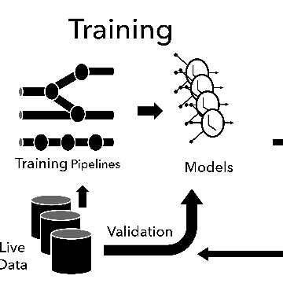

A Short History of Prediction-Serving Systems - RISE Lab

A Short History of Prediction-Serving Systems - RISE Lab

https://rise.cs.berkeley.edu/blog/a-short-history-of-prediction-serving-systems/

Machine learning is an enabling technology that transforms data into solutions by extracting patterns that generalize to new data. Much of machine learning can be reduced to learning a model — a function that maps an input (e.g. a photo) to a prediction (e.g. objects in the photo). Once trained, these models can be used to make predictions on new inputs (e.g., new photos) and as part of more complex decisions (e.g., whether to promote a photo). While there are thousands of papers published each year on ho