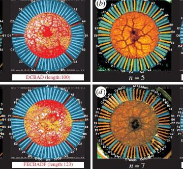

A Single Cell Hints at a Solution to the Biggest Problem in Computer Science

A Single Cell Hints at a Solution to the Biggest Problem in Computer Science

https://www.popularmechanics.com/science/math/a25686417/amoeba-math/

One small amoeba found a solution to the traveling salesman problem faster than our best algorithms. What does it know that we don't?