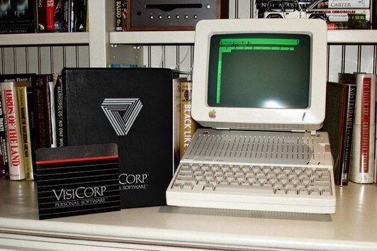
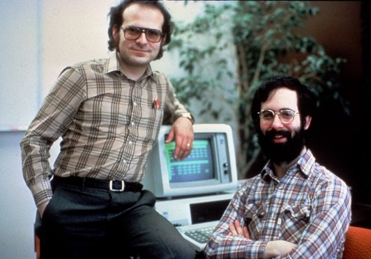
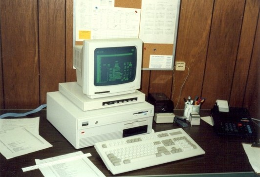

A Spreadsheet Way of Knowledge | Backchannel

- Author: Steven Levy[Steven Levy](https://www.wired.com/author/steven-levy)
- [backchannel](https://www.wired.com/category/backchannel/)
- 10.24.14
- 12:00 am

# A Spreadsheet Way of Knowledge

#### Share

- [**](https://www.facebook.com/sharer/sharer.php?t=A%20Spreadsheet%20Way%20of%20Knowledge%20%7C%20Backchannel&u=https%3A%2F%2Fwww.wired.com%2F2014%2F10%2Fa-spreadsheet-way-of-knowledge%2F?mbid=social_fb_onsiteshare)
- [**](https://twitter.com/intent/tweet?text=A%20Spreadsheet%20Way%20of%20Knowledge%20%7C%20Backchannel&url=https%3A%2F%2Fwww.wired.com%2F2014%2F10%2Fa-spreadsheet-way-of-knowledge%2F?mbid=social_twitter_onsiteshare&via=backchnnl)
- [**](https://www.wired.com/2014/10/a-spreadsheet-way-of-knowledge/#comments)
- [**](https://www.wired.com/2014/10/a-spreadsheet-way-of-knowledge/mailto:?subject=WIRED%3A%20A%20Spreadsheet%20Way%20of%20Knowledge%20%7C%20Backchannel&body=Check%20out%20this%20great%20article%20I%20read%20on%20WIRED%3A%20%22A%20Spreadsheet%20Way%20of%20Knowledge%20%7C%20Backchannel%22%0D%0A%0D%0Ahttps%3A%2F%2Fwww.wired.com%2F2014%2F10%2Fa-spreadsheet-way-of-knowledge%2F?mbid=email_onsiteshare%22%0D%0A%0D%0AFor%20unlimited%20access%20to%20stories%20like%20this%20on%20WIRED.com,%20subscribe%20with%20the%20following%20link:%0D%0Ahttps%3A%2F%2Fsubscribe.wired.com%2Fsubscribe%2Fsplits%2Fwired%2FWIR_Edit_Hardcoded%3Fsource%3DEDT_WIR_ARTICLE_SHARE_LINK_0_SUB_AD_ZZ)

> I learned, belatedly, that last October 17 was Spreadsheet Day, marking the 35th anniversary of VisiCalc, the Apple II program that started it all. This moved me to republish a long piece I wrote 30 years ago about the significance, as well as the dangers, of this advance. (This was so long ago that I had to define what a cursor was!) The piece first appeared in *> Harper’s*> , November 1984.

**As Dan Bricklin remembers it,** the idea first came to him in the spring of 1978 while he was sitting in a classroom at the Harvard Business School. It was the kind of idea—so obvious, so right— that made him immediately wonder why no one else had thought of it. And yet it was no accident that this breakthrough should have been his.

Bricklin had graduated from MIT, where—and this is crucial to the idea he would have that afternoon in 1978— he had worked intimately with computers. Before deciding to go to graduate school he had worked for two major computer companies— first for Wang, then for the Digital Equipment Corporation, for whom he helped design a word-processing program. Like most Harvard MBA candidates, he wanted to be a businessman; but more often than not, his thoughts strayed to the technological.

The question Bricklin was pondering that day in 1978 concerned how he might use what he knew about computers to help him in his finance course. This was the assignment: he and several other students had been asked to project the complicated financial implications- the shift in numbers and dollars, and the shifts resulting from these shifts- of one company’s acquisition of another.

Bricklin and his classmates would need ledger sheets, often called spreadsheets. Only by painstakingly filling in the pale green grids of the spreadsheets would they get an accurate picture of the merger and its consequences. A row on the ledger might represent an expense of a category of revenue; a column might represent a specific period of time – a day, a month, a year. Run your finger across, say, a row of figures representing mortgage payments for a certain property, and the number in each “cell” of the horizontal row would be the figure paid in the time period represented by that particular vertical column. Somewhere on the sheet the columns and rows would be tallied, and that information would be entered on even larger sheets.

### Trending Now

Science

[### Astronomer Jill Tarter Answers Alien Questions From Twitter](http://video.wired.com/watch/astronomer-jill-tarter-answers-aliens-questions-from-twitter)

The problem with ledger sheets was that if one monthly expense went up or down, everything – everything – had to be recalculated. It was a tedious task, and few people who earned their MBAs at Harvard expected to work with spreadsheets very much. Making spreadsheets, however necessary, was a dull chore best left to accountants, junior analysts, or secretaries. As for sophisticated “modeling” tasks – which, among other things, enable executives to project costs for their companies – these tasks could be done only on big mainframe computers by the data-processing people who worked for the companies Harvard MBAs managed.

Bricklin knew all this, but he also knew that spreadsheets were needed for the exercise; he wanted an easier way to do them. It occurred to him: why not create the spreadsheets on a microcomputer?

Why not design a program that would produce on a computer screen a green, glowing ledger, so that the calculations, as well as the final tabulations, would be visible to the person “crunching” the numbers?

Why not make an electronic spreadsheet, a word processor for figures?

Bricklin’s teachers at Harvard thought he was wasting his time: why would a manager want to do a spreadsheet on one of those “toy” computers? What were secretaries and accountants and the people down in DP for? But Bricklin could not be dissuaded. With a computer programmer friend from MIT named Bob Frankston, he set to work developing the first electronic spreadsheet program. It would be contained on a floppy disk and run on the then brand-new Apple personal computer. Bricklin and Frankson released VisiCalc (the name was derived from Visible Calculation) in late 1979.

VisiCalc running on Apple IIc, 1983.
**Photo by Mark Mathosian.

Today, VisiCalc and its newer rivals – most notably, a more powerful spreadsheet program designed by the Lotus Development Corporation called 1–2–3 – are making fundamental changes in the way American businesses work. For the first time, businessmen have at their fingertips sophisticated and flexible means to chart all the variables – from interest rates to warehouse space – that make (and break) businesses. The biggest firms, the most diversified corporations, can be neatly translated into spreadsheet “models” – each box of the grid a window on to once-overlooked facts or relationships. These models can be used not only to keep track of transactions but also to analyze the nature of a business itself. They allow businessmen to calculate the effects of sudden changes in the corporate environment (a decrease in the prime rate) and to experiment with scenarios (anything from the expansion of a product line to a merger) – all with an ease inconceivable five years ago.

More than a million computer spreadsheet programs worth more than $250 million will be purchased in the United States this year. There are corporate executives, wholesalers, retailers, and small business owners who talk about their business lives in two time periods: before and after the electronic spreadsheet. They cite prodigious gains in productivity. They speak of having a better handle on their businesses, of knowing more and planning better, of approaching their work more imaginatively.

A virtual cult of the spreadsheet has formed, complete with gurus and initiates, detailed lore, arcane rituals – and an unshakable belief that the way the world works can be embodied in rows and columns of numbers and formulas.

It is not far-fetched to imagine that the introduction of the electronic spreadsheet will have an effect like that brought about by the development during the Renaissance of double-entry bookkeeping. Like the new spreadsheet, the double-entry ledger, with its separation of debits and credits, gave merchants a more accurate picture of their businesses and let them see – there, on the page – how they might grow by pruning here, investing there. The electronic spreadsheet is to double entry what an oil painting is to a sketch. And just as double-entry changed not only individual businesses but business, so has the electronic spreadsheet.

Already, the spreadsheet has redefined the nature of some jobs; to be an accountant in the age of spreadsheet program is — well, almost sexy. And the spreadsheet has begun to be a forceful agent of decentralization, breaking down hierarchies in large companies and diminishing the power of data processing.

There has been much talk in recent years about an “entrepreneurial renaissance” and a new breed of risk-taker who creates businesses where none previously existed. Entrepreneurs and their venture-capitalist backers are emerging as new culture heroes, settlers of another American frontier. Less well known is that most of these new entrepreneurs depend on their economic spreadsheets as much as movie cowboys depend on their horses.

Mitch Kapor, age 34, a former teacher of Transcendental Meditation, is chairman of the board of the Lotus Development Corporation. In 1983, less than a year after selling its first 1–2–3 package, Lotus went public, a move that brought Kapor’s personal net worth to more than $75 million. “Compare the expansion of business today to the conquering of the continent in the nineteenth century,” Kapor told me recently as he pulled himself away from his IBM-PC. We were talking in his modest office in the old iron-casting factory in Cambridge, Massachusetts, that is now Lotus’s headquarters.

“The spreadsheet in that comparison is like the transcontinental railroad. It accelerated the movement, made it possible, and changed the course of the nation.”

Kapor’s comparison is an apt one. The computer spreadsheet, like the transcontinental railroad, is more than a means to an end. The spreadsheet embodies, embraces, that end, and ultimately serves to reinforce it. As Marshall McLuhan observed, “We shape our tools and thereafter our tools shape us.” The spreadsheet is a tool, and it is also a world view — reality by the numbers. If the perceptions of those who play a large part in shaping our world are shaped by spreadsheets, it is important that all of us understand what this tool can and cannot do.

One measure of the spreadsheet’s impact is clear, however, and it is a source of satisfaction to Dan Bricklin: every student in the Harvard Business School is now required to be proficient in using electronic spreadsheets.

**Ezra Gottheil,** 34 is the senior product-design planner at Lotus. He shows up for work in casual clothes, and his small office is cluttered with piles of manuals and software. When I visited Gottheil he gave me a quick introduction to electronic speadsheeting. Computer programs are said to use different “metaphors” to organize their task; a program might use the metaphor of a Rolodex, or a file cabinet. When you “boot” almost any spreadsheet program into your personal computer, you see little more than some letters running across the top of the display screen and some numbers running down the side. This serves to indicate the grid of a ledger sheet, the metaphor used by Lotus and other best-selling spreadsheets like VisiCalc, Multiplan, and SuperCalc. The “cursor,” a tiny block of light on the screen that acts like a kind of electronic pencil, can be moved (by a touch of the computer keyboard) to any cell on the spreadsheet in order to “input” numbers or formulas. By placing in the cells either figures of formulas that adjust figures according to different variables, it is possible to duplicate the relationships between various aspects of a business and create a “model.” The basic model for a restaurant, for example, world include expenses such as salaries, food and liquor costs, and mortgage or rent payments; revenues might be broken down into “bar” and “food,” perhaps even further by specific dishes. Every week, the figures would be updated, the formulas reworked if necessary (perhaps the price of the olive oil had risen) and the recalculated model provides an accurate snapshot of the business.

Gottheil turned to the keyboard of the IBM-PC on a table beside his desk and booted a spreadsheet. The screen lit up with the familiar grid, and Gottheil’s hands arched over the keys as gracefully as the hands of a pianist. He pressed the keys that make the blinking cursor hopscotch across the cells and as he changed an item in one cell, there was a ripple-like movement in the other cells; the spreadsheet program was recalculating. His eyebrows rose as he saw the result. Then he punched in another variable, and another ripple of figures washed across the screen. He was offering the computer different hypothetical developments, and it was feeding back to him their probable consequences. “It’s a good tool,” Gottheil noted matter-of-factly. In these, the early days of electronic spreadsheeting, it is most frequently seen as a tool for saving time. Don Jackson is a certified public accountant in Cincinnati. He has between 40 and 50 clients, mostly small businesses. Before he bought an Apple three years ago, he painstakingly did his calculations on light green crosshatched ledger sheets. A client would come in to work out a billing procedure, and after Jackson had put the relevant numbers on a sheet — in light pencil, so erasures could be easily made — various questions would come up. For example, if the billing procedure was based on a 15 percent interest rate, what would happen if the rate went up to 18 percent? To find out, the whole sheet would have to be redone. Each figure would have to be punched into a hand calculator and then checked by one of Jackson’s employees. “I would work for twenty hours,” Jackson said. “With a spreadsheet, it takes me 15 minutes.”

**Jackson’s story** is a common one. In the first days of electronic spreadsheets — that is, two or three years ago — those who used them got things done so quickly that, despite the evidence of finished reports, bosses and co-workers often had trouble believing the tasks had been completed. Gottheil told me of an accountant who got “a rush task, sat down with his micro and his spreadsheet, finished it in an hour or two, and left it on his desk for two days. Then he Fed Ex-ed it to the client and got all sorts of accolades for working overtime.”

But saving time is hardly the only benefit of spreadsheets. They encourage businesses to keep track of things that were previously unquantified or altogether overlooked. Executives no longer have to be satisfied with quarterly updates, for it is now an easy matter to compile monthly, weekly, even daily updates. People use spreadsheets to make daily inventory checks, to find out who has paid their bills, to chart the performance of truck drivers over a period of weeks or months. How-to manuals for spreadsheets often use as an example a performance chart for salespeople — the model breaks down how many items they sell week by week and instantly calculates commissions and even bonuses due. If word comes down that a belt-tightening is in order, a few keystrokes will create a sheet that clearly identifies the worst performers.

Bob Frankston (standing) and Dan Bricklin, 1982.
**Jim Raycroft

Bob Frankston, the programmer who designed VisiCalc with Dan Bricklin, noted that instant hard figures, so recently a luxury, are quickly becoming a necessity. The spreadsheet tool is shaping us. “There’s an increasing demand for quantitative rather than qualitative justification for decisions,” he said. “In the past, before spreadsheets, people would have taken a guess. Now they feel obligated to run the numbers.”

Yet what really has the spreadsheet users charmed is not the hard and fast figures but the “what if” factor: the ability to create scenarios, explore hypothetical developments, try out different options. The spreadsheet, as one executive put it, allows the user to create and then experiment with “a phantom business within the computer.”

“Before the spreadsheet, you barely had enough time to do the totals,” said Archie Barrett, a Capitol Hill staff member who uses an IBM PC-XT to work up spreadsheets for the House Armed Services Committee. “Now you put in a number and see whether you’re above or below the total. You can play what-if games. What if we don’t order as many tanks? What if we order more?”

The what-if factor has changed the way Allen Sneider, a partner in the Boston office of Laventhol & Harwath, a national accounting firm, approaches his job. Sneider bought an Apple in 1978, but he was not able to make it useful in his business until he saw an early copy of VisiCalc and became one of the first professionals to use the program. He explained:

> Before, you would suggest a change to a client, get a staff member to calculate it, send it to the typist, to the proofreader, and recalculate it to make sure there weren’t any errors. Now you have a machine right there with the client. Want to see what happens with a different return on investment? Sheltering? Interest rates changing by half of a percent? It’s done in a minute. Before you’d be tempted to say, “Let’s leave it the way it was.” The whole mental attitude toward preparing projections has changed.

The what-if factor has not only changed the nature of jobs such as accounting; it has altered once rigid organizational structures. Junior analysts, without benefit of secretaries or support from data processing departments, can work up 50-page reports, complete with graphs and charts, advocating a complicated course of action for a client. And senior executives who take the time to learn how to use spreadsheets are no longer forced to rely on their subordinates for information.

Theodore Stein is an assistant vice president in data processing at the Connecticut Mutual Life Insurance Company in Hartford. After seeing what VisiCalc and the more powerful Lotus 1–2–3 could do, Stein became a passionate disciple of the spreadsheet. Until recently, Connecticut Mutual, like many large corporations, centralized its computer services in one division – data processing. People out in the field, or even at corporate headquarters, were generally not satisfied with the information they got from DP, Stein said.

> DP always has more requests than it can handle. There are two kinds of backlog – the obvious one, of things requested, and a hidden one. People say, “I won’t ask for the information because I won’t get it anyway." When those two guys designed VisiCalc, they opened up a whole new way. We realized that in three or four years, you might as well take your big minicomputer out on a boat and make an anchor out of it. With spreadsheets, a microcomputer gives you more power at a tenth the cost. Now people can do the calculations themselves, and they don’t have to deal with the bureaucracy.

Since it was easy to learn how to use spreadsheets – no programming experience is required – all it takes to get into the game is a $3,000 personal computer and a $500 copy of 1–2–3, or even a copy of VisiCalc or the Micro-Soft Company’s Multiplan, both of which cost less than $200. Stein learned then early in Connecticut Mutual’s spreadsheeting days. The company’s chief financial officer wanted certain information, and his top “experts” had difficulty providing it. So one weekend he brought an Apple computer and a copy of VisiCalc home with him. Monday morning, he called his people in and showed them how he had gotten the information he had been clamoring for. “With one swipe of the diskette, he cut them off at the knees.” Stein said. “He out-teched them. His experts! He’d cut the chain. The following week, they all came down to learn VisiCalc – fast.”

All this powerful scenario-testing machinery right there on the desktop induces some people to experiment with elaborate models. They talk of “playing” with the numbers, “massaging” the model. Computer “hackers” lose themselves in the intricacies of programming; spreadsheet hackers lose themselves in the world of what-if. Some, like Theodore Stein of Connecticut Mutual, admit that their habit goes beyond the point of diminishing returns: “I can’t begin to tell you how many hours I spend at this,” he said. “This is my pet, in a way. Scratching its ears and brushing its code…it’s almost an obsession.”

The experiments Stein and those like him carry out are far-flung attempts to formulate the ultimate model, the spreadsheet that behaves just like an actual business. Allerton J. Cushman of Morgan Stanley has been a connoisseur of these models since discovering that computer spreadsheets could make forecasts of the property-casualty insurance industry. Cushman wrote a pamphlet about his projections entitled “Confessions of an Apple Byter”, which offered the observation that with VisiCalc, getting your arms around the future seems a trifle easier. Cushman’s office, high above midtown Manhattan, is dominated by IBM-compatible computers and printers, and when I visited him there he explained his fascination with modeling this way: “People like to build elegant models, whether of balsa wood or numbers.”

Spreadsheet models have become a form of expression, and the very act of creating them seem to yield a pleasure unrelated to their utility. Unusual models are duplicated and passed around; these templates are sometimes used by other modelers and sometimes only admired for their elegance.

Sterin, Cushman, and others so-called gurus lost themselves in the more esthetic possibilities of spreadsheeting: the perfect model is an end in itself. Power users learn from gurus, but have other ends in mind they can use sophisticated models to gain significant professional advantages. When a guru is not available, there are courses to take, self-help books to study, and magazine articles to examine, like the one in the July 1984 issue of *Personal Computing* entitled “Power Spreadsheeting,” which warns of “arrested spreadsheet development” and urges users to “think like a spreadsheet”.

> Mastery is important, not for art’s sake but to win. A brilliant model is not only beautiful, it yields insights impossible to attain by any other method.

Dick York, a private real estate investor in Sausalito,changed his entire business to revolve around his Lotus 1–2–3. “I’ve used it to reduce everything in my operation to cash flow,” he said. “The spreadsheets give me constant updates, and I’m able to pinpoint property that isn’t bringing in money — I dump those properties immediately. This is information I’d always tried to get manually, but couldn’t.” York told me about the time he negotiated a commercial lease that included both a monthly rental and a percentage of the profit of his operation. In the course of making the spreadsheet model, he discovered there was a point at which going along with a raise in his rent would actually decrease the amount he’d pay the landlord. (The landlord did not have his own spreadsheet to divine this fact.)

Allen Sneider of Lowenthol & Horwath once worked a spreadsheet masterpiece. A client representing a finance company wanted to know whether it would be a good idea to pay $12 million for a factory that made artificial turf. Sneider and the client made a model that was sensitive to all sorts of variables. It would let you know the consequences of any change you might want to make in the business. Add a new production line, decrease production, increase inventory, widen the collateral base, change the mortgage rate, increase hourly wages…it was all there, calculated according to highly refined formulas. What happened? Sneider’s client did not buy the factory (the factory employees bought it). Instead, he started his own business — buying and selling spreadsheet templates.

**Because spreadsheets** can do so many important things, those who use them tend to lose sight of the crucial fact that the imaginary business that they create on their computers are just that-imaginary. You can’t really duplicate a business inside a computer, just aspects of a business. And since numbers are the strength of spreadsheets. The aspects that get emphasized are the ones easily embodied by numbers. Intangible factors aren’t so easily quantified. Jim McNitt, in *TheArt of Computer Management*, tells the story of a restaurant owner named Maxwell who was trying to decide whether to undertake a costly renovation. He ran fifteen different scenarios on his computer, including one in which he took the money set aside for renovation and invested it elsewhere. What Maxwell found was startling: Not only would renovation be foolhardy, but “even the ‘best case’ showed I’d get nearly as good a rate of a return on my investment in a money market fund as staying in the restaurant business.” Get out of the restaurant business! the spreadsheet said. What the spreadsheet left out, of course was the unquantifiable emotional factor — Maxwell loved what he did. He kept the restaurant (though scuttled the renovation).

Maxwell was his own boss and could follow his instincts. But a corporate executive who ignored such a clear-cut bottom-line conclusion might be risking his professional life. He is more likely to follow the numbers turned out by spreadsheets.

And so it is that spreadsheets help in the drive for paper profits, and are a prime tool of takeover architects. An executive in a acquisition-hungry company might spend his time spreadsheeting in order to find a company ripe for takeover. If his spreadsheet projections were to produce a likely candidate- if the numbers looked good- he would naturally recommend making a takeover bid. Even a hostile takeover seems cut and dried, perfectly logical, in the world of spreadsheets. The spreadsheet user has no way of quantifying a corporate tradition or the misery of stockholders or whether the headaches of a drawn out takeover bid will ultimately harm the corporate climates of the firms involved.

The flexibility of spreadsheets can encourage other heartless moves from headquarters. It is no great drain on an executive’s time to experiment with all sorts of odd, even insidious. He might ask “What if we dropped our pension plan?” Then he might run his idea through a spreadsheet and find a huge gain in capital- and there would be an unthinkable, in hard figures.

Spreadsheets have no way of dealing with hunches, either, no formulas for telling their users when lightning will strike- when a product will be not merely a product but a trend-setting blockbuster.

There were no formulas in Lotus’s spreadsheet projections that did justice to the fantastic consumer acceptance of 1–2–3.”Our own projections were violated on a daily basis,” said Ezra Gottheil. “It was beyond our wildest assumptions.”

People tend to forget that even the most elegantly crafted spreadsheet is a house of cards, ready to collapse at the first erroneous assumption. The spreadsheet that looks good but turns makers themselves pay the price. In August 1984, the *Wall Street Journal* reported that a Texas-based oil and gas company had fired several executives after the firm lost millions of dollars in an acquisition deal because of “errors traced to a faulty financial analysis spread sheet model.”

An often-repeated truism about computers is “Garbage in, Garbage Out.” Any computer program, no matter how costly, sophisticated, or popular, will yield worthless results if the data fed into it is faulty. With spreadsheets, the danger is not so much that incorrect figures can be fed into them as that “garbage” can be embedded in the models themselves. The accuracy of a spreadsheet model is dependent on the accuracy of the formulas that govern the relationships between various figures. These formulas are based on assumptions made by the model maker. An assumption might be an educated guess about a complicated cause-and-effect relationship. It might also be a wild guess, or a dishonestly optimistic view.

For instance, a 5 percent increase in the cost of raw materials used to make widgets might lead to 10 percent increase in the retail price, according to an established cost-price ratio. Anyone projecting a budget for a widget company could confidently integrate that formula into his model. But to determine the effect of a 10 percent price increase on the number of widgets actually sold, he would have to take into account all sorts of market factors, as well as how people tend to behave in certain situations. Perhaps the spreadsheeter has access to a study that definitively shows that a 5 percent increase in widget prices results in a 6 percent decrease in sales. But maybe no study exists. Or maybe the spreadsheeter knows that the widget company plans to use the projection to seek new financing and therefore doesn’t want to reveal the company’s vulnerability to fluctuations in the price of raw materials. So he might make the ludicrously optimistic assumption that a 5 percent price increase would result in only a 1 percent decrease in sales.

A notorious example of this kind of fiddling occurred when David Stockman, Director of the Office of Management and Budget, was drawing up the budget for Ronald Reagan’s first presidential term. According to William Greider’s book *The Education of David Stockman and Other Americans*, a mainframe computer had been programmed with an elaborate model of the nation’s economic behavior. When Stockman used the model to project the effects of Reagan’s plan to reduce income taxes and increase defense spending, the computer calculated that the plan would lead to unprecedented federal deficits. Did Stockman warn his president that they were on a dangerous course? No. “He changed the economic assumptions fed into computer model,” writes Greider. “[He] assumed a swift decline in prices and interest rates. …The new model was based on a dramatic surge in the nation’s productivity.” So Stockman was able to fortify the Administration with figures — generated by a computer — showing that the deficit would not be problem.

Stockman’s sleight of hand was fairly easy to discern. In 1981, electronic spreadsheets were just coming into their own, and the kind of sophisticated modeling Stockman did was still done chiefly on mainframe computers. The output he was working with wasn’t in the now-familiar spreadsheet format; instead, the formulas appeared in one place and the results in another. You could see what you were getting. That cannot be said of electronic spreadsheets, which don’t display the formulas that govern their calculations.

As Mitch Kapor explained, with electronic spreadsheets, “You can just randomly make formulas, all of which depend on each other. And when you look at the final results, you have no way of knowing what the rules are, unless somebody tells you.”

Lotus 1–2–3 on the screen of the Tandy 3000NL computer used in 1988.
**Rick Payette

**Increasingly, however,** businessmen are not telling but letting their spreadsheets do the talking. Because a spreadsheet looks so authoritative – and it was done by a computer, wasn’t it? – the hypothetical models get accepted as gospel. The spreadsheet presentation is becoming both more commonplace and more sophisticated: not only the numbers but the formats of the sheets themselves are designed to make eloquent points. This use of spreadsheets has less to do with productivity or insightful analysis than with the art of persuasion. “People doing negotiations now sit down with spreadsheets,” Bob Frankston said. “When you’re trying to sell a car, the standard technique is to ask for the other person’s objections, and then argue them away. If two people are in front of a spreadsheet, and one says, ‘Well, the numbers say this,’ the other can’t say, ‘Yes, but there’s something I can’t quite point to.’”

As spreadsheets are used more for persuasion and negotiation, people are becoming rather sly about their design. Lotus 1–2–3 can turn figures and formulas into graphs—graphs that spreadsheeters can use to skew and oversimplify reality. “With graphs, things take on greater weight,” Allen Sneider said. Sneider expects spreadsheets to become more persuasive – and the distortion of reality greater – when color printers become more common. “If I wanted to, I could skew the picture by choosing a particular color in a bar graph. Some people think red is very negative. They might think green indicates profitability.” All of this has made some people who work with spreadsheets regularly skeptical of what they see. “I know of one venture capital firm that assumes people manipulate spreadsheets,” Kapor said. “So they have this other model to put against the first one, to factor the stuff out.”

Obviously, not all the millions of people who use spreadsheets (VisiCalc alone has sold over 700,000 copies) are accountants, financial analysts, or middle managers. VisiCalc’s co-designer Bob Frankston attributes some of his program’s popularity to these other users: “It turns out there are a number of people who are running their own businesses or doing financial management. The ‘own business’ might be something like renting an apartment. If you’’ve got to project costs for a year, it makes sense to do it with a spreadsheet.” More than 10 million people filed Schedule C “self-employment” reports with the IRS last year: we are becoming a nation of businesspeople. Moreover, we are becoming a society of businesspeople. We speak in a jargon derived from the business world (“What’s the bottom line on this?”). We read columns on “personal money management” that urge us to speculate in markets once reserved for the very few. We have accepted the venture capitalist as a role model. The buzz word these days in computer software firms looking to expand their markets is “personal productivity,” as if the home itself — maybe life itself – were best viewed as a business.

Spreadsheets are at the heart of this movement. Using electronic spreadsheets, everyone can run his or her own business. Thousands of Americans are attending classes to learn about the spreadsheet way of knowledge.

Some will lose themselves in the rows of columns, the grids becoming their windows on the world. They will spend their evenings in front of their computers, the dark dimly lit by the glow of green phosphorescent numbers, fiddling with scenarios, trying to make the profit line perfect.

There is no doubt that the electronic spreadsheet saves time and provides insight; there is no doubt that even greater benefits will one day be derived from these grids. Yet all these benefits will be meaningless if the spreadsheet metaphor is taken too much to heart. After all, it is only a metaphor. Fortunately, few would argue that all relations between people can be quantified and manipulated by formulas. Of human behavior, no faultless assumptions – and so no perfect model — can be made.

*Copyright © 1984 by Steven Levy, reprinted by permission.*

- [#Backchannel](https://www.wired.com/tag/backchannel/)

#### Most Popular

- [        science ##### Quantum Darwinism Could Explain What Makes Reality Real  Author: Philip BallPhilip Ball](https://www.wired.com/story/quantum-darwinism-could-be-what-makes-reality-real/)
- [        security ##### How to Get Your Equifax Settlement Money  Author: Lily Hay NewmanLily Hay Newman](https://www.wired.com/story/how-to-get-equifax-settlement-money/)

-

 [                 Sponsor Content   ##### How 5G Technology Could Change the World      Condé Nast](https://video.vanityfair.com/watch/how-5g-technology-could-change-the-world?intcid=polar&utm_source=polar&utm_medium=nativetile)

- [        culture ##### My Search for a Boyhood Friend Led to a Dark Discovery  Author: Douglas PrestonDouglas Preston](https://www.wired.com/story/my-search-for-boyhood-friend-led-to-dark-discovery/)

[**More Stories](https://www.wired.com/most-popular)