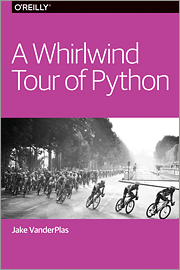

A Whirlwind Tour of Python | A Whirlwind Tour of Python

A Whirlwind Tour of Python | A Whirlwind Tour of Python

https://jakevdp.github.io/WhirlwindTourOfPython/

A Whirlwind Tour of Python Jake VanderPlas This website contains the full text of my free O'Reilly report, A Whirlwind Tour of Python . A Whirlwind Tour of Python is a fast-paced introduction to essential features of the Python language, aimed at researchers and developers who are already familiar with programming in another language. The material is particularly designed for those who wish to use Python for data science and/or scientific programming, and in this capacity serves as an introduction to my longer book,