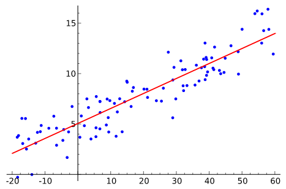

A 'Brief' History of Neural Nets and Deep Learning

# [A 'Brief' History of Neural Nets and Deep Learning](http://www.andreykurenkov.com/writing/ai/a-brief-history-of-neural-nets-and-deep-learning/)

##### The beginning of a story spanning half a century, about how we learned to make computers learn	|December 24, 2015

This is the first part of ‘A Brief History of Neural Nets and Deep Learning’. Part 2 is [here](http://www.andreykurenkov.com/writing/ai/a-brief-history-of-neural-nets-and-deep-learning-part-2), and parts 3 and 4 are [here](http://www.andreykurenkov.com/writing/ai/a-brief-history-of-neural-nets-and-deep-learning-part-3) and [here](http://www.andreykurenkov.com/writing/ai/a-brief-history-of-neural-nets-and-deep-learning-part-4). In this part, we shall cover the birth of neural nets with the Perceptron in 1958, the AI Winter of the 70s, and neural nets’ return to popularity with backpropagation in 1986.

*Update: I now (in 2018) do a lot of writing about AI on **[Skynet Today](https://www.skynettoday.com/)** and **[The Gradient](https://thegradient.pub/)**. Be sure to visit those sites and check out some of the writing and/or subscribe if you are interested in the topic!*

# Prologue: The Deep Learning Tsunami

>

> “Deep Learning waves have lapped at the shores of computational linguistics for several years now, but 2015 seems like the year when the full force of the tsunami hit the major Natural Language Processing (NLP) conferences.” -> [> Dr. Christopher D. Manning, Dec 2015](http://www.mitpressjournals.org/doi/pdf/10.1162/COLI_a_00239)>

>

This may sound hyperbolic - to say the established methods of an entire field of research are quickly being superseded by a new discovery, as if hit by a research ‘tsunami’. But, this catastrophic language is appropriate for describing the meteoric rise of Deep Learning over the last several years - a rise characterized by drastic improvements over reigning approaches towards the hardest problems in AI, massive investments from industry giants such as Google, and exponential growth in research publications (and Machine Learning graduate students). Having taken several classes on Machine Learning, and even used it in undergraduate research, I could not help but wonder if this new ‘Deep Learning’ was anything fancy or just a scaled up version of the ‘artificial neural nets’ that were already developed by the late 80s. And let me tell you, the answer is quite a story - the story of not just neural nets, not just of a sequence of research breakthroughs that make Deep Learning somewhat more interesting than ‘big neural nets’ (that I will attempt to explain in a way that just about anyone can understand), but most of all of how several unyielding researchers made it through dark decades of banishment to finally redeem neural nets and achieve the dream of Deep Learning.

> I am in no capacity an expert on this topic. In depth technical overviews with long lists of references written by those who actually made the field what it is include Yoshua Bengio's > [> "Learning Deep Architectures for AI"](http://www.iro.umontreal.ca/~lisa/pointeurs/TR1312.pdf)> , Jürgen Schmidhuber's > [> "Deep Learning in Neural Networks: An Overview"](http://arxiv.org/pdf/1404.7828v4.pdf)>  and LeCun et al.s' > [> "Deep learning"](http://www.cs.toronto.edu/~hinton/absps/NatureDeepReview.pdf)> . In particular, this is mostly a history of research in the US/Canada AI community, and even there will not mention many researchers; a particularly in depth history of the field that covers these omissions is Jürgen Schmidhuber's > [> "Deep Learning in Neural Networks: An Overview"](http://people.idsia.ch/~juergen/deep-learning-overview.html)> . I am also most certainly not a professional writer, and will cop to there being shorter and much less technical overviews written by professional writers such as Paul Voosen's > [> "The Believers"](http://chronicle.com/article/The-Believers/190147)> , John Markoff's > [> "Scientists See Promise in Deep-Learning Programs"](http://www.nytimes.com/2012/11/24/science/scientists-see-advances-in-deep-learning-a-part-of-artificial-intelligence.html)>  and Gary Marcus's > [> "Is “Deep Learning” a Revolution in Artificial Intelligence?"](http://www.newyorker.com/news/news-desk/is-deep-learning-a-revolution-in-artificial-intelligence)> . I also will stay away from getting too technical here, but there is a plethora of tutorials on the internet on all the major topics covered in brief by me.

> Any corrections would be greatly appreciated, though I will note some ommisions are intentional since I want to try and keep this 'brief' and a good mix of simple technical explanations and storytelling.

# The Centuries Old Machine Learning Algorithm

 

Linear regression [(Source)](https://upload.wikimedia.org/wikipedia/commons/3/3a/Linear_regression.svg)

Let’s start with a brief primer on what Machine Learning is. Take some points on a 2D graph, and draw a line that fits them as well as possible. What you have just done is generalized from a few example of pairs of input values (x) and output values (y) to a general function that can map any input value to an output value. This is known as linear regression, and it is a wonderful little [200 year old](https://en.wikipedia.org/wiki/Linear_regression#cite_note-4) technique for extrapolating a general function from some set of input-output pairs. And here’s why having such a technique is wonderful: there is an incalculable number of functions that are hard to develop equations for directly, but are easy to collect examples of input and output pairs for in the real world - for instance, the function mapping an input of recorded audio of a spoken word to an output of what that spoken word is.

Linear regression is a bit too wimpy a technique to solve the problem of speech recognition, but what it does is essentially what **supervised Machine Learning** is all about: ‘learning’ a function given a **training set** of **examples**, where each example is a pair of an input and output from the function (we shall touch on the unsupervised flavor in a little while). In particular, machine learning methods should derive a function that can generalize well to inputs not in the training set, since then we can actually apply it to inputs for which we do not have an output. For instance, Google’s current speech recognition technology is powered by Machine Learning with a massive training set, but not nearly as big a training set as all the possible speech inputs you might task your phone with understanding.

This generalization principle is so important that there is almost always a **test set** of data (more examples of inputs and outputs) that is not part of the training set. The separate set can be used to evaluate the effectiveness of the machine learning technique by seeing how many of the examples the method correctly computes outputs for given the inputs. The nemesis of generalization is **overfitting** - learning a function that works really well for the training set but badly on the test set. Since machine learning researchers needed means to compare the effectiveness of their methods, over time there appeared standard **datasets** of training and testing sets that could be used to evaluate machine learning algorithms.

Okay okay, enough definitions. Point is - our line drawing exercise is a very simple example of supervised machine learning: the points are the training set (X is input and Y is output), the line is the approximated function, and we can use the line to find Y values for X values that don’t match any of the points we started with. Don’t worry, the rest of this history will not be nearly so dry as all this. Here we go.

# The Folly of False Promises

Why have all this prologue with linear regression, since the topic here is ostensibly neural nets? Well, in fact linear regression bears some resemblance to the first idea conceived specifically as a method to make machines learn: [Frank Rosenblatt’s **Perceptron**](http://psycnet.apa.org/index.cfm?fa=buy.optionToBuy&id=1959-09865-001)

.
 

A diagram showing how the Perceptron works. [(Source)](http://cse-wiki.unl.edu/wiki/images/0/0f/Perceptron.jpg)

A psychologist, Rosenblatt conceived of the Percetron as a simplified mathematical model of how the neurons in our brains operate: it takes a set of binary inputs (nearby neurons), multiplies each input by a continuous valued weight (the synapse strength to each nearby neuron), and thresholds the sum of these weighted inputs to output a 1 if the sum is big enough and otherwise a 0 (in the same way neurons either fire or do not). Most of the inputs to a Perceptron are either some data or the output of another Perceptron, but an extra detail is that Perceptrons also have one special ‘bias’ input, which just has a value of 1 and basically ensures that more functions are computable with the same input by being able to offset the summed value. This model of the neuron built on the work of Warren McCulloch and Walter Pitts [Mcculoch-Pitts](http://www.minicomplexity.org/pubs/1943-mcculloch-pitts-bmb.pdf)

, who showed that a neuron model that sums binary inputs and outputs a 1 if the sum exceeds a certain threshold value, and otherwise outputs a 0, can model the basic OR/AND/NOT functions. This, in the early days of AI, was a big deal - the predominant thought at the time was that making computers able to perform formal logical reasoning would essentially solve AI.

 

Another diagram, showing the biological inspiration. The **activation function** is what people now call the non-linear function applied to the weighted input sum to produce the output of the artificial neuron - in the case of Rosenblatt's Perceptron, the function just a thresholding operation. [(Source)](http://cs231n.github.io/neural-networks-1/)

However, the Mcculoch-Pitts model lacked a mechanism for learning, which was crucial for it to be usable for AI. This is where the Perceptron excelled - Rosenblatt came up with a way to make such artificial neurons learn, inspired by the [foundational work](http://onlinelibrary.wiley.com/doi/10.1002/cne.900930310/abstract)

of Donald Hebb. Hebb put forth the unexpected and hugely influential idea that knowledge and learning occurs in the brain primarily through the formation and change of synapses between neurons - concisely stated as Hebb’s Rule:

>

> “When an axon of cell A is near enough to excite a cell B and repeatedly or persistently takes part in firing it, some growth process or metabolic change takes place in one or both cells such that A’s efficiency, as one of the cells firing B, is increased.”

The Perceptron did not follow this idea exactly, but having weights on the inputs allowed for a very simple and intuitive learning scheme: given a **training set** of input-output examples the Perceptron should ‘learn’ a function from, for each example increase the weights if the Perceptron output for that example’s input is too low compared to the example, and otherwise decrease the weights if the output is too high. Stated ever so slightly more formally, the algorithm is as follows:

1. Start off with a Perceptron having random weights and a training set

2. For the inputs of an example in the training set, compute the Perceptron’s output

3. If the output of the Perceptron does not match the output that is known to be correct for the example: * If the output should have been 0 but was 1, decrease the weights that had an input of 1. * If the output should have been 1 but was 0, increase the weights that had an input of 1.

4. Go to the next example in the training set and repeat steps 2-4 until the Perceptron makes no more mistakes

This procedure is simple, and produces a simple result: an input linear function (the weighted sum), just as with linear regression, ‘squashed’ by a non-linear **activation function** (the thresholding of the sum). It’s fine to threshold the sum when the function can only have a finite set of output values (as with logical functions, in which case there are only two - True/1 and False/0), and so the problem is not so much to generate a continuous-numbered output for any set of inputs - regression - as to categorize the inputs with a correct label - **classification**.

 

'Mark I Perceptron at the Cornell Aeronautical Laboratory', hardware implementation of the first Perceptron (Source: Wikipedia / Cornell Library)

Rosenblatt implemented the idea of the Perceptron in custom hardware (this being before fancy programming languages were in common use), and showed it could be used to learn to classify simple shapes correctly with 20x20 pixel-like inputs. And so, machine learning was born - a computer was built that could approximate a function given known input and output pairs from it. In this case it learned a little toy function, but it was not difficult to envision useful applications such as converting the mess that is human handwriting into machine-readable text.

But wait, so far we’ve only seen how one Perceptron is able to learn to output a one or a zero - how can this be extended to work for classification tasks with many categories, such as human handwriting (in which there are many letters and digits as the categories)? This is impossible for one Perceptron, since it has only one output, but functions with multiple outputs can be learned by having multiple Perceptrons in a **layer**, such that all these Perceptrons receive the same input and each one is responsible for one output of the function. Indeed, neural nets (or, formally, ‘Artificial Neural Networks’ - ANNs) are nothing more than layers of Perceptrons - or neurons, or units, as they are usually called today - and at this stage there was just one layer - the **output layer**. So, a prototypical example of neural net use is to classify an image of a handwritten digit. The inputs are the pixels of the image , and there are 10 output neurons with each one corresponding to one of the 10 possible digit values. In this case only one of the 10 neurons output 1, the highest weighted sum is taken to be the correct output, and the rest output 0.

 
A neural net with multiple outputs.

It is also possible to conceive of neural nets with artificial neurons different from the Perceptron. For instance, the thresholding activation function is not strictly necessary; Bernard Widrow and Tedd Hoff soon explored the option of just outputting the weight input in 1960 with [“An adaptive “ADALINE” neuron using chemical “memistors”](http://www-isl.stanford.edu/~widrow/papers/t1960anadaptive.pdf)

, and showed how these ‘Adaptive Linear Neurons’ could be incorporated into electrical circuits with ‘memistors’ - resistors with memory. They also showed that not having the threshold activation function is mathematically nice, because the neuron’s learning mechanism can be formally based on minimizing the error through good ol’ calculus. See, with the neuron’s function not being made weird by this sharp thresholding jump from 0 to 1, a measure of how much the error changes when each weight is changed (the derivative) can be used to drive the error down and find the optimal weight values. As we shall see, finding the right weights using the derivatives of the training error with respect to each weight is exactly how neural nets are typically trained to this day.

> In short a function is differentiable if it is a nice smooth line - Rosenblatt's Perceptron computed the output in such a way that the output abruptly jumped from 0 to 1 if the input exceeded some number, whereas Adaline simply output the input which was a nice non-jumpy line. For a much more in depth explanation of all this math you can read > [> this tutorial](http://sebastianraschka.com/Articles/2015_singlelayer_neurons.html)> , or any resource from Google - let us focus on the fun high-level concepts and story here.

If we think about ADALINE a bit more we will come up with a further insight: finding a set of weights for a number of inputs is really just a form of linear regression. And again, as with linear regression, this would not be enough to solve the complex AI problems of Speech Recognition or Computer Vision. What McCullough and Pitts and Rosenblatt were really excited about is the broad idea of Connectionism: that networks of such simple computational units can be vastly more powerful and solve the hard problems of AI. And, Rosenblatt said as much, as in this frankly ridiculous New York Times quote [from the time](http://query.nytimes.com/gst/abstract.html?res=9D01E4D8173DE53BBC4053DFB1668383649EDE)

:
>

> “The Navy revealed the embryo of an electronic computer today that it expects will be able to walk, talk, see, write, reproduce itself an be conscious of its existence … Dr. Frank Rosenblatt, a research psychologist at the Cornell Aeronautical Laboratory, Buffalo, said Perceptrons might be fired to the planets as mechanical space explorers”

Or, have a look at this TV segment from the time:

The stuff promised in this video - still not really around.

This sort of talk no doubt irked other researchers in AI, many of whom were focusing on approaches based on manipulation of symbols with concrete rules that followed from the mathematical laws of logic. Marvin Minsky, founder of the MIT AI Lab, and Seymour Papert, director of the lab at the time, were some of the researchers who were skeptical of the hype and in 1969 published their skepticism in the form of rigorous analysis on of the limitations of Perceptrons in a seminal book aptly named [Perceptrons](https://mitpress.mit.edu/books/perceptrons)

. Interestingly, Minksy may have actually been the first researcher to implement a hardware neural net with 1951’s [SNARC](https://en.wikipedia.org/wiki/Stochastic_neural_analog_reinforcement_calculator) (Stochastic Neural Analog Reinforcement Calculator)

, which preceded Rosenblatt’s work by many years. But the lack of any trace of his work on this system and the critical nature of the analysis in *Perceptrons* suggests that he concluded this approach to AI was a dead end. The most widely discussed element of this analysis is the elucidation of the limits of a Perceptron - they could not, for instance, learn the simple boolean function XOR because it is not **linearly separable**. Though the history here is vague, this publication is widely believed to have helped usher in the first of the **AI Winters** - a period following a massive wave of hype for AI characterized by disillusionment that causes a freeze to funding and publications.

 

Visualization of the limitations of Perceptrons. Finding a linear function on the inputs X,Y to correctly ouput + or - is equivalent to drawing a line on this 2D graph separating all + cases from - cases; clearly, for the third case this is impossible.

# The Thaw of the AI Winter

So, things were not good for neural nets. But why? The idea, after all, was to combine a bunch of simple mathematical neurons to do complicated things, not to use a single one. In other terms, instead of just having one **output layer**, to send an input to arbitrarily many neurons which are called a **hidden layer** because their output acts as input to another hidden layer or the output layer of neurons. Only the output layer’s output is ‘seen’ - it is the answer of the neural net - but all the intermediate computations done by the hidden layer(s) can tackle vastly more complicated problems than just a single layer.

 

Neural net with two hidden layers [(Excellent Source)](http://cs231n.github.io/neural-networks-1/)

The reason hidden layers are good, in basic terms, is that the hidden layers can find **features** within the data and allow following layers to operate on those features rather than the noisy and large raw data. For example, in the very common neural net task of finding human faces in an image, the first hidden layer could take in the raw pixel values and find lines, circles, ovals, and so on within the image. The next layer would receive the position of these lines, circles, ovals, and so on within the image and use those to find the location of human faces - much easier! And people, basically, understood this. In fact, until recently machine learning techniques were commonly not applied directly to raw data inputs such as images or audio. Instead, machine learning was done on data after it had passed through **feature extraction** - that is, to make learning easier machine learning was done on preprocessed data from which more useful features such as angles or shapes had been already extracted.

> Earlier, we saw that the weighted sum computed by the Perceptron is usually put through a non-linear activation function. Now we can get around to fully answering an implicit question: why bother? Two reasons: 1. Without the activation function, the learned functions could only be linear, and most 'interesting' functions are not linear (for instance, logic functions that only output 1 or 0 or classification functions that output the category). 2. Several layers of linear Perceptrons can always be collapsed into only one layer due to the linearity of all the computations - the same cannot be done with non-linear activation functions.

> So, in intuitive speak a network can massage the data better with activation functions than without.

 

Visualization of traditional handcrafted feature extraction. [(Source)](http://lear.inrialpes.fr/people/vandeweijer/color_descriptors.html)

So, it is important to note Minsky and Papert’s analysis of Perceptrons did not merely show the impossibility of computing XOR with a single Perceptron, but specifically argued that it had to be done with multiple layers of Perceptrons - what we now call multilayer neural nets - and that Rosenblatt’s learning algorithm did not work for multiple layers. And that was the real problem: the simple learning rule previously outlined for the Perceptron does not work for multiple layers. To see why, let’s reiterate how a single layer of Perceptrons would learn to compute some function:

1. A number of Perceptrons equal to the number of the function’s outputs would be started off with small initial weights

2. For the inputs of an example in the training set, compute the Perceptrons’ output

3. For each Perceptron, if the output does not match the example’s output, adjust the weights accordingly

4. Go to the next example in the training set and repeat steps 2-4 until the Perceptrons no longer make mistakes

The reason why this does not work for multiple layers should be intuitively clear: the example only specifies the correct output for the final output layer, so how in the world should we know how to adjust the weights of Perceptrons in layers before that? The answer, despite taking some time to derive, proved to be once again based on age-old calculus: the chain rule. The key realization was that if the neural net neurons were not quite Perceptrons, but were made to compute the output with an activation function that was still non-linear but also differentiable, as with Adaline, not only could the derivative be used to adjust the weight to minimize error, but the chain rule could also be used to compute the derivative for all the neurons in a prior layer and thus the way to adjust their weights would also be known. Or, more simply: we can use calculus to assign some of the blame for any training set mistakes in the output layer to each neuron in the previous hidden layer, and then we can further split up blame if there is another hidden layer, and so on - we **backpropagate** the error. And so, we can find how much the error changes if we change any weight in the neural net, including those in the hidden layers, and use an optimization technique (for a long time, typically **stochastic gradient descent**) to find the optimal weights to minimize the error.

 

The basic idea of backpropagation. [(Source)](http://devblogs.nvidia.com/parallelforall/inference-next-step-gpu-accelerated-deep-learning/)

**Backpropagation** was derived by multiple researchers in the early 60’s and implemented to run on computers much as it is today as early as 1970 by Seppo Linnainmaa

, but Paul Werbos was first in the US to propose that it could be used for neural nets after analyzing it in depth in his 1974 PhD Thesis

. Interestingly, as with Perceptrons he was loosely inspired by work modeling the human mind, in this case the psychological theories of Freud as [he himself recounts](http://www.die.uchile.cl/ieee-cis/evic2005/files/AD2004Werbosv2.pdf)

:
>

> “In 1968, I proposed that we somehow imitate Freud’s concept of a backwards flow of credit assignment, flowing back from neuron to neuron … I explained the reverse calculations using a combination of intuition and examples and the ordinary chainrule, though it was also exactly a translation into mathematics of things that Freud had previously proposed in his theory of psychodynamics!”

Despite solving the question of how multilayer neural nets could be trained, and seeing it as such while working on his PhD thesis, Werbos did not publish on the application of backprop to neural nets until 1982 due to the chilling effects of the AI Winter. In fact, Werbos thought the approach would make sense for solving the problems pointed out in *Perceptrons*, but the community at large lost any faith in tackling those problems:

>

> “Minsky’s book was best known for arguing that (1) we need to use MLPs [multilayer perceptrions, another term for multilayer neural nets] even to represent simple nonlinear functions such as the XOR mapping; and (2) no one on earth had found a viable way to *> train*>  MLPs good enough to learn such simple functions. Minsky’s book convinced most of the world that neural networks were a discredited dead-end – the worst kind of heresy. Widrow has stressed that this pessimism, which squashed the early “perceptron” school of AI, should not really be blamed on Minsky. Minsky was merely summarizing the experience of hundreds of sincere researchers who had tried to find good ways to train MLPs, to no avail. There had been islands of hope, such as the algorithm which Rosenblatt called “backpropagation” (not at all the same as what we now call backpropagation!), and Amari’s brief suggestion that we might consider least squares [what is the basis of simple linear regression] as a way to train neural networks (without discussion of how to get the derivatives, and with a warning that he did not expect much from the approach). But the pessimism at that time became terminal. In the early 1970s, I did in fact visit Minsky at MIT. I proposed that we do a joint paper showing that MLPs can in fact overcome the earlier problems … But Minsky was not interested(14). In fact, no one at MIT or Harvard or any place I could find was interested at the time.”

It seems that it was because of this lack of academic interest that it was not until more than a decade later, in 1986, that this approach was popularized in [“Learning representations by back-propagating errors”](http://www.iro.umontreal.ca/~vincentp/ift3395/lectures/backprop_old.pdf) by David Rumelhart, Geoffrey Hinton, and Ronald Williams

. Despite the numerous discoveries of the method (the paper even explicitly mentions David Parker and Yann LeCun as two people who discovered it beforehand) the 1986 publication stands out for how concisely and clearly the idea is stated. In fact, as a student of Machine Learning it is easy to see that the description in their paper is essentially identical to the way the concept is still explained in textbooks and AI classes. A [retrospective in IEEE](http://www-isl.stanford.edu/~widrow/papers/j199030years.pdf)

echoes this notion:
>

> “Unfortunately, Werbos’s work remained almost unknown in the scientific community. In 1982, Parker rediscovered the technique [39] and in 1985, published a report on it at M.I.T. [40]. Not long after Parker published his findings, Rumelhart, Hinton, and Williams [41], [42] also rediscovered the techniques and, largely as a result of the clear framework within which they presented their ideas, they finally succeeded in making it widely known.”

But the three authors went much further than just present this new learning algorithm. In the same year they published the much more in-depth [“Learning internal representations by error propagation”](http://psych.stanford.edu/~jlm/papers/PDP/Volume%201/Chap8_PDP86.pdf)

, which specifically addressed the problems discussed by Minsky in *Perceptrons*. Though the idea was conceived by people in the past, it was precisely this formulation in 1986 that made it widely understood how multilayer neural nets could be trained to tackle complex learning problems. And so, neural nets were back! In [part 2](http://www.andreykurenkov.com/writing/ai/a-brief-history-of-neural-nets-and-deep-learning-part-2), we shall see how just a few years later backpropagation and some other tricks discussed in “Learning internal representations by error propagation” were applied to a very significant problem: enabling computers to read human handwriting.

1.   Christopher D. Manning. (2015). Computational Linguistics and Deep Learning Computational Linguistics, 41(4), 701–707. [↩](http://www.andreykurenkov.com/writing/ai/a-brief-history-of-neural-nets-and-deep-learning/#fnref:1)

2.   F. Rosenblatt. The perceptron, a perceiving and recognizing automaton Project Para. Cornell Aeronautical Laboratory, 1957. [↩](http://www.andreykurenkov.com/writing/ai/a-brief-history-of-neural-nets-and-deep-learning/#fnref:2)

3.   W. S. McCulloch and W. Pitts. A logical calculus of the ideas immanent in nervous activity. The bulletin of mathematical biophysics, 5(4):115–133, 1943. [↩](http://www.andreykurenkov.com/writing/ai/a-brief-history-of-neural-nets-and-deep-learning/#fnref:3)

4.   The organization of behavior: A neuropsychological theory. D. O. Hebb. John Wiley And Sons, Inc., New York, 1949 [↩](http://www.andreykurenkov.com/writing/ai/a-brief-history-of-neural-nets-and-deep-learning/#fnref:4)

5.   B. Widrow et al. Adaptive ”Adaline” neuron using chemical ”memistors”. Number Technical Report 1553-2. Stanford Electron. Labs., Stanford, CA, October 1960. [↩](http://www.andreykurenkov.com/writing/ai/a-brief-history-of-neural-nets-and-deep-learning/#fnref:5)

6.   “New Navy Device Learns By Doing”, New York Times, July 8, 1958. [↩](http://www.andreykurenkov.com/writing/ai/a-brief-history-of-neural-nets-and-deep-learning/#fnref:6)

7.   Perceptrons. An Introduction to Computational Geometry. MARVIN MINSKY and SEYMOUR PAPERT. M.I.T. Press, Cambridge, Mass., 1969. [↩](http://www.andreykurenkov.com/writing/ai/a-brief-history-of-neural-nets-and-deep-learning/#fnref:7)

8.   Minsky, M. (1952). A neural-analogue calculator based upon a probability model of reinforcement. Harvard University Pychological Laboratories internal report. [↩](http://www.andreykurenkov.com/writing/ai/a-brief-history-of-neural-nets-and-deep-learning/#fnref:SNARC)

9.   Linnainmaa, S. (1970). The representation of the cumulative rounding error of an algorithm as a Taylor expansion of the local rounding errors. Master’s thesis, Univ. Helsinki. [↩](http://www.andreykurenkov.com/writing/ai/a-brief-history-of-neural-nets-and-deep-learning/#fnref:8)

10.   P. Werbos. Beyond Regression: New Tools for Prediction and Analysis in the Behavioral Sciences. PhD thesis, Harvard University, Cambridge, MA, 1974. [↩](http://www.andreykurenkov.com/writing/ai/a-brief-history-of-neural-nets-and-deep-learning/#fnref:9)

11.   Werbos, P.J. (2006). Backwards differentiation in AD and neural nets: Past links and new opportunities. In *Automatic Differentiation: Applications, Theory, and Implementations,* pages 15-34. Springer. [↩](http://www.andreykurenkov.com/writing/ai/a-brief-history-of-neural-nets-and-deep-learning/#fnref:10)

12.   Rumelhart, D. E., Hinton, G. E., and Williams, R. J. (1986). Learning representations by back-propagating errors. Nature, 323, 533–536. [↩](http://www.andreykurenkov.com/writing/ai/a-brief-history-of-neural-nets-and-deep-learning/#fnref:11)

13.   Widrow, B., & Lehr, M. (1990). 30 years of adaptive neural networks: perceptron, madaline, and backpropagation. Proceedings of the IEEE, 78(9), 1415-1442. [↩](http://www.andreykurenkov.com/writing/ai/a-brief-history-of-neural-nets-and-deep-learning/#fnref:12)

14.   D. E. Rumelhart, G. E. Hinton, and R. J. Williams. 1986. Learning internal representations by error propagation. In Parallel distributed processing: explorations in the microstructure of cognition, vol. 1, David E. Rumelhart, James L. McClelland, and CORPORATE PDP Research Group (Eds.). MIT Press, Cambridge, MA, USA 318-362 [↩](http://www.andreykurenkov.com/writing/ai/a-brief-history-of-neural-nets-and-deep-learning/#fnref:13)

#### [Previous Post](http://www.andreykurenkov.com/writing/art/movie-recommendations-for-the-aspiring-eclectic-intellectual/) | [Next Post](http://www.andreykurenkov.com/writing/ai/a-brief-history-of-neural-nets-and-deep-learning-part-2/)

#### Share on

- [** Twitter](https://twitter.com/intent/tweet?text=/writing/ai/a-brief-history-of-neural-nets-and-deep-learning/)

- [** Facebook](https://www.facebook.com/sharer/sharer.php?u=/writing/ai/a-brief-history-of-neural-nets-and-deep-learning/)

- [** Google+](https://plus.google.com/share?url=/writing/ai/a-brief-history-of-neural-nets-and-deep-learning/)

- [0 comments]()
- [**My Site**](https://disqus.com/home/forums/eclecticcreations/)
- [Marc Cohen](https://disqus.com/embed/comments/?base=default&f=eclecticcreations&t_u=http%3A%2F%2Fwww.andreykurenkov.com%2Fwriting%2Fai%2Fa-brief-history-of-neural-nets-and-deep-learning%2F&t_d=A%20%27Brief%27%20History%20of%20Neural%20Nets%20and%20Deep%20Learning&t_t=A%20%27Brief%27%20History%20of%20Neural%20Nets%20and%20Deep%20Learning&s_o=default#)
- [](https://disqus.com/home/inbox/)
- [ Recommend  5](https://disqus.com/embed/comments/?base=default&f=eclecticcreations&t_u=http%3A%2F%2Fwww.andreykurenkov.com%2Fwriting%2Fai%2Fa-brief-history-of-neural-nets-and-deep-learning%2F&t_d=A%20%27Brief%27%20History%20of%20Neural%20Nets%20and%20Deep%20Learning&t_t=A%20%27Brief%27%20History%20of%20Neural%20Nets%20and%20Deep%20Learning&s_o=default#)
- tTweetfShare
- [Sort by Best](https://disqus.com/embed/comments/?base=default&f=eclecticcreations&t_u=http%3A%2F%2Fwww.andreykurenkov.com%2Fwriting%2Fai%2Fa-brief-history-of-neural-nets-and-deep-learning%2F&t_d=A%20%27Brief%27%20History%20of%20Neural%20Nets%20and%20Deep%20Learning&t_t=A%20%27Brief%27%20History%20of%20Neural%20Nets%20and%20Deep%20Learning&s_o=default#)

Start the discussion…

GIF

Be the first to comment.

## Also on **My Site**

- [

###  A 'Brief' History of Game AI Up To AlphaGo – Andrey Kurenkov's Web …

    - 1 comment •

    - 2 years ago

[ Larry “lazy2late” Lawrence —  thank you for awesome history article](http://disq.us/?url=http%3A%2F%2Fwww.andreykurenkov.com%2Fwriting%2Fai%2Fa-brief-history-of-game-ai%2F&key=PEke0GRtlQ1xkiEDD1bQWg)](http://disq.us/?url=http%3A%2F%2Fwww.andreykurenkov.com%2Fwriting%2Fai%2Fa-brief-history-of-game-ai%2F&key=PEke0GRtlQ1xkiEDD1bQWg)

- [

### On Employment – Andrey Kurenkov's Web World

    - 1 comment •

    - 2 years ago

[ Ilya L. —  Well how robotization will change that fact that people can sell 8 hours of their time daily (or 10h if they are in South Korea or China) just for being survive? Right now a half of workers are guards who sitting in the halls and staring at their smartphones or office workers who sitting and staring at their laptops, the rest are drivers, cashiers etc - they can be replaced, so more people will be sitting and staring...](http://disq.us/?url=http%3A%2F%2Fwww.andreykurenkov.com%2Fwriting%2Flife%2Fon-employment%2F&key=ABJbHq5l5IjxADcjYmnqyQ)](http://disq.us/?url=http%3A%2F%2Fwww.andreykurenkov.com%2Fwriting%2Flife%2Fon-employment%2F&key=ABJbHq5l5IjxADcjYmnqyQ)

- [

### A 'Brief' History of Neural Nets and Deep Learning, Part 1

    - 28 comments •

    - 4 years ago

[ Iqbal Addou —  Can you elaborate? What technique?](http://disq.us/?url=http%3A%2F%2Fwww.andreykurenkov.com%2Fwriting%2Fa-brief-history-of-neural-nets-and-deep-learning%2F&key=H1wrT8h_N6_WoLsMBK5t5w)](http://disq.us/?url=http%3A%2F%2Fwww.andreykurenkov.com%2Fwriting%2Fa-brief-history-of-neural-nets-and-deep-learning%2F&key=H1wrT8h_N6_WoLsMBK5t5w)

- [

### A 'Brief' History of Game AI Up To AlphaGo, Part 3

    - 2 comments •

    - 3 years ago

[ Andrey Kurenkov —  Thanks!](http://disq.us/?url=http%3A%2F%2Fwww.andreykurenkov.com%2Fwriting%2Fa-brief-history-of-game-ai-part-3%2F&key=_h6SIg79jDtV6NEMIUHYJQ)](http://disq.us/?url=http%3A%2F%2Fwww.andreykurenkov.com%2Fwriting%2Fa-brief-history-of-game-ai-part-3%2F&key=_h6SIg79jDtV6NEMIUHYJQ)

- [Powered by Disqus](https://disqus.com/)
- [*✉*Subscribe*✔*](https://disqus.com/embed/comments/?base=default&f=eclecticcreations&t_u=http%3A%2F%2Fwww.andreykurenkov.com%2Fwriting%2Fai%2Fa-brief-history-of-neural-nets-and-deep-learning%2F&t_d=A%20%27Brief%27%20History%20of%20Neural%20Nets%20and%20Deep%20Learning&t_t=A%20%27Brief%27%20History%20of%20Neural%20Nets%20and%20Deep%20Learning&s_o=default#)
- [*d*Add Disqus to your site](https://publishers.disqus.com/engage?utm_source=eclecticcreations&utm_medium=Disqus-Footer)
- [**Disqus' Privacy Policy](https://help.disqus.com/customer/portal/articles/466259-privacy-policy)

 This work is licensed under a [Creative Commons Attribution-ShareAlike 4.0 International License](http://creativecommons.org/licenses/by-sa/4.0/).