A brief introduction to the beauty of Information Theory

# A brief introduction to the beauty of Information Theory

## Or how to be a hardcore Guess Who gamer

[unbalancedparentheses](https://notamonadtutorial.com/@federicocarrone?source=post_page-----8357f5b6a355----------------------)

[May 6](https://notamonadtutorial.com/a-brief-introduction-to-the-beauty-of-information-theory-8357f5b6a355?source=post_page-----8357f5b6a355----------------------) · 7 min read

*Authors: Juan Pablo Amoroso, Javier Rodríguez Chatruc, Camilo Plata, and Federico Carrone.*

> The fundamental problem of communication is that of reproducing at one point either exactly or approximately a message selected at another point.

>  — Claude Shannon, 1948

Imagine you were tasked with designing a comunications system between a space station and a ground control headquarters back in Earth. The system would transmit and receive messages encoded in binary, that is, as a sequence of 1s and 0s. As the message travels, there may be interferences from other radio signals, so that what is picked up in ground control is not exactly the same as the original message. Under these circumstances, is it possible to devise a scheme that allows reliable comunication?

A simple workaround would be to add redundancy: send each bit a number of times, let’s say 5:

11111
00000
…

If ground control receives the message *11101*, they could be fairly certain that what was truly sent was *11111*. Although this simple system would work (up to a point), we can see that it is very wasteful: we have to send 4 extra bits for every bit in the original message. The *transmission rate* is therefore only 20%. Can we do any better?

There seems to be a dilemma here: if we want accuracy, we must lower the rate of transmission.

This is the problem Claude Shannon tackled in his 1948 paper *A Mathematical Theory of Communication*. In it, he proved that there is a limit for the rate of information that can be reliably transmitted over a noisy channel (the *Shannon limit*). However, below this limit we can transmit information with an increasingly small error. This important result tells us that there *exists* a code that allows arbitrary accuracy over a given comunication channel, but it does not tell us how to build it.

More precisely, let’s say a channel has a probability *p* of transmitting a bit correctly, and a corresponding probability of 1 — *p* of sending the wrong bit, Shannon proved that the optimum rate of transmission is:

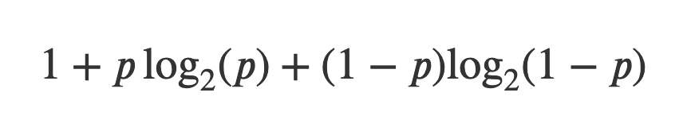
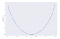

The plot is symmetrical around *p = 0.5*, with maxima at *p = 0* and *p = 1*. The case of *p = 0* is interesting, the channel has perfect noise: it flips all the bits in the original message. But if we know that, then the message is trivially deciphered, we just flip them back.

The formula is commonly stated in terms of [information entropy](https://en.wikipedia.org/wiki/Entropy_(information_theory)), a measure Shannon devised that can be interpreted as the level of ‘uncertainty’ or ‘surprise’ associated with the channel.

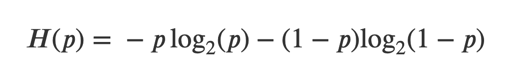
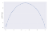
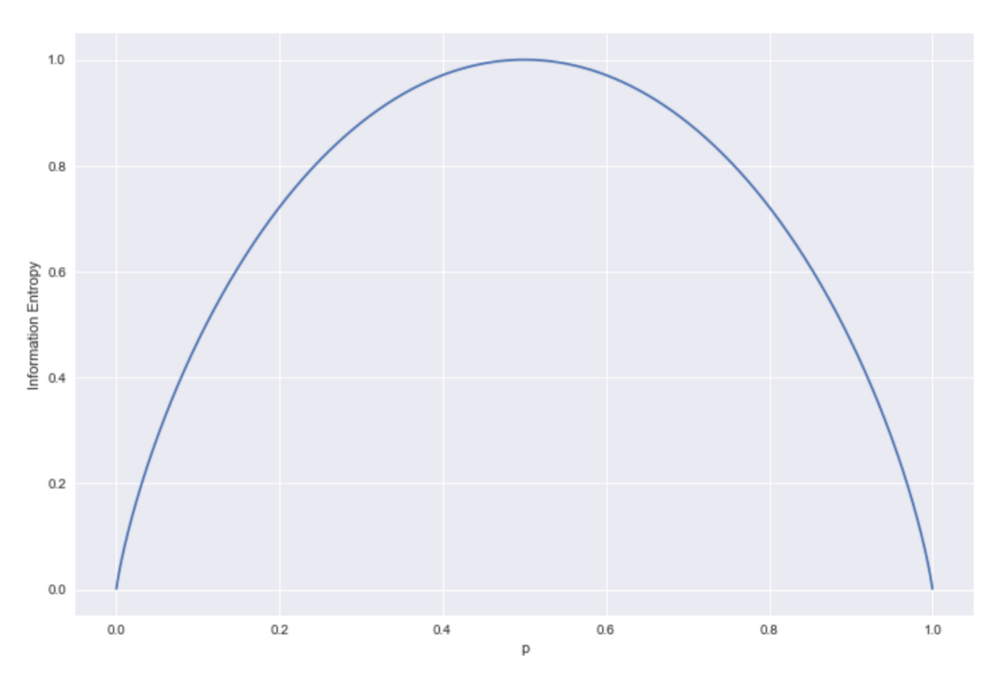

We can see that the entropy has a maximum at 1 when *p *= ½, and minima at 0 for *p =* 0 and *p = *1.

More generally, given a random message *M* that can take *n* different values with probability *pᵢ* for *i = *1,…,*n*, we define the entropy of the message as:

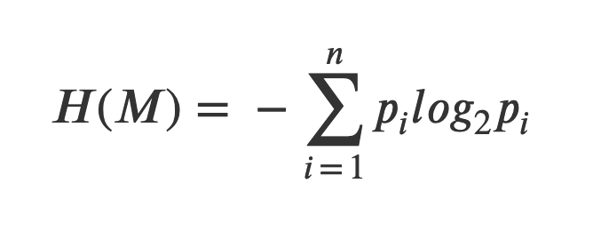

## Guess Who example

Let’s take a different approach. Suppose you are playing *Guess Who*, the game where you ask yes/no questions about the appearance of your opponent’s character in order to single him or her out among a set of characters. You ask yourself: what order should I ask the questions in to maximise the probability of winning? Intutively, you try to ask first about features most of the characters have.

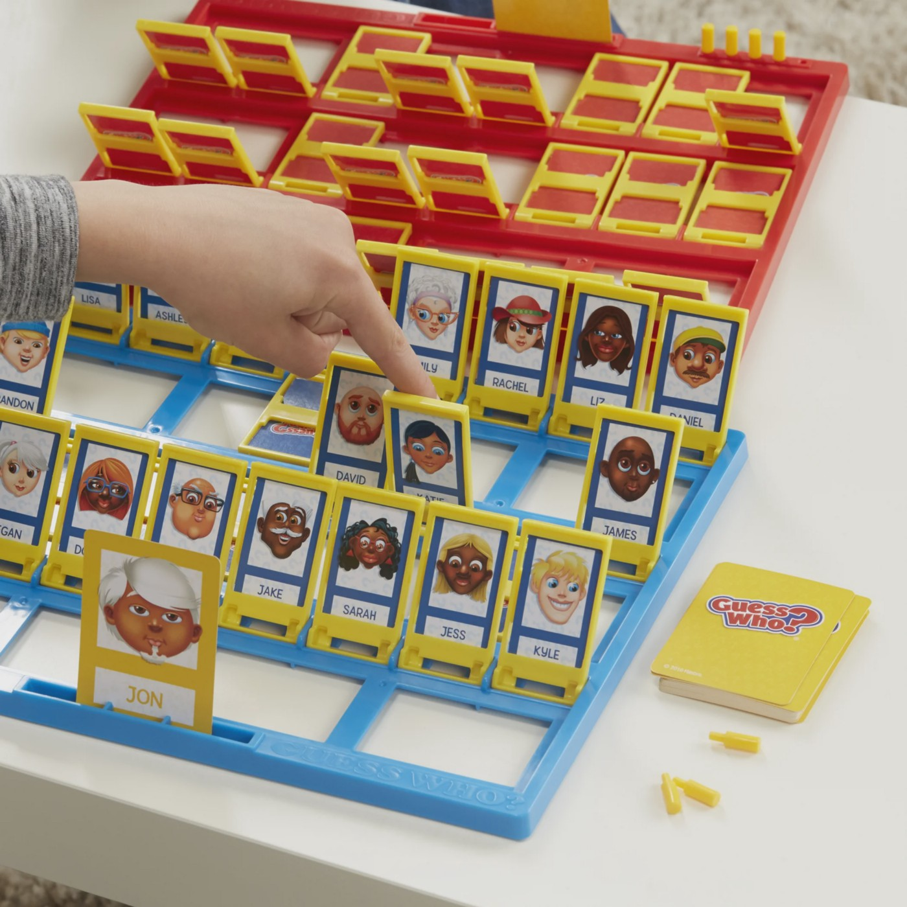
Hardcore Guess Who gamers apply Information Theory for optimal results

Moreover, an optimal question is one that divides the population evenly, that is, one that regardless of the answer (*yes* or *no*) discards half the characters. In any other case, you are not gaining the optimal amount of information with each question.

But what if you can’t divide the characters evenly by their characteristics? To answer the question, first we recall the concept of entropy defined above. We can think of a question as a variable *X* that splits the population into groups *xᵢ* with probabilities *pᵢ*. For example, think of a question about the eye color of the character (the questions in the game are technically only *yes* or *no* but this can be generalized). With this in mind, the entropy of a question becomes:

The intuition here is that with each possible answer, we gain an amount of information *— log*  *p*(*x*ᵢ), meaning that if we receive an answer with a very low probability (i.e. we ask if the character has a feature that is shared by very few people, and the answer is yes), the amount of information we gained is higher than an answer with more probability.

On the other hand, entropy is related to uncertainty. For example, if we flip a coin, the uncertainty in the outcome is higher with a *p* = 0.5 than with any other value of *p*. And in our case, more uncertainty is better. Why? If we choose a question with an uneven distribution in the population, lets say 0.7 and 0.3, the odds are that our character is among the 70%, discarding with the *no *answer only the remaining 30%, but with a more even division (and therefore more uncertain), we always tend to discard 50% of the population, leading to an advantage in the long run. This means that the best questions to ask are those that maximize the entropy, i.e, the ones with the higher uncertainty.

## Decision Trees

One common use of entropy is in decision trees, where one uses a set of features (features that split the data into disjoint sets) to construct a flowchart for a classification problem. Here, a common question is: which order should we “apply” the features in to get the best splits? A possible solution is to recursively always use the feature that maximizes the *information gain*. If we’re working with a dataset *S* and our feature is called *X*, the information gained on *S* by *X*, *I*(*S*,*X*), is calculated as:

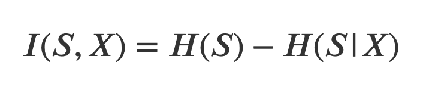

where *H*(*S*|*X*) is the conditional entropy of *S* given *X*. Intuitively, this is just the reduction in the entropy of the dataset *S* if we know *X*. Thus, it makes sense to choose the features *X* that maximize this value, as they will be the ones that reduce uncertainty the most, effectively obtaining the best splits.

Algorithms that consider the information gain at each node to choose the next feature are called *greedy* algorithms. Such algorithms do not take into account the overall information gain and may lead in some cases to suboptimal queries, but they are well-behaved and have a straightforward approach.

As an example, consider the picture below, where a decision tree method was used on the famous Iris flower dataset and two features were selected, the petal width, first with 0.8 cm as a threshold and then 1.75 cm. Setting aside how these specific features are selected, why use the ≤ 0.8 first? With the information gain calculation we described, we can provide an answer. We will call the feature that separates petal width on 0.8 cm *X* and the other one *Y*.

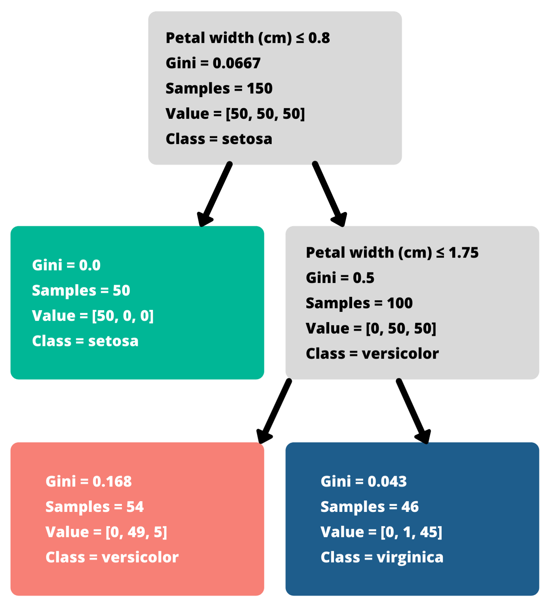

Applying *X* first splits the 150 data points (usually one would split between training and test sets, here for simplicity we use the entire set) into two sets: one containing the entire *setosa* class (50 points, corresponding to ≤ 0.8 cm) and nothing else, and the other containing the rest. In that case the calculations yield:

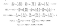
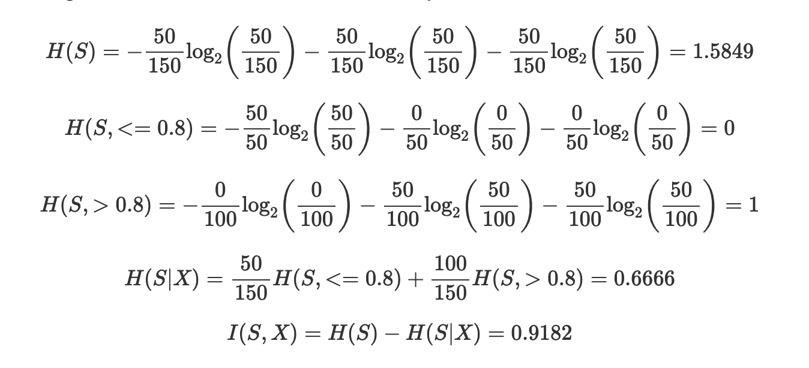

On the other hand, applying *Y* first gives us one set with 50 *setosa*, 49 *versicolor* and 5 *virginica* (≤ 1.75 cm) and another with no *setosa*, 1 *versicolor* and 45 *virginica*. This leaves us with:

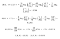
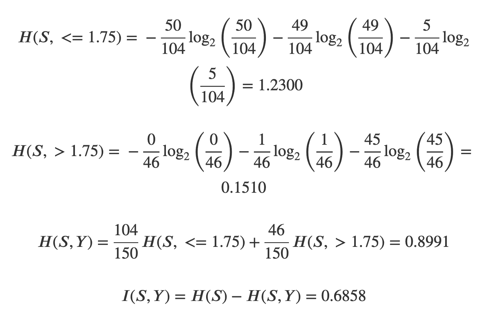

Thus the information gain from *X* (petal width being under or over 0.8 cm) is greater than the one from *Y*, and we should use it first. This makes sense intuitively, as *X* completely separates the *setosa* class from the other two, whereas using *Y* first gives a more entangled split.

## Conclusion

It is hard to overstate the importance of Shannon’s work: the Theory of Information has found [many applications](https://www.britannica.com/science/information-theory/Applications-of-information-theory) in fields as diverse as statistical inference and machine learning, natural language processing, genetics, data compression, coding theory, and cryptography. With over 120,000 citations, few papers can boast a similar impact. In the words of information theorist Anthony Ephremides:

> It was like an earthquake and the aftershocks haven’t finished yet!