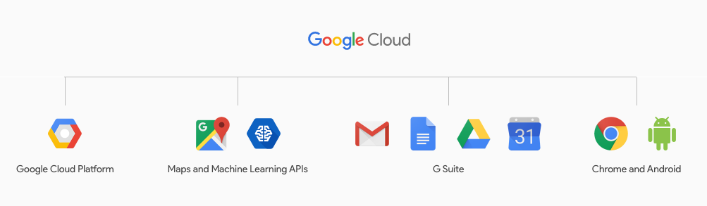

A dissection of Google Cloud Next 17 — What’s Next?

# A dissection of Google Cloud Next 17 — What’s Next?

tl;dr; What are you waiting for? Get on the plane or be left behind in dust.

Let’s start from the very beginning. When the event was announced, the branding was totally different. Rather than being GCP Next, it was now Google Cloud Next. Hmm.. time to put my *thinking cap* on.

### Why change event’s brand name?

It’s always amusing to watch Google’s events unfold. While Google IO used to be my favorite one, Google seems to have turned it into an end-consumer centric event. In those same efforts, they combined GSuite and Google Cloud Platform (GCP) into one Google Cloud offering, thereby making Google Cloud Next event to be everything related to Cloud. For technologies that are partly open source and have grown way beyond Google’s own infrastructure, there are now summits, most notably Chrome, Android and recently Tensorflow summit. With renaming of GCP Next to Google Cloud Next, google is now betting big on their cloud efforts and other hardware efforts in that organization. While Chrome and Android do not get a big mention in Google Next, remember that it’s the hardware part that is Google’s own, rest is majorly open sourced.

### Okay, So what?

Well, you see, when you change branding, you also change what’s happening in the brand. Google started these changes by the end of GCP Next 16, it was pretty clear that Google is pushing more and more towards Enterprise. [Diane Greene became SVP](https://www.forbes.com/sites/roberthof/2016/05/08/google-cloud-chief-diane-greene-heres-how-well-catch-amazon-and-microsoft/#627d9ee92270) and started on her mission to get Enterprises on GCP. All this while, [Urs Holzle been doing what he does best](https://research.google.com/pubs/author79.html), building and extending the amazing infrastructure that Google runs on. But, somewhere during this time Google realized that open source efforts at Google, esp on Kubernetes and TensorFlow have grown considerably and product strategy might remain incomplete if they do not include Open Source into it. So they went ahead and got one of the best, [Sam Ramji onboard](https://techcrunch.com/2016/11/17/cloud-foundry-foundation-ceo-sam-ramji-departs-for-google/). And then they were happy once again. But wait.. Come end of year, they realized that there are two types of folks in machine learning, academia and enthusiasts that they have been overlooking. [Fei-Fei Li](http://vision.stanford.edu/feifeili/) and [Kaggle](https://www.kaggle.com/) were acquired to complement the missing part and now the puzzle is solved. For now.

### Umm.. what are we doing so far off from topic?

Well let’s take a flight to SF and have a closer look. And one day before the event, Sam Ramji and GCP team is having an event with [Google Cloud Insiders](https://gcp-slack.appspot.com/) (a group of users, evangelists and experts on GCP). What’s so special about doing this event? Well, one thing about Sam, his approach is rooted on ground up and hard truth. The event was a step forward from Google to embrace developers. Most of the developers/geeks aren’t used to getting hugged and the reactions swing, either they will love you or complain a lot. No, devs don’t hate people, they hate technologies that those folks use. Here Sam’s charisma played a major role. His answers are long and explanatory, rather than being cut short. He will hear you out and explain not only what they are trying, but also why. He connects to developers personally, he reads books that we have read and if he could, he would make all of Google open for you. He got his whole team in action. If you do not like Google’s Support, let’s talk. Not a fan of direction of Kubernetes, we are here. Confused between App Engine Standard, Flex and Cloud Functions, let’s call in experts.

### Wait.. we have to be at Moscone, don’t get launched in space just yet.

Long queues are always an issue at events of such a scale. That’s why they give badged one day in advance. Plan better next time. On stage, we see a plethora of enterprises using Google Cloud, be in Compute, Data or GSuite offerings. As the keynote unfolded, it was pretty clear that Greene deliverd on her promise of making Google Cloud competitive in enterprise market as well. She made enterprise not only move from their infrastructure, but also from competitions. She not only built internal teams to help support this, but also laid foundation for partners and other providers thereby enriching the whole ecosystem around Google Cloud. But since the audience of GCP has conventionally been developers, parts of crowd was internally screaming (Show me some code!!). Well, their calls were answered by Fei-Fei Li’s arrival on stage. Not only she showed a promising roadmap for machine learning at Google, she connected to audience’s plight of machine learning being an alien concept (to implement properly). Video Intelligence API and Kaggle’s acquisition solidified the fact of google’s ongoing investment in ML and it’s democratization for masses.

### But.. where are all the announcements? What is happening?

Well, you see, everyone’s been complaining that GCP does not have enterprises. And it was a valid complaint. Enterprise is slow. They move because someone else is moving. And now Greene has shown a stream of some of the biggest organizations moving to Google Cloud. This will pull all the enterprises which have been on the edge to choose between Google and anything else to Google Cloud. But.. while planning this amazing show, the transition from core developer centric event to an all technology event, the folks misjudged developers love for action. Just one demo was not enough to fulfill the appetite and hopefully it will be considered appropriately next time.

### If show is same as yesterday, I might fall asleep.

You get a car, and you get a car and you too will get a car. Everyone gets something! *Not Titan though*. Urs Holzle and team put on a spectacular show, giving away everything (almost) folks have asked for. More zone, better security, GPUs, more machine learning APIs, even more security services, core machine learning, databases and data products, more platforms, go serverless, NoOps, no nonsense facts and amazing live demos. Everything developers hoped for was there, and rejoiced they were. Did you forget, we are not just GCP now, take some updates from GSuite team too. Make sure whether you are working with your team from Chromebook, or hanging out with them, or just jamming with them you can do all of that effortlessly and remain productive at all times. All this while, partners are coming and going off the stage, showing that these are not just Google used technologies, enterprises are gaining from them already and winning big. At the end of keynote, Urs makes the concluding statement: “And we understand it’s not just about the technology, it’s about helping everyone be successful in using it.”

### Do I have to get up today? They already announced everything.

Let’s hope Sam surprises us. And he does! A complete history of Open Source and Google is being played effortlessly on stage. Starting by father of internet Vint Cerf himself. Reminiscing the early days of internet he makes everyone realize how open source has been the key for internet and continues to be so. We move further in time where foundations are here to help us with open governance, trust and security of open source. Then of course how google has been involved in open source projects, not just of their own, but also the overall ecosystem. The bet google is making here is that they will take chances with Open Source since they are confident in their own innovations and speed of execution. And now when ecosystem is there, partners are welcome as well. Oh and, don’t forget, we are committed towards open machine learning and open data too. Open source and cloud have to work with each other to bring out the best in each other and Sam is on a mission to make it happen. We are building an Open Ecosystem where users will win and we welcome all of you to take part in this process. Let’s begin by extending your credits and giving you some always free services. Also, we love Startups and wanna help you build great machine learning products and give you loads of credits and funding too. Let’s do it!

### Finally we are done! What was this all about?

It’s all about the mission. Mission is not to just be great in enterprise, or amazingly engineered platform, but it’s a collection of all such entities and at the same time, keeping open source, end developers and startups along with us. In Sam’s words: “Negative feedback is a gift, it’s a declaration of what’s missing”. Google has heard us well. They have rethought and rebuilt their products and approaches to include everyone.

### Hmm.. So what’s Next?

Watch as the [market responds](https://aws.amazon.com/blogs/aws/new-instance-size-flexibility-for-ec2-reserved-instances/) to Google, how adoption happens, how quickly Google deliver on promises and be ready to get amazed by progress reports, new products and features [next year](https://cloudnext.withgoogle.com/).