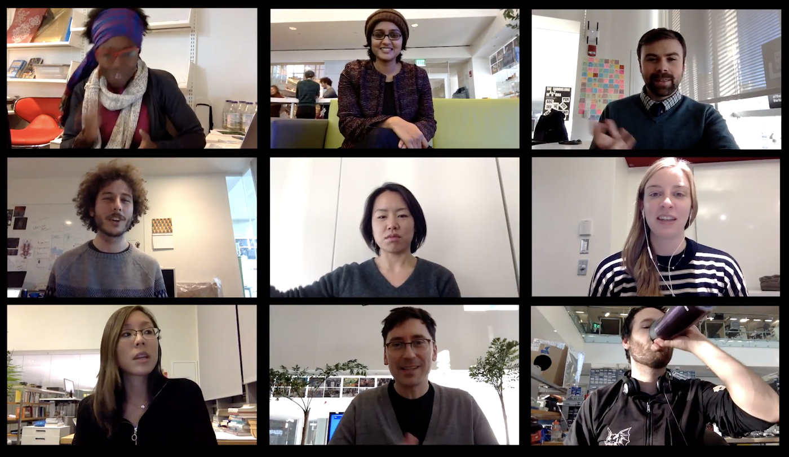
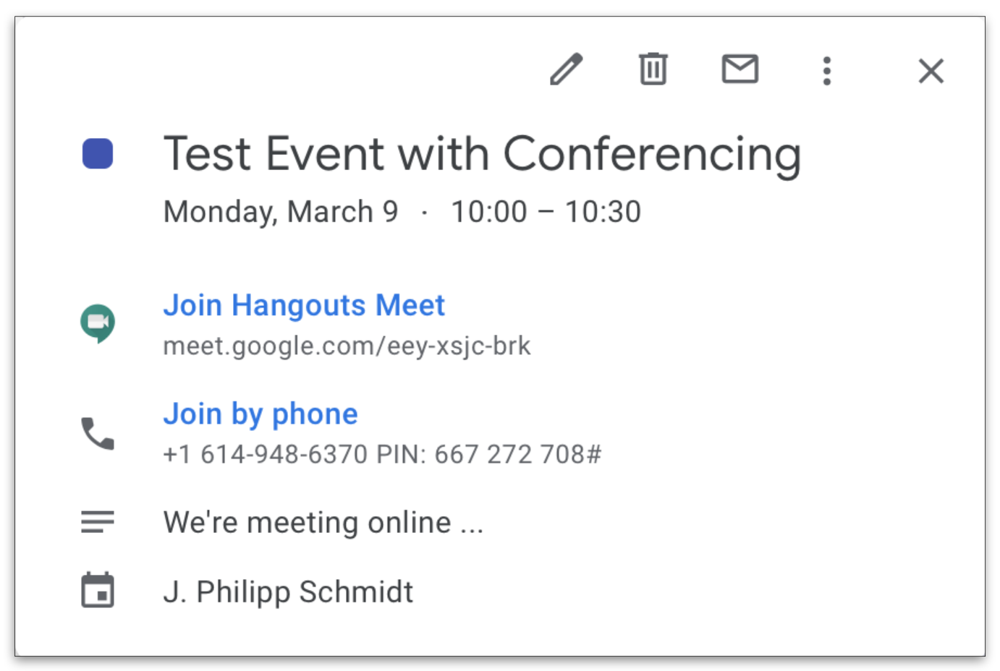

A few simple tips for better online meetings (COVID-19 edition) — MIT Media Lab

Post

# A few simple tips for better online meetings (COVID-19 edition)

   ![](data:image/svg+xml,%3csvg version='1.1' id='Layer_1' xmlns='http://www.w3.org/2000/svg' xmlns:xlink='http://www.w3.org/1999/xlink' x='0px' y='0px' viewBox='0 20 20 20' enable-background='new 0 20 20 20' xml:space='preserve' data-evernote-id='400' class='js-evernote-checked'%3e %3cpath d='M10%2c20c2.8%2c0%2c5.2%2c1%2c7.1%2c2.9c0.9%2c0.9%2c1.7%2c2%2c2.1%2c3.2c0.5%2c1.2%2c0.7%2c2.5%2c0.7%2c3.8c0%2c1.4-0.2%2c2.7-0.7%2c3.8 c-0.5%2c1.2-1.2%2c2.3-2.1%2c3.2c-1%2c1-2.1%2c1.7-3.3%2c2.2C12.6%2c39.7%2c11.3%2c40%2c10%2c40s-2.6-0.3-3.8-0.8C5%2c38.7%2c3.9%2c38%2c2.9%2c37s-1.7-2-2.2-3.2 S0%2c31.3%2c0%2c30s0.3-2.6%2c0.8-3.8S2%2c23.9%2c3%2c22.9C4.9%2c21%2c7.2%2c20%2c10%2c20z M10%2c21.8c-2.3%2c0-4.2%2c0.8-5.8%2c2.4c-0.8%2c0.8-1.4%2c1.7-1.8%2c2.7 s-0.6%2c2-0.6%2c3.1s0.2%2c2.1%2c0.6%2c3.1s1%2c1.9%2c1.8%2c2.7s1.7%2c1.4%2c2.7%2c1.8c1%2c0.4%2c2%2c0.6%2c3.1%2c0.6s2.1-0.2%2c3.1-0.6c1-0.4%2c1.9-1%2c2.7-1.8 c1.6-1.5%2c2.3-3.4%2c2.3-5.7c0-1.1-0.2-2.2-0.6-3.1c-0.4-1-1-1.9-1.8-2.6C14.2%2c22.6%2c12.3%2c21.8%2c10%2c21.8z M9.9%2c28.3L8.6%2c29 c-0.1-0.3-0.3-0.5-0.5-0.6s-0.4-0.2-0.6-0.2c-0.9%2c0-1.3%2c0.6-1.3%2c1.8c0%2c0.5%2c0.1%2c1%2c0.3%2c1.3c0.2%2c0.3%2c0.6%2c0.5%2c1%2c0.5 c0.6%2c0%2c1-0.3%2c1.2-0.9l1.2%2c0.6c-0.3%2c0.5-0.6%2c0.9-1.1%2c1.2s-1%2c0.4-1.5%2c0.4c-0.9%2c0-1.6-0.3-2.2-0.8C4.6%2c31.8%2c4.3%2c31%2c4.3%2c30 s0.3-1.7%2c0.8-2.3c0.6-0.6%2c1.3-0.8%2c2.1-0.8C8.5%2c26.9%2c9.4%2c27.4%2c9.9%2c28.3z M15.7%2c28.3L14.3%2c29c-0.1-0.3-0.3-0.5-0.5-0.6 s-0.4-0.2-0.6-0.2c-0.9%2c0-1.3%2c0.6-1.3%2c1.8c0%2c0.5%2c0.1%2c1%2c0.3%2c1.3s0.6%2c0.5%2c1%2c0.5c0.6%2c0%2c1-0.3%2c1.2-0.9l1.3%2c0.6 c-0.3%2c0.5-0.6%2c0.9-1.1%2c1.2s-1%2c0.4-1.5%2c0.4c-0.9%2c0-1.6-0.3-2.2-0.8c-0.5-0.5-0.8-1.3-0.8-2.3s0.3-1.7%2c0.8-2.3 c0.6-0.6%2c1.3-0.8%2c2.1-0.8C14.3%2c26.9%2c15.1%2c27.4%2c15.7%2c28.3z'%3e%3c/path%3e %3c/svg%3e)

ML Learning Initiative

 [  Research](https://www.media.mit.edu/research/)

by [J. Philipp Schmidt](https://www.media.mit.edu/people/ps1/overview/)

March 7, 2020

##### People

- [ **J. Philipp Schmidt**    Director, ML Learning Initiative](https://www.media.mit.edu/people/ps1/overview/)

##### Groups

- [ML Learning](https://www.media.mit.edu/groups/ml-learning/overview/)

- [COVID-19](https://www.media.mit.edu/groups/covid-19/overview/)

-

# Share this post

    - [![](data:image/svg+xml,%3csvg version='1.1' xmlns='http://www.w3.org/2000/svg' xmlns:xlink='http://www.w3.org/1999/xlink' x='0px' y='0px' width='25' height='25' viewBox='0 0 25 25' enable-background='new 0 0 25 25' xml:space='preserve' data-evernote-id='406' class='js-evernote-checked'%3e %3cpath d='M20.463%2c8.426c0%2c0.186%2c0%2c0.347%2c0%2c0.533c0%2c5.417-4.12%2c11.666-11.666%2c11.666c-2.315%2c0-4.491-0.509-6.296-1.667 c0.324%2c0.046%2c0.648%2c0.069%2c0.972%2c0.069c1.921%2c0%2c3.704-0.833%2c5.092-1.944c-1.782-0.023-3.31-1.227-3.819-2.847 c0.255%2c0.046%2c0.509%2c0.07%2c0.764%2c0.07c0.37%2c0%2c0.741-0.046%2c1.088-0.139c-1.875-0.37-3.287-2.037-3.287-4.028c0-0.023%2c0-0.023%2c0-0.046 c0.556%2c0.301%2c1.181%2c0.486%2c1.852%2c0.509C4.051%2c9.862%2c3.334%2c8.612%2c3.334%2c7.199c0-0.764%2c0.208-1.389%2c0.555-1.991 c2.037%2c2.477%2c5.046%2c4.028%2c8.449%2c4.213c-0.07-0.301-0.093-0.625-0.093-0.949c0-2.269%2c1.829-4.097%2c4.097-4.097 c1.181%2c0%2c2.245%2c0.509%2c3.009%2c1.296c0.926-0.185%2c1.805-0.532%2c2.592-0.995c-0.301%2c0.949-0.949%2c1.759-1.805%2c2.268 c0.833-0.092%2c1.62-0.324%2c2.361-0.648C21.944%2c7.13%2c21.25%2c7.847%2c20.463%2c8.426z' data-evernote-id='436' class='js-evernote-checked'%3e%3c/path%3e %3c/svg%3e)](https://twitter.com/share?url=https%3A%2F%2Fwww.media.mit.edu%2Fposts%2Fa-few-simple-tips-for-better-online-meetings-covid-19-edition%2F&text=A+few+simple+tips+for+better+online+meetings+%28COVID-19+edition%29%2C+via+%40medialab)

    - 

    - 

*[A community-editable version with additional information is available **[here](https://docs.google.com/document/d/1ubzFL5XWA4F4_O90VtkFn_cbCok5IXl5XZABrj9iq_4/edit) -** for users with @media accounts]*

One of the implications of the [COVID-19 virus](https://www.cdc.gov/coronavirus/2019-ncov/summary.html) (Coronavirus Disease) has been that many in-person events and meetings are getting cancelled or moved online. Last week MIT president Rafael Reif [canceled all events on campus with more than 150 people](http://news.mit.edu/2020/letter-regarding-coronavirus-disease-0305) (in addition, there are limitations on our travel to attend meetings elsewhere).

We don’t know yet how things will evolve in the next weeks and months, but it seems likely that online meetings and workshops will become a much more common part of our day-to-day lives (not just at MIT, but in other universities and schools, and in many companies as well). This also has some potential benefits; for example, many people who in the past were excluded from events (for reasons including disabilities, social anxiety, inability to be away from family members, etc…) will be able to participate online. The current crisis is also an opportunity to establish an option for virtual participation as the norm, rather than the exception, going forward.

 

   ![](data:image/svg+xml,%3csvg version='1.1' id='Layer_1' xmlns='http://www.w3.org/2000/svg' xmlns:xlink='http://www.w3.org/1999/xlink' x='0px' y='0px' viewBox='0 20 20 20' enable-background='new 0 20 20 20' xml:space='preserve' data-evernote-id='409' class='js-evernote-checked'%3e %3cpath d='M10%2c20c2.8%2c0%2c5.2%2c1%2c7.1%2c2.9c0.9%2c0.9%2c1.7%2c2%2c2.1%2c3.2c0.5%2c1.2%2c0.7%2c2.5%2c0.7%2c3.8c0%2c1.4-0.2%2c2.7-0.7%2c3.8 c-0.5%2c1.2-1.2%2c2.3-2.1%2c3.2c-1%2c1-2.1%2c1.7-3.3%2c2.2C12.6%2c39.7%2c11.3%2c40%2c10%2c40s-2.6-0.3-3.8-0.8C5%2c38.7%2c3.9%2c38%2c2.9%2c37s-1.7-2-2.2-3.2 S0%2c31.3%2c0%2c30s0.3-2.6%2c0.8-3.8S2%2c23.9%2c3%2c22.9C4.9%2c21%2c7.2%2c20%2c10%2c20z M10%2c21.8c-2.3%2c0-4.2%2c0.8-5.8%2c2.4c-0.8%2c0.8-1.4%2c1.7-1.8%2c2.7 s-0.6%2c2-0.6%2c3.1s0.2%2c2.1%2c0.6%2c3.1s1%2c1.9%2c1.8%2c2.7s1.7%2c1.4%2c2.7%2c1.8c1%2c0.4%2c2%2c0.6%2c3.1%2c0.6s2.1-0.2%2c3.1-0.6c1-0.4%2c1.9-1%2c2.7-1.8 c1.6-1.5%2c2.3-3.4%2c2.3-5.7c0-1.1-0.2-2.2-0.6-3.1c-0.4-1-1-1.9-1.8-2.6C14.2%2c22.6%2c12.3%2c21.8%2c10%2c21.8z M9.9%2c28.3L8.6%2c29 c-0.1-0.3-0.3-0.5-0.5-0.6s-0.4-0.2-0.6-0.2c-0.9%2c0-1.3%2c0.6-1.3%2c1.8c0%2c0.5%2c0.1%2c1%2c0.3%2c1.3c0.2%2c0.3%2c0.6%2c0.5%2c1%2c0.5 c0.6%2c0%2c1-0.3%2c1.2-0.9l1.2%2c0.6c-0.3%2c0.5-0.6%2c0.9-1.1%2c1.2s-1%2c0.4-1.5%2c0.4c-0.9%2c0-1.6-0.3-2.2-0.8C4.6%2c31.8%2c4.3%2c31%2c4.3%2c30 s0.3-1.7%2c0.8-2.3c0.6-0.6%2c1.3-0.8%2c2.1-0.8C8.5%2c26.9%2c9.4%2c27.4%2c9.9%2c28.3z M15.7%2c28.3L14.3%2c29c-0.1-0.3-0.3-0.5-0.5-0.6 s-0.4-0.2-0.6-0.2c-0.9%2c0-1.3%2c0.6-1.3%2c1.8c0%2c0.5%2c0.1%2c1%2c0.3%2c1.3s0.6%2c0.5%2c1%2c0.5c0.6%2c0%2c1-0.3%2c1.2-0.9l1.3%2c0.6 c-0.3%2c0.5-0.6%2c0.9-1.1%2c1.2s-1%2c0.4-1.5%2c0.4c-0.9%2c0-1.6-0.3-2.2-0.8c-0.5-0.5-0.8-1.3-0.8-2.3s0.3-1.7%2c0.8-2.3 c0.6-0.6%2c1.3-0.8%2c2.1-0.8C14.3%2c26.9%2c15.1%2c27.4%2c15.7%2c28.3z'%3e%3c/path%3e %3c/svg%3e)

Credit:
ML Learning Initiative

Despite the fact that we spend a lot of time in meetings already, many of them (especially the online ones) aren’t going as well as they could go. Part of the reason is that some of the strategies that work well for in-person meetings don’t translate well to online meetings.

Below are a few simple starting points for **organizing and running high-quality online meetings**. The primary audience for this post is the Media Lab community, but we tried to keep it general enough to be useful for others.

(This post is mainly about smaller meetings. We are planning to share some tips for running large participatory online events via a separate post in the future).

**Online meetings (2–25 participants)**

Most Media Lab meetings fall within the 2–25 participants range—project meetings, group meetings, and even some of the MAS seminars. The structure of these meetings can vary widely, and a project presentation followed by Q+A will be need a different approach from an open brainstorming session. The following principles and guidelines are meant to be a starting point; they should apply to most meetings, but we encourage you to adapt them to your specific needs and use-cases.

**I. Designate a facilitator.** In an in-person meeting it is easy to pick up on physical cues and often conversations flow naturally without a dedicated facilitator. That’s much harder to do online, and quiet people often end up participating even less. Good facilitation is a skill and facilitators need to keep in mind that they play that role; for example facilitators don’t typically get involved too deeply into the substance of what is being discussed. Some groups, especially groups that have been doing online meetings for a while, may be able to share the facilitation role without designating a single person. But in general we highly recommend having a facilitator who can keep an eye on group dynamics and guide the conversation.

**II. The key to a good video call is the audio.** Nothing improves the quality of a video meeting as much as a headset and good audio etiquette. Make sure all participants use a headset, and encourage participants to mute themselves when they are not speaking. If necessary this is one of the areas where it’s ok for the facilitator to get a little heavy handed if necessary. Bad audio from one or two participants can ruin the meeting for everyone else. In addition, all participants should be in a quiet space when they connect.

**III. Raise your hand/use a speaker queue.** This may sound like we’re back in elementary school, but it’s amazing how well the conversation flows if all participants “raise their hand” to indicate they want to chime in. Some videoconferencing tools have a dedicated button for this, but we often just use the chat window and type “Hand” or “q+” (shout out to the W3C IRC crowd). It’s the facilitator’s job to make sure that people are asked to speak in the order in which they added themselves to the queue.

**IV. Don’t stress about the tech. Most videoconferencing tools are fine.** If you are already using a tool that you like, just keep using it. If you don’t have a preference yet, we recommend Google Hangouts Meet or Zoom. Hangouts Meet is the conferencing app for corporate Google accounts (like the Media Lab accounts). Zoom is a stand-alone application. Both offer mobile apps for smartphones or tablets (much better experience than trying to login to the website from a mobile device).

We generally recommend Google Hangouts for groups of up to ~8 people, and Zoom for larger groups. Zoom has a few extra management features that make it easier to facilitate larger groups.

**a) Google Hangouts Meet **([https://hangouts.google.com/](https://hangouts.google.com/?authuser=1)) has a web-interface, but the easiest way to use it is through the Google Calendar. When you create a calendar event, simply choose “Add Conferencing” and the event will include a link to a Google Hangout. For Google accounts that are part of an Enterprise edition (the Media Lab accounts are) it will also automatically generate a dial-in number for meeting participants without access to a computer. Like this:

 

   ![](data:image/svg+xml,%3csvg version='1.1' id='Layer_1' xmlns='http://www.w3.org/2000/svg' xmlns:xlink='http://www.w3.org/1999/xlink' x='0px' y='0px' viewBox='0 20 20 20' enable-background='new 0 20 20 20' xml:space='preserve' data-evernote-id='412' class='js-evernote-checked'%3e %3cpath d='M10%2c20c2.8%2c0%2c5.2%2c1%2c7.1%2c2.9c0.9%2c0.9%2c1.7%2c2%2c2.1%2c3.2c0.5%2c1.2%2c0.7%2c2.5%2c0.7%2c3.8c0%2c1.4-0.2%2c2.7-0.7%2c3.8 c-0.5%2c1.2-1.2%2c2.3-2.1%2c3.2c-1%2c1-2.1%2c1.7-3.3%2c2.2C12.6%2c39.7%2c11.3%2c40%2c10%2c40s-2.6-0.3-3.8-0.8C5%2c38.7%2c3.9%2c38%2c2.9%2c37s-1.7-2-2.2-3.2 S0%2c31.3%2c0%2c30s0.3-2.6%2c0.8-3.8S2%2c23.9%2c3%2c22.9C4.9%2c21%2c7.2%2c20%2c10%2c20z M10%2c21.8c-2.3%2c0-4.2%2c0.8-5.8%2c2.4c-0.8%2c0.8-1.4%2c1.7-1.8%2c2.7 s-0.6%2c2-0.6%2c3.1s0.2%2c2.1%2c0.6%2c3.1s1%2c1.9%2c1.8%2c2.7s1.7%2c1.4%2c2.7%2c1.8c1%2c0.4%2c2%2c0.6%2c3.1%2c0.6s2.1-0.2%2c3.1-0.6c1-0.4%2c1.9-1%2c2.7-1.8 c1.6-1.5%2c2.3-3.4%2c2.3-5.7c0-1.1-0.2-2.2-0.6-3.1c-0.4-1-1-1.9-1.8-2.6C14.2%2c22.6%2c12.3%2c21.8%2c10%2c21.8z M9.9%2c28.3L8.6%2c29 c-0.1-0.3-0.3-0.5-0.5-0.6s-0.4-0.2-0.6-0.2c-0.9%2c0-1.3%2c0.6-1.3%2c1.8c0%2c0.5%2c0.1%2c1%2c0.3%2c1.3c0.2%2c0.3%2c0.6%2c0.5%2c1%2c0.5 c0.6%2c0%2c1-0.3%2c1.2-0.9l1.2%2c0.6c-0.3%2c0.5-0.6%2c0.9-1.1%2c1.2s-1%2c0.4-1.5%2c0.4c-0.9%2c0-1.6-0.3-2.2-0.8C4.6%2c31.8%2c4.3%2c31%2c4.3%2c30 s0.3-1.7%2c0.8-2.3c0.6-0.6%2c1.3-0.8%2c2.1-0.8C8.5%2c26.9%2c9.4%2c27.4%2c9.9%2c28.3z M15.7%2c28.3L14.3%2c29c-0.1-0.3-0.3-0.5-0.5-0.6 s-0.4-0.2-0.6-0.2c-0.9%2c0-1.3%2c0.6-1.3%2c1.8c0%2c0.5%2c0.1%2c1%2c0.3%2c1.3s0.6%2c0.5%2c1%2c0.5c0.6%2c0%2c1-0.3%2c1.2-0.9l1.3%2c0.6 c-0.3%2c0.5-0.6%2c0.9-1.1%2c1.2s-1%2c0.4-1.5%2c0.4c-0.9%2c0-1.6-0.3-2.2-0.8c-0.5-0.5-0.8-1.3-0.8-2.3s0.3-1.7%2c0.8-2.3 c0.6-0.6%2c1.3-0.8%2c2.1-0.8C14.3%2c26.9%2c15.1%2c27.4%2c15.7%2c28.3z'%3e%3c/path%3e %3c/svg%3e)

Google Calendar event with Hangouts Meet information

Credit:
ML Learning Initiative

Google recently [announced](https://cloud.google.com/blog/products/g-suite/helping-businesses-and-schools-stay-connected-in-response-to-coronavirus) that in response to COVID-19 they are rolling out Hangout premium features to all GSuite and GSuite for Education customers.

**b) Zoom** (https://zoom.us/meetings) offers free accounts, but you need a Pro account (~15 USD/month) to host meetings that are longer than 45 minutes. While that actually sounds quite nice—who wouldn’t want shorter meetings—it’s often not feasible. In general we recommend signing up for a Pro account.

A neat feature in Zoom is the ability to specify a fixed URL that will always point to your Zoom meeting, e.g., it is possible to create a URL for a research group that could be used for all group meetings. Participants can then just bookmark the URL. Zoom also let’s you configure meetings to mute all participants by default (they can then unmute themselves)—highly recommended!

**V. Shared note-taking is great.** This is one of the areas where online meetings may actually have an advantage over in-person meetings. It feels natural to keep a browser window open for shared notes. We recommend [Google Docs](https://docs.google.com/) or [Etherpad](https://etherpad.org/) which let you see edits from the whole group in real-time. Good facilitators keep an eye on the notes and bring ideas from the notes into the conversation if appropriate (some participants may prefer to contribute in this way). One caveat: while shared notes are a great addition to an online meeting, keep in mind that participants who are dialing in (or using small mobile devices) may not be able to see the notes.

**VII. The small but important details.** There are a number of things that can make a huge difference; they are worth paying attention to, especially if you are participating in meetings regularly. Making these small changes will pay off.

- Use a wired internet connection if at all possible (not WiFi or Cell).
- Close tabs or applications you don’t need during the call; this can significantly improve video performance, especially on older computers.
- Don’t sit in front of a bright window with the camera facing you (ideally all light sources are placed behind the camera).

**VIII. Set expectations. **Online meetings are not worse than in-person, and they can even be better in many ways, but they are definitely different. Setting expectations—having a conversation with the group about the way you want to run the meetings—and agreeing on a few clear guidelines at the start of the meeting can greatly improve the experience for everyone.

These are just some starting points. Feel free to add other ideas or suggestions in the comments below. We will keep an eye on the discussion and continue to update the document.

Related Content

 [ Research  ## Interview with Philipp Schmidt (MIT Media Lab)       ML Learning head Philipp Schmidt talks about learning, innovation, and collaboration.](https://www.media.mit.edu/articles/interview-with-philipp-schmidt-mit-media-lab/)

via [Hochschulforum Digitalisierung](https://www.youtube.com/watch?v=251rpmG_qNY&feature=youtu.be) · Oct. 15, 2019

in [ML Learning](https://www.media.mit.edu/groups/ml-learning/overview/)

 [#learning](https://www.media.mit.edu/research/?filter=everything&tag=learning)  [#technology](https://www.media.mit.edu/research/?filter=everything&tag=technology)

 [ Research  ## Helping libraries keep pace with the demands of the digital age       The MIT Media Lab | $250,000 | To build a library residency program in which librarians and Media Lab technologists can collaborate](https://www.media.mit.edu/articles/helping-libraries-keep-pace-with-the-demands-of-the-digital-age/)

via [Knight Foundation](https://www.knightfoundation.org/articles/helping-libraries-keep-pace-with-the-demands-of-the-digital-age) · March 30, 2017

in [ML Learning](https://www.media.mit.edu/groups/ml-learning/overview/)

 [#learning](https://www.media.mit.edu/research/?filter=everything&tag=learning)

 [ Research  ## Nine universities team up to create global infrastructure for digital academic credentials       Researchers set sights on a new standard for issuing, sharing, and verifying academic credentials.](https://www.media.mit.edu/articles/nine-universities-team-up-to-create-global-infrastructure-for-digital-academic-credentials/)

via [MIT News](http://news.mit.edu/2019/nine-universities-team-up-global-infrastructure-digital-academic-credentials-0423) · April 23, 2019

in [ML Learning](https://www.media.mit.edu/groups/ml-learning/overview/)

 [#learning](https://www.media.mit.edu/research/?filter=everything&tag=learning)

 [ Research  ## Seeking a shared global standard for digital credentials       Nine universities in five countries are working together to create a shared infrastructure for digital academic credentials.](https://www.media.mit.edu/articles/seeking-a-shared-global-standard-for-digital-credentials/)

via [Inside Higher Ed](https://www.insidehighered.com/digital-learning/article/2019/04/24/mit-and-8-other-universities-partner-shared-digital-credential) · April 24, 2019

in [ML Learning](https://www.media.mit.edu/groups/ml-learning/overview/)

 [#learning](https://www.media.mit.edu/research/?filter=everything&tag=learning)