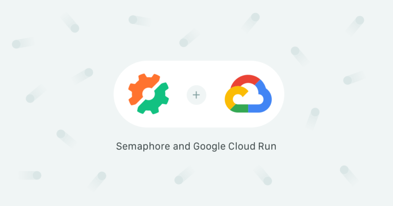
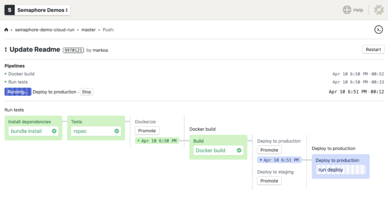
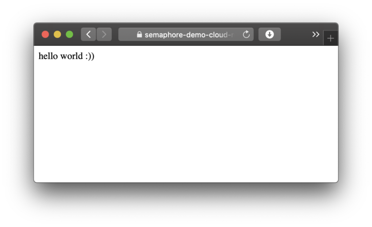

A first look at Google Cloud Run - Semaphore

# A first look at Google Cloud Run

   [Marko Anastasov](https://semaphoreci.com/author/marko)

 ·  Last update: 24 Apr 2019  ·  [Software Engineering](https://semaphoreci.com/category/engineering)

 

Google has launched [Cloud Run](https://cloud.google.com/run/), a new solution for running serverless applications based on Docker containers, this month at its Cloud Next ’19 [(L)](https://cloud.withgoogle.com/next/sf)conference. What we can say now is this is an important step for serverless computing — deploying to Cloud Run is much easier than running containers on Kubernetes. It also has no architectural restrictions, which Lambda functions do. Semaphore provides seamless CI/CD pipelines to build, test and deploy applications to Google Cloud Run.

## What is Google Cloud Run?

Google Cloud Run is a fully managed platform that takes a Docker container image and runs it as a stateless, autoscaling HTTP service.

The difference between Cloud Run and the first generation of serverless platforms — such as AWS Lambda, Google Cloud Functions or Azure Functions — is that it allows you to run arbitrary applications serving multiple endpoints, not small functions with a specific interface.

Cloud Run is based on [Knative](https://www.knative.dev/), which means that similar solutions will likely show up on other managed Kubernetes platforms.

## Will my project run on Google Cloud Run?

Google has published a [Container runtime contract](https://cloud.google.com/run/docs/reference/container-contract) which lists the requirements for containers, including:

- The container is compiled for 64-bit Linux.
- The container listens for HTTP requests on the port defined by the `PORT` environment variable, which is always set to 8080.
- Can fit in up to 2 GB of memory.
- Container instances must start an HTTP server within 4 minutes after receiving a request.
- Your application should work as containers are auto-scaled from 0 to multiple running instances.
- All computation is stateless and scoped to a request.

As long your project adheres to the general requirements above, you can run any application written in any programming language on Cloud Run.

Note that Cloud Run is currently in beta and so these requirements may change over time.

## There is no workflow — and that’s a good thing

Developers already familiar with Docker or traditional PaaS solutions like Heroku will feel right at home with Google Cloud Run.

Once your application is packaged in Docker, all it takes is to:

- Push a container image to Google Container Registry.
- Run `gcloud beta run deploy`

Within minutes, Cloud Run will provision a new app under a domain which you can customize and make public.

## Example: continuous deployment with Semaphore

In the following demo we will configure a [serverless CI/CD pipeline](https://semaphoreci.com/blog/cicd-pipeline) with [Semaphore](https://semaphoreci.com/) for a microservice which will perform the following tasks:

- Run automated tests;
- Build a Docker container;
- Push a container image to Google Container Registry;
- Provide one-click manual deployment to a staging Google Cloud Run environment;
- Automatically deploy to a production Cloud Run environment, after every successful build on the master Git branch.

A Semaphore CI/CD pipeline for Google Cloud Run

You can find [the complete source code of the project on GitHub](https://github.com/semaphoreci-demos/semaphore-demo-cloud-run).

### Enabling Cloud Run

The official [quick start guide](https://cloud.google.com/run/docs/quickstarts/build-and-deploy) by Google provides a roadmap for getting started with Cloud Run.

The first steps are to:

- [Enable the Cloud Run API](http://console.cloud.google.com/apis/library/run.googleapis.com) on your account;
- Install the Google Cloud SDK;
- Install beta components with `gcloud components install beta`, or update them if you have installed them earlier with `gcloud components update`.

### [(L)](https://gist.github.com/markoa/5c0ed78cd73acc19a15490573b267ba7#dockerizing-your-application)Dockerizing your application

In our example we will use a simple Sinatra web app packaged with the following Dockerfile:

	FROM ruby:2.5

	RUN apt-get update -qq && apt-get install -y build-essential

	ENV APP_HOME /app
	RUN mkdir $APP_HOME
	WORKDIR $APP_HOME

	ADD Gemfile* $APP_HOME/
	RUN bundle install --without development test

	ADD . $APP_HOME

	EXPOSE 8080

	CMD ["bundle", "exec", "rackup", "--host", "0.0.0.0", "-p", "8080"]

When adapting your existing Dockerfile, making sure that the application runs on port 8080 is probably going to be the only change that you need to make. If you don’t do that, you may see an error like:

> ERROR: (gcloud.beta.run.deploy) Container failed to start. Failed to start and then listen on the port defined by the PORT environment variable. Logs for this revision might contain more information.

### Authenticating with Google Cloud and Container Registry (GCR)

In order to automate [pushing Docker images to GCR](https://cloud.google.com/container-registry/docs/pushing-and-pulling) in the CI/CD pipeline, Semaphore needs to authenticate with Google Cloud. To do that securely, we need to create a Semaphore secret based on a Google Cloud service account’s authentication key.

Once you [have obtained your authentication key](https://cloud.google.com/iam/docs/creating-managing-service-account-keys#iam-service-account-keys-list-gcloud), upload it on Semaphore as a secret using the Semaphore CLI. The secret should define a file, let’s call it `‌.secrets.gcp.json`:

`$ sem create secret google-cloud-stg --file ~/Downloads/account-name-27f3a5bcea2d.json:.secrets.gcp.json`

### Defining the delivery pipelines

We can now write a Semaphore pipeline which builds, tags and pushes a Docker container to GCR:

	# .semaphore/docker-build.yml
	# This pipeline runs after semaphore.yml
	version: v1.0
	name: Docker build
	agent:
	  machine:
	    # Use a machine type with more RAM and CPU power for faster container
	    # builds:
	    type: e1-standard-4
	    os_image: ubuntu1804
	blocks:

	  - name: Build

	    task:
	      # Mount a secret which defines an authentication key file.
	      # For info on creating secrets, see:
	      # - https://docs.semaphoreci.com/article/66-environment-variables-and-secrets
	      # - https://docs.semaphoreci.com/article/72-google-container-registry-gcr
	      secrets:

	        - name: google-cloud-stg

	      jobs:

	      - name: Docker build

	        commands:
	          # Authenticate using the file injected from the secret

	          - gcloud auth activate-service-account --key-file=.secrets.gcp.json

	          # Configure access to container registry, silence confirmation prompts with -q

	          - gcloud auth configure-docker -q

	          - checkout

	          # Tag your images with gcr.io/ACCOUNT_PROJECT_NAME/SERVICE_NAME pattern
	          # Use Git SHA to produce unique artifacts

	          - docker build -t "gcr.io/semaphore2-stg/semaphore-demo-cloud-run:${SEMAPHORE_GIT_SHA:0:7}" .
	          - docker push "gcr.io/semaphore2-stg/semaphore-demo-cloud-run:${SEMAPHORE_GIT_SHA:0:7}"

	promotions:
	  # Deployment to staging can be trigger manually:

	  - name: Deploy to staging

	    pipeline_file: deploy-staging.yml

	  # Automatically deploy to production on successful builds on master branch:

	  - name: Deploy to production

	    pipeline_file: deploy-production.yml
	    auto_promote_on:

	      - result: passed

	        branch:

	          - master

The pipelines defined in `deploy-staging.yml` and `deploy-production.yml` run the same steps, with the difference being in the name of the service.

Here’s how the production deployment runs:

	# .semaphore/deploy-production.yml
	# This pipeline runs after docker-build.yml
	version: v1.0
	name: Deploy to production
	agent:
	  machine:
	    type: e1-standard-2
	    os_image: ubuntu1804
	blocks:

	  - name: Deploy to production

	    task:
	      secrets:

	        - name: google-cloud-stg

	      jobs:

	      - name: run deploy

	        commands:

	          - gcloud auth activate-service-account --key-file=.secrets.gcp.json
	          - gcloud auth configure-docker -q

	          # Deploy to Cloud Run, using flags to avoid interactive prompt
	          # See https://cloud.google.com/sdk/gcloud/reference/beta/run/deploy

	          - gcloud beta run deploy markoci-demo-cloud-run --project semaphore2-stg --image gcr.io/semaphore2-stg/markoci-demo-cloud-run:${SEMAPHORE_GIT_SHA:0:7} --region us-central1

## Going live

The last line of the deploy log in your local terminal or Semaphore job will contain the URL on which your new app is live, for example `https://semaphore-demo-cloud-run-ud2bmvsmda-uc.a.run.app`.

When you open the URL for the first time, you will see:
> Error: Forbidden
> Your client does not have permission to get URL / from this server.

This is because there’s one more step to make, and that is to [make your service public](https://cloud.google.com/run/docs/securing/managing-access#making_a_service_public) in Google Cloud Run console. And voilà:

An app running on Google Cloud Run

## Wrapping up

Hopefully this article has inspired you to build and ship something to Google Cloud Run with [a well-oiled CI/CD pipeline.](https://semaphoreci.com/blog/why-a-well-oiled-cicd-pipeline-makes-for-a-happy-devops-team) The next move is on you.

Resources:

- [Cloud Run quick start guide](https://cloud.google.com/run/docs/quickstarts/build-and-deploy)
- [Example project on GitHub](https://github.com/semaphoreci-demos/semaphore-demo-cloud-run)

*Article first published on *[*The New Stack*](https://thenewstack.io/a-first-look-at-google-cloud-run/).

- [9 comments]()
- [**Semaphore Blog**](https://disqus.com/home/forums/semaphoreblog/)
- [Login](https://disqus.com/embed/comments/?base=default&f=semaphoreblog&t_i=11372%20https%3A%2F%2Fsemaphoreci.com%2F%3Fp%3D11372&t_u=https%3A%2F%2Fsemaphoreci.com%2Fblog%2Fgoogle-cloud-run-cicd-first-look&t_e=A%20first%20look%20at%20Google%20Cloud%20Run&t_d=A%20first%20look%20at%20Google%20Cloud%20Run&t_t=A%20first%20look%20at%20Google%20Cloud%20Run&s_o=default#)
- [](https://disqus.com/home/inbox/)
- [ Recommend  4](https://disqus.com/embed/comments/?base=default&f=semaphoreblog&t_i=11372%20https%3A%2F%2Fsemaphoreci.com%2F%3Fp%3D11372&t_u=https%3A%2F%2Fsemaphoreci.com%2Fblog%2Fgoogle-cloud-run-cicd-first-look&t_e=A%20first%20look%20at%20Google%20Cloud%20Run&t_d=A%20first%20look%20at%20Google%20Cloud%20Run&t_t=A%20first%20look%20at%20Google%20Cloud%20Run&s_o=default#)
- tTweetfShare
- [Sort by Oldest](https://disqus.com/embed/comments/?base=default&f=semaphoreblog&t_i=11372%20https%3A%2F%2Fsemaphoreci.com%2F%3Fp%3D11372&t_u=https%3A%2F%2Fsemaphoreci.com%2Fblog%2Fgoogle-cloud-run-cicd-first-look&t_e=A%20first%20look%20at%20Google%20Cloud%20Run&t_d=A%20first%20look%20at%20Google%20Cloud%20Run&t_t=A%20first%20look%20at%20Google%20Cloud%20Run&s_o=default#)

Join the discussion…

###### Log in with

-
-
-
-

######  or sign up with Disqus

?

### Disqus is a discussion network

- Disqus never moderates or censors. The rules on this community are its own.
- Don't be a jerk or do anything illegal. Everything is easier that way.

[Read full terms and conditions](https://docs.disqus.com/kb/terms-and-policies/)

-

    - [−](https://disqus.com/embed/comments/?base=default&f=semaphoreblog&t_i=11372%20https%3A%2F%2Fsemaphoreci.com%2F%3Fp%3D11372&t_u=https%3A%2F%2Fsemaphoreci.com%2Fblog%2Fgoogle-cloud-run-cicd-first-look&t_e=A%20first%20look%20at%20Google%20Cloud%20Run&t_d=A%20first%20look%20at%20Google%20Cloud%20Run&t_t=A%20first%20look%20at%20Google%20Cloud%20Run&s_o=default#)
    - [*⚑*](https://disqus.com/embed/comments/?base=default&f=semaphoreblog&t_i=11372%20https%3A%2F%2Fsemaphoreci.com%2F%3Fp%3D11372&t_u=https%3A%2F%2Fsemaphoreci.com%2Fblog%2Fgoogle-cloud-run-cicd-first-look&t_e=A%20first%20look%20at%20Google%20Cloud%20Run&t_d=A%20first%20look%20at%20Google%20Cloud%20Run&t_t=A%20first%20look%20at%20Google%20Cloud%20Run&s_o=default#)

 [Muhammad Junaid](https://disqus.com/by/disqus_10vKgzriy0/)    •  [10 days ago](https://semaphoreci.com/blog/google-cloud-run-cicd-first-look#comment-4437098995)

How is this different than container hosted on Azure app service?

    -

        - [−](https://disqus.com/embed/comments/?base=default&f=semaphoreblog&t_i=11372%20https%3A%2F%2Fsemaphoreci.com%2F%3Fp%3D11372&t_u=https%3A%2F%2Fsemaphoreci.com%2Fblog%2Fgoogle-cloud-run-cicd-first-look&t_e=A%20first%20look%20at%20Google%20Cloud%20Run&t_d=A%20first%20look%20at%20Google%20Cloud%20Run&t_t=A%20first%20look%20at%20Google%20Cloud%20Run&s_o=default#)
        - [*⚑*](https://disqus.com/embed/comments/?base=default&f=semaphoreblog&t_i=11372%20https%3A%2F%2Fsemaphoreci.com%2F%3Fp%3D11372&t_u=https%3A%2F%2Fsemaphoreci.com%2Fblog%2Fgoogle-cloud-run-cicd-first-look&t_e=A%20first%20look%20at%20Google%20Cloud%20Run&t_d=A%20first%20look%20at%20Google%20Cloud%20Run&t_t=A%20first%20look%20at%20Google%20Cloud%20Run&s_o=default#)

 [Marko Anastasov](https://disqus.com/by/marko_anastasov/)    [*>* Muhammad Junaid](https://semaphoreci.com/blog/google-cloud-run-cicd-first-look#comment-4437098995)  •  [10 days ago](https://semaphoreci.com/blog/google-cloud-run-cicd-first-look#comment-4437791888)

For example there's no resource group to (over)allocate.

-

    - [−](https://disqus.com/embed/comments/?base=default&f=semaphoreblog&t_i=11372%20https%3A%2F%2Fsemaphoreci.com%2F%3Fp%3D11372&t_u=https%3A%2F%2Fsemaphoreci.com%2Fblog%2Fgoogle-cloud-run-cicd-first-look&t_e=A%20first%20look%20at%20Google%20Cloud%20Run&t_d=A%20first%20look%20at%20Google%20Cloud%20Run&t_t=A%20first%20look%20at%20Google%20Cloud%20Run&s_o=default#)
    - [*⚑*](https://disqus.com/embed/comments/?base=default&f=semaphoreblog&t_i=11372%20https%3A%2F%2Fsemaphoreci.com%2F%3Fp%3D11372&t_u=https%3A%2F%2Fsemaphoreci.com%2Fblog%2Fgoogle-cloud-run-cicd-first-look&t_e=A%20first%20look%20at%20Google%20Cloud%20Run&t_d=A%20first%20look%20at%20Google%20Cloud%20Run&t_t=A%20first%20look%20at%20Google%20Cloud%20Run&s_o=default#)

 [MikeDK](https://disqus.com/by/dudziakm/)    •  [10 days ago](https://semaphoreci.com/blog/google-cloud-run-cicd-first-look#comment-4437336089)

Looks nice

-

    - [−](https://disqus.com/embed/comments/?base=default&f=semaphoreblog&t_i=11372%20https%3A%2F%2Fsemaphoreci.com%2F%3Fp%3D11372&t_u=https%3A%2F%2Fsemaphoreci.com%2Fblog%2Fgoogle-cloud-run-cicd-first-look&t_e=A%20first%20look%20at%20Google%20Cloud%20Run&t_d=A%20first%20look%20at%20Google%20Cloud%20Run&t_t=A%20first%20look%20at%20Google%20Cloud%20Run&s_o=default#)
    - [*⚑*](https://disqus.com/embed/comments/?base=default&f=semaphoreblog&t_i=11372%20https%3A%2F%2Fsemaphoreci.com%2F%3Fp%3D11372&t_u=https%3A%2F%2Fsemaphoreci.com%2Fblog%2Fgoogle-cloud-run-cicd-first-look&t_e=A%20first%20look%20at%20Google%20Cloud%20Run&t_d=A%20first%20look%20at%20Google%20Cloud%20Run&t_t=A%20first%20look%20at%20Google%20Cloud%20Run&s_o=default#)

 [Boogie Man](https://disqus.com/by/disqus_0dv6XeQsjh/)    •  [10 days ago](https://semaphoreci.com/blog/google-cloud-run-cicd-first-look#comment-4437353793)

Love the fact that Google cloud keeps improving & enhancing their services

-

    - [−](https://disqus.com/embed/comments/?base=default&f=semaphoreblog&t_i=11372%20https%3A%2F%2Fsemaphoreci.com%2F%3Fp%3D11372&t_u=https%3A%2F%2Fsemaphoreci.com%2Fblog%2Fgoogle-cloud-run-cicd-first-look&t_e=A%20first%20look%20at%20Google%20Cloud%20Run&t_d=A%20first%20look%20at%20Google%20Cloud%20Run&t_t=A%20first%20look%20at%20Google%20Cloud%20Run&s_o=default#)
    - [*⚑*](https://disqus.com/embed/comments/?base=default&f=semaphoreblog&t_i=11372%20https%3A%2F%2Fsemaphoreci.com%2F%3Fp%3D11372&t_u=https%3A%2F%2Fsemaphoreci.com%2Fblog%2Fgoogle-cloud-run-cicd-first-look&t_e=A%20first%20look%20at%20Google%20Cloud%20Run&t_d=A%20first%20look%20at%20Google%20Cloud%20Run&t_t=A%20first%20look%20at%20Google%20Cloud%20Run&s_o=default#)

 [robwaldron](https://disqus.com/by/robwaldron/)    •  [10 days ago](https://semaphoreci.com/blog/google-cloud-run-cicd-first-look#comment-4437369147)

This blog seems misinformed. AWS Lambda and Azure Functions provide more than just run small functions. You can host a full ASP.NET Core service or NodeJS Express app in Lambda for instance. Cloud Run sounds nice, but isn't offering anything groundbreaking. Maybe Cloud Run is more akin to AWS Fargate?

    -

        - [−](https://disqus.com/embed/comments/?base=default&f=semaphoreblog&t_i=11372%20https%3A%2F%2Fsemaphoreci.com%2F%3Fp%3D11372&t_u=https%3A%2F%2Fsemaphoreci.com%2Fblog%2Fgoogle-cloud-run-cicd-first-look&t_e=A%20first%20look%20at%20Google%20Cloud%20Run&t_d=A%20first%20look%20at%20Google%20Cloud%20Run&t_t=A%20first%20look%20at%20Google%20Cloud%20Run&s_o=default#)
        - [*⚑*](https://disqus.com/embed/comments/?base=default&f=semaphoreblog&t_i=11372%20https%3A%2F%2Fsemaphoreci.com%2F%3Fp%3D11372&t_u=https%3A%2F%2Fsemaphoreci.com%2Fblog%2Fgoogle-cloud-run-cicd-first-look&t_e=A%20first%20look%20at%20Google%20Cloud%20Run&t_d=A%20first%20look%20at%20Google%20Cloud%20Run&t_t=A%20first%20look%20at%20Google%20Cloud%20Run&s_o=default#)

 [Marko Anastasov](https://disqus.com/by/marko_anastasov/)    [*>* robwaldron](https://semaphoreci.com/blog/google-cloud-run-cicd-first-look#comment-4437369147)  •  [10 days ago](https://semaphoreci.com/blog/google-cloud-run-cicd-first-look#comment-4437800439)

No, with Fargate you start by provisioning a cluster (see

[*t*](https://disqus.com/embed/comments/?base=default&f=semaphoreblog&t_i=11372%20https%3A%2F%2Fsemaphoreci.com%2F%3Fp%3D11372&t_u=https%3A%2F%2Fsemaphoreci.com%2Fblog%2Fgoogle-cloud-run-cicd-first-look&t_e=A%20first%20look%20at%20Google%20Cloud%20Run&t_d=A%20first%20look%20at%20Google%20Cloud%20Run&t_t=A%20first%20look%20at%20Google%20Cloud%20Run&s_o=default#)

which is not a serverless experience.

With Lambda you're programming _for Lambda_ specifically, and have to deal with CloudFormation, API Gateway... again UX that can be improved.

    -

        - [−](https://disqus.com/embed/comments/?base=default&f=semaphoreblog&t_i=11372%20https%3A%2F%2Fsemaphoreci.com%2F%3Fp%3D11372&t_u=https%3A%2F%2Fsemaphoreci.com%2Fblog%2Fgoogle-cloud-run-cicd-first-look&t_e=A%20first%20look%20at%20Google%20Cloud%20Run&t_d=A%20first%20look%20at%20Google%20Cloud%20Run&t_t=A%20first%20look%20at%20Google%20Cloud%20Run&s_o=default#)
        - [*⚑*](https://disqus.com/embed/comments/?base=default&f=semaphoreblog&t_i=11372%20https%3A%2F%2Fsemaphoreci.com%2F%3Fp%3D11372&t_u=https%3A%2F%2Fsemaphoreci.com%2Fblog%2Fgoogle-cloud-run-cicd-first-look&t_e=A%20first%20look%20at%20Google%20Cloud%20Run&t_d=A%20first%20look%20at%20Google%20Cloud%20Run&t_t=A%20first%20look%20at%20Google%20Cloud%20Run&s_o=default#)

 [Jason](https://disqus.com/by/jasonpolites/)    [*>* robwaldron](https://semaphoreci.com/blog/google-cloud-run-cicd-first-look#comment-4437369147)  •  [10 days ago](https://semaphoreci.com/blog/google-cloud-run-cicd-first-look#comment-4437867205)

Worth pointing out that AWS Lambda limits concurrent requests per instance to 1 (as does Google Cloud Functions). So while you *can* run an entire webapp in a function, it may not be the most optimal use of resources, and you typically hit a lot more cold starts which, if your app is large, can be slow. Cloud Run allows up to 80 concurrent requests on an instance (you can also force it to be 1 if you like). I believe Azure does allow concurrency to an instance.

-

    - [−](https://disqus.com/embed/comments/?base=default&f=semaphoreblog&t_i=11372%20https%3A%2F%2Fsemaphoreci.com%2F%3Fp%3D11372&t_u=https%3A%2F%2Fsemaphoreci.com%2Fblog%2Fgoogle-cloud-run-cicd-first-look&t_e=A%20first%20look%20at%20Google%20Cloud%20Run&t_d=A%20first%20look%20at%20Google%20Cloud%20Run&t_t=A%20first%20look%20at%20Google%20Cloud%20Run&s_o=default#)
    - [*⚑*](https://disqus.com/embed/comments/?base=default&f=semaphoreblog&t_i=11372%20https%3A%2F%2Fsemaphoreci.com%2F%3Fp%3D11372&t_u=https%3A%2F%2Fsemaphoreci.com%2Fblog%2Fgoogle-cloud-run-cicd-first-look&t_e=A%20first%20look%20at%20Google%20Cloud%20Run&t_d=A%20first%20look%20at%20Google%20Cloud%20Run&t_t=A%20first%20look%20at%20Google%20Cloud%20Run&s_o=default#)

 [Martin Dingus](https://disqus.com/by/martindingus/)    •  [10 days ago](https://semaphoreci.com/blog/google-cloud-run-cicd-first-look#comment-4437927690)

> The container listens for HTTP requests on port 8080.

This is incorrect. Cloud Run uses 8080 by default, but explicitly states you should not hard-code 8080, and should use the $PORT environment variable provided to the container instead.

    -

        - [−](https://disqus.com/embed/comments/?base=default&f=semaphoreblog&t_i=11372%20https%3A%2F%2Fsemaphoreci.com%2F%3Fp%3D11372&t_u=https%3A%2F%2Fsemaphoreci.com%2Fblog%2Fgoogle-cloud-run-cicd-first-look&t_e=A%20first%20look%20at%20Google%20Cloud%20Run&t_d=A%20first%20look%20at%20Google%20Cloud%20Run&t_t=A%20first%20look%20at%20Google%20Cloud%20Run&s_o=default#)
        - [*⚑*](https://disqus.com/embed/comments/?base=default&f=semaphoreblog&t_i=11372%20https%3A%2F%2Fsemaphoreci.com%2F%3Fp%3D11372&t_u=https%3A%2F%2Fsemaphoreci.com%2Fblog%2Fgoogle-cloud-run-cicd-first-look&t_e=A%20first%20look%20at%20Google%20Cloud%20Run&t_d=A%20first%20look%20at%20Google%20Cloud%20Run&t_t=A%20first%20look%20at%20Google%20Cloud%20Run&s_o=default#)

 [Marko Anastasov](https://disqus.com/by/marko_anastasov/)    [*>* Martin Dingus](https://semaphoreci.com/blog/google-cloud-run-cicd-first-look#comment-4437927690)  •  [9 days ago](https://semaphoreci.com/blog/google-cloud-run-cicd-first-look#comment-4438618789)

Thanks for pointing that out. I don't see how it's incorrect as the port is "always set to 8080" but I've updated the article to recommend $PORT.

- [Powered by Disqus](https://disqus.com/)
- [*✉*Subscribe*✔*](https://disqus.com/embed/comments/?base=default&f=semaphoreblog&t_i=11372%20https%3A%2F%2Fsemaphoreci.com%2F%3Fp%3D11372&t_u=https%3A%2F%2Fsemaphoreci.com%2Fblog%2Fgoogle-cloud-run-cicd-first-look&t_e=A%20first%20look%20at%20Google%20Cloud%20Run&t_d=A%20first%20look%20at%20Google%20Cloud%20Run&t_t=A%20first%20look%20at%20Google%20Cloud%20Run&s_o=default#)
- [*d*Add Disqus to your site](https://publishers.disqus.com/engage?utm_source=semaphoreblog&utm_medium=Disqus-Footer)
- [**Disqus' Privacy Policy](https://help.disqus.com/customer/portal/articles/466259-privacy-policy)