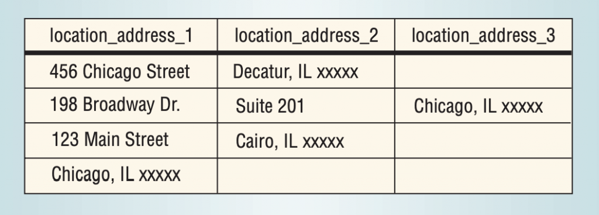

A humble guide to database schema design - Mike Alche

Having a good database schema design is crucial for building applications that will need to scale in traffic and complexity. If you happen to do a bad design choice you will see that it takes a lot of effort to stop the pattern from propagating to your backends’ services and controllers, and finally to your frontend.

So there is a need to be able to evaluate if a database design is better than another.

But what does *good* mean when we are talking about *design?*
Well, there are at least **two things that we want to be sure to do:**
1. Preserve everything we know when we split our information into tables
2. Reduce the redundancy of how we store it

> Regarding the second point: do we only want to reduce redundancy because of a storage size problem? No, we do it mainly because having redundant data leads you to **> inconsistency problems **> if you don’t update *> all the fields*>  that represent the same information when an update occurs

Here I present some guidelines that I believe will help achieve a good design:
1. Use at least third normal form
2. Create a last line of defense with constraints
3. Never store full addresses in a single field
4. Never store firstname and lastname in the same field
5. Establish conventions for table and field names, and keep them

### 1) Use at least third normal form

The design of databases can be separated into these categories:

- First normal form
- Second normal form
- Third normal form
- Boyce-Codd normal form

The idea is that these categories act like a proxy to classify how good is the design

I’ll quickly explain each one so that you can understand why we want to be in third normal form.

#### **First normal form**

For a database to be in first normal form then every value of every column of every table should be atomic

What does atomic mean?
Speaking lightly atomic means that the value represents a “single thing”
For example, if you have a table like this

|     |     |     |     |
| --- | --- | --- | --- |
| first_name | last_name | age | areas |
| John | Doe | 27  | {“Website design”, “Customer research”} |
| Mary | Jane | 33  | {“Long term strategy planning”,”Hiring”} |
| Tom | Smith | 35  | {“Marketing”} |

Then the “areas” column has values that aren’t atomic. Just look at the row of John to see that the areas’ field is storing two things “Website design” and “Customer research”.

So this table is not in first normal form.
To be in first normal form you should store a *single value per field*

#### **Second normal form**

For a table to be in second normal form then every column that is not part of the primary key (or could act as part of another primary key) shouldn’t be able to be inferred from **a smaller part of the primary key. **

What does this mean?

Say you have the following design (I have underlined the fields that conform the primary key in this table)

|     |     |     |     |     |
| --- | --- | --- | --- | --- |
| employee_id | project_id | Hours | employee_name | project_name |
| 1   | 1   | 10  | john | “website design” |
| 2   | 1   | 20  | Mary | “website design” |

In this design employee name can be directly inferred from employee_id because the idea is that the name of an employee is uniquely defined by it’s id.

Similarly, the project_name is uniquely defined by the project_id

So we have two examples of columns where the columns can be inferred from only part of the primary key.

Each one of these examples would be enough to throw this table out of second normal form.

Another takeaway is that if a table is in first normal form and all the primary keys are single columns, then the table is already in second normal form.

#### **Third normal form**

For a table to be in third normal form then it must be in second normal form and there should not be a non prime attribute* that depends transitively from the primary key.

*a prime attribute is an attribute that is part of a of a group of attributes that can act as a primary key

** I’m using *attribute* and *column* a bit interchangeably
What does that mean?
Say you have the following design (which is far from ideal):

|     |     |     |     |     |
| --- | --- | --- | --- | --- |
| employee_name | employee_id | age | department_number | department_name |
| John | 1   | 27  | 123 | “Marketing” |
| Mary | 2   | 33  | 456 | “Opreations” |
| Tom | 3   | 35  | 123 | “Marketing” |

In this table the department_number can be inferred from the employee_id, but the department_name can be inferred from the department_number!

Then department_name depends transitively from employee_id!

Then there exists a transitive dependency from employee_id -> department_number -> department_name, which means this table is not in third normal form.

What problems does this bring?

Well, in some way if the department name can be inferred from the department number, storing it each time for every employee introduces redundancy.

Imagine now that the marketing department is changing its name to “Marketing & Sales”. To keep consistency, you should update that in every row of the table for each employee that belongs to that department!

Also, think what happens if Mary decides to leave the company: we should delete her row from the table, but if she was our only employee belonging to the “operations” department the department will also get deleted!

> These are all problems that get completely avoided if we do our best to stay in third normal form

### 2) Create a last line of defense with constraints

The database that you are working on is more than just a group of tables. It has a lot of baked in functionality. Many that it can help you with the sanity and quality of your data

Constrains are way of to restrict what values a database field can take.
Be sure to enforce foreign key constrains when you define your relations.

Be sure to specify what should happen ON DELETE and a ON UPDATE of a row which is related to other rows in other tables.

Be sure to use NOT NULL whenever you think that a field could never be null. You may also want to perform sanity checks on the backend, but remember that everything can fail and it doesn’t hurt to add this.

Add CHECK constraints to make sure that values are in a possible range. ie: price should always be positive.

You can read all PostgreSQL constraints here
https://www.postgresql.org/docs/9.4/ddl-constraints.html

### 3) Never store full addresses in a single field

If you have a form in your app or website with a single field where the user can enter their address then you can already tell that something smells bad. This is because it is very likely that you will also have a single field in your database to store the address as as a simple string!

Now what if I want to aggregate my users purchases by city to see in which city is my product most popular? Will you be able to do that?

It will be very hard!

Since the complete address is stored as a string in a database field, in the first place you will need to be able to determine which part of the address string is the city! and that is an almost impossible task, given all the possible formats that addresses can take.

> So be sure to always split the all encompassing “address” field into smaller fields like “street”, “street_numer”, “city”, “state”, “postal_code”, etc…

### 3.b) Another problem of address storing is having “anonymous” fields:

This image is taken form Michaels Blaha’s *A Copper Bullet for Software Quality Improvement*

Looking at the table, do you see any possible problems?

Will you be able to easily distinguish Chicago the city from Chicago the street? Probably not very easily.

So remember to always store the address field splitted with clear column names for each part

### 4) Never store firstname and lastname in the same field

Similar to the address point above: the amount of firstname-lastname variations are too many to be able to differentiate them clearly.

Something you may want to do is to store it as a single string and then separate firstname from lastname by splitting the string where a white space occurs.

Like “Mike Alche” -> “Mike” first name and “Alche” lastname

But, what if your users have middlenames? And what if they have two lastnames? And what if they have both a middlename and two lastnames?

How will you be able to tell which is which when you split the string at white spaces?

The answer is that at some point errors will start happening!

> So a way to avoid all this trouble is by creating separate fields (in your forms) for the users’ first_name and last_name. In this way you will let the users split their own names and you will be able to store the data in a consistent way.

**Footnote**: **I’m not saying that the database fields can’t contain whitespaces**. For example for names like “Juan Martin Del Potro” I believe that “Juan Martin” belongs to the first_name field and “Del Potro” to the last_name field. Of course **this isn’t ideal**: you could have a middle_name column, or second_last_name column. However in [here](https://www.kalzumeus.com/2010/06/17/falsehoods-programmers-believe-about-names/)  [you can read about all the variations a name can take](https://www.kalzumeus.com/2010/06/17/falsehoods-programmers-believe-about-names/). So at some point you’ll need to decide between precision and practicality.

### 5) Establish conventions for table and field names. And keep them!

There aren’t many things as hideous that having to work with data that looks like user.firstName, user.lst_name, user.birthDate and so forth…

I’d advice you to choose underscore naming, because not all SQL engines handle capitalization in the same way, and it becomes a pain to enclose everything with quotation marks.

Also, chose if you will name your tables in plural like “users” or in singular “user”. I prefer to use the singular version, although every backend framework seems to be preconfigured to be in plural. So I end up following the pattern and using plural naming.

