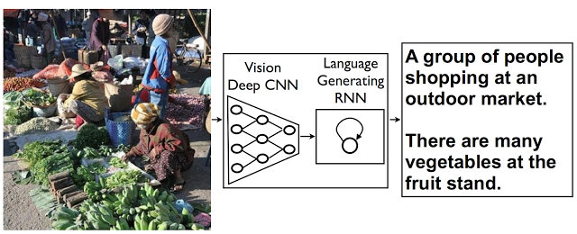
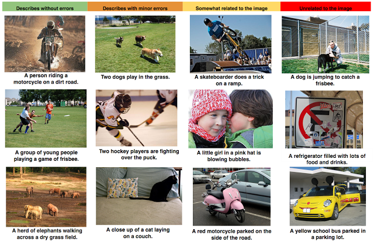

A picture is worth a thousand (coherent) words: building a natural description of images

## [A picture is worth a thousand (coherent) words: building a natural description of images](https://research.googleblog.com/2014/11/a-picture-is-worth-thousand-coherent.html)

Monday, November 17, 2014

 Posted by Google Research Scientists Oriol Vinyals, Alexander Toshev, Samy Bengio, and Dumitru Erhan

*“Two pizzas sitting on top of a stove top oven”*
*“A group of people shopping at an outdoor market”*
*“Best seats in the house”*

People can summarize a complex scene in a few words without thinking twice. It’s much more difficult for computers. But we’ve just gotten a bit closer -- we’ve developed a machine-learning system that can automatically produce captions (like the three above) to accurately describe images the first time it sees them. This kind of system could eventually help visually impaired people understand pictures, provide alternate text for images in parts of the world where mobile connections are slow, and make it easier for everyone to search on Google for images.

Recent research has greatly improved [object detection, classification, and labeling](http://googleresearch.blogspot.com/2014/09/building-deeper-understanding-of-images.html#uds-search-results). But accurately describing a complex scene requires a deeper representation of what’s going on in the scene, capturing how the various objects relate to one another and translating it all into natural-sounding language.

|     |
| --- |
|  |
| *Automatically captioned: “Two pizzas sitting on top of a stove top oven”* |

Many efforts to construct computer-generated natural descriptions of images propose combining current state-of-the-art techniques in both [computer vision](http://en.wikipedia.org/wiki/Computer_vision) and [natural language processing](http://en.wikipedia.org/wiki/Natural_language_processing) to form a [complete image description approach](https://www.cs.cmu.edu/~afarhadi/papers/sentence.pdf). But what if we instead merged recent computer vision and language models into a single jointly trained system, taking an image and directly producing a human readable sequence of words to describe it?

This idea comes from recent advances in [machine translation](http://en.wikipedia.org/wiki/Machine_translation) between languages, where a [Recurrent Neural Network](http://en.wikipedia.org/wiki/Recurrent_neural_network) (RNN) transforms, say, a French sentence into a [vector representation](http://google-opensource.blogspot.com/2013/08/learning-meaning-behind-words.html), and a second RNN uses that vector representation to generate a target sentence in German.

Now, what if we replaced that first RNN and its input words with a deep [Convolutional Neural Network](http://en.wikipedia.org/wiki/Convolutional_neural_network) (CNN) trained to classify objects in images? Normally, the CNN’s last layer is used in a final [Softmax](http://en.wikipedia.org/wiki/Softmax_function) among known classes of objects, assigning a probability that each object might be in the image. But if we remove that final layer, we can instead feed the CNN’s rich encoding of the image into a RNN designed to produce phrases. We can then train the whole system directly on images and their captions, so it maximizes the likelihood that descriptions it produces best match the training descriptions for each image.

|     |
| --- |
|  |
| *The model combines a vision CNN with a language-generating RNN so it can take in an image and generate a fitting natural-language caption.* |

Our experiments with this system on several openly published datasets, including Pascal, Flickr8k, Flickr30k and SBU, show how robust the qualitative results are -- the generated sentences are quite reasonable. It also performs well in quantitative evaluations with the [Bilingual Evaluation Understudy](http://en.wikipedia.org/wiki/BLEU) (BLEU), a metric used in machine translation to evaluate the quality of generated sentences.

|     |
| --- |
|  |
| *A selection of evaluation results, grouped by human rating.* |

A picture may be worth a thousand words, but sometimes it’s the words that are most useful -- so it’s important we figure out ways to translate from images to words automatically and accurately. As the datasets suited to learning image descriptions grow and mature, so will the performance of end-to-end approaches like this. We look forward to continuing developments in systems that can read images and generate good natural-language descriptions. To get more details about the framework used to generate descriptions from images, as well as the model evaluation, read the full paper [here](http://arxiv.org/abs/1411.4555).

5 comments

Add a comment as Marc Cohen

Top comments

## Stream

### [Ken Perry](https://apis.google.com/u/0/wm/1/105359952962054668586)

[5 months ago](https://apis.google.com/u/0/wm/1/105359952962054668586/posts/QBvPadGESe9)  -  Shared publicly

The only way ALT text will be good is if humans do it.    No matter how much AI improves it will not catch the full nuance of a photo.  My wife picked up something for me at the last Bliz con convention.  She took a picture of it.  The AI description said there was food in the picture.  It was a picture of socks that had pizza on it.

This talked about a stove with two pieces of pizza on it.  What if I was posting that picture to my parents to show them how great the new counter tops and cabinets looked with the stove but because the counters didn’t seem to be the intention of the picture they were not even described.  Or what if right behind the pizza in the picture there was  a pile of black.  It was not a pile of black but it was a cat garding the pizza.  Sometimes the current AI stuff gets the cat but most of the time it doesn’t have any idea what that weird pile is so it ignores it.  I am blind so I get this kind of stuff on facebook and other programs that try to do this all the time.

There is a reason they say a picture is worth a thousand words because if you’re not careful you will describe the wrong thing in the wrong way.  I had a friend that had cars on a shirt and did it say a person with cars on their shirt.?  No, it said there are cars and flowers in the picture.

How does the AI know if you were showing people the shiny train in the back ground or the four-people watching their pennies being pressed by the train wheel?  Is the AI going to take the whole picture and just describe it like a graphic novel?

Even if it did was that holiday party a picture of a family at a holiday party?  Who are they?  Or was it a cut from a new movie that the person watched and wanted to show someone because it was a family member in the movie?   Maybe it was not a picture of the movie holiday party at all but the abstract face that the bodies of all the people made while they were dancing around the table?

My daughter asked her friends on facebook how many faces do you see in the picture.  Facebook AI said two.  There were 8 abstract faces made by the lines formed by objects in the picture.  How is descriptive text that is auto generated ever going to know what to describe without context of the intention of the person posting or putting the picture in a document.

We are so far away from a computer even coming close to being useful.  I know everyone is so excited about these AI tools and so am I because how else will I ever find out if my co-worker is an Elephant?  Which is what the last picture said when my boss used an AI application on his IPhone to take a picture of him.

We are just now getting to the point where computers can tell if a pile of cloth is a non-folded pair of jeans. I could throw 30 different shirt and pants that are all the same color, out on the floor and a sighted person can in 5 seconds pick up all the items that are jeans.  A robot would take hours of processing sometimes to even figure out which pile is a pair of jeans.  Sure, there is lots of research in this field but context for any photo is the key.

So, I am glad we are working on this stuff but we are so far away from a computer being able to get what the artistic, human intention of a picture is.  I say good luck and I can’t wait till a computer can read me a true graphic comic strip that has not been pre-described by a human.

+
0
1
0

 ·
Reply

### [Paul Sheldrake](https://apis.google.com/u/0/wm/1/108566136018092946845)

[6 months ago](https://apis.google.com/u/0/wm/1/+PaulSheldrake/posts/brYaLrzmjHw)  -  Shared publicly

Is there any plan to add this to the Vision API product from Google?
+
0
1
0

 ·
Reply

### [gabriel bly](https://apis.google.com/u/0/wm/1/108470849208662519706)

[9 months ago](https://apis.google.com/u/0/wm/1/108470849208662519706/posts/Sr78Qi6xrKS)  -  Shared publicly

Why don't the images on this page have Alt attributes?
+
1
2
1

 ·
Reply

[Arjan Wiegel](https://plus.google.com/109800520155061946137)

[8 months ago](https://apis.google.com/u/0/wm/1/108470849208662519706/posts/Sr78Qi6xrKS)

+
0
1
0

because Google assumes we are not blind or use Lynx

[Andre Polomat](https://plus.google.com/115212457151011310826)

[6 months ago](https://apis.google.com/u/0/wm/1/108470849208662519706/posts/Sr78Qi6xrKS)

+
0
1
0

They expect you to use their algo to get a textual description of the images

Labels:[Computer Vision](https://research.googleblog.com/search/label/Computer%20Vision) , [Machine Learning](https://research.googleblog.com/search/label/Machine%20Learning) , [Machine Translation](https://research.googleblog.com/search/label/Machine%20Translation) , [Natural Language Processing](https://research.googleblog.com/search/label/Natural%20Language%20Processing)