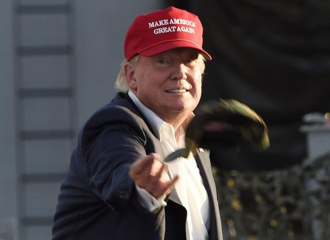

A robot that keeps on calling elections correctly has called the US presidential race

The New York businessman with a penchant for celebrity television may suddenly find himself in love with artificial intelligence developed in India.

The polls and simulations that involve the skills and insight of human beings suggest [Donald Trump could be heading for something of a pasting](http://www.independent.co.uk/news/world/americas/us-elections/presidential-election-how-donald-trump-win-states-swing-votes-percentage-electoral-college-a7384011.html). But an artificial intelligence (AI) system developed in Mumbai, and which correctly predicted the last three US presidential elections, puts the Republican nominee ahead of his rival Hillary Clinton in the battle to secure the keys to the White House.

MogIA was developed by Sanjiv Rai, the founder of Indian start-up Genic.ai. It has taken 20 million data points from public platforms such as Google, Facebook and Twitter and analysed the information to create predictions, *CNBC*  [reported](http://www.cnbc.com/2016/10/28/donald-trump-will-win-the-election-and-is-more-popular-than-obama-in-2008-ai-system-finds.html).

Picture: (Robyn Beck/AFP/Getty Images)

The AI system was created in 2004 and has already correctly predicted the results of the Democrat and Republican primaries.

The channel said that data such as engagement with tweets or Facebook Live videos have been taken into account in the machine’s latest calculation. The result is that Mr Trump has overtaken the engagement numbers of Barack Obama’s peak in 2008, the year he was first elected, by 25 per cent.

“If Trump loses, it will defy the data trend for the first time in the last 12 years since internet engagement began in full earnest,” Mr Rai said.

Most national polls put Ms Clinton and the Democrats far ahead. An average of polls collated by [RealClearPolitics](http://www.realclearpolitics.com/epolls/2016/president/us/general_election_trump_vs_clinton-5491.html) gives Ms Clinton a 5.2 lead. Yet Mr Rai said his data showed the Democrats should not get complacent.

He admitted there were limitations to the data in that sentiment around social media posts is difficult for the system to analyse. Just because somebody engages with a tweet from the 70-year-old New York tycoon does not mean they will necessarily vote for him, *CNBC *said.

Ms Clinton herself warned against such complacency earlier this week when she held a rally in Florida. “Pay no attention to the polls,“ she said at a rally at Broward College in Coconut Creek. “Don't get complacent.”

Mr Rai said another consideration was that there were many more people on social media than there were in the three previous presidential elections.

“If you look at the primaries, in the primaries, there were immense amount of negative conversations that happen with regards to Trump,” he said.

## The sexual assault claims against Donald Trump

- [](http://www.independent.co.uk/news/world/americas/us-elections/mogia-ai-system-that-correctly-predicted-last-3-us-elections-says-donald-trump-will-win-artificial-a7384671.html#)  [](http://www.independent.co.uk/news/world/americas/us-elections/mogia-ai-system-that-correctly-predicted-last-3-us-elections-says-donald-trump-will-win-artificial-a7384671.html#)

- [(L)](http://www.independent.co.uk/news/world/americas/us-elections/mogia-ai-system-that-correctly-predicted-last-3-us-elections-says-donald-trump-will-win-artificial-a7384671.html#)

- [(L)](http://www.independent.co.uk/news/world/americas/us-elections/mogia-ai-system-that-correctly-predicted-last-3-us-elections-says-donald-trump-will-win-artificial-a7384671.html#)

- [(L)](http://www.independent.co.uk/news/world/americas/us-elections/mogia-ai-system-that-correctly-predicted-last-3-us-elections-says-donald-trump-will-win-artificial-a7384671.html#)

- [9  show all](http://www.independent.co.uk/news/world/americas/us-elections/mogia-ai-system-that-correctly-predicted-last-3-us-elections-says-donald-trump-will-win-artificial-a7384671.html#)

 [](http://www.independent.co.uk/news/world/americas/us-elections/mogia-ai-system-that-correctly-predicted-last-3-us-elections-says-donald-trump-will-win-artificial-a7384671.html#)

## The sexual assault claims against Donald Trump

    [(L)](http://www.independent.co.uk/news/world/americas/us-elections/mogia-ai-system-that-correctly-predicted-last-3-us-elections-says-donald-trump-will-win-artificial-a7384671.html#)  [(L)](http://www.independent.co.uk/news/world/americas/us-elections/mogia-ai-system-that-correctly-predicted-last-3-us-elections-says-donald-trump-will-win-artificial-a7384671.html#)

Using social media to predict outcomes of elections has become increasingly popular because of the amount of data available publicly.

## Read more

- [Michael Moore explains why he thinks Donald Trump will win](http://www.independent.co.uk/indy100/article/michael-moore-thinks-donald-trump-will-win-us-election-2016-7383441)
- [Donald Trump says US 'should just cancel the election'](http://www.independent.co.uk/news/world/americas/us-elections/donald-trump-us-presidential-election-campaign-latest-cancel-the-election-ohio-speech-hillary-a7384116.html)
- [Hillary Clinton’s support among millennials surges at last](http://www.independent.co.uk/news/world/americas/us-elections/hillary-clinton-millennials-poll-donald-trump-presidential-election-a7383936.html)

In September, Nick Beauchamp, a political scientist at Northeastern University, published a paper about his experiment applying AI to more than 100 million tweets in the 2012 election.

He found it closely mirrored the results seen in state-level polling.

- More about: |

- [AI](http://www.independent.co.uk/topic/ai)|

- [artificial intelligence](http://www.independent.co.uk/topic/artificial-intelligence)|

- [US election 2016](http://www.independent.co.uk/topic/us-election-2016)|

- [Sanjiv Rai](http://www.independent.co.uk/topic/sanjiv-rai)|

 [Reuse content](http://www.independent.co.uk/syndication/reuse-permision-form?url=http://www.independent.co.uk/news/world/americas/us-elections/mogia-ai-system-that-correctly-predicted-last-3-us-elections-says-donald-trump-will-win-artificial-a7384671.html)

[  ](http://popup.taboola.com/en/?template=colorbox&utm_source=eslmedia-theindependent&utm_medium=referral&utm_content=ab_thumbnails-d_row-read-more:Below%20Article%20Thumbnails:)

[by Taboola ](http://popup.taboola.com/en/?template=colorbox&utm_source=eslmedia-theindependent&utm_medium=referral&utm_content=ab_thumbnails-d_row-read-more:Below%20Article%20Thumbnails:)

[Sponsored Links ](http://popup.taboola.com/en/?template=colorbox&utm_source=eslmedia-theindependent&utm_medium=referral&utm_content=ab_thumbnails-d_row-read-more:Below%20Article%20Thumbnails:)

[(L)](http://www.carbuyer.co.uk/news?utm_source=taboola&utm_medium=cpc&utm_campaign=TBROS&utm_content=eslmedia-theindependent)[Top 10 Cars To Buy This YearCarbuyer](http://www.carbuyer.co.uk/news?utm_source=taboola&utm_medium=cpc&utm_campaign=TBROS&utm_content=eslmedia-theindependent)

Undo

[(L)](http://scribol.com/a/news-and-politics/crime/after-mom-handed-daughter-stranger-words-chilled/?utm_source=Taboola&utm_medium=CPC&utm_campaign=Stranger_Grabbed_Baby_UK_Desktop&utm_content=eslmedia-theindependent)[After Mom Handed Her Daughter To A Stranger, She Heard Four Words That Chilled Her To The BoneScribol](http://scribol.com/a/news-and-politics/crime/after-mom-handed-daughter-stranger-words-chilled/?utm_source=Taboola&utm_medium=CPC&utm_campaign=Stranger_Grabbed_Baby_UK_Desktop&utm_content=eslmedia-theindependent)

Undo

[(L)](https://ableplan.uk/funeral-plans/1000s-brits-taking-advantage-new-funeral-policy/?lp=ai212&utm_campaign=funeral_desktop&utm_medium=taboola&utm_source=eslmedia-theindependent&utm_term=Harlow%3A1%2C000s+taking+advantage+of+new+funeral+policy&utm_content=http%3A%2F%2Fcdn.taboolasyndication.com%2Flibtrc%2Fstatic%2Fthumbnails%2Fdb75b801bcaa7a2a3d00b408731dde7f.jpg)[Harlow:1,000s taking advantage of new funeral policyAble Plan](https://ableplan.uk/funeral-plans/1000s-brits-taking-advantage-new-funeral-policy/?lp=ai212&utm_campaign=funeral_desktop&utm_medium=taboola&utm_source=eslmedia-theindependent&utm_term=Harlow%3A1%2C000s+taking+advantage+of+new+funeral+policy&utm_content=http%3A%2F%2Fcdn.taboolasyndication.com%2Flibtrc%2Fstatic%2Fthumbnails%2Fdb75b801bcaa7a2a3d00b408731dde7f.jpg)

Undo

[(L)](http://news.dailyfeed.co.uk/this-hawk-got-more-than-he-bargained-for-in-this-ambush/?utm_source=taboola&utm_medium=eslmedia-theindependent&utm_campaign=20170420-hawk-arran-uk-desktop-taboola-dailyfeed&utm_content=This+Hawk+Got+More+Than+He+Bargained+For+In+This+Ambush%21_https%3A%2F%2F11001100.s3.amazonaws.com%2FimgId-4_20170420125003097.png)[This Hawk Got More Than He Bargained For In This Ambush!Daily Feed](http://news.dailyfeed.co.uk/this-hawk-got-more-than-he-bargained-for-in-this-ambush/?utm_source=taboola&utm_medium=eslmedia-theindependent&utm_campaign=20170420-hawk-arran-uk-desktop-taboola-dailyfeed&utm_content=This+Hawk+Got+More+Than+He+Bargained+For+In+This+Ambush%21_https%3A%2F%2F11001100.s3.amazonaws.com%2FimgId-4_20170420125003097.png)

Undo

[(L)](http://adrzr.com/58d6?utm_source=taboola&utm_campaign=taboola_GB_desktop_frank151-vintageads-intl-taboola_24_58d6_20161220_dl_4375&utm_term=eslmedia-theindependent&utm_medium=eslmedia-theindependent&utm_term=eslmedia-theindependent)[75 Explicit Ads That Were Too Degrading For Modern DayFrank151](http://adrzr.com/58d6?utm_source=taboola&utm_campaign=taboola_GB_desktop_frank151-vintageads-intl-taboola_24_58d6_20161220_dl_4375&utm_term=eslmedia-theindependent&utm_medium=eslmedia-theindependent&utm_term=eslmedia-theindependent)

Undo

[(L)](http://definition.org/how-smart-are-you-quiz/?utm_source=Taboola&utm_medium=eslmedia-theindependent&utm_campaign=DEF_GB_D_Taboola_33596_548816&utm_content=41244759)[We Can Guess Your Education Level With This Simple QuizDefinition](http://definition.org/how-smart-are-you-quiz/?utm_source=Taboola&utm_medium=eslmedia-theindependent&utm_campaign=DEF_GB_D_Taboola_33596_548816&utm_content=41244759)

Undo

[(L)](http://activly.com/the-amish-keep-these-details-hidden-for-a-good-reason/?utm_source=taboola&utm_campaign=11amish5&utm_medium=referral&utm_content=Why+Do+The+Amish+Keep+These+Practices+A+Secret%3F+https%3A%2F%2Fprezna.com%2Fget%2F_d_ljD-6544958394675581798.jpg&utm_term=eslmedia-theindependent)[Why Do The Amish Keep These Practices A Secret?Activly](http://activly.com/the-amish-keep-these-details-hidden-for-a-good-reason/?utm_source=taboola&utm_campaign=11amish5&utm_medium=referral&utm_content=Why+Do+The+Amish+Keep+These+Practices+A+Secret%3F+https%3A%2F%2Fprezna.com%2Fget%2F_d_ljD-6544958394675581798.jpg&utm_term=eslmedia-theindependent)

Undo

[(L)](http://fashioninsider.club/t/the-website-the-fashion-industry-doesnt-want-you-to-know-about/?utm_source=taboola&utm_medium=eslmedia-theindependent&utm_term=Men%3A+How+to+Dress+Well+Without+Trying%E2%80%A6&utm_content=http%3A%2F%2Fcdn.taboolasyndication.com%2Flibtrc%2Fstatic%2Fthumbnails%2F14b46e115e9285f7e172693738215c7e.jpg)[Men: How to Dress Well Without Trying…Fashion Insider](http://fashioninsider.club/t/the-website-the-fashion-industry-doesnt-want-you-to-know-about/?utm_source=taboola&utm_medium=eslmedia-theindependent&utm_term=Men%3A+How+to+Dress+Well+Without+Trying%E2%80%A6&utm_content=http%3A%2F%2Fcdn.taboolasyndication.com%2Flibtrc%2Fstatic%2Fthumbnails%2F14b46e115e9285f7e172693738215c7e.jpg)

Undo

[(L)](http://quizzes.howstuffworks.com/quiz/97-people-cant-identify-individual-countries-just-a-map-outline-can-you?acct=zoocom-sc&utm_medium=paid&utm_source=taboola&utm_campaign=540863&utm_term=eslmedia-theindependent&utm_content=Quiz%3A+Can+you+guess+the+country+from+just+its+outline%3F&device=Desktop&adid=40667207&img=http%3A%2F%2Fgleaned-images.stuff.com%2Fsignals-test%2Fc5d20f86e51918435f850d9e247580184f6193fec9dd53412e364cc9&mkcpgn=04a3115b48404a90be9abcb9ad3b2acb&sg_uid=MhiPxLP5TQ-2uI8oiYMHhg)[Quiz: Can you guess the country from just its outline?HowStuffWorks.com](http://quizzes.howstuffworks.com/quiz/97-people-cant-identify-individual-countries-just-a-map-outline-can-you?acct=zoocom-sc&utm_medium=paid&utm_source=taboola&utm_campaign=540863&utm_term=eslmedia-theindependent&utm_content=Quiz%3A+Can+you+guess+the+country+from+just+its+outline%3F&device=Desktop&adid=40667207&img=http%3A%2F%2Fgleaned-images.stuff.com%2Fsignals-test%2Fc5d20f86e51918435f850d9e247580184f6193fec9dd53412e364cc9&mkcpgn=04a3115b48404a90be9abcb9ad3b2acb&sg_uid=MhiPxLP5TQ-2uI8oiYMHhg)

Undo

[(L)](http://www.independent.co.uk/life-style/food-and-drink/anthony-bourdain-food-trends-brunch-kobe-beef-truffle-oil-cronuts-verdict-a7699216.html)[A top chef says if you see this one thing on a menu, you should leave immediately](http://www.independent.co.uk/life-style/food-and-drink/anthony-bourdain-food-trends-brunch-kobe-beef-truffle-oil-cronuts-verdict-a7699216.html)

Undo

[(L)](http://www.independent.co.uk/news/world/americas/american-airlines-flight-crying-mother-man-defend-tony-fierro-texas-speaks-a7699546.html)[Man who defended crying mother on American Airlines flight speaks out](http://www.independent.co.uk/news/world/americas/american-airlines-flight-crying-mother-man-defend-tony-fierro-texas-speaks-a7699546.html)

Undo

[(L)](http://www.independent.co.uk/life-style/female-pubic-hair-male-opinion-women-body-relationship-split-deal-breaker-a7705861.html)[Men have revealed their views on public hair and it's not happy reading](http://www.independent.co.uk/life-style/female-pubic-hair-male-opinion-women-body-relationship-split-deal-breaker-a7705861.html)

Undo

[by Taboola](http://popup.taboola.com/en/?template=colorbox&utm_source=eslmedia-theindependent&utm_medium=referral&utm_content=organic-thumbnails-d:Below%20Article%20Thumbnails%202nd:)

 

## Comments

Log in or register to comment

177 Comments

- Subscribe
- [RSS](http://comments.us1.gigya.com/comments/rss/6115931/ArticleComments/a7384671)

180 days ago
lastflightout
Well done Mr Rai.  Who will ever trust the old style polls again?

- Reply
- Share

0 likes



180 days ago
signalfire
Nailed it.

- Reply
- Share

0 likes



184 days ago
missmee1963

WATCHING RT news...Julian Assange Wikki leaks on secret emails ..if it's true it's shocking!

- Reply
- Share

0 likes



184 days ago
anonymousA1
It may be AI but getting it right by fluke in a 2 horse race is not difficult

- Reply
- Share

+1 likes



184 days ago
cbarneym

Senators Ted Kennedy – a Democrat – and Orrin Hatch – a Republican – teamed up with Hillary Rodham Clinton and her staff in 1997, and succeeded in passing legislation forming the State Children's Health Insurance Program (SCHIP), the largest (successful) health care reform in the years of the Clinton Presidency. That year, Hillary Clinton shepherded through Congress the Adoption and Safe Families Act and two years later she succeeded in helping pass the Foster Care Independence Act.

What Hillary will do:

NOT give tax cuts to the wealthy, which Presidents Reagan & GW Bush did. Reagan's tax cuts increased the federal deficit & thereby tripled federal debt. Pres. GW Bush also cut taxes to the wealth & lied to get it done, by proposing a "sunset provision" to have the cuts expire after a certain number of years - because his tax cuts exceeded the amount allowable under previously passed budget balancing legislation. Not only were GWB's tax cuts not reversed, as previously agreed too, but Dem efforts to restore the old tax rates were called the nation's largest tax increase by Republican liars.

NOT allow Social Security to be privatized.

NOT allow Medicare to be privatized.

NOT allow millions of middle-class & low-income families to be without some form of medical insurance.

NOT allow anti-Planned Parenthood (PP) Right-wing Christians & their GOP politicians to bring pain & misery to the millions of low-income women & children clients of PP.

NOT allow Republicans to bring more pain & misery to average Americans.

- Reply
- Share

+2 likes



186 days ago
javiroll
Hillary is unelectable.

- Reply
- Share

-2 likes



187 days ago
kawasakiman
Maybe we should give the AI bot, the job..?

- Reply
- Share

+1 likes



189 days ago
natashabubble

So many people loathe Donald Trump myself included it is normal with the controversy he ignited people to click his name on google,twitter n facebook. it def doesnt mean he is winning! You cant compare Obama in 2008 with Trump they re poles apart - one gave hope n one gives fear.

- Reply
- Share
- 1 reply

+2 likes


This comment has been deleted

- 1 reply

184 days ago
historydoctor
Worse than GW Bush? I don't think so.

- Share

0 likes



191 days ago
William

With the overweighting of democrats in all of the major outlet polls, that Hillary is only leading by 2-5 pts and not creaming Trump by 50 is extremely BAD news for Hillary.

She can barely win the gift polls they're giving her? Democrats oversampled 50% and she isn't up 50 pts? Wow.

RealClearPolitics click the ABC link (and others) for methodology. In the latest ABC, they oversampled democrats by a 28% margin. Who can't win with a margin like that? Oh...Hillary...

- Reply
- Share
- 2 replies

+1 likes



191 days ago
William

When ABC was oversampling by 50% they had Hillary up 12 pts. See how fast her "advantage" evaporates when the polling becomes less biased? With a 28% current oversampling, she up by a whisker 2 pts. Real bad.

- Reply
- Share

+1 likes



187 days ago
Mike

"Democrats oversampled". Nope. There's simply more Democrats than Republicans, thus the sampling is made to reflect this.

- Reply
- Share

0 likes



192 days ago
Albatross
All the big donors including Trump himself have stopped funding his campaign.

You draw your own conclusions.

- Reply
- Share
- 1 reply

-3 likes



192 days ago
Albatross
Link:

https://myaccount.nytimes.com/mobile/wall/smart/index.html?campaignId=&EXIT_URI=http%3A%2F%2Fmobile.nytimes.com%2F2016%2F10%2F28%2Fus%2Fpolitics%2Fmoney-flows-down-ballot-as-donald-trump-is-abandoned-by-big-donors-even-himself.html

- Reply
- Share

0 likes



Show more comments