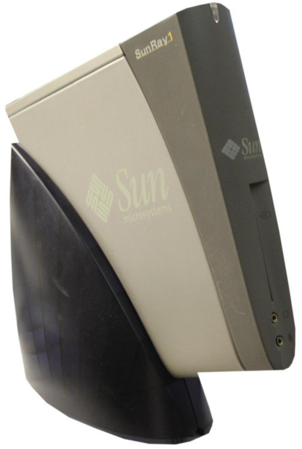
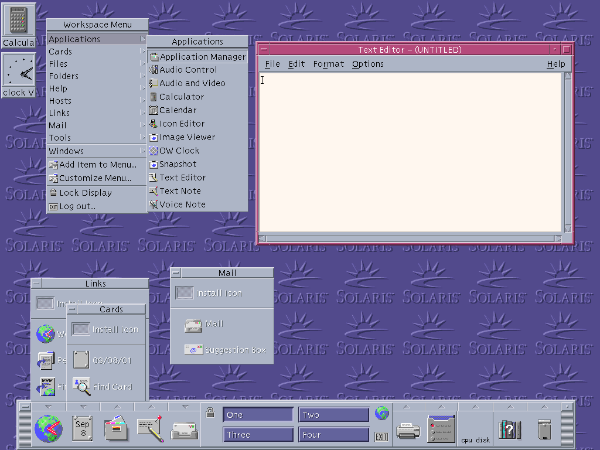

A thread written by @mcclure111: "A long time ago— like 15 years ago— I worked at Sun Microsystems. The company was nearly dead at the time [...]"

[**](https://twitter.com/mcclure111/status/1196557401710837762)

 

 [mcc](https://threader.app/@mcclure111)  [@mcclure111](https://threader.app/@mcclure111)  glitch girl – working on a vr game, announcements at @mermaidvr – current avatar by @egypturnash – also at [mastodon.social/@mcc](https://mastodon.social/@mcc) — she/her  [Nov. 18, 2019](https://twitter.com/mcclure111/status/1196557401710837762)  ** 8 min read

A long time ago— like 15 years ago— I worked at Sun Microsystems. The company was nearly dead at the time (it died a couple years later) because they didn't make anything that anyone wanted to buy anymore. So they had a lot of strange ideas about how they'd make their comeback.

I heard a lot of highups there talk at the time about "what Sun is going to be about over the next 10 years". They all seemed to have different ideas what that was. But the most common thing I heard was an idea they called "Utility Computing", that only seemed to exist within Sun

They thought in the future no one would own a "computer". Instead, your computer would exist "in the cloud" (though that word didn't exist yet). ISP NOCs would have big megacomputers, and you'd just have a screen that would connect to the nearest NOC, and it would stream to you.

So you'd have "your" computer desktop, but it wouldn't be a real computer running its own OS. It would just be a user account on some server somewhere that stored your icons and your data, and your programs would all run on the server and you'd pay a monthly bill.

Sun believed people would do this because, if people did this, it would create business for the big-iron servers Sun made at the time, & this way Sun would not go bankrupt. They didn't really have a user story. They thought users would use Solaris. Nobody used Solaris, even then.

So this never caught on as a product. But the thing is, they *built* this. It *existed*. It *worked*.

When I went to work at Sun, there were no desktop computers. Instead every desk had a "Sunblade" on it. It looked like a Nintendo Wii (though this was years before the Wii).

 

Every Sunblade had a monitor and a keyboard plugged in, and a slot on the front, like for a credit card. Everybody who worked at Sun had a card clipped to our jeans— the same card we used to unlock the doors to the building. And we'd stick the card in. And there was our desktop.

 

At the end of the day, you'd pull the card out and go home. And the next day you'd come back and put the card in, and there were all your programs, just like you'd left them— even if the SunRay you put your card in wasn't the same one you were using yesterday.

Because nothing ran on the SunRay, it was just streaming window instructions from a big server in the center of the building. There was even some way or other to go home and connect from your computer, and you could be running your SunRay screen at home, with just a little delay.

This was *incredible*, actually. It was *magic*. Sometimes you'd want to go to someone's office and ask for help, and if they said "well, can you show me?" you could just stick your card in their SunRay and— and instantly, there's your computer! It followed you upstairs.

The way you'd do that in a modern workspace is everyone would have a MacBook, and when you went upstairs you'd carry your MacBook, but like in that awkward way where it's 2 inches open so it doesn't go to sleep? And try not to walk into anyone else carrying a laptop the same way.

Of course, there were problems. You couldn't do some things you'd expect to be able to do on a computer, like run a screensaver, cuz that would suck up the CPU. It only really worked for like… writing documents and stuff. Low animation stuff. Oh, and you had to run Solaris.

 

And, of course, "run Solaris" just killed the whole thing instantly, so instantly it baffles me how they didn't stop the project on day one. In 2004 nobody could use Linux except programmers— you struggled to run office suites on Linux— and Solaris was one step harder than Linux.

Still, they didn't kill this obviously-unworkable project, they BUILT it, whether anyone wanted it or not, and they replaced all their own computers with it, and I've never heard of anyone other than Sun *using* it. But for one summer I got to use this awesome, alien-future tech.

Here's why this is interesting to me: Why did the Sunray fail?

I think the answer's obvious. Because they designed the product backward. They didn't think "what do people want?", or even go Apple and think "what COULD people want, if we showed them why they wanted it?".

Sun started with: "What can we build?" "What would be good for US, if people wanted it?". And then assumed they'd figure out a way to work backwards, somehow, into convincing people they wanted it & wanted to pay monthly for it & pay an expensive sysadmin & use a 3-button mouse.

So obviously I'm not really thinking about the Sunray here. I'm thinking about Google Stadia.

Stadia is not a product that exists because people want it. I'm not sure why it exists. But it seems to exist because it *could*. Google knew how to make it, & it would be a good thing for Google if people wanted it, so they just *made* it & assumed the reasons why would follow.

Stadia is "utility computing" for games, but they don't have to call it that, because we have words like "in the cloud" and "streaming". It's a lot like the Sunray system, really. But if I try to compare Sunray to Stadia, I notice something: *The Sunray actually solved problems*.

The Sunray solved *A* problem. It had things it did better than the alternatives that existed at the time. It was made with *A* user in mind, even if that user (Sun Microsystems employees) were the same people making the Sunray. There was *someone*— me, in 2004— it was great for.

I do not know if I can say the same about Stadia.

When I think about Stadia, I *want* to be afraid. I want to see it as one spike (with Apple Arcade) of an encroaching change that ends general computing and brings game creation under a publisher system.

I am finding it hard to be afraid of Stadia. The design thinking is just too backward. Every single step seems to be "what can we build" "what could we license" and not "what does someone want". Someone was being incentivized based on "did we ship" and not "did anyone use it".

If I were trying to build Stadia, I'd start by asking what content people are playing on it. Stadia has limitations (latency), so I'd design content where those limitations don't matter, but the advantages of Stadia (central servers) stand out. Highly social casual games maybe.

Say you don't stream *everything*— you move UI to a simple javascript-like layer so it feels responsive (that's what the SunBlade did)— and make games nongamers with cheap Android phones and old Macbooks play. Farmville but everyone's farm is next to yours visible at all times.

Stadia is doing the opposite of that.

They pitched to the high-end hardcore gamer crowd, pixel shaders and AAA content. The exact people most likely to complain about latency. And they aren't obviously cheaper or better looking than the existing products.

Looking at the launch lineup, I see no exclusives. I see nothing specifically designed for Stadia (to take advantage of cloud possibilities). I see nothing that's hot in streaming RN (to take advantage of YouTube). I do see two fighting games and two rhythm games (latency hell!)

Maybe this is a tech demo that one day they'll find a way to pivot into a serious product. But I think this fails for the same reason the Sunblade fails. Not because the tech was bad. But because Google doesn't know what the tech is for. Bad institutional thinking is hard to fix.

For Stadia to be "scary" to me as a game developer— "scary" meaning "I expect I'll be locked into a disadvantageous contract just to make cheap indie games, because it ate the market while no one was paying attention"— Google will have to fundamentally change the way they design.

Hm, OK. So this looks like something I'd play if it was on the PS4. I don't see any Stadia features tho. Previous game by this developer was a Unreal game & probably so is this, so it probably *could* run on the PS4 if [$GOOG](https://twitter.com/search?q=%24GOOG) wasn't paying for exclusivity.

I'm making VR games, for a living, right now. That's another tech that might turn out to be a white elephant nobody wants. The approach I'm taking, with my current game and the one I want to make after it, is *don't make a game for VR unless that game could ONLY exist in VR*.

You want people to use a thing? *Show them why they need it!* Show them what they can do with your technology that they *can't* do without it.

Note: I've just realized in this thread I use "Sunray" and "Sunblade" kind of interchangeably. The product I was talking about was the Sunray. Sunblade was just a line of sparc desktops. I got confused. Maybe this is evidence their branding was not as clear as it could have been?

You can follow [@mcclure111](https://twitter.com/intent/user?screen_name=mcclure111).

 Share this threadBookmark

- [Facebook](https://www.facebook.com/sharer/sharer.php?u=https://threader.app/thread/1196557401710837762)

- [LinkedIn](https://www.linkedin.com/shareArticle?mini=true&url=https://threader.app/thread/1196557401710837762&title=%22A%20long%20time%20ago%E2%80%94%20like%2015%20years%20ago%E2%80%94%20I%20worked%20at%20Sun%20Microsystems.%20The%20company%20was%20nearly%20dead%20at%20the%20time%20%5B...%5D%22%20-%20%40mcclure111&source=threader.app)

- [Twitter](https://twitter.com/intent/tweet/?text=%22A%20long%20time%20ago%E2%80%94%20like%2015%20years%20ago%E2%80%94%20I%20worked%20at%20Sun%20Microsystems.%20The%20company%20was%20nearly%20dead%20at%20the%20time%20%5B...%5D%22%20-%20%40mcclure111%20on%20%23Threader%0A&url=https://threader.app/thread/1196557401710837762)

- 

____

Tip: mention [@threader_app](https://twitter.com/intent/user?screen_name=threader_app) on a Twitter thread with the keyword “compile” to get a link to it.

Enjoy Threader? [Sign up](https://threader.app/thread/1196557401710837762#).

 Threader is an independent project created by only two developers. The site gets 500,000+ visits a month and our iOS Twitter client was featured as an [App of the Day](https://apps.apple.com/us/story/id1367658799) by Apple. Running this space is expensive and time consuming. If you find Threader useful, please consider [supporting us](https://threader.app/faq/how-to-support-threader) to make it a sustainable project.

 