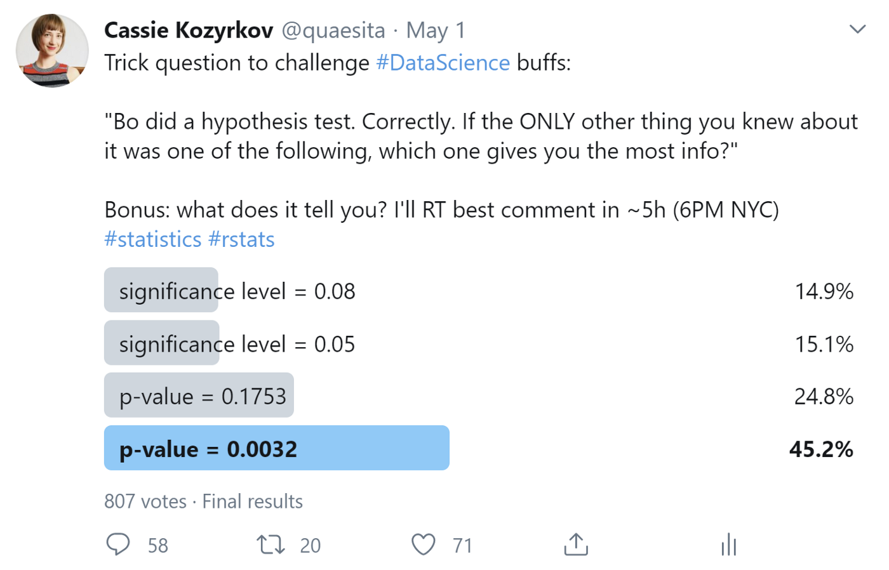
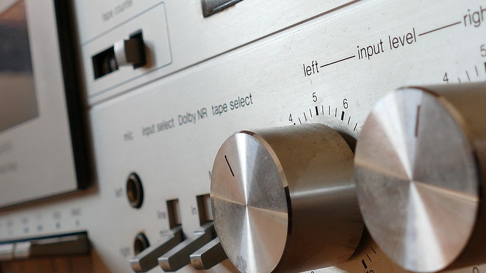

A trick question for data science buffs - Towards Data Science

# A trick question for data science buffs

## Try your hand at a multiple choice statistical reasoning puzzle!

[Cassie Kozyrkov](https://towardsdatascience.com/@kozyrkov?source=post_page-----f44e21866a75----------------------)

[May 4](https://towardsdatascience.com/a-trick-question-for-data-science-buffs-f44e21866a75?source=post_page-----f44e21866a75----------------------) · 12 min read

My favorite thing about trick questions is that nitpicking (yours *and *mine) is fair game. When a question warns you that it’s a trick question, read carefully.

Originally posted on [posted on Twitter](https://twitter.com/quaesita/status/1256261730755317767), here it is again for you to try:

***“Bo did a hypothesis test. Correctly. If the ONLY other thing you knew about it was one of the following, which one gives you the most info?”***

***A) significance level = 0.08
B) significance level = 0.05
C) p-value = 0.1753
D) p-value = 0.0032***

And now, let’s reveal the audience’s answers:

You know what my second favorite thing about a trick question is? When it works well, the least popular answer is the right one! Yes, folks — it’s A. The correct answer is the one that only got 15% of the vote.

> And the winner is… A.

Reading the Twitter comments makes me itch to go off on a tangent about the [Dunning-Kruger effect](https://bit.ly/dunningkrugereffectwiki), but I’ll restrain myself. Let’s analyze the question instead.

To help you skim the discussion, **clues we can deduce will be in bold with Arabic numerals 1, 2, 3, 4, …** and* things we can’t know will be in italics with Roman numerals i, ii, iii, …*

# What the question DOES tell you

Each of A-D only makes sense in a specific decision-making framework, so:

**1. Bo used the framework from **[**frequentist statistics**](http://bit.ly/quaesita_statistics)**.**

> “Bo did a hypothesis test. Correctly.”
**2. There’s no mistake in the calculations.**
**3. The test used is appropriate to the data and assumptions.**
**4. The test is valid for decision-making.**

Everyone would probably agree that Bo made a mistake if the calculations went awry, but which incarnation of “correctly” would stand up to the most extreme nitpickers? One that goes beyond good technical execution into the territory of decision validity. That’s your first outside-the-box clue. This hypothesis test is more than mathematically correct.

> Bo’s hypothesis test was mathematically **> and**>  decision-theoretically correct.

# What the question DOESN’T tell you

Among other things, *which pronoun to use for Bo*. I saw lots of assumptions in the comments, so you might be surprised when you scroll down to see the real Bo’s photo.

More pertinently, here are some questions you couldn’t answer from the wording:
*i) Was Bo the decision-maker, the statistician, or both?
ii) How many de facto decision-makers were there?*

To make things easy for you (and less wordy for me), we’ll pretend this scenario has one decision-maker (Bo) who also happens to be playing the role of statistician. Just so you know, that assumption will often get you into trouble in real life. Much on-the-job pain in professional [data science](http://bit.ly/quaesita_datasci) comes from issues around [decision delegation](http://bit.ly/quaesita_dsleaders), [decision-maker incompetence](http://bit.ly/quaesita_genie), and complications involving multiple stakeholders.

If you want to be nitpicky about it, though, replace instances of “*Bo*” below with “*the decision-maker(s)*” unless we’re talking about calculations.

*iii) What was the decision about?*

Although novices often struggle to spot underlying decisions, classical hypothesis testing is philosophically rooted in decision-making. (Read my article “[*Never start with a hypothesis*](http://bit.ly/quaesita_damnedlies)” to understand the framework better.)

Before you say “*I’m just doing some science*” or “*I just want to know *[*how strong my evidence is*](http://bit.ly/quaesita_pointofstats)*,*” take a moment to spot the real decision-makers (e.g editors of the scientific journal you’re submitting your science to) who have a well-defined [default action](http://bit.ly/quaesita_damnedlies) (e.g. don’t publish) and predefined decision criteria (e.g. alpha set at 5%). When you’re doing data work just for yourself, think about *why *you’re doing it and what will change depending on what you see. If you have a clear answer, you’ll also see the decisions. If you’re truly not making decisions, then the [data science subfield](http://bit.ly/quaesita_datasci) you want is [analytics](http://bit.ly/quaesita_versus) — not [statistics](http://bit.ly/quaesita_statistics). Analytics may use hypothesis testing equations, but does not actually test hypotheses. (Just like using a scalpel doesn’t mean you’re doing surgery.)

*iv) What was the null hypothesis and decision criteria?
v) What were the testing assumptions?*

Absolutely no information was supplied about these, which automatically means that options C and D are both garbage. You might be surprised to learn a hard truth about p-values:

> A p-value is useless if you don’t know *> all *> the details of the hypothesis test setup.

Both of the p-values offered are equally useless to you. (Those who don’t know what a p-value is can learn the basics [here](http://bit.ly/quaesita_puppiesm).)

> Both C & D were intentional red herrings, intended as a wake-up call to those who make the mistake of taking p-values at face value.

Those red herrings were handed to you on purpose, to remind you that the general public does a shoddy job of appreciating that p-values aren’t very informative on their own. Let’s drill down into two main things that people incorrectly(!) believed they got from those p-values. Firstly:

*vi) How much data did Bo use?*

It’s a myth that p-values tell you about [sample sizes](http://bit.ly/quaesita_vocab). There are many paths to a low p-value, including convenient or obviously-violated assumptions. If the *only* thing you know about a test is its p-value, you know nothing about the test.

> If the *> only*>  thing you know about a test is its p-value, you know nothing about the test.

To make a point, I intentionally generated Option C and D’s p-values in a perverse manner. I used only two datapoints to generate *p-value = 0.0032 *and then I added one more datapoint to get *p-value = 0.1753. *It’s almost as if I anticipated that people would make this very common statistical thinking error. Yay, trick questions!

> Nope, low p-values don’t mean lots of data.
Secondly:
*vii) What statistical conclusion can we make from the test?*
Folks, who is this “we” you keep commenting about?

One of recurring themes in the comments was allusion to a mythical “we” learning something. As if we’re all doing the decision-making together. Back off, no one invited “us” — Bo is in charge here.

> Folks, who is this “we”? Bo is in charge here!

Statistical hypothesis testing is a tool for making reasonable decisions under uncertainty. You pick the settings, you put in some data, and you get a suggested action. If someone else prefers to use different — yet also valid — assumptions or settings, they might get a different result. Both will be correct.

> “We” should think before we try to foist our opinions on those who don’t want them.

The only entity [potentially learning something](http://bit.ly/quaesita_fisher) is the decision-maker(s), yet many of the comments seemed not to realize this. The idea that “we” are all supposed to participate in — and learn from — *every* decision is bizarre. It’s impractical, inefficient, and impinges unnecessarily on freedom. “We” are not going to choose the flavor of my next espresso treat; go away.

# Option A or B?

Since we know that Bo’s hypothesis test is *valid for decision-making*, here are some additional items that must be true:

**5. The hypotheses were set up in the right order, starting with the default action.**

(See my article [*Never start with a hypothesis*](http://bit.ly/quaesita_damnedlies) for details.)

**6. The **[**significance level**](http://bit.ly/quaesita_statistics)** was set in stone BEFORE any **[**data**](http://bit.ly/quaesita_hist)** or **[**p-values**](http://bit.ly/quaesita_puppies)** were examined.**

No self-respecting decision theorist would condone a decision approach that is wide open to [confirmation bias](http://bit.ly/quaesita_inspired), so the test must have been performed in a *correct *manner from that perspective as well.

> If you allow yourself to move the goalposts after the ball has landed, you’re doing it wrong. The significance level must be set in advance!

If you allow yourself to move the goalposts after the ball has landed, you’re doing it wrong. This means that whatever the significance level was, Bo committed to it early in the project.

**7. A **[**significance level**](http://bit.ly/quaesita_statistics)** of 0.05 is the default for teaching, so it’s often the default setting in statistical software.**

Teachers usually try to focus on the new concepts they’re trying to introduce, so they like to keep the rest as simple as possible. Defaults are handy when the point of the lesson isn’t the significance level, so students are asked to assume significance level = 0.05 unless told otherwise. One day I might write about the fascinating and arbitrary history of why it’s 5% and not some other number (the story involves a famous man with a [big beard](http://bit.ly/quaesita_fisher), an ambitious textbook, copyright law, and agriculture).

**8. The beauty of the classical hypothesis testing framework is the way it lets you control your decision quality and risk of making mistakes.**

What most people don’t realize is that statistical hypothesis testing is a personalized decision-making framework that gives you three dials. You set any two of them, the third clicks into place automatically, then you put in data and get a suggested action as output. Here are the three dials:

- Significance level
- Minimum power profile
- Maximum sample size budget

All of these things are in balance. Lower significance and higher power refer to better control over Type I and Type II errors respectively. (I’ve defined all these jargon terms for you in my article “[*Statistics for people in a hurry*](http://bit.ly/quaesita_statistics)*.*”) You can ask for a procedure that makes both of these errors very unlikely… but at a price: lots more data. The required sample size budget dial may set itself on an exorbitant number. Too expensive? Increase your significance level or decrease your power requirements.

> If you’ve come to the land of p-values and confidence intervals, you’d better be here for a certain way of controlling quality and risk.

Your ability to pick the quality of your decision-making is pretty much *the* point of classical statistical inference. The reason you’re not choosing a [Bayesian approach](http://bit.ly/quaesita_statistics) (which doesn’t use p-values, significance, or confidence intervals) is that you *want* to control the risk of being wrong. If you don’t care about this, go Bayesian.

Now let me tell you what I see when I look at what most people do with classical statistical inference.

I see a powerful framework with three dials. One ([sample size](http://bit.ly/quaesita_vocab)) is often set with a shrug, meaning you end up in one of two bad extremes: overpaying for data or wasting your whole project. One is usually ignored ([power](http://bit.ly/quaesita_statistics)) and one ([significance level](http://bit.ly/quaesita_statistics)) is set to 0.05 because that’s what people remember from school. I can’t facepalm hard enough. Talk about missing the whole point!

> I can’t facepalm hard enough. Talk about missing the whole point!

I can’t emphasize enough how important it is that the decision-maker thoughtfully sets the significance level!

How should they set it? If people [show enough interest](https://twitter.com/quaesita/status/1257392379012755458), I’ll write a separate article about that. In the meantime, it’s important that you understand that whoever is responsible for making the decision should pick the decisions settings. Whatever you choose… choose it thoughtfully.

When I’ve been in charge, I’ve used significance levels above 0.1753 and below 0.0032. I’ve used 0.05 and 0.08 too… and a whole bunch of others. It always depended on what was at stake and what quality the decision needed to be made at.

> The significance level is allowed to be whatever the decision-maker is comfortable with.

Comments were wrong in two ways when they said that would reject / not reject the null hypothesis with those Option D & C p-values “almost surely.” Firstly, you don’t know anything about the decision or the quality the decision-maker intends to make it at, so don’t be so sure about that. Secondly, “almost surely” is a technical term from measure theory which you’ve *almost surely* used incorrectly, probably because you didn’t know that your stats profs were making a private joke during lectures. A better way to say what you meant would be that a decision-maker using “conventional” settings would make certain conclusions, which brings me to…

*viii) Does Bo give a damn about convention?*

This one is thorny. While Bo is making a decision with *full* authority, no. Bo shouldn’t give a damn about convention and should use decision tools however Bo sees fit. There’s always more than one reasonable way to approach decision-making. However, since you don’t know whether Bo *is *the decision-maker, you can’t really make assumptions here. When decision-making custodians act on behalf of society (as in the case of a government’s approval process for new medication), then tradition dictates much of their decision criteria and they *do *have to follow convention because they can’t ask society to participate directly each time. If the decision-makers are fully involved in the decision, then following convention is usually a sign of laziness. (Admittedly, [sometimes laziness is efficient.](http://bit.ly/quaesita_di))

When you see Option B (significance level = 0.05), you don’t know whether the decision-maker(s) chose it thoughtfully, whether they picked it because it’s what all the lemmings pick, or whether someone didn’t bother to adjust the software settings. That’s less info than Option A, which at least tells you that the significance level was *almost surely *set to 8% on purpose.

# Unconventional or up to no good?

A lot of comments led themselves astray on the topic of convention. Following convention is only wise under certain circumstances.

> If you’re doing something naughty with a hypothesis test, you’re not testing a hypothesis correctly.

Option A (*significance level = 0.08*) would tell you that the decision setup is unconventional, but it’s ignorant to assume that an unconventional choice is sneaky in some way. (In fact, those of you who thought it meant Bo was up to no good (e.g. “alpha-hacking”) missed all the implications of the word “correctly” and **clue #6** above. If you’re doing something naughty with a hypothesis test, you’re not testing a hypothesis correctly.)

In fact, an unconventional choice like 0.08 is more likely to signal that Bo is an expert who understands the tradeoffs between data budget, power, and significance. But we don’t know that for sure.

# Summary

Here’s what each of the options in the trick question actually told us:

**A) The significance level was set on purpose. Someone had to have thought at least a little bit about it before choosing it, since it’s different from the default setting.**

B) The significance level happens to be the same as the teaching and software default setting. It may or may not have been set to 5% thoughtfully.

C) Not much.
D) Not much.
Which is why the winner is Option A.

Meet the Bo that inspired that puzzle (on the right). She’s a statistician, decision-maker, data scientist, and Canadian badass-in-general. And my college best friend.

# Why the answer wasn’t about effect sizes

A small postscript for those whose thinking when down the “effect sizes” track:

**9. *“Testing a hypothesis”* is not the same thing as *“using hypothesis testing math for ***[***EDA***](http://bit.ly/quaesita_damnedlies)***”* so *effect sizes* shouldn’t come into the discussion.**

The appropriate effect size for taking action should already have been incorporated into the way Bo phrased the null hypothesis.

# Still don’t understand why C & D are incorrect?

If you know *everything *about the decision-maker’s decision setup and assumptions (you don’t!), you can infer something about how unlikely the null hypothesis world is to generate data at least as extreme as what Bo observed.

If you know the significance level and the p-value together (you don’t!), you can infer whether the decision-maker found the data surprising enough to change their mind and switch away from their default action.

When you find out that someone else’s p-value is “low enough”, all you really learn is “the decision-maker was surprised by something.”

> If you don’t have information about the test’s hypotheses and assumptions, one p-value is as useless as another.

Unfortunately, you don’t know what “low enough” is, so you don’t even know if Bo was [surprised into action](http://bit.ly/quaesita_damnedlies). Without all those other bits of information, one p-value is as useless as another. Both C & D were intentional red herrings, intended as a wake-up call to those who make the mistake of taking p-values at face value. (For an explanation, see my article [*Why are p-values like needles?*](http://bit.ly/quaesita_needles))

# Don’t be a lemming

The best thing about statistical hypothesis testing is that it gives you a way to control your Type I and Type II error probabilities, balancing them against your data budget. (See my article [*Statistics for People in a Hurry*](http://bit.ly/quaesita_statistics) if you need a refresher.)

If you don’t bother to thoughtfully set your tolerance for the risk of making the worst kind of mistake available in this framework — the Type I error — then you’ve missed the key part of the whole exercise. Picking significance level of 5% every time defeats the point — it’s the same as throwing away the most important dial that you have control over.

# Thanks for reading! Liked the author?

If you want to say thank you, I appreciate shares and [retweets](https://twitter.com/quaesita/status/1257392379012755458). If you’re keen to read more of my writing, most of the links in this article take you to my other musings. Can’t choose? Try this one:

[ ## Why are p-values like needles? It’s dangerous to share them!   ### There’s a war on p-values… and both sides are wrong!    #### towardsdatascience.com](https://towardsdatascience.com/why-are-p-values-like-needles-its-dangerous-to-share-them-b94c11be537)