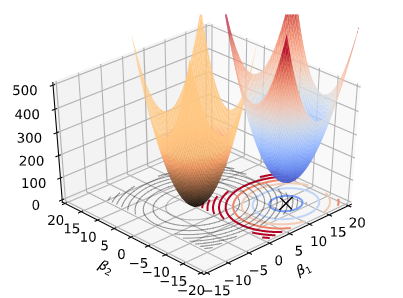
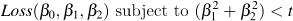
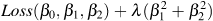
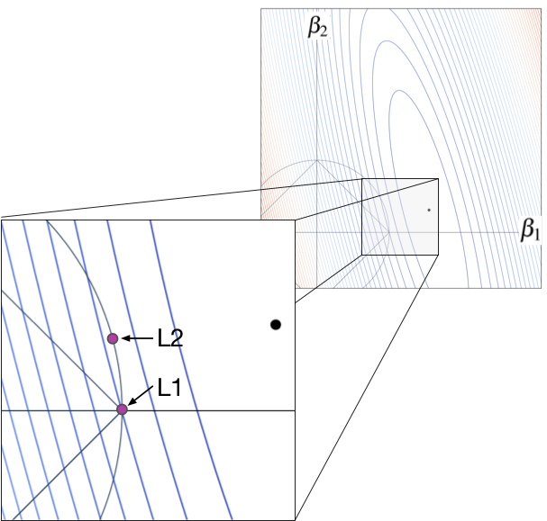
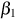
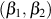

A visual explanation for regularization of linear models

*[Main article](http://explained.ai/regularization/index.html)
Brought to you by [explained.ai](http://explained.ai/)*

# A visual explanation for regularization of linear models

[Terence Parr](http://parrt.cs.usfca.edu/)

Terence teaches in [University of San Francisco's MS in Data Science program](https://www.usfca.edu/arts-sciences/graduate-programs/data-science) and you might know him as the creator of the ANTLR parser generator.

Linear and logistic regression models are important because they are interpretable, fast, and form the basis of deep learning neural networks. They are also extremely simple; we're just fitting lines (or hyperplanes) through training data. Unfortunately, linear models have a tendency to chase outliers in the training data, which often leads to models that don't generalize well to new data. To produce models that generalize better, we all know to *regularize* our models. There are many forms of regularization, such as *early stopping* and *drop out* for deep learning, but for isolated linear models, *Lasso* (L1) and *Ridge* (L2) regularization are most common. The mathematics behind fitting linear models and regularization are well described elsewhere, such as in the excellent book *The Elements of Statistical Learning* (ESL) by Hastie, Tibshirani, and Friedman. The world certainly doesn't need yet another article on the mechanics of regularized linear models, so I'm going to assume that you're familiar with basics.

What's lacking is a simple and intuitive explanation for what exactly is going on during regularization. The goal of this article is to explain how regularization behaves visually, dispelling some myths and answering important questions along the way. This article has exploded way beyond my initial intentions, so let me start out by summarizing the key elements; that way you can quickly get back to watching YouTube or playing Animal Crossing.

## TL;DR   The key nuggets

1. Personally, my biggest initial stumbling block was this: *The math used to implement regularization does not correspond to pictures commonly used to explain regularization*. Take a look at the oft-copied picture (shown below left) from page 71 of ESL in the section on “Shrinkage Methods.” Students see this multiple times in their careers but have trouble mapping that to the relatively straightforward mathematics used to regularize linear model training. The simple reason is that that illustration shows how we regularize models conceptually, with *hard constraints*, not how we actually implement regularization, with *soft constraints*! The math actually corresponds to the picture on the right, with the loss function in blue-red (blue = lower, red = higher loss) and the regularization penalty term in orange, emanating from the (0,0).

|     |     |
| --- | --- |
|  |  |
| **Hard constraint** illustration from ESL page 71. | **Soft constraint** with non-regularized loss function (blue-red) term and penalty term (orange). |

Regularization conceptually uses a hard constraint to prevent coefficients from getting too large (the cyan circles from the ESL picture). For implementation purposes, however, we convert that “subject to” hard constraint to a soft constraint by adding the constraint as a term to the loss function. The hard constraint in the regularized loss function,, becomes a term in the equation and with a new constant that controls regularization:.	The penalty term is a soft constraint because there is no threshold or clipping; larger coefficients are simply more expensive. The effect is to shift the ordinary loss function “bowl” upwards and the loss function minimum towards the origin, as shown to the right; that bowl is the addition of the loss and penalty bowls. The only thing changing in that picture is lambda; the training data remains the same. The moving bowl is the nonregulated loss function plus the penalty L2 term.

2.  Here's a key question about L1 Lasso: *Does L1 encourage coefficients to shrink to zero or does it simply not discourage zeroes*? It encourages zeros, which I verified by running lots of simulations of random loss functions (different minima locations and shape). In the following images, green dots indicate the location of a loss function minimum that results in a zero regularized coefficient. Blue indicates a loss function that does not result in a zero coefficient and orange indicates a near miss. L1 tends not to give near misses and so the simulation on the left is just blue/green.

|     |     |
| --- | --- |
|  |  |

The L1 diamond hard constraint on the left tends to zero coefficients for any loss function whose minimum is in the zone perpendicular to the diamond edges. The L2 circular constraint tends to zero coefficients for loss function minimums sitting really close to or on one of the axes.

3. If L1 encourages zero coefficients, **why** does it do that?! Why doesn't L2 encourages zero coefficients? Imagine we have some training data where the variable associated with  is very predictive but the other variable is not. In that case, we would see a loss function with contour lines kind of like the following where the big black dot is the non-regularized loss function minimum.

For the L1 case, the optimal  location is the purple dot at the diamond tip. This is true because any movement of  away from that spot increases the loss. Take a look at the contour line emanating from the L1 purple dot. The associated ellipse has the same loss value at all locations. Any  position outside of that ellipse, away from the black dot, has higher loss; any inside that ellipse have lower loss. Any movement in either direction along the diamond edge, away from the purple dot, increases the loss because  immediately moves outside of the contour associated with the L1 purple dot. Moving the black dotup into the left, however, would start to make nonzero L1 coefficients more likely.

For the L2 case, the optimal  location is at the other purple dot location, and not on the axis like the L1 case. Because the L2 purple dot is inside the contour line that meets the L1 dot on the axis, it has lower loss value than that contour line. Moving the purple dot along the circular constraint line in any direction would increase the loss. The optimal L2 coefficients are nonzero, despite the fact that the non-regularized loss function minimum (black dot) is very close to the  axis.

## Deep dive for those lured in by my cool visualizations

The text and visualizations from the summary above were pulled from the following subsections that go into much more detail. There are also many more simulations, so I recommend checking it out if a hazy regularization understanding has been bugging the crap out of you for years!

- [1. A quick review of linear regression](https://explained.ai/regularization/intro.html)
    - [Motivation for regularization](https://explained.ai/regularization/intro.html#sec:1.1)
    - [The premise and trade-off of regularization](https://explained.ai/regularization/intro.html#sec:1.2)
- [2. How regularization works conceptually](https://explained.ai/regularization/constraints.html)
    - [Single-variable regularization](https://explained.ai/regularization/constraints.html#sec:2.1)
    - [L2 Ridge regularization](https://explained.ai/regularization/constraints.html#sec:2.2)
    - [L1 Lasso regularization](https://explained.ai/regularization/constraints.html#sec:2.3)
- [3. The difference between L1 and L2 regularization](https://explained.ai/regularization/L1vsL2.html)
    - [L1 regularization encourages zero coefficients](https://explained.ai/regularization/L1vsL2.html#sec:3.1)
    - [L1 and L2 regularization encourage zero coefficients for less predictive features](https://explained.ai/regularization/L1vsL2.html#sec:3.2)
    - [Why is L1 more likely to zero coefficients than L2?](https://explained.ai/regularization/L1vsL2.html#why)
- [4. How we express regularization in practice](https://explained.ai/regularization/impl.html)
    - [A quick hard constraint regularization recap](https://explained.ai/regularization/impl.html#sec:4.1)
    - [Recasting hard constraints as soft constraints](https://explained.ai/regularization/impl.html#sec:4.2)
    - [Wrapping up](https://explained.ai/regularization/impl.html#sec:4.3)

## Acknowledgements

I'd like to thank mathematicians Steve Devlin, David Uminsky, and Jeff Hamrick, also faculty in [University of San Francisco's MS in Data Science program](https://www.usfca.edu/arts-sciences/graduate-programs/data-science), for helping me understand the mathematics and why L1 regularization encourages zero coefficients.

## Resources

Here are the original papers on Ridge and Lasso regression:

- [Ridge Regression: Biased Estimation for Nonorthogonal Problems](https://www.math.arizona.edu/~hzhang/math574m/Read/RidgeRegressionBiasedEstimationForNonorthogonalProblems.pdf) by *Hoerl and Kennard, Journal Technometrics, 1970*.
- [Regression Shrinkage and Selection via the Lasso](http://www-stat.stanford.edu/~tibs/lasso/lasso.pdf) by *Tibshirani* in Journal of the Royal Statistical Society, 1996.

Here are some in-depth articles:

- My MSDS621 project could prove useful for those interested in the implementation of regularization by gradient descent: [Using gradient descent to fit regularized linear models](https://github.com/parrt/msds621/raw/master/projects/linreg/linreg.pdf)
- [Lecture notes on ridge regression](https://arxiv.org/pdf/1509.09169.pdf) by *Wessel N. van Wieringen*.
- [Deep Learning Basics Lecture 3: Regularization I (slides)](https://www.cs.princeton.edu/courses/archive/spring16/cos495/slides/DL_lecture3_regularization_I.pdf) by *Yingyu Liang* at Princeton University.
- [Regularized Regression](https://uc-r.github.io/regularized_regression) from *@bradleyboehmke* at University of Cincinnati.

**Deep Learning related links**

If you are new to deep learning, check out Jeremy Howard's full course called [Practical Deep Learning for Coders](https://course.fast.ai/). Then you might be interested in some articles that relate the regularization described in this article to deep learning.

- [Understanding AdamW: Weight decay or L2 regularization?](https://www.fast.ai/2018/07/02/adam-weight-decay/#understanding-adamw-weight-decay-or-l2-regularization)  *Sylvain Gugger and Jeremy Howard*
- [Three Mechanisms of Weight Decay Regularization](https://arxiv.org/abs/1810.12281) by *Guodong Zhang, Chaoqi Wang, Bowen Xu, Roger Grosse*