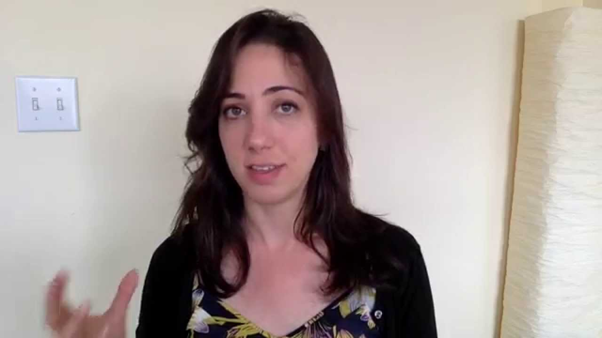

A visual guide to Bayesian thinking

A visual guide to Bayesian thinking
https://www.youtube.com/watch?v=BrK7X_XlGB8
[Julia Galef](https://www.youtube.com/channel/UCz-RZblnhjXK_krP1jDybeQ)
398,505 views views
Published on Jul 16, 2015

|     |
| --- |
| [(L)](https://www.youtube.com/watch?v=BrK7X_XlGB8) |

Description

I use pictures to illustrate the mechanics of "Bayes' rule," a mathematical theorem about how to update your beliefs as you encounter new evidence. Then I tell three stories from my life that show how I use Bayes' rule to improve my thinking.

Top Comments

Mortimer Snead | 1 month ago
If a repair man wants to rob you, he'll do it when he's writing the bill.

Daniel Korolev | 1 year ago
Got a good chuckle out of the mathematician joke actually.

Not Even Wrong | 2 years ago

Very useful video,...but the whole time I was thinking: ' Goddamn! She draws perfect straight lines.'

Brew Sauce | 7 months ago

I've done a lot of repair work, and I know what's it's like to be in the category: "looks like he's going to rob you but really he's just doing his job." Let me tell you - every place is built differently, and you should always keep your eyes open.. One time I found a gas line going into a bedroom and not even capped off. The place would have filled up with explosives at the turn of a knob, well if not for my "snooping about" that is. But it's also part of the job description to not freak people out. I just said, "I need to look around a bit to make sure I know where all the gas lines are going."

Otto von Chesterfield, Esquire | 2 years ago (edited)

This seems like a good way to justify your position while also being wrong. I like it.

Ryan Brady | 2 years ago

I think there's a danger here of thinking that your behavior is scientific/logical/statistically valid when it might not be. Choice of prior is incredibly critical to making valid Bayesian inference. I mean, the easiest (and one of the worst) example is thinking "black people are more likely to be criminals than white people", and you update your belief in favor of this proposition every time you see a news story about a black person committing a crime or a police officer detaining one. It should be obvious that there are other covariates at play here - unequal enforcement, poverty, observer bias, etc. When using stats responsibly, it's important to do sensitivity analysis on the choice of prior. In the analogies here, this would be something like "if I believed meditation were likely to be 'real', how would it change the way in which this new information updates my beliefs?" And on meditation, there are two other (important imo) frameworks for that belief updating. You could instead simultaneously update your beliefs about the 'realness' of meditation AND the intelligence of your friend. Secondly, you could propose that meditation works for some people, and does not work for others.

Alley00Cat | 4 months ago

If you found the math joke funny, what is the probability you are a mathematician?

Univ Univeral | 8 months ago
a really gorgeous Bayesian

alerus2 | 2 years ago (edited)

As someone who uses Bayesian systems professionally, in daily life thinking, and also to show why other people's arguments don't land, I have to say that this is a fantastic video. It very clearly illustrates to the layperson why Bayes is what is and what the messages are. I will be sharing this with others.

fluff | 2 months ago
I think Tom was molested as a child.