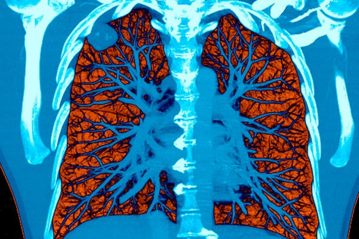
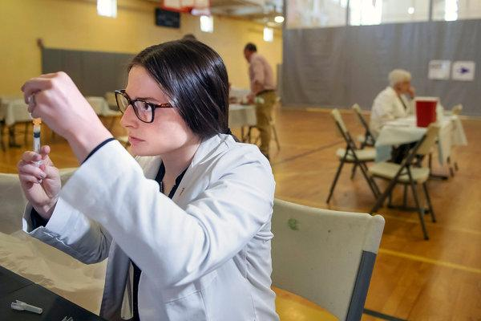
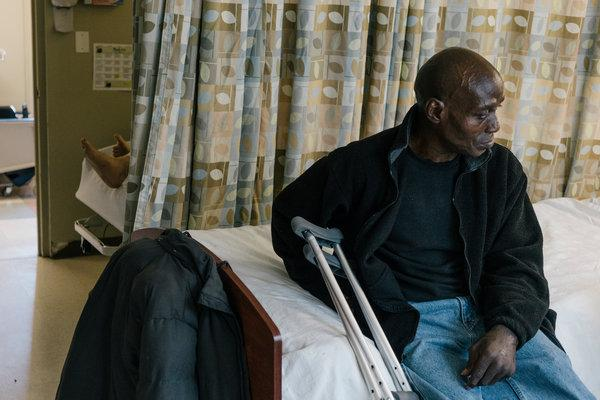

A.I. Took a Test to Detect Lung Cancer. It Got an A.

Advertisement

[      The truth is worth it.         See the stories](https://adclick.g.doubleclick.net/pcs/click?xai=AKAOjsv0d2TdV3on3_W_ZOIG8V8Ehp6PT3KFmrWK9gauomUAbBtff13CyB-uz_MEV6VMWs52MQepETbQljU8bak41BkR1FpaATgdkZ0cnQ-_A2QAcTcmwn6n6xPTnFcaPvVajdIS4bOrOrFZocwygdkrIai7aa8xWms9o2ti_LwNNCtEz4NZAM2Euqb6Zc_aGczPWlIpEwaQwOKqWenRIyRdPq_Y7Qmb1_lfh_SlzcEzAwOzQwPldNo0o2_rBuZzWDtojokq&sig=Cg0ArKJSzCe7rsgvxU9QEAE&urlfix=1&adurl=https://ad.doubleclick.net/ddm/trackclk/N296811.6440THENEWYORKTIMESCOMPA/B22187340.237970964%3Bdc_trk_aid%3D435228218%3Bdc_trk_cid%3D111025435%3Bdc_lat%3D%3Bdc_rdid%3D%3Btag_for_child_directed_treatment%3D%3Btfua%3D)

# A.I. Took a Test to Detect Lung Cancer. It Got an A.A.I. Took a Test to Detect Lung Cancer. It Got an A.

Artificial intelligence may help doctors make more accurate readings of CT scans used to screen for lung cancer.

A colored CT scan showing a tumor in the lung. Artificial intelligence was just as good, and sometimes better, than doctors in diagnosing lung tumors in CT scans, a new study indicates.CreditVoisin/Science Source

Image

A colored CT scan showing a tumor in the lung. Artificial intelligence was just as good, and sometimes better, than doctors in diagnosing lung tumors in CT scans, a new study indicates.CreditCreditVoisin/Science Source

By [Denise Grady](https://www.nytimes.com/by/denise-grady)

- May 20, 2019

-

    - 
    - 
    - [](https://www.nytimes.com/2019/05/20/health/cancer-artificial-intelligence-ct-scans.htmlmailto:?subject=NYTimes.com%3A%20A.I.%20Took%20a%20Test%20to%20Detect%20Lung%20Cancer.%20It%20Got%20an%20A.&body=From%20The%20New%20York%20Times%3A%0A%0AA.I.%20Took%20a%20Test%20to%20Detect%20Lung%20Cancer.%20It%20Got%20an%20A.%0A%0AArtificial%20intelligence%20may%20help%20doctors%20make%20more%20accurate%20readings%20of%20CT%20scans%20used%20to%20screen%20for%20lung%20cancer.%0A%0Ahttps%3A%2F%2Fwww.nytimes.com%2F2019%2F05%2F20%2Fhealth%2Fcancer-artificial-intelligence-ct-scans.html)

    -
    -
    -

Computers were as good or better than doctors at detecting tiny lung cancers on CT scans, in a study by researchers from Google and several medical centers.

The technology is a work in progress, not ready for widespread use, but [the new report](https://www.nature.com/articles/s41591-019-0447-x), published Monday in the journal Nature Medicine, offers a glimpse of the future of artificial intelligence in medicine.

One of the most promising areas is recognizing patterns and interpreting images — the same skills that humans use to read microscope slides, X-rays, M.R.I.s and other medical scans.

By feeding huge amounts of data from medical imaging into systems called artificial neural networks, researchers can train computers to recognize patterns linked to a specific condition, like pneumonia, cancer or a wrist fracture that would be hard for a person to see. The system follows an algorithm, or set of instructions, and learns as it goes. The more data it receives, the better it becomes at interpretation.

Advertisement

[      The truth is worth it.         See the stories](https://adclick.g.doubleclick.net/pcs/click?xai=AKAOjssXvMBlxfOw33SzX0jcoiWdpCckWbTEmzkS516XhK9jdHZOEWZJD3GetR26gNQNH1nAG98hwvjN1rQ2LTEJSv25KsZ4dQdJeDrZscC9x-LzkRTC98QjSMloLd5rg-ZmZ1WaTaVgVnudwUiYTjTl2PduY1Jv4sn6v_feQMt4CKg6TJSEr3_SttyoAxfg2AbPuB2AWCnUw2HoaZDOZHV7rwdljtUdb140ST09l6ZcS5lQIuo_XZls0qJHPAzLQ8QaWKiR&sig=Cg0ArKJSzMgd-SeQUhhMEAE&urlfix=1&adurl=https://ad.doubleclick.net/ddm/trackclk/N296811.6440THENEWYORKTIMESCOMPA/B22187340.237970964%3Bdc_trk_aid%3D435228218%3Bdc_trk_cid%3D111025435%3Bdc_lat%3D%3Bdc_rdid%3D%3Btag_for_child_directed_treatment%3D%3Btfua%3D)

The process, known as deep learning, is already being used in many applications, like enabling computers to understand speech and identify objects so that a self-driving car will recognize a stop sign and distinguish a pedestrian from a telephone pole. In medicine, Google has already created systems to help pathologists read microscope slides to diagnose cancer, and to help ophthalmologists detect eye disease in people with diabetes.

“We have some of the biggest computers in the world,” said Dr. Daniel Tse, a project manager at Google and an author of the journal article. “We started wanting to push the boundaries of basic science to find interesting and cool applications to work on.”

In the new study, the researchers applied artificial intelligence to CT scans used to screen people for lung cancer, which caused 160,000 deaths in the United States last year, and 1.7 million worldwide. The scans are recommended for people at high risk because of a long history of smoking.

Studies have found that screening can reduce the risk of dying from lung cancer. In addition to finding definite cancers, the scans can also identify spots that might later become cancer, so that radiologists can sort patients into risk groups and decide whether they need biopsies or more frequent follow-up scans to keep track of the suspect regions.

But the test has pitfalls: It can miss tumors, or mistake benign spots for malignancies and push patients into invasive, risky procedures like lung biopsies or surgery. And radiologists looking at the same scan may have different opinions about it.

Advertisement

[      The truth is worth it.         See the stories](https://adclick.g.doubleclick.net/pcs/click?xai=AKAOjssq33TGY1tbpTP1z4YCM741ZQMiWHMFW5OjbXJJXbrwsB2ZJ_z_WQs7PBaWOm4CEM5OirzdQhjxAH51oIoAJ_lIFq3MwQVJT9uYU3Txsoris2ZQiDuXuqLNSH48f7lC-FW85vzkDpmWLgO0eXSWZF7Sj9j4upwZ4kh0StNGedBQTc0mqYmEg_3wL2y9HnLWnqyw7FxqJjMMpMTJ6FK11fp2_92dYQSEZDkq1kzbkfbtoxBPwm17FfBqWXTxVaZFtLfT&sig=Cg0ArKJSzHIhC-Jv6PdKEAE&urlfix=1&adurl=https://ad.doubleclick.net/ddm/trackclk/N296811.6440THENEWYORKTIMESCOMPA/B22187340.237970964%3Bdc_trk_aid%3D435228218%3Bdc_trk_cid%3D111025435%3Bdc_lat%3D%3Bdc_rdid%3D%3Btag_for_child_directed_treatment%3D%3Btfua%3D)

The researchers thought computers might do better. They created a neural network, with multiple layers of processing, and trained it by giving it many CT scans from patients whose diagnoses were known: Some had lung cancer, some did not and some had nodules that later turned cancerous.

Then, they began to test its diagnostic skill.

“The whole experimentation process is like a student in school,” Dr. Tse said. “We’re using a large data set for training, giving it lessons and pop quizzes so it can begin to learn for itself what is cancer, and what will or will not be cancer in the future. We gave it a final exam on data it’s never seen after we spent a lot of time training, and the result we saw on final exam — it got an A.”

Tested against 6,716 cases with known diagnoses, the system was 94 percent accurate. Pitted against six expert radiologists, when no prior scan was available, the deep learning model beat the doctors: It had fewer false positives and false negatives. When an earlier scan was available, the system and the doctors were neck and neck.

The ability to process vast amounts of data may make it possible for artificial intelligence to recognize subtle patterns that humans simply cannot see.

“It may start out as something we can’t see, but that may open up new lines of inquiry,” said Dr. Mozziyar Etemadi, a research assistant professor of anesthesiology at Northwestern University Feinberg School of Medicine, and an author of the study.

Dr. Eric Topol, director of the Scripps Research Translational Institute in La Jolla, Calif., who [has written extensively about artificial intelligence](https://www.nature.com/articles/s41591-018-0300-7) in medicine, said, “I’m pretty confident that what they’ve found is going to be useful, but it’s got to be proven.” Dr. Topol was not involved in the study.

Given the high rate of false positives and false negatives on the lung scans as currently performed, he said, “Lung CT for smokers, it’s so bad that it’s hard to make it worse.”

Advertisement

 [(L)](https://adclick.g.doubleclick.net/pcs/click%253Fxai%253DAKAOjst3bq0v68Kr7dgjaT4Tq5bVm8O6APmvBmQMDEQdljbWCPOQ4-E5kJ_8ASQG_4BvH3qoU1s83molOWGw8jNtnKMVREYjgtYkfClvA2_Gw5nRZyxxA-WvYBu1RQOHgjdb6E5-qxI9NOPqR_vm18_JXPZLcxPRhmnLhBu2XDdHly5T1jt3Ad8eOJEP15CfOk9r1-PxjpKtgrPnbD_2kg2cynMil_Ne2sNEpPMcb_LPnKOZFQUsav2x6JerZmNxk_vif-UB%2526sig%253DCg0ArKJSzJBD59rcdlG_EAE%2526urlfix%253D1%2526adurl%253Dhttps://ad.doubleclick.net/ddm/trackclk/N296811.6440THENEWYORKTIMESCOMPA/B22283637.241082562%3Bdc_trk_aid%3D437743845%3Bdc_trk_cid%3D112652536%3Bdc_lat%3D%3Bdc_rdid%3D%3Btag_for_child_directed_treatment%3D%3Btfua%3D)

[                  Set the course for a better life ahead.           Prepare for the day’s conversations with a newsletter from our journalists, delivered to your inbox weekday mornings.        sign up      ](https://adclick.g.doubleclick.net/pcs/click%253Fxai%253DAKAOjst3bq0v68Kr7dgjaT4Tq5bVm8O6APmvBmQMDEQdljbWCPOQ4-E5kJ_8ASQG_4BvH3qoU1s83molOWGw8jNtnKMVREYjgtYkfClvA2_Gw5nRZyxxA-WvYBu1RQOHgjdb6E5-qxI9NOPqR_vm18_JXPZLcxPRhmnLhBu2XDdHly5T1jt3Ad8eOJEP15CfOk9r1-PxjpKtgrPnbD_2kg2cynMil_Ne2sNEpPMcb_LPnKOZFQUsav2x6JerZmNxk_vif-UB%2526sig%253DCg0ArKJSzJBD59rcdlG_EAE%2526urlfix%253D1%2526adurl%253Dhttps://ad.doubleclick.net/ddm/trackclk/N296811.6440THENEWYORKTIMESCOMPA/B22283637.241082562%3Bdc_trk_aid%3D437743845%3Bdc_trk_cid%3D112652536%3Bdc_lat%3D%3Bdc_rdid%3D%3Btag_for_child_directed_treatment%3D%3Btfua%3D)

Asked if artificial intelligence would put radiologists out of business, Dr. Topol said, “Gosh, no!”

The idea is to help doctors, not replace them.

“It will make their lives easier,” he said. “Across the board, there’s a 30 percent rate of false negatives, things missed. It shouldn’t be hard to bring that number down.”

There are potential hazards, though. A radiologist who misreads a scan may harm one patient, but a flawed A.I. system in widespread use could injure many, Dr. Topol warned. Before they are unleashed on the public, he said, the systems should be studied rigorously, with the results published in peer-reviewed journals, and tested in the real world to make sure they work as well there as they did in the lab.

And even if they pass those tests, they still have to be monitored to detect hacking or software glitches, he said.

Shravya Shetty, a software engineer at Google and an author of the study, said, “How do you present the results in a way that builds trust with radiologists?” The answer, she said, will be to “show them what’s under the hood.”

Another issue is: If an A.I. system is approved by the F.D.A., and then, as expected, keeps changing with experience and the processing of more data, will its maker need to apply for approval again? If so, how often?

The lung-screening neural network is not ready for the clinic yet.

“We are collaborating with institutions around the world to get a sense of how the technology can be implemented into clinical practice in a productive way,” Dr. Tse said. “We don’t want to get ahead of ourselves.”

Denise Grady has been a science reporter for The Times since 1998. She wrote “Deadly Invaders,” a book about emerging viruses.   [@nytDeniseGrady](https://twitter.com/nytDeniseGrady)

A version of this article appears in print on May 21, 2019, on Page A17 of the New York edition with the headline: A.I. Took a Test to Detect Lung Cancer. It Got an A.. [Order Reprints](http://www.nytreprints.com/) | [Today’s Paper](http://www.nytimes.com/pages/todayspaper/index.html) | [Subscribe](https://www.nytimes.com/subscriptions/Multiproduct/lp8HYKU.html?campaignId=48JQY)

- 
- 
- [](https://www.nytimes.com/2019/05/20/health/cancer-artificial-intelligence-ct-scans.htmlmailto:?subject=NYTimes.com%3A%20A.I.%20Took%20a%20Test%20to%20Detect%20Lung%20Cancer.%20It%20Got%20an%20A.&body=From%20The%20New%20York%20Times%3A%0A%0AA.I.%20Took%20a%20Test%20to%20Detect%20Lung%20Cancer.%20It%20Got%20an%20A.%0A%0AArtificial%20intelligence%20may%20help%20doctors%20make%20more%20accurate%20readings%20of%20CT%20scans%20used%20to%20screen%20for%20lung%20cancer.%0A%0Ahttps%3A%2F%2Fwww.nytimes.com%2F2019%2F05%2F20%2Fhealth%2Fcancer-artificial-intelligence-ct-scans.html)

-

## Sign Up for NYT Parenting

From the team at NYT Parenting: Get the latest news and guidance for parents. We'll celebrate the little parenting moments that mean a lot — and share stories that matter to families.

I want to receive updates and promotions from The New York Times. I can opt out any time.

- [Privacy Policy](https://www.nytimes.com/privacy)
- [Contact us](https://www.nytimes.com/help/index.html)

## [More in Health](https://www.nytimes.com/section/health)

[   Steph Chambers/Pittsburgh Post-Gazette, via Associated Press](https://www.nytimes.com/2019/05/20/health/measles-outbreak-washington-new-york.html?action=click&module=MoreInSection&pgtype=Article&region=Footer&contentCollection=Health)

[## Measles Outbreak Now at 880 Cases, With Fastest Growth Still in New York](https://www.nytimes.com/2019/05/20/health/measles-outbreak-washington-new-york.html?action=click&module=MoreInSection&pgtype=Article&region=Footer&contentCollection=Health)May 20

 [   PAID POST: Kuwait Fund for Arab Economic Development](https://adclick.g.doubleclick.net/pcs/click?xai=AKAOjssd8tFPFIASGRlUOP7gO0zJsS45RReKewWuwO9dmODL0b8W0hhXloN2bOK3ITNAMmLlBPxqs4WRHd81Nx91YUjrXIcObQ8GgQykt0g9fROl4mCUYgxtzRWaZvhYNc9aQclz23rueVsg_SqBZOIfkv0yoH3wPsy7XLi3ZcWNtclvmOCTnvHycmHNQDNULE7jYd5xX3lgc10zqK-KTux8uClMsCGNmTpiq3vyhGZM1MZkJ1uVwLwb3ZO7fOUV-h5l&sig=Cg0ArKJSzJxIAH24MpI1EAE&urlfix=1&adurl=https://www.nytimes.com/paidpost/kuwait-fund/lending-support-to-the-world.html%3Fcpv_ap_id%3D50005736%26sr_source%3Dlift_morein%2520%26tbs_nyt%3D2019-april-nytnative_morein)  [See How Belgrade’s New Rail Station Smooths Capital Connections](https://adclick.g.doubleclick.net/pcs/click?xai=AKAOjssd8tFPFIASGRlUOP7gO0zJsS45RReKewWuwO9dmODL0b8W0hhXloN2bOK3ITNAMmLlBPxqs4WRHd81Nx91YUjrXIcObQ8GgQykt0g9fROl4mCUYgxtzRWaZvhYNc9aQclz23rueVsg_SqBZOIfkv0yoH3wPsy7XLi3ZcWNtclvmOCTnvHycmHNQDNULE7jYd5xX3lgc10zqK-KTux8uClMsCGNmTpiq3vyhGZM1MZkJ1uVwLwb3ZO7fOUV-h5l&sig=Cg0ArKJSzJxIAH24MpI1EAE&urlfix=1&adurl=https://www.nytimes.com/paidpost/kuwait-fund/lending-support-to-the-world.html%3Fcpv_ap_id%3D50005736%26sr_source%3Dlift_morein%2520%26tbs_nyt%3D2019-april-nytnative_morein)

[](https://adclick.g.doubleclick.net/pcs/click?xai=AKAOjssd8tFPFIASGRlUOP7gO0zJsS45RReKewWuwO9dmODL0b8W0hhXloN2bOK3ITNAMmLlBPxqs4WRHd81Nx91YUjrXIcObQ8GgQykt0g9fROl4mCUYgxtzRWaZvhYNc9aQclz23rueVsg_SqBZOIfkv0yoH3wPsy7XLi3ZcWNtclvmOCTnvHycmHNQDNULE7jYd5xX3lgc10zqK-KTux8uClMsCGNmTpiq3vyhGZM1MZkJ1uVwLwb3ZO7fOUV-h5l&sig=Cg0ArKJSzJxIAH24MpI1EAE&urlfix=1&adurl=https://www.nytimes.com/paidpost/kuwait-fund/lending-support-to-the-world.html%3Fcpv_ap_id%3D50005736%26sr_source%3Dlift_morein%2520%26tbs_nyt%3D2019-april-nytnative_morein)

[   Lexey Swall for The New York Times](https://www.nytimes.com/2019/05/18/health/heroin-fentanyl-deaths-baltimore.html?action=click&module=MoreInSection&pgtype=Article&region=Footer&contentCollection=Health)

[## In Cities Where It Once Reigned, Heroin Is Disappearing](https://www.nytimes.com/2019/05/18/health/heroin-fentanyl-deaths-baltimore.html?action=click&module=MoreInSection&pgtype=Article&region=Footer&contentCollection=Health)May 18

[   Michael Adno for The New York Times](https://www.nytimes.com/2019/05/17/health/antibiotics-oranges-florida.html?action=click&module=MoreInSection&pgtype=Article&region=Footer&contentCollection=Health)

[## Citrus Farmers Facing Deadly Bacteria Turn to Antibiotics, Alarming Health Officials](https://www.nytimes.com/2019/05/17/health/antibiotics-oranges-florida.html?action=click&module=MoreInSection&pgtype=Article&region=Footer&contentCollection=Health)May 18

Most Popular

- [Opinion: China Deserves Donald Trump](https://www.nytimes.com/2019/05/21/opinion/china-trump-trade.html?fallback=0&recId=1LaX8SWRv6mN5JgN7QG6JkPtq8A&locked=0&geoContinent=EU&geoRegion=LND&recAlloc=top_conversion&geoCountry=GB&blockId=most-popular&imp_id=324454961&action=click&module=trending&pgtype=Article&region=Footer)
- [Fox News Welcomes Pete Buttigieg. Trump and ‘Fox & Friends’ Aren’t Pleased.](https://www.nytimes.com/2019/05/20/business/media/fox-news-pete-buttigieg-chris-wallace.html?fallback=0&recId=1LaX8SWRv6mN5JgN7QG6JkPtq8A&locked=0&geoContinent=EU&geoRegion=LND&recAlloc=top_conversion&geoCountry=GB&blockId=most-popular&imp_id=157209277&action=click&module=trending&pgtype=Article&region=Footer)
- [The New German Anti-Semitism](https://www.nytimes.com/2019/05/21/magazine/anti-semitism-germany.html?fallback=0&recId=1LaX8SWRv6mN5JgN7QG6JkPtq8A&locked=0&geoContinent=EU&geoRegion=LND&recAlloc=top_conversion&geoCountry=GB&blockId=most-popular&imp_id=515998601&action=click&module=trending&pgtype=Article&region=Footer)
- [Wanda Sykes on Ignoring Michelle Obama and Leaving ‘Roseanne’”](https://www.nytimes.com/interactive/2019/05/20/magazine/wanda-sykes-comedy-rosanne.html?fallback=0&recId=1LaX8SWRv6mN5JgN7QG6JkPtq8A&locked=0&geoContinent=EU&geoRegion=LND&recAlloc=top_conversion&geoCountry=GB&blockId=most-popular&imp_id=673333168&action=click&module=trending&pgtype=Article&region=Footer)
- [Wanda Sykes: If Only You Knew Her Stand-Up Work Better](https://www.nytimes.com/2019/05/21/arts/television/wanda-sykes-not-normal-netlix.html?fallback=0&recId=1LaX8SWRv6mN5JgN7QG6JkPtq8A&locked=0&geoContinent=EU&geoRegion=LND&recAlloc=top_conversion&geoCountry=GB&blockId=most-popular&imp_id=711688115&action=click&module=trending&pgtype=Article&region=Footer)
- [How the Deprivation of Ramadan Helps Care for the Spirit](https://www.nytimes.com/2019/05/21/style/self-care/how-the-deprivation-of-ramadan-helps-care-for-the-spirit.html?fallback=0&recId=1LaX8SWRv6mN5JgN7QG6JkPtq8A&locked=0&geoContinent=EU&geoRegion=LND&recAlloc=top_conversion&geoCountry=GB&blockId=most-popular&imp_id=254717750&action=click&module=trending&pgtype=Article&region=Footer)
- [She Had Stage 4 Lung Cancer, and a Mountain to Climb](https://www.nytimes.com/2019/05/22/sports/cancer-mother.html?fallback=0&recId=1LaX8SWRv6mN5JgN7QG6JkPtq8A&locked=0&geoContinent=EU&geoRegion=LND&recAlloc=top_conversion&geoCountry=GB&blockId=most-popular&imp_id=225300527&action=click&module=trending&pgtype=Article&region=Footer)
- [Why the New York Public Library Has 7 Floors of Stacks With No Books](https://www.nytimes.com/2019/05/20/nyregion/ny-public-library-midtown-manhattan.html?fallback=0&recId=1LaX8SWRv6mN5JgN7QG6JkPtq8A&locked=0&geoContinent=EU&geoRegion=LND&recAlloc=top_conversion&geoCountry=GB&blockId=most-popular&imp_id=794086897&action=click&module=trending&pgtype=Article&region=Footer)
- [Why You Should Try to Be a Little More Scarce](https://www.nytimes.com/2019/05/18/smarter-living/benefits-of-being-scarce.html?fallback=0&recId=1LaX8SWRv6mN5JgN7QG6JkPtq8A&locked=0&geoContinent=EU&geoRegion=LND&recAlloc=top_conversion&geoCountry=GB&blockId=most-popular&imp_id=871891162&action=click&module=trending&pgtype=Article&region=Footer)
- [Sophie Turner on ‘Game of Thrones,’ ‘Disrespectful’ Fan Reactions and Sansa’s End](https://www.nytimes.com/2019/05/20/arts/television/sophie-turner-sansa-stark.html?fallback=0&recId=1LaX8SWRv6mN5JgN7QG6JkPtq8A&locked=0&geoContinent=EU&geoRegion=LND&recAlloc=top_conversion&geoCountry=GB&blockId=most-popular&imp_id=959539637&action=click&module=trending&pgtype=Article&region=Footer)

Advertisement