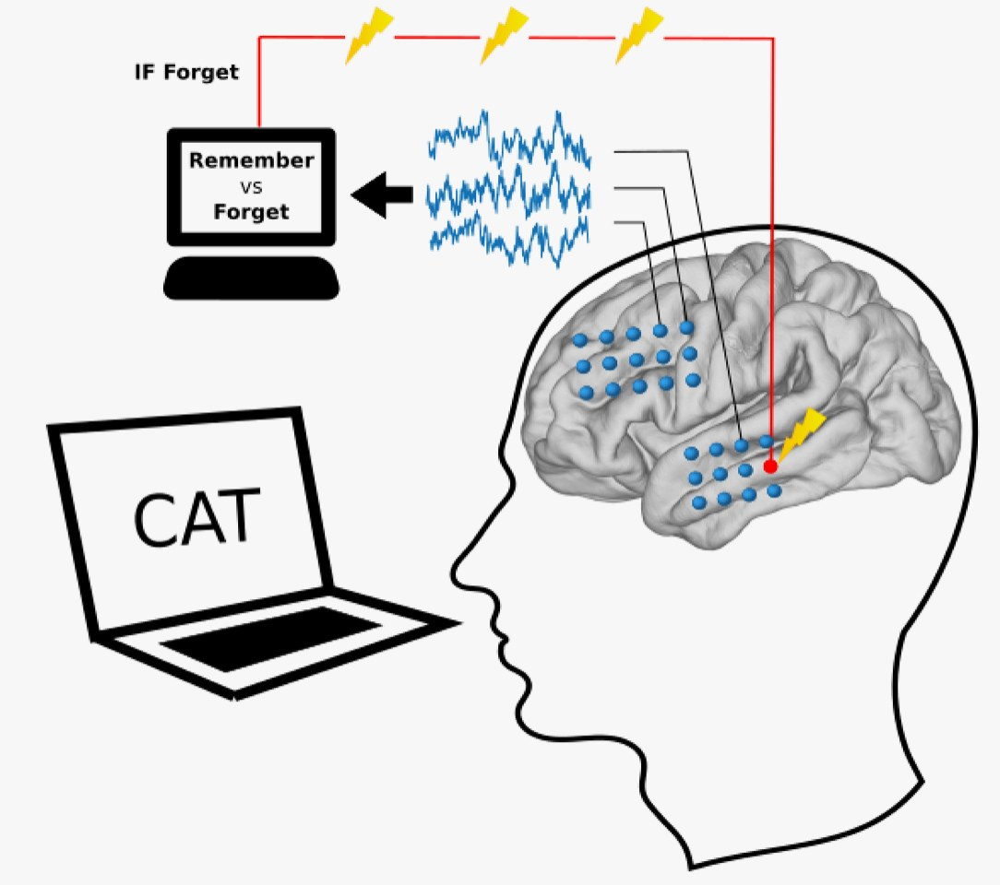

AI Just Learned How to Boost the Brain's Memory

# AI Just Learned How to Boost the Brain's Memory

![electricbrain-871025390-[Converted\].jpg](../_resources/c4ac46032fd80ca861e5f2d8517cc410.jpg)

By triggering precisely timed pulses of electricity to the brain, researchers can essentially use one black box to unlock the potential of another.

Denis Maliugin/Getty Images

When it comes to black boxes, there is none more black than the human brain. Our gray matter is so complex, scientists lament, that it can’t quite understand itself.

But if we can’t grok our own brains, maybe the machines can do it for us. [In the latest issue of *Nature Communications*](http://nature.com/articles/doi:10.1038/s41467-017-02753-0), researchers led by University of Pennsylvania psychologist Michael Kahana show that machine learning algorithms—[notoriously inscrutable systems themselves](https://www.wired.com/2016/05/the-end-of-code/)—can be used to decode and then enhance human memory. How? By triggering the delivery of precisely timed pulses of electricity to the brain.

Researchers, in other words, can use one black box to unlock the potential of another. Which on one hand sounds like a rather elegant solution to an absurdly difficult problem, and on the other sounds like the beginning of a techno-pocalypse horror flick.

When it comes to brain measurements, the best recordings come from inside the cranium. But people—and institutional review boards—aren’t usually amenable to cracking open skulls in the name of science. So Kahana and his colleagues collaborated with 25 epilepsy patients, each of whom had between 100 and 200 electrodes implanted in their brain (to monitor seizure-related electrical activity). Kahana and his team piggybacked on those implants, using the electrodes to record high-resolution brain activity during memory tasks.

Machine learning algorithms learned to associate patterns of electrode measurements with a patients' likelihood of memorizing a word.

Kahana et al.

First, the researchers got a sense of what it looks like when a brain memorizes stuff. As the patients read and attempted to internalize lists of words, Kahana and his team gathered thousands of voltage measurements per second from each of the implanted electrodes. Later, they tested the patients’ recall—building up data about which brain activity patterns were associated with remembering a word vs. forgetting it.

Then they did it again. And again. After two or three visits with each test subject, they'd collected enough training data to produce patient-specific algorithms that could predict which words each patient would likely remember—based on their electrode activity alone.

Here’s the kicker. These electrodes don’t just *read* neural activity; they can stimulate it, too. So the researchers tried prodding the brain to improve—or, as they put it, "rescue"—the formation of memories in real time. Every few seconds, the subject would see a new word, and the newly trained algorithm would decide whether the brain was ready to remember it. “A closed loop system lets us record the state of the subject's brain, analyze it, and decide whether to trigger a stimulation, all in a few hundred milliseconds," Kahana says.

And it worked. The researchers' system improved patients' ability to recall words by an average of 15 percent.

This isn’t the first time Kahana’s lab has explored the impacts of brain stimulation on memory. Last year, [the group showed](http://www.cell.com/current-biology/abstract/S0960-9822%2817%2930326-3) that electrode pulses seemed to improve or worsen recall, depending on when the researchers delivered them. In that study, test subjects scored higher when the researchers stimulated memory-specific regions of the brain during periods of low functionality (stimulation during high-functioning times had the opposite effect). It was a major finding, but therapeutically useless; the researchers could only identify the link between memory and brain states *after* the memory tests were performed. What you really want, from a brain-enhancement standpoint, is to deliver pulses in the middle of memorization.

Now, Kahana and his colleagues appear to have closed the loop with the help of their machine learning algorithm. "Only instead of using it to identify images of cats, we're using it to build a decoder—something that can look at electrical activity and say whether the brain is in a state that's conducive to learning," Kahana says. If the brain looks like it’s encoding memories effectively, the researchers leave it alone. If it isn't, their system quickly delivers electrical pulses to jostle it into a higher-functioning state—like a pacemaker for the brain.

"It's not a whomping effect, but it's definitely promising," says UC San Diego neuroscientist Bradley Voytek, who was unaffiliated with the study. The question now is whether future work in this area will yield better results. If patients' brains were implanted with more—and more precise—electrodes, algorithms could decode more neural signatures, with more specificity, on smaller time scales. More training data could help, too; most patients with epilepsy are only able to participate in studies like this one for a few weeks at most, which limits the time researchers can spend with them. A machine learning algorithm trained on more than three sessions might perform better than the ones in Kahana's latest study.

But even with higher resolution and more training data, scientists will need to grapple with the implications of using opaque algorithms to study—and manipulate—brains. The fact remains that while Kahana’s system can improve word recall in specific circumstances, he doesn’t know exactly *how* it’s improving function. That’s the nature of machine learning.

Luckily, Kahana's team has thought this through, and some algorithms are easier to scrutinize than others. For this particular study, the researchers used a simple linear classifier, which allowed them to draw some inferences about how activity at individual electrodes might contribute to their model's ability to discriminate between patterns of brain activity. "We can't really say at this point if there are interactions between the features that we’re using to record brain activity," says UPenn psychologist Youssef Ezzyat, who oversaw the study's machine learning analyses.

More complicated deep-learning techniques won't necessarily translate to bigger cognitive enhancements. But if they do, researchers could wind up struggling to make sense of the machines’ decision to deliver brain-boosting electrical impulses. Or—if they become truly diabolical—withhold them.

####  Related Video

Science

##### Neuroscientist Explains One Concept in 5 Levels of Difficulty

The Connectome is a comprehensive diagram of all the neural connections existing in the brain. WIRED has challenged neuroscientist Bobby Kasthuri to explain this scientific concept to 5 different people; a 5 year-old, a 13 year-old, a college student, a neuroscience grad student and a connectome entrepreneur.