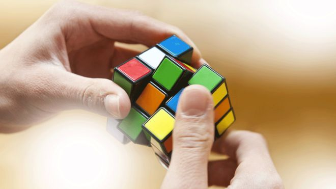

AI solves Rubik's Cube in one second

# AI solves Rubik's Cube in one second

- 16 July 2019

- [      Share this with Facebook](https://www.bbc.co.uk/news/technology-49003996#)

- [      Share this with Messenger](https://www.bbc.co.uk/news/technology-49003996#)

- [  ![](data:image/svg+xml,%3csvg xmlns='http://www.w3.org/2000/svg' class='extracted-svg ex-twitter js-evernote-checked' viewBox='-13 -15 44 44' enable-background='new 0 0 44 44' width='44px' height='44px' aria-hidden='true' focusable='false' data-evernote-id='998'%3e %3cg%3e%3cpath d='M5.80573373%2c15 C12.7721527%2c15 16.581877%2c9.22887915 16.581877%2c4.22385671 C16.581877%2c4.06002242 16.581877%2c3.89618812 16.5714931%2c3.73466135 C17.3122088%2c3.19816171 17.9525471%2c2.53359441 18.4602026%2c1.77326482 C17.7690988%2c2.08016568 17.0364595%2c2.28092039 16.28536%2c2.36976011 C17.0756874%2c1.89671742 17.6675677%2c1.15138674 17.9502395%2c0.274527115 C17.2072164%2c0.715264453 16.3938137%2c1.02678037 15.5457981%2c1.19407596 C14.1105174%2c-0.331198284 11.7118448%2c-0.405039095 10.1865706%2c1.0290879 C9.20241101%2c1.95440555 8.78590269%2c3.33315194 9.09049603%2c4.64844138 C6.04571636%2c4.4961447 3.20861397%2c3.05740266 1.28529161%2c0.691035437 C0.280364327%2c2.42167943 0.793788713%2c4.63574999 2.45751448%2c5.74682343 C1.85525036%2c5.72951699 1.26567764%2c5.56683646 0.738408105%2c5.27262698 L0.738408105%2c5.32108501 C0.739561868%2c7.12441605 2.00985456%2c8.67622684 3.77741896%2c9.03389326 C3.2201516%2c9.18618993 2.63519393%2c9.20811142 2.06754269%2c9.09850397 C2.56366064%2c10.6410847 3.98509624%2c11.6979313 5.60613279%2c11.7290828 C4.26430681%2c12.7824682 2.60750362%2c13.3547344 0.902242404%2c13.3535807 C0.601110348%2c13.3524269 0.299978293%2c13.3339667 7.10542736e-15%2c13.2982001 C1.73295152%2c14.4104273 3.74742113%2c15 5.80573373%2c14.9965387'%3e%3c/path%3e%3c/g%3e %3c/svg%3e)    Share this with Twitter](https://www.bbc.co.uk/news/technology-49003996#)

- [      Share this with Email](https://www.bbc.co.uk/news/technology-49003996mailto:?subject=Shared%20from%20BBC%20News&body=https%3A%2F%2Fwww.bbc.co.uk%2Fnews%2Ftechnology-49003996)

- [Share](https://www.bbc.co.uk/news/technology-49003996#share-tools)

     Image copyright  Getty Images

 Image caption   The Rubik's Cube is a puzzle challenging people to create six sides of a single colour

An artificial intelligence system created by researchers at the University of California has solved the Rubik's Cube in just over a second.

DeepCubeA, as the algorithm was called, completed the 3D logic puzzle which has been taxing humans since it was invented in 1974.

"It learned on its own," said report author Prof Pierre Baldi.

The researchers noted that its strategy was very different from the way humans tackle the puzzle.

"My best guess is that the AI's form of reasoning is completely different from a human's," said Prof Baldi, who is professor of computer science at University of California, Irvine.

The study, [published in Nature Machine Intelligence](https://www.nature.com/articles/s42256-019-0070-z.epdf?referrer_access_token=V_xdSLZcMc0NpPOK4qU5-dRgN0jAjWel9jnR3ZoTv0Osb8UCgUm5AQaSCMHWqWzspuy7oBsxRTU7jhKFTJ7Yw6OXuH4O6l8dYMFTi6WGbKd52pVGF25odDxVWZ1qmNizPtQspftcdC0PMDFynrF8Dad6PDlYDzCrDmmtdsMImvgSKlAQmNkGcFTPUbeFUbXPeQ_ZdtUpp24Fi1vonALZfDSm9Lb17omgOrWnOnh-REA%3D&tracking_referrer=www.theregister.co.uk), saw the algorithm given 10 billion different combinations of the puzzle, with the target to decode all of them within 30 moves.

It was then tested on 1,000 of these and managed to solve all of them, finding the shortest path to the solution about 60% of the time.

## 'Hefty goal'

Humans able to solve the puzzle quickly generally take about 50 moves. The AI system solved it in an average of 28 moves.

The computer algorithm is not the first or the fastest non-human to solve the puzzle. That honour goes to a system devised at the Massachusetts Institute of Technology, dubbed the min2phase algorithm, which solved the puzzle three times faster.

But crucially that system did not use a neural network - which mimics how the human brain works - or machine learning techniques and was programmed just to solve the puzzle.

[In 2018, researchers built a robot](https://www.bbc.co.uk/news/technology-43331049)that solved the puzzle in 0.38 seconds.

Creating a system that teaches itself to complete the challenge is seen as the first step towards creating an AI that can move beyond games to solve real-world problems.

"The solution to the Rubik's Cube involves symbolic, mathematical and abstract thinking, so a deep learning machine that can crack such a puzzle is getting closer to becoming a system that can think, reason, plan and make decisions," said Prof Baldi.

"How do we create advanced AI that is smarter, more robust and capable of reasoning, understanding and planning? This work is a step toward this hefty goal."