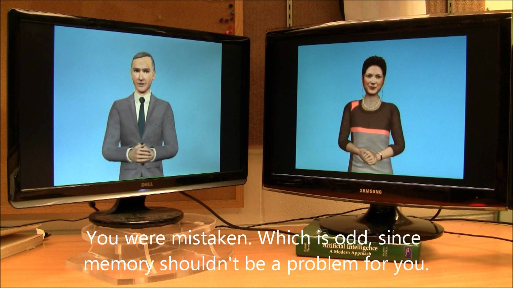

AI vs. AI. Two chatbots talking to each other

AI vs. AI. Two chatbots talking to each other
https://www.youtube.com/watch?v=WnzlbyTZsQY
[CornellCCSL](https://www.youtube.com/channel/UCPgIJMsnxPkiVhKlvwu70nA)
5,839,150 views views
Published on Aug 26, 2011

|     |
| --- |
| [(L)](https://www.youtube.com/watch?v=WnzlbyTZsQY) |

Description

Are you a Robot or a Unicorn? Let the world know: http://yosinski.com/IAmAUnicorn/

What happens when you let two bots have a conversation? We certainly never expected this... (More: [http://creativemachines.cornell.edu/A...](http://creativemachines.cornell.edu/AI-vs-AI))

By Igor Labutov, Jason Yosinski, and Hod Lipson of the Cornell Creative Machines Lab (http://creativemachines.cornell.edu/)

If you liked this, check out our site for evolving your own 3D shapes: [http://EndlessForms.com/](http://endlessforms.com/)