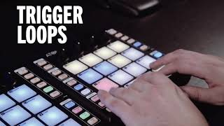
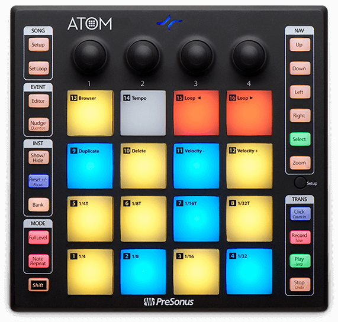
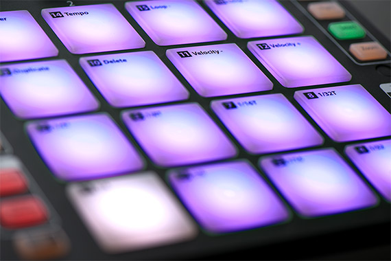
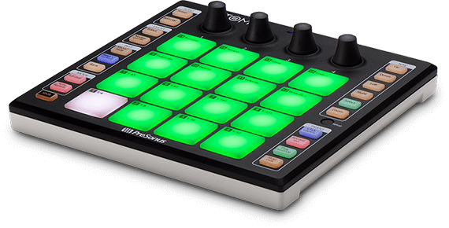

ATOM | PreSonus

# Portable, Versatile Production Controller

 ATOM: Production and Performance Pad Controller

# ATOM

- [ Overview](https://www.presonus.com/products/ATOM)  |

- [ Images and Videos](https://www.presonus.com/products/ATOM/media)  |

- [ Accessories](https://www.presonus.com/products/ATOM/accessories)  |

- [ Features](https://www.presonus.com/products/ATOM/features)  |

- [ Tech Specs](https://www.presonus.com/products/ATOM/tech-specs)  |

- [ Downloads](https://www.presonus.com/products/ATOM/downloads)  |

- [ Artists](https://www.presonus.com/products/ATOM/artists)  |

- [ Reviews](https://www.presonus.com/products/ATOM/reviews)  |

- [Buy Now](https://www.presonus.com/products/atom#obn)

## Fast, flexible, and feature-packed.

Produce beats, play virtual instruments, and trigger sound effects and loops with unsurpassed expressiveness and flexibility! Both a compact, dynamic performance controller and a tightly integrated production environment, PreSonus®’ ATOM pad controller and included Studio One® Artist production software let you create and perform with ease. The most versatile pad controller in its class, ATOM is compatible with most music software and lets you perform and produce with virtual instruments and trigger samples and loops in real-time, using 16 full-size, velocity- and pressure-sensitive RGB pads and 8 assignable pad banks.

## Produce quickly and easily in a tightly integrated environment.

ATOM connects to your computer via USB and is compatible with most music production and performance software but it is absolutely amazing when used with PreSonus Studio One. ATOM and Studio One integrate tightly so you can create quickly and easily. Enjoy blazingly fast, professional-style workflow with ATOM’s navigation, editing, and loop-point-creation features and transport controls.

[Learn more about ATOM’s tight integration with Studio One.](https://www.presonus.com/products/atom#)

## You’re in control.

ATOM puts you in control of your music production software. Trigger loops and effects and play virtual instruments with 16 full-size, velocity- and pressure-sensitive RGB pads. Eight assignable pad banks let you, for example, assign your entire virtual drum rack to each pad within each bank. MIDI Keyboard mode, Note Repeat mode, and Full Velocity mode enable you to custom control your instruments. And with 4 programmable rotary encoders and 20 assignable buttons, you can navigate and set more parameters faster.

## Bring ATOM out to play for a stunning live show.

Sure, ATOM is a great production pad controller but it’s an instrument controller too. Use the velocity- and pressure-sensitive pads to play your virtual instruments live, with incredible expressiveness. Set up pad banks for a full virtual drum set and perform beats that will energize any crowd. Even play multiple ATOMs at once to put on an exciting live show.

​

## Everything you need.

You’ll love ATOM’s expressive pads and flexible controls. Its tight integration with Studio One will open up your production environment and speed up your workflow, and you get a wealth of virtual instruments, loops, and drum kits with Studio One to fuel your creativity. But we wanted to give you more, so we worked with MVP Loops to deliver a carefully curated loop and one-shot library custom-designed for ATOM. Still not enough? You can buy even more content from the PreSonus Shop. Check out ATOM and Studio One at your favorite PreSonus dealer today!

## Studio One Artist makes recording a breeze.

No other recording and production software is this easy to learn and use, yet is capable of creating studio-quality output. Studio One® Artist lets you work quickly and stay focused on your inspiration and offers unlimited tracks and plug-ins. Access powerful editing tools without wading through menus. Load and save audio clips, MIDI files, and effects by drag-and-drop. Studio One makes it easy! Best of all, ATOM and Studio One integrate tightly so you can enjoy a blazingly fast, professional-style workflow.

[Read more about Studio One Artist.](https://www.presonus.com/products/Studio-One)

[Learn more about ATOM’s tight integration with Studio One.](https://www.presonus.com/products/atom#)

* * *

## What Artists Have to Say

 

### KATFYR

 

### MVP Loops

* * *

>

>   *> *>  PreSonus ATOM is not only a lightweight and portable drum pad controller but the perfect complement for beat production with Studio One 4. *> *>

>   *>  Tobias Homburger, > [>  Bonedo.de](https://www.bonedo.de/artikel/einzelansicht/presonus-atom-test.html)>   *>

>

>   *> *>  I’d highly recommend this unit to the singer-songwriter that needs to make quality demos, yet doesn’t have the space or means to record a full drum kit. *> *>

>   *>  Nick Ryan Piescor, > [>  American Songwriter](https://americansongwriter.com/2019/03/presonus-atom-review/)>   *>

>

>   *> *>  Für alle, die ohnehin schon mit Studio One arbeiten oder gar mit Studio One als DAW liebäugeln, heißt es: bedenkenlos zugreifen! *> *>

>   *>  Markus Galla, > [>  tools4music.de](https://www.presonus.com/products/atom)>   *>

>

>   *> *>  The Atom is very sturdy and the pads are great, it is of excellent build quality. *> *>

>   *>  Thorsten Meyer, > [>  StrongMocha](https://www.strongmocha.com/2019/01/08/presonus-atom-production-and-performance-pad-controller-by-presonus-review/)>   *>

>

>   *> *>  Die Arbeit mit „Studio One“ erleichtert es alle mal. Und das Arbeiten grade mit „Impact XT“ macht damit auch richtig Spaß. *> *>

>   *>  Klaus Feurich, > [>  Buenasideas](https://www.buenasideas.de/test/musikproduktion/hardware/testbericht-daw-controller-atom-von-presonus/)>   *>

>
>   *> *>  Von mir gibt es eine klare Kaufempfehlung! *> *>

>   *>  Martin Beurskens, > [>  digital-notes.de](http://www.digital-notes.de/testbericht-atom-pad-controller-von-presonus/)>   *>

>

>   *> *>  Mit dem Atom eine sehr dynamische Pad-Einheit, die sich dazu noch einfach bedienen lässt. *> *>

>   *>  Felix Thoma, > [>  Amazona.de](https://www.amazona.de/test-presonus-atom-pad-controller/)>   *>

>
>   *> *>  ...a little powerhouse of pad‑oriented control. *> *>

>   *>  Robin Vincent, > [>  Sound on Sound](https://www.soundonsound.com/reviews/presonus-atom)>   *>

>
>   *> *>  ATOM is a winner. *> *>

>   *>  SoundGuy, > [>  Gearslutz](https://www.gearslutz.com/board/reviews/1241027-presonus-atom-production-performance-pad-controller.html?highlight=ATOM#post13671648)>   *>

>

>   *> *>  Tweakheads and musicians alike will find the ATOM a real creativity booster. *> *>

>   *>  Mike Metlay, > [>  Recording magazine](https://www.presonus.com/products/atom)>   *>

>

>   *> *>  ...there are virtually limitless options for manipulating and playing sounds. *> *>

>   *>  David Larkin, > [>  Crossfadr](https://crossfadr.com/2019/05/20/presonus-atom-review/)>   *>

>

>   *> *>  A pure joy to use... if you own Studio One, just grab one of these and run. *> *>

>   *>  Alex Arsov, > [>  SoundBytes](http://soundbytesmag.net/atom-by-presonus/)>   *>

>

>   *> *>  Being able to indulge and audition your creative whims is a huge advantage for songwriters and producers. *> *>

>   *>  Sven-Erik Seaholm, > [>  San Diego Troubadour](https://sandiegotroubadour.com/2019/06/a-bonus-from-presonus-studio-one-4-5-and-atom-controller-pt-1/)>   *>

>

>   *> *>  Pairing [ATOM] with a Digital Audio Workstation as deeply featured and user friendly as Studio One Professional 4.5 creates a creative environment as formidable and affordable as any I can imagine. *> *>

>   *>  Sven-Erik Seaholm, > [>  San Diego Troubadour](https://sandiegotroubadour.com/2019/07/a-bonus-from-presonus-studio-one-4-5-and-atom-controller-pt-2/)>   *>

.

- 
- [Products](https://www.presonus.com/products)
- [Control Surfaces](https://www.presonus.com/products/Control-Surfaces)
- [ATOM Pad Controllers](https://www.presonus.com/products/ATOM-Pad-Controllers)
- [ATOM](https://www.presonus.com/products/ATOM)

### Follow PreSonus

- 

- 

- 

- 

### eNewsletter Signup

### Sitemap

- [Products](https://www.presonus.com/products)

- [Support](https://www.presonus.com/support)

- [Learn](https://www.presonus.com/learn)

- [Buy](https://www.presonus.com/buy)

- [Press Center](https://www.presonus.com/press)

- [About PreSonus](https://www.presonus.com/about)

### Support Resources

- [My.PreSonus](http://my.presonus.com/)
- [PreSonus Answers](http://answers.presonus.com/)

- [Community Forum](http://forums.presonus.com/)
- [Product Repairs](https://www.presonus.com/support/repairs)
- [Contact Support](https://www.presonus.com/support/Contact-Technical-Support)

### Popular Areas

- [Videos](https://www.presonus.com/videos/player)

- [PreSonus Blog](http://blog.presonus.com/)
- [PreSonus History](https://www.presonus.com/about/history)
- [Contact Us](https://www.presonus.com/about/contact-us)
- [Careers](https://www.presonus.com/about/careers)
- [Technical Articles](https://www.presonus.com/learn/technical-articles/getting-started-guides)

- [Privacy Policy](https://www.presonus.com/privacy-policy)|

- [Terms of Use](https://www.presonus.com/terms-of-use)|

- [End User License Agreement](https://www.presonus.com/EULA)|

- [Trademarks](https://www.presonus.com/trademarks)|

- [Louisiana Economic Development](https://www.presonus.com/about/Louisiana-Economic-Development)

 Copyright ©2019 PreSonus Audio Electronics, Inc. All Rights Reserved.

   Music is our life. PreSonus is our day job.