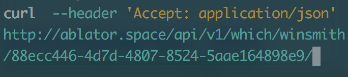
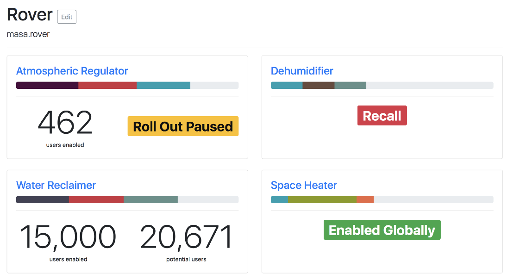
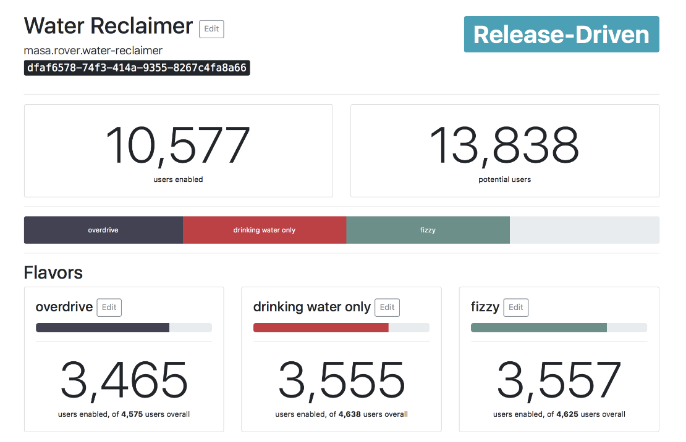
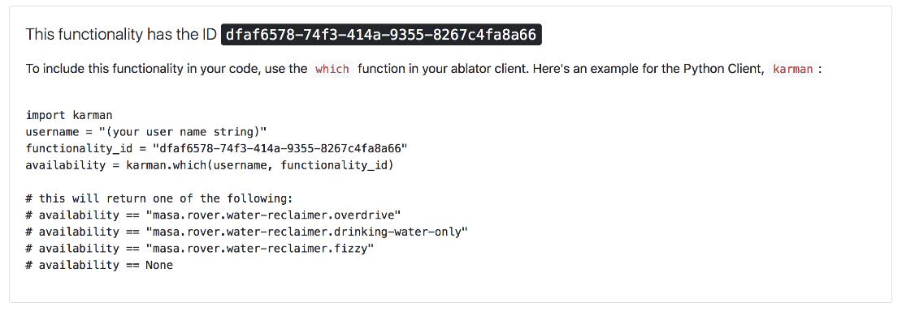

Ablator

 

#  Roll out at your own pace

Ablator is a Service that enables you to **roll out functionalities in a controlled way**, and perform **good A/B testing**.

#### Controlled Rollout

 **You have 40.000 users.** Do you want all of them to hit your server at once after that new update? If not, consider carefully and systematically releasing your new functionality with ablator.

#### A/B Testing

 **Your new app design could go two, three, many tasty ways.** Want to distribute each variant among your users and see how they are doing? ablator keeps track which user gets which flavor.

It works like this:

1. You define your app's switchable functionalities in ablator.

2. Your app asks ablator **"User X wants Functionality Y. Which Flavor should they get, if any?"**

3. ablator takes care of rolling out the feature in a way that you define.

As an administrator, you'll get a nice overview of what percentage of users has a functionality enabled. 😎

 [Register Now! It's free!](http://ablator.space/)

 [Check it out on GitHub](https://github.com/ablator/ablator/)  [Follow **@ablator_io** on Twitter](https://twitter.com/ablator_io)

## Try It Out BETA

For free even!

 **Ablator is in an extended Beta period where the service is fully usable, but the UI is a bit rough around the edges.** To iron everything out, and to let you [fearlessly try it without any commitment](http://ablator.space/), you can use the hosted version of ablator completely free of charge.

The software will always be open-source, and you will always be able to self-host it for free.

If you choose to use hosted ablator in the beta period, and want to switch to self-hosted at a later point, we'll do our best to help you migrate your data.

#### Come to Space!

The hosted version of ablator is at [ablator.space](http://ablator.space/)! You should try it out and then tell us how you like it! Your feedback is awesome!

 [Register at ablator.space BETA](http://ablator.space/)

 It's free and quite stable, but please be advised that we take no responsibilty for lost data at this point.

* * *

## You can access ablator from your App

Either use these libraries, or make a simple web request.

 

#### Python Library

The Python library for ablator is called [karman](https://github.com/ablator/karman) and is available on GitHub. It is in early beta and feature-complete.

 [Karman on GitHub](https://github.com/ablator/karman)

 

#### Swift Library

The Swift framework for ablator is called [shepard](https://github.com/ablator/shepard). Star ★ it on GitHub now, so you can follow along its development!

 [Shepard on GitHub](https://github.com/ablator/shepard)

 

#### Roll Your Own

Accessing the ablator API is a simple `GET` request to the server's `/which/feature_id/` path. Check out the [Readme](https://github.com/ablator/ablator/blob/master/README.rst#accessing-the-ablator-api) for more info!

 [Ablator on GitHub](https://github.com/ablator/ablator)

## Some Screenshots, for your viewing pleasure:

* * *

 
* * *

 
* * *

 
* * *

 