Accommodation

# Stay with us

##### A warm welcome, unforgettable views, caring hospitality

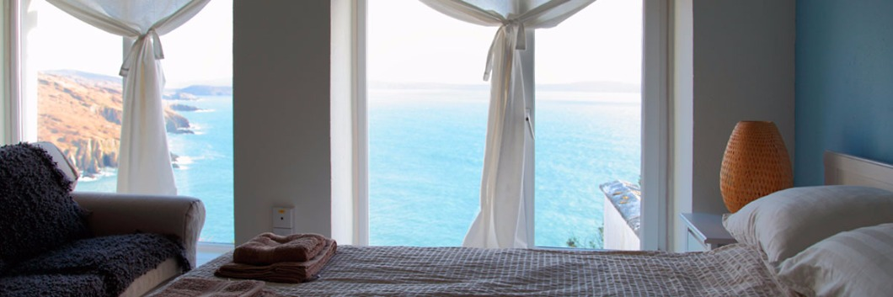

Our cottages and private conservatory rooms offer exceptional ocean views.

At the south-western tip of Europe, Dzogchen Beara isn’t the easiest place to get to but once you arrive you won’t want to leave.

Whether spending some contemplative time alone, or unwinding with friends or family, Dzogchen Beara has accommodation to suit you, including secluded clifftop cottages, private conservatory rooms and a budget hostel.

Enjoying a break from your busy life or extending your stay after a retreat, the Atlantic vista, peaceful atmosphere and wild natural surroundings make Dzogchen Beara ideal for rest, reflection and renewal.

Curled up on a couch by a wood-burning stove, watching the ever-changing light on the waves far below, relaxing in the gardens, meeting like-minded people in the friendly café, exploring the historic Beara Way, whale-watching or touring the Wild Atlantic Way; whatever you do or however long you stay we are sure that a break at Dzogchen Beara will give you memories to last a lifetime.

*Reflexology and Biodynamic Craniosacral Therapy sessions are available to guests by appointment.*

**Everyone is Welcome!

**We’re delighted to have been awarded the new Welcome Standard national quality mark.

**Accommodation bookings and information
**
[Book Accommodation Now](http://accommodation.dzogchenbeara.org/)

During retreats, the hostel and cottages are reserved for participants but the **Care Centre is open for bookings as usual**.

To book accommodation in the Care Centre during retreats and other events please contact the Administration Office at [info@dzogchenbeara.org]() or phone +353 (0)27 73 032 to book directly.

### Cottages

- 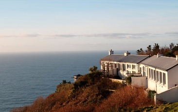
- 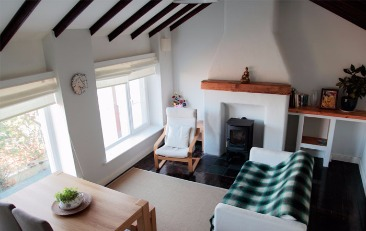
- 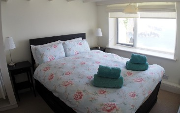
- 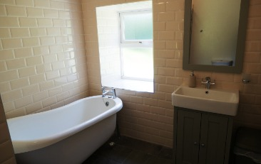



Our three secluded cliff-top cottages have been renovated to a high standard in the last year. All are spectacularly situated with breathtaking views over the Atlantic Ocean. Each cottage has a fully equipped kitchen and large living room.

[Find out more](http://www.dzogchenbeara.org/cottages/)

### The Care Centre

- 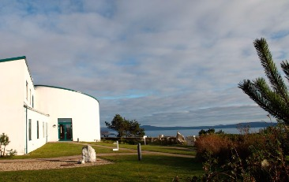
- 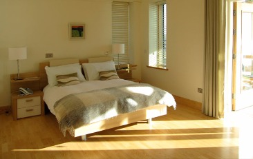
- 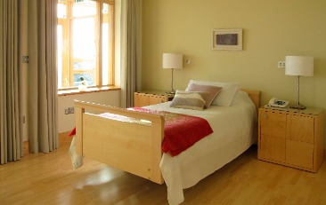
- 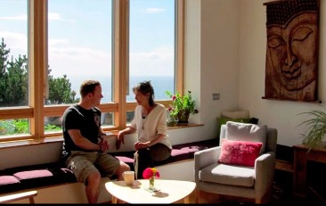
- 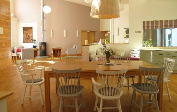
- 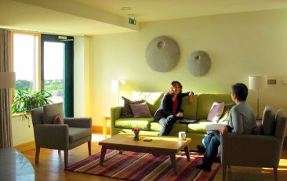



Conservatory rooms, twins or doubles, all fully accessible in a building designed for space and comfort. Come and stay to relax and revitalise yourself or avail of a planned supportive Care Break.

[Find out more](http://www.dzogchenbeara.org/private-rooms/)

### Hostel

- 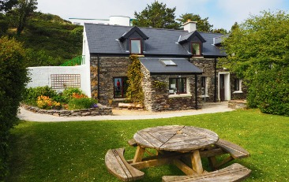
- 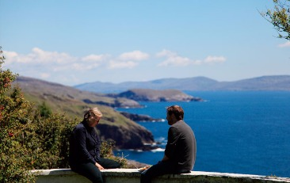
- 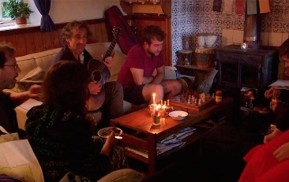
- 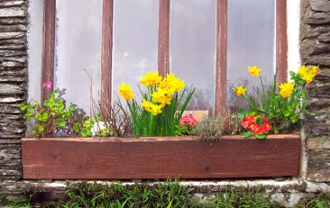



The hostel offers dormitory and family room accommodation. The building was sensitively renovated this year to provide improved comfort, safety and economy while preserving the unique character of the farmhouse which we all love so well!

[Find out more](http://www.dzogchenbeara.org/hostel/)