Advantages of Using R Notebooks For Data Analysis Instead of Jupyter Notebooks

# Advantages of Using R Notebooks For Data Analysis Instead of Jupyter Notebooks

*June 6, 2017[**](https://www.facebook.com/share.php?u=http://minimaxir.com/2017/06/r-notebooks/)[**](http://twitter.com/home/?status=Advantages%20of%20Using%20R%20Notebooks%20For%20Data%20Analysis%20Instead%20of%20Jupyter%20Notebooks%20-%20http://minimaxir.com/2017/06/r-notebooks/%20-%20via%20@minimaxir)  [** 162](http://www.linkedin.com/shareArticle?mini=true&title=&url=http://minimaxir.com/2017/06/r-notebooks/)  *

[Jupyter Notebooks](http://jupyter.org/), formerly known as [IPython Notebooks](https://ipython.org/notebook.html), are ubiquitous in modern data analysis. The Notebook format allows statistical code and its output to be viewed on any computer in a logical and *reproducible* manner, avoiding both the confusion caused by unclear code and the inevitable “it only works on my system” curse.

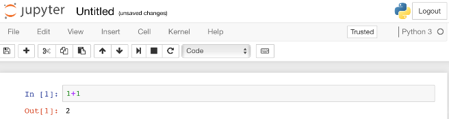

In Jupyter Notebooks, each block of Python input code executes in its own cell, and the output of the block appears inline; this allows the user to iterate on the results, both to make the data transformations explicit and to and make sure the results are as expected.

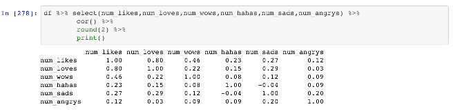

In addition to code blocks, Jupyter Notebooks support [Markdown](https://en.wikipedia.org/wiki/Markdown) cells, allowing for more detailed write-ups with easy formatting. The final Notebook can be exported as a HTML file displayable in a browser, or the raw Notebook file can be shared and [rendered](https://github.com/blog/1995-github-jupyter-notebooks-3) on sites like [GitHub](https://github.com/). Although Jupyter is a Python application, it can run kernels of [non-Python languages](https://irkernel.github.io/), such as [R](https://www.r-project.org/).

Over the years, there have a been a few new competitors in the reproducible data analysis field, such as [Beaker Notebook](http://beakernotebook.com/features) and, for heavy-duty business problems, [Apache Zeppelin](https://zeppelin.apache.org/). However, today we’ll look at the relatively new [R Notebooks](http://rmarkdown.rstudio.com/r_notebooks.html), and how they help improve the workflows of common data analysis in ways Jupyter Notebooks can’t without third-party extensions.

## About R Notebooks

R Notebooks are a format maintained by [RStudio](https://www.rstudio.com/), which develops and maintains a large number of open source R packages and tools, most notably the free-for-consumer RStudio R IDE. More specifically, R Notebooks are an extension of the earlier [R Markdown](http://rmarkdown.rstudio.com/)  `.Rmd` format, useful for rendering analyses into HTML/PDFs, or other cool formats like [Tufte handouts](http://rmarkdown.rstudio.com/tufte_handout_format.html) or even [books](https://bookdown.org/). The default output of an R Notebook file is a `.nb.html` file, which can be viewed as a webpage on any system. ([RPubs](https://rpubs.com/) has many examples of R Notebooks, although I recommend using [GitHub Pages](https://pages.github.com/) to host notebooks publicly).

Instead of having separate cells for code and text, a R Markdown file is all plain text. The cells are indicated by three backticks and a gray background in RStudio, which makes it easy to enter a code block, easy to identify code blocks at a glance, and easy to execute a notebook block-by-block. Each cell also has a green indicator bar which shows which code is running and which code is queued, line-by-line.

For Notebook files, a HTML webpage is automatically generated whenever the file is saved, which can immediately be viewed in any browser (the generated webpage stores the cell output and any necessary dependencies).

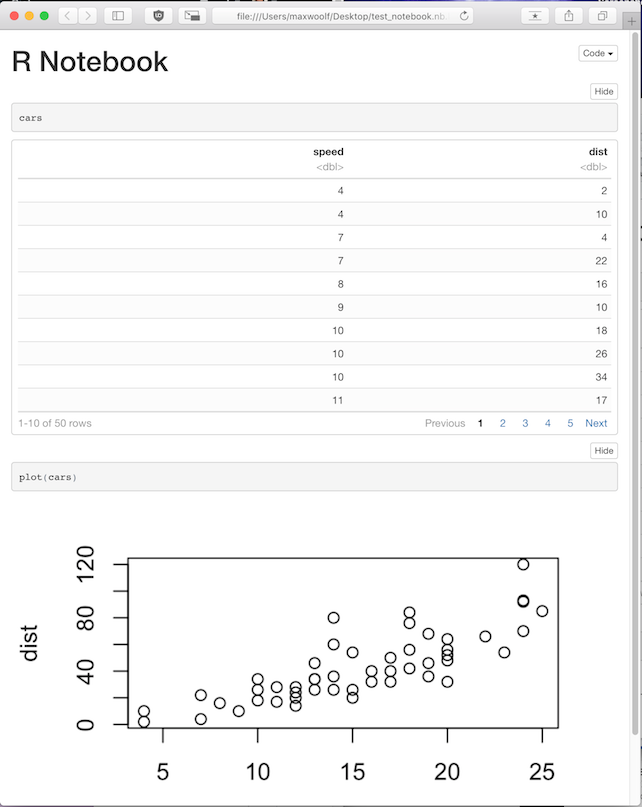

R Notebooks can only be created and edited in RStudio, but this is a case where tight vertical integration of open-source software is a good thing. Among many other features, RStudio includes a file manager, a function help, a variable explorer, and a project manager; all of which make analysis much easier and faster as opposed to the browser-only Jupyter.

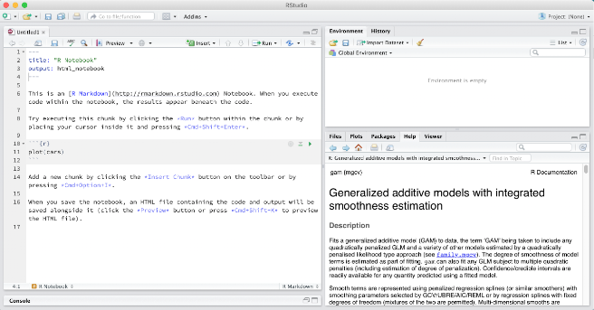

I’ve made many, many Jupyter Notebooks and R Notebooks [over the years](http://minimaxir.com/data-portfolio), which has given me insight into the strengths and weaknesses of both formats. Here are a few native features of R Notebooks which present an objective advantage over Jupyter Notebooks, particularly those not highlighted in the documentation:

## Version Control

Version control of files with tools such as [git](https://en.wikipedia.org/wiki/Git) is important as it both maintains an explorable database of changes to the code files and also improves collaboration by using a centralized server (e.g. GitHub) where anyone with access to the repository can pull and push changes to the code. In the data science world, large startups such as [Stripe](https://stripe.com/blog/reproducible-research) and [Airbnb](https://medium.com/airbnb-engineering/scaling-knowledge-at-airbnb-875d73eff091) have seen a lot of success with this approach.

RStudio incidentally has a native git client for tracking and committing changes to a `.Rmd` file, which is easy since `.Rmd` files are effectively plain text files where you can see differences between versions at a per-line level. (You may not want to store the changes to the generated `.nb.html` Notebook since they will be large and redundant to the changes made in the corresponding `.Rmd`; I recommend adding a `*.nb.html` rule to a `.gitignore` file during analysis).

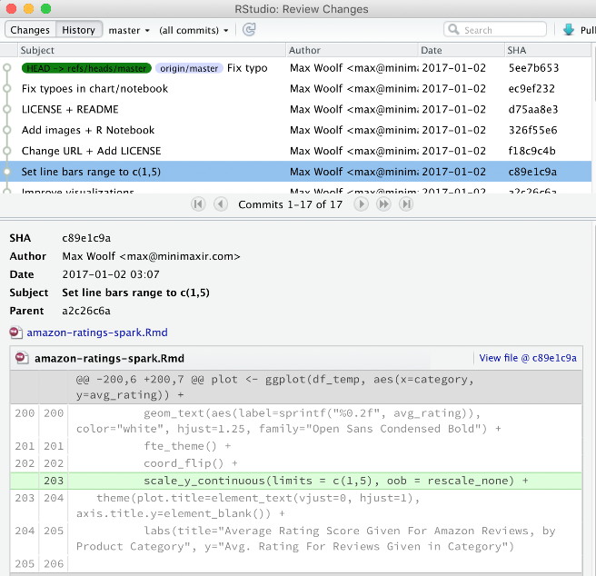

The `.ipynb` Jupyter Notebook files are blobs of JSON that also store cell output, which will result in large diffs if you keep them in version control and make any changes which result in different output. This can cause the git database to balloon and makes reading per-line diffs hard if not impossible.

On Hacker News, the version control issues in Jupyter are [a common complaint](https://news.ycombinator.com/item?id=14034341), however a Jupyter developer noted of a possibility of [working with RStudio](https://news.ycombinator.com/item?id=14035158) on solving this issue.

## Inline Code Rendering

A common practice in Jupyter Notebooks is to print common values as a part of a write-up or testing statistical code. In Jupyter Notebooks, if you want to verify the number of rows in a dataset for exploratory data analysis, you have to add an appropriate print statement to the cell to get the number `n` rows, and then add a Markdown cell to redundantly describe what you just print in the output.

In R Notebooks, you can skip a step by calling such print statements in-line in the Markdown text, which will then be rendered with the Notebook. This also avoids hard-coding such numbers in the Markdown text if you change the data beforehand (e.g. parameter tuning) or if the values are nontrivial to calculate by hand.

For example, these lines of R Markdown from my [Reddit First Comment Notebook](http://minimaxir.com/notebooks/first-comment/):

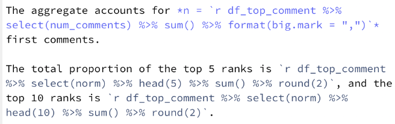
translate into:
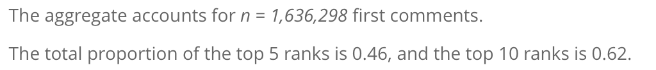

## Metadata

R Notebooks are configured with a [YAML](http://yaml.org/) header, which can include common attributes such as title, author, date published, and other relevant options. These fields will then be configured correctly in the metadata for HTML/PDF/Handouts output. Here’s an example from [one of my notebooks](http://minimaxir.com/notebooks/amazon-spark/):

	---
	title: "Playing with 80 Million Amazon Product Review Ratings Using Apache Spark"
	author: "Max Woolf (@minimaxir)"
	date: "January 2nd, 2017"
	output:
	  html_notebook:
	    highlight: tango
	    mathjax: null
	    number_sections: yes
	    theme: spacelab
	    toc: yes
	    toc_float: yes
	---

Said metadata features are [often requested but unimplemented](https://github.com/ipython/ipython/issues/6073) in Jupyter.

## Notebook Theming

As noted in the example metadata above, R Notebooks allow extensive theming. Jupyter Notebooks do [support themes](https://github.com/dunovank/jupyter-themes), but with a third-party Python package, or placing custom CSS in an [odd location](https://stackoverflow.com/a/32158550).

Like Jupyter Notebooks, the front-end of browser-based R Notebooks is based off of the [Bootstrap](http://getbootstrap.com/) HTML framework. R Notebooks, however, allow you to natively select the style of code syntax highlighting via `highlight` (similar options as [pygments](https://help.farbox.com/pygments.html)) and also the entire Bootstrap theme via `theme` (with a selection from the excellent [Bootswatch](https://bootswatch.com/) themes by [Thomas Park](https://twitter.com/thomashpark)), giving your Notebook a unique look without adding dependencies.

## Data Tables

When you print a data frame in a Jupyter Notebook, the output appears as a standard *boring* HTML table:

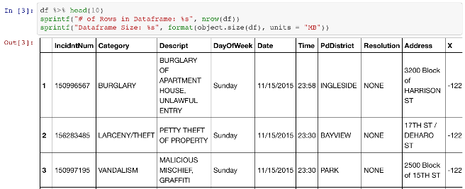

No cell block output is ever truncated. Accidentally printing an entire 100,000+ row table to a Jupyter Notebook is a mistake you only make *once*.

R Notebook tables are pretty tables with pagination for both rows and columns, and can support large amounts of data if necessary.

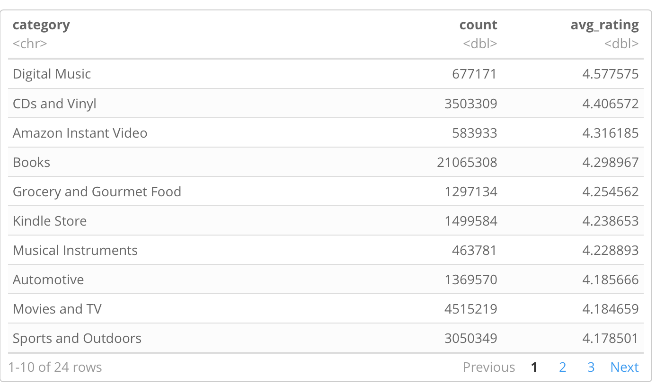

The R Notebook output table also includes the data type of the column, which is helpful for debugging unexpected issues where a column has an unintended data type (e.g. a numeric `<dbl>` column or a datetime `<S3: POSIXct>` column is parsed as a text-based `<chr>` column).

## Table of Contents

A Table of Contents always helps navigating, particularly in a PDF export. Jupyter Notebooks [requires an extension](https://github.com/minrk/ipython_extensions) for a ToC, while R Notebooks will natively create one from section headers (controllable via `toc` and `number_sections`). An optional `toc_float` parameter causes the Table of Contents to float on the left in the browser, making it always accessible.

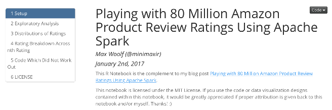

In conclusion, R Notebooks haven’t received much publicity since the benefits aren’t immediately obvious, but for the purpose of reproducible analyses, the breadth of native features allows for excellent utility while avoiding dependency hell. Running R in an R Notebook is a significantly better experience than running R in a Jupyter Notebook. The advantages present in R Notebooks can also provide guidance for feature development in other Notebook software, which improves the data analysis ecosystem as a whole.

However, there’s an elephant in the room…

## What About Python?

So you might be thinking “an R Notebook forces you to use R, but *serious* data science work is done using Python!” Plot twist: you can use Python in an R Notebook!

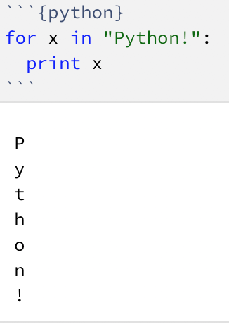

Well, sort of. The Python session ends after the cell executes, making it unhelpful for tasks other than *ad hoc* scripts.

The topic on whether R or Python is better for data analysis is a [common](https://news.ycombinator.com/item?id=14056098)  [religious](https://news.ycombinator.com/item?id=13239530)  [flamewar](https://news.ycombinator.com/item?id=12301996) topic which is best saved for a separate blog post (tl;dr: I disagree with the paraphrased quote above in that both languages have their advantages and you’ll benefit significantly from knowing both ecosystems).

And I wouldn’t count R out of “serious data science”. You can use R [seamlessly](http://spark.rstudio.com/) with big data tools like [Apache Spark](https://spark.apache.org/), and R can [now](https://rstudio.github.io/keras/) use [Keras](https://keras.io/)/[TensorFlow](https://www.tensorflow.org/) for deep learning with near-API-parity to the Python version. *Hmm*.

I am currently **looking for a job** in data analysis/software engineering in San Francisco. If you liked this post and have a lead, feel free to [shoot me an email](http://minimaxir.com/2017/06/r-notebooks/mailto:max@minimaxir.com).

Since I currently do not have a full-time salary to subsidize my machine learning/deep learning/software/hardware needs for these blog posts, I have set up a [Patreon](https://www.patreon.com/minimaxir), and any monetary contributions to the Patreon are appreciated and will be put to good creative use.

Share this article[**](http://twitter.com/home/?status=Advantages%20of%20Using%20R%20Notebooks%20For%20Data%20Analysis%20Instead%20of%20Jupyter%20Notebooks%20-%20http://minimaxir.com/2017/06/r-notebooks/%20-%20via%20@minimaxir)  [** 162](http://www.linkedin.com/shareArticle?mini=true&title=&url=http://minimaxir.com/2017/06/r-notebooks/)

- [2 comments]()
- [**minimaxir**](https://disqus.com/home/forums/minimaxir/)
- [Login](https://disqus.com/embed/comments/?base=default&f=minimaxir&t_i=http%3A%2F%2Fminimaxir.com%2F2017%2F06%2Fr-notebooks%2F&t_u=http%3A%2F%2Fminimaxir.com%2F2017%2F06%2Fr-notebooks%2F&t_d=Advantages%20of%20Using%20R%20Notebooks%20For%20Data%20Analysis%20Instead%20of%20Jupyter%20Notebooks&t_t=Advantages%20of%20Using%20R%20Notebooks%20For%20Data%20Analysis%20Instead%20of%20Jupyter%20Notebooks&s_o=default#)
- [1](https://disqus.com/home/inbox/)
- [ Recommend  2](https://disqus.com/embed/comments/?base=default&f=minimaxir&t_i=http%3A%2F%2Fminimaxir.com%2F2017%2F06%2Fr-notebooks%2F&t_u=http%3A%2F%2Fminimaxir.com%2F2017%2F06%2Fr-notebooks%2F&t_d=Advantages%20of%20Using%20R%20Notebooks%20For%20Data%20Analysis%20Instead%20of%20Jupyter%20Notebooks&t_t=Advantages%20of%20Using%20R%20Notebooks%20For%20Data%20Analysis%20Instead%20of%20Jupyter%20Notebooks&s_o=default#)
- [⤤  Share](https://disqus.com/embed/comments/?base=default&f=minimaxir&t_i=http%3A%2F%2Fminimaxir.com%2F2017%2F06%2Fr-notebooks%2F&t_u=http%3A%2F%2Fminimaxir.com%2F2017%2F06%2Fr-notebooks%2F&t_d=Advantages%20of%20Using%20R%20Notebooks%20For%20Data%20Analysis%20Instead%20of%20Jupyter%20Notebooks&t_t=Advantages%20of%20Using%20R%20Notebooks%20For%20Data%20Analysis%20Instead%20of%20Jupyter%20Notebooks&s_o=default#)
- [Sort by Best](https://disqus.com/embed/comments/?base=default&f=minimaxir&t_i=http%3A%2F%2Fminimaxir.com%2F2017%2F06%2Fr-notebooks%2F&t_u=http%3A%2F%2Fminimaxir.com%2F2017%2F06%2Fr-notebooks%2F&t_d=Advantages%20of%20Using%20R%20Notebooks%20For%20Data%20Analysis%20Instead%20of%20Jupyter%20Notebooks&t_t=Advantages%20of%20Using%20R%20Notebooks%20For%20Data%20Analysis%20Instead%20of%20Jupyter%20Notebooks&s_o=default#)

Join the discussion…

- [Attach](https://disqus.com/embed/comments/?base=default&f=minimaxir&t_i=http%3A%2F%2Fminimaxir.com%2F2017%2F06%2Fr-notebooks%2F&t_u=http%3A%2F%2Fminimaxir.com%2F2017%2F06%2Fr-notebooks%2F&t_d=Advantages%20of%20Using%20R%20Notebooks%20For%20Data%20Analysis%20Instead%20of%20Jupyter%20Notebooks&t_t=Advantages%20of%20Using%20R%20Notebooks%20For%20Data%20Analysis%20Instead%20of%20Jupyter%20Notebooks&s_o=default#)

###### Log in with

-
-
-
-

######  or sign up with Disqus

?

### Disqus is a discussion network

- Disqus never moderates or censors. The rules on this community are its own.
- Don't be a jerk or do anything illegal. Everything is easier that way.

[Read full terms and conditions](https://docs.disqus.com/kb/terms-and-policies/)

-

    - [−](https://disqus.com/embed/comments/?base=default&f=minimaxir&t_i=http%3A%2F%2Fminimaxir.com%2F2017%2F06%2Fr-notebooks%2F&t_u=http%3A%2F%2Fminimaxir.com%2F2017%2F06%2Fr-notebooks%2F&t_d=Advantages%20of%20Using%20R%20Notebooks%20For%20Data%20Analysis%20Instead%20of%20Jupyter%20Notebooks&t_t=Advantages%20of%20Using%20R%20Notebooks%20For%20Data%20Analysis%20Instead%20of%20Jupyter%20Notebooks&s_o=default#)
    - [*⚑*](https://disqus.com/embed/comments/?base=default&f=minimaxir&t_i=http%3A%2F%2Fminimaxir.com%2F2017%2F06%2Fr-notebooks%2F&t_u=http%3A%2F%2Fminimaxir.com%2F2017%2F06%2Fr-notebooks%2F&t_d=Advantages%20of%20Using%20R%20Notebooks%20For%20Data%20Analysis%20Instead%20of%20Jupyter%20Notebooks&t_t=Advantages%20of%20Using%20R%20Notebooks%20For%20Data%20Analysis%20Instead%20of%20Jupyter%20Notebooks&s_o=default#)

 [germ](https://disqus.com/by/germ65/)    •  [19 days ago](http://minimaxir.com/2017/06/r-notebooks/#comment-3352427326)

Rather marginal arguments for R notebooks, at the cost of having to use a proprietary app to edit and create them--and, can't use Python properly, a non-starter.

The Jupyter project also has a similar effort, called jupyter lab:

[https://github.com/jupyterl...](https://disq.us/url?url=https%3A%2F%2Fgithub.com%2Fjupyterlab%2Fjupyterlab%3AlGq4_J35tgAjjghg6STG3tTXOo4&cuid=660018)

    -

        - [−](https://disqus.com/embed/comments/?base=default&f=minimaxir&t_i=http%3A%2F%2Fminimaxir.com%2F2017%2F06%2Fr-notebooks%2F&t_u=http%3A%2F%2Fminimaxir.com%2F2017%2F06%2Fr-notebooks%2F&t_d=Advantages%20of%20Using%20R%20Notebooks%20For%20Data%20Analysis%20Instead%20of%20Jupyter%20Notebooks&t_t=Advantages%20of%20Using%20R%20Notebooks%20For%20Data%20Analysis%20Instead%20of%20Jupyter%20Notebooks&s_o=default#)
        - [*⚑*](https://disqus.com/embed/comments/?base=default&f=minimaxir&t_i=http%3A%2F%2Fminimaxir.com%2F2017%2F06%2Fr-notebooks%2F&t_u=http%3A%2F%2Fminimaxir.com%2F2017%2F06%2Fr-notebooks%2F&t_d=Advantages%20of%20Using%20R%20Notebooks%20For%20Data%20Analysis%20Instead%20of%20Jupyter%20Notebooks&t_t=Advantages%20of%20Using%20R%20Notebooks%20For%20Data%20Analysis%20Instead%20of%20Jupyter%20Notebooks&s_o=default#)

 [Durand](https://disqus.com/by/durand1/)    [*>* germ](http://minimaxir.com/2017/06/r-notebooks/#comment-3352427326)  •  [16 days ago](http://minimaxir.com/2017/06/r-notebooks/#comment-3358148254)

Rstudio is mostly open source, actually.

- [Powered by Disqus](https://disqus.com/)
- [*✉*Subscribe*✔*](https://disqus.com/embed/comments/?base=default&f=minimaxir&t_i=http%3A%2F%2Fminimaxir.com%2F2017%2F06%2Fr-notebooks%2F&t_u=http%3A%2F%2Fminimaxir.com%2F2017%2F06%2Fr-notebooks%2F&t_d=Advantages%20of%20Using%20R%20Notebooks%20For%20Data%20Analysis%20Instead%20of%20Jupyter%20Notebooks&t_t=Advantages%20of%20Using%20R%20Notebooks%20For%20Data%20Analysis%20Instead%20of%20Jupyter%20Notebooks&s_o=default#)
- [*d*Add Disqus to your site](https://publishers.disqus.com/engage?utm_source=minimaxir&utm_medium=Disqus-Footer)
- [*🔒*Privacy](https://help.disqus.com/customer/portal/articles/1657951?utm_source=disqus&utm_medium=embed-footer&utm_content=privacy-btn)

#### Author

**Max Woolf (@minimaxir)** is a [former](http://minimaxir.com/2017/05/leaving-apple/) Apple Software QA Engineer living in San Francisco and a Carnegie Mellon University graduate.

In his spare time, Max uses [Python](https://www.python.org/) to gather data from public APIs and [ggplot2](http://ggplot2.org/) to plot plenty of pretty charts from that data.

You can learn more about Max [here](http://minimaxir.com/about), view his data analysis portfolio [here](http://minimaxir.com/data-portfolio), or view his coding portfolio [here](http://minimaxir.com/portfolio).

- [**](https://facebook.com/max.woolf)
- [**](https://twitter.com/minimaxir)
- [**](https://linkedin.com/in/minimaxir)
- [**](http://minimaxir.com/2017/06/r-notebooks/mailto:max@minimaxir.com)
- [**](https://github.com/minimaxir)
- [**](https://youtube.com/minimaxir)
- [**](http://minimaxir.com/rss.xml)

#### Recent Posts

##### [Predicting the Success of a Reddit Submission with Deep Learning and Keras](http://minimaxir.com/2017/06/reddit-deep-learning/)

Jun 26, 2017

##### [The Decline of Imgur on Reddit and the Rise of Reddit's Native Image Hosting](http://minimaxir.com/2017/06/imgur-decline/)

Jun 20, 2017

##### [Benchmarking CNTK on Keras: is it Better at Deep Learning than TensorFlow?](http://minimaxir.com/2017/06/keras-cntk/)

Jun 12, 2017

##### [Advantages of Using R Notebooks For Data Analysis Instead of Jupyter Notebooks](http://minimaxir.com/2017/06/r-notebooks/)

Jun 6, 2017

##### [Leaving Apple Inc.](http://minimaxir.com/2017/05/leaving-apple/)

May 4, 2017

##### [Pretrained Character Embeddings for Deep Learning and Automatic Text Generation](http://minimaxir.com/2017/04/char-embeddings/)

Apr 4, 2017

#### GitHub Code Repositories

##### [Big List of Naughty Strings](http://github.com/minimaxir/big-list-of-naughty-strings)

** 20,142+

##### [Facebook Page Post Scraper](http://github.com/minimaxir/facebook-page-post-scraper)

** 1,035+

##### [Multiplatform System Dashboard](http://github.com/minimaxir/system-dashboard)

** 100+

##### [Tritonize](http://github.com/minimaxir/tritonize)

** 9+

##### [Stylistic Word Clouds](http://github.com/minimaxir/stylistic-word-clouds)

** 30+

##### [Pretrained Character Embeddings for Deep Learning and Automatic Text Generation](http://github.com/minimaxir/char-embeddings)

** 8+

##### [Get GitHub Profile Data of All Stargazers of a GitHub Repo](http://github.com/minimaxir/get-profile-data-of-repo-stargazers)

** 15+

##### [Copy Syntax Highlight for OS X](http://github.com/minimaxir/copy-syntax-highlight-osx)

** 349+

##### [Convert Video to GIF on OS X](http://github.com/minimaxir/video-to-gif-osx)

** 262+

#### Data Analysis Notebooks

##### [The Decline of Imgur on Reddit and the Rise of Reddit's Native Image Hosting](http://minimaxir.com/notebooks/imgur-decline/)

** R, ggplot2

##### [Benchmarking CNTK on Keras: is it Better at Deep Learning than TensorFlow?](http://minimaxir.com/notebooks/keras-cntk/)

** R, ggplot2

##### [Pretrained Character Embeddings for Deep Learning and Automatic Text Generation](http://minimaxir.com/notebooks/char-tsne/)

** R, ggplot2

##### [Predicting And Mapping Arrest Types in San Francisco](http://minimaxir.com/notebooks/predicting-arrests/)

** R, ggplot2, LightGBM

##### [Playing with 80 Million Amazon Product Review Ratings](http://minimaxir.com/notebooks/amazon-spark/)

** R, ggplot2, Spark

##### [How to Create an Interactive WebGL Network Graph](http://minimaxir.com/notebooks/interactive-network/)

** R, ggplot2, plotly

##### [What Percent of the Top-Voted Comments in Reddit Threads Were Also 1st Comment?](http://minimaxir.com/notebooks/first-comment/)

** R, ggplot2

##### [Processing Clusters of Clickbait Headlines](https://github.com/minimaxir/clickbait-cluster/blob/master/fb_news_53D_spark.ipynb)

** Python, Spark, word2vec

##### [Visualizing Clusters of Clickbait Headlines](https://github.com/minimaxir/clickbait-cluster/blob/master/fb_news_53D_plotly.ipynb)

** R, plotly

**Max Woolf (@minimaxir)** is a [former](http://minimaxir.com/2017/05/leaving-apple/) Apple Software QA Engineer living in San Francisco and a Carnegie Mellon University graduate.

In his spare time, Max uses [Python](https://www.python.org/) to gather data from public APIs and [ggplot2](http://ggplot2.org/) to plot plenty of pretty charts from that data.

You can learn more about Max [here](http://minimaxir.com/about), view his data analysis portfolio [here](http://minimaxir.com/data-portfolio), or view his coding portfolio [here](http://minimaxir.com/portfolio).

- [**](https://facebook.com/max.woolf)
- [**](https://twitter.com/minimaxir)
- [**](https://linkedin.com/in/minimaxir)
- [**](http://minimaxir.com/2017/06/r-notebooks/mailto:max@minimaxir.com)
- [**](https://github.com/minimaxir)
- [**](https://youtube.com/minimaxir)
- [**](http://minimaxir.com/rss.xml)

 Copyright © 2017 Max Woolf. All Rights Reserved. minimaxir.com is powered by Jekyll and GitHub Pages.