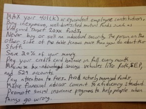

Advice to Alex M

# Advice to Alex M

April 27, 2013 By [Harold Pollack](http://www.samefacts.com/author/harold/)

[(L)](http://www.samefacts.com/2013/04/uncategorized/advice-to-alex-m/attachment/advice_to_alexm/)

Alex M commented on my last post: *What *is* this simple free best personal finance advice that fits on a 3×5 card? It’s kind of a tease to say it’s so easy and then not go ahead and spell it out in twenty seconds.*

This is a pretty reasonable quick response, artistically rendered. (My daughter observes that I used a 4×6 card. It still would fit.)

*Addendum: Rights to this picture belong to Harold Pollack. My book with Helaine Olen, based on the card, may be found [here](http://www.amazon.com/The-Index-Card-Personal-Complicated/dp/1591847680) and [here](http://www.barnesandnoble.com/w/the-index-card-helaine-olen/1121731446).*

*This picture may be reproduced on a blog as long as my ownership is acknowledged and a link is posted to the original and to one of the above two book links.*

Filed Under: [Everything Else](http://www.samefacts.com/category/everything-else/) Tagged With: [Medicare](http://www.samefacts.com/tag/medicare/)