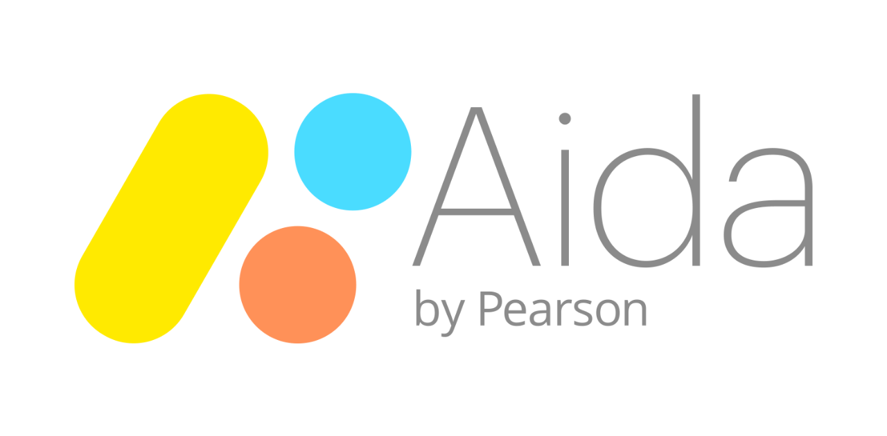
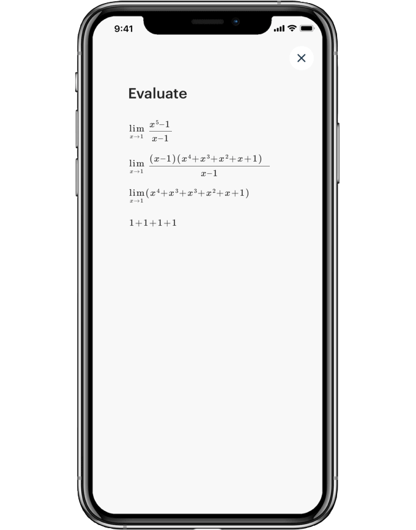
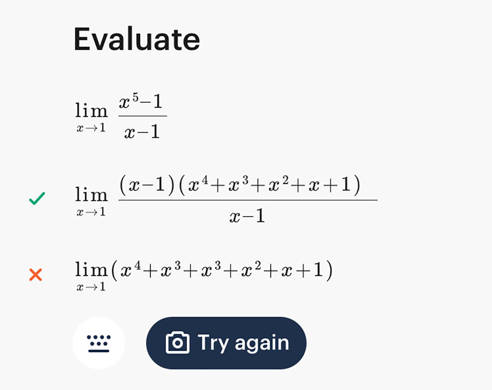
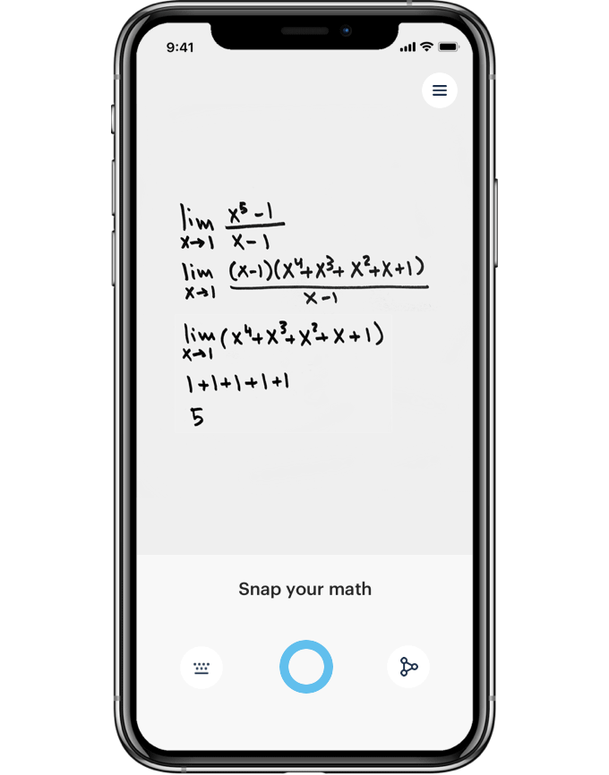
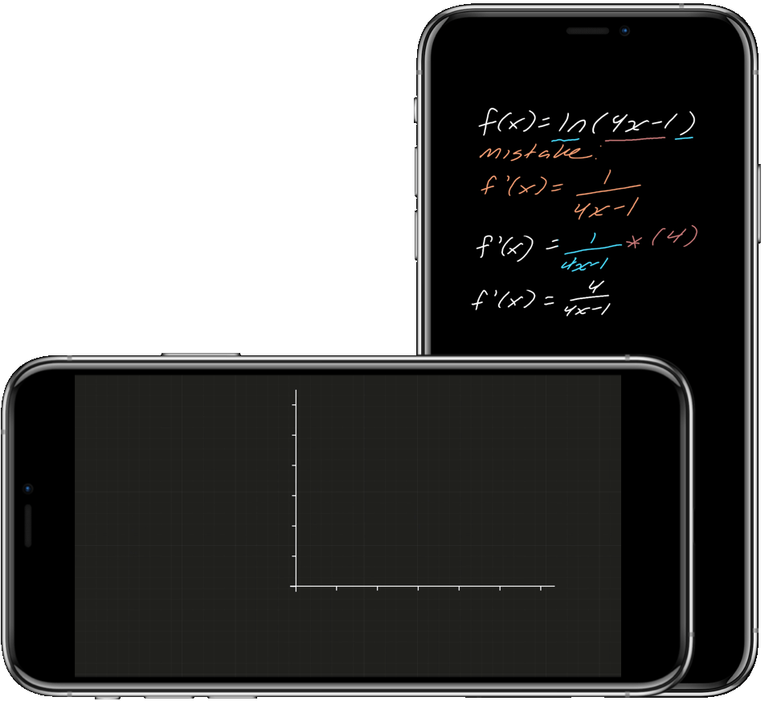
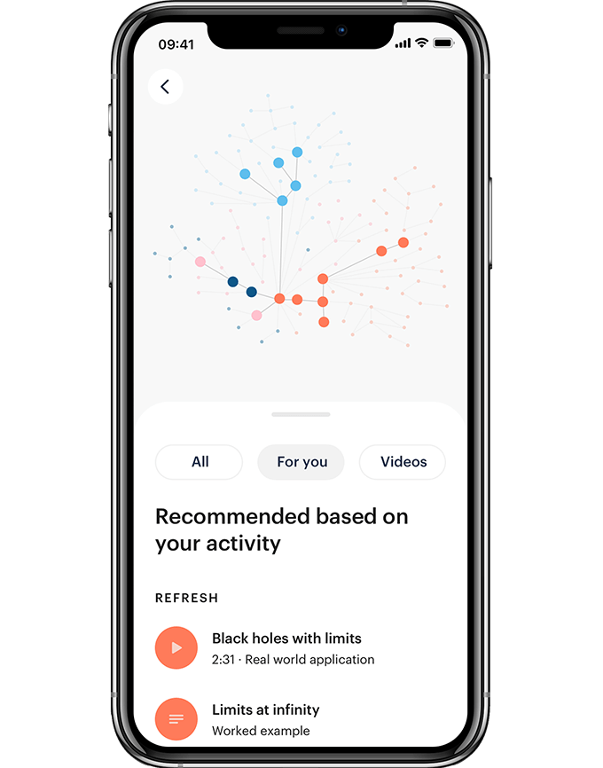

Aida by Pearson: Calculus tutoring with homework help

[Skip to main content](https://www.pearson.com/us/higher-education/products-services-teaching/learning-engagement-tools/aida.html#main-content)

[*Pearson***](https://www.pearson.com/us/)

- [Higher Education](https://www.pearson.com/us/higher-education.html)
- [Products & Services for Teaching](https://www.pearson.com/us/higher-education/products-services-teaching.html)
- [Learning & Engagement Tools](https://www.pearson.com/us/higher-education/products-services-teaching/learning-engagement-tools.html)
- Aida Calculus tutoring app

 

 

##### Stuck on derivatives? Lost on limits? Aida™ Calculus is the first tutoring app that not only guides you to the answer—it helps you understand how you got there.

#### Try it for free for the rest of the year

  

## Tackle calculus with confidence

Whatever your goals—medicine, engineering, teaching—crushing calculus is often the first step. Don’t let today’s homework stand in your way. The limit does not exist.

 

## Check your steps

Aida uses AI to pinpoint which steps you nailed and which you need to work on.

 

## Make it personal

The more you use Aida, the more it adapts to your strengths and weaknesses.

 

## Save time searching

Aida's video library serves up extra help instantly, whenever you need it.

## Go beyond the final answer

Get more out of your homework with these tutoring resources.

 

## Feedback on your work

There’s more than one way to get to the right answer. Aida analyzes your work, identifies any incorrect steps, and guides you through the solution. Got it right? Aida tells you that, too.

  

## Help that’s a snapshot away

Get instant feedback when you take a picture of your handwritten work with your iPhone. Use this feature while it’s in Beta and help Aida learn while it helps you. If Aida doesn’t capture your math perfectly, just use the app’s keyboard to correct your submission.

  

## Videos that explain and explore

No more wasting time searching for the right video. With 200+ to choose from, you can follow an instructor solving a similar problem, learn how calculus can be used to identify black holes, and much more.

 

## Study suggestions customized for you

Not sure how to prepare for your next exam? As you tackle more problems, Aida adapts—and highlights which concepts and resources you should study first.

## Aida is here

## [See how Aida is changing digital learning](https://www.pearson.com/corporate/news/artificial-intelligence.html)

## Get started with Aida

Try it for free for the rest of the year

- [Terms of Use](https://www.pearson.com/us/terms-of-use.html)

- [Privacy Statement](https://www.pearson.com/us/privacy-statement.html)

- [Patent Notice](https://www.pearson.com/us/patent-notice.html)

- [Accessibility](https://www.pearson.com/us/accessibility.html)

- Copyright © 1996–2019  [Pearson](https://www.pearson.com/) All rights reserved.

