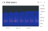
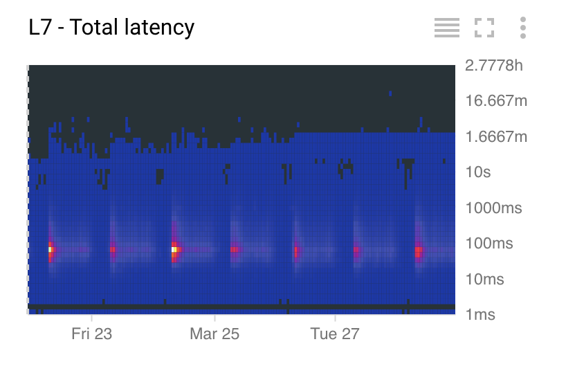
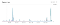

Alerting the API way – Google Cloud Platform — Community – Medium

# Alerting the API way

After working on a project for over a year, having it role-out smoothly is a nice thing to experience. Having your application built on-top of an array of managed stable services relieves you from a lot of the operational burdens: It still amazes me that I can upgrade the Google Kubernetes Engine cluster just with a few clicks without having to worry about downtime. It’s like having your engine replaced while you are driving.

HTTP load balanser latency

Still, building a cloud native application doesn’t mean that you don’t have to think about monitoring and alerting. In contrast you should think from day one about your logging, metrics and monitoring. As we are running on the Google Cloud platform we did deep integration with Stackdriver in our micro-services: Tracing, Logging, ErrorReporting and Custom Metrics (everything nicely correlated through the trace id) and on-top of that the Cloud Endpoints proxy. Stackdriver also automatically collects all the infrastructure metrics (Load balancer, Kubernetes Engine, Firewall, Compute, etc).

Now that you have all those data points you want to be alerted when anomalies occur. Although it’s nice that you can create and alert through the user interface, you will soon discover that an alert needs to be created, copied, changed slightly and created again, over and over again… just because it’s the same type of alert on a different resource. We were looking for a tidy and error prone way to create alerts, so you can imaging I was really happy to discover that now an alerting API is available.

Once you prototyped your alert in the UI, it’s possible to get and duplicate the alert policy on similar resources through the API. Now you can even start thinking of having your templated alert checked-in in a git repository.

Below a few ideas an alerting API can be used for:

**Managing different environments / different customers** : you have a test, staging and production environment. Instead of developing and testing your alerts on a development cluster and copy them over to the production environment you can write some code to manage your alerts in templates and apply those to the different environments.

**Cloud Dataflow health check patterns**: as a long time [Cloud Dataflow](https://cloud.google.com/dataflow/) user we notice two patterns that we can check on to see if the pipeline is running smoothly: exceptions in the logs and system lag in the dataflow. We even topped it off with the backlog size of the Pub/Sub subscription. To achieve this, we have a script discover the pipelines that are running and add a custom log metric on the number of exceptions and alerts on them. Next to this, we also create an additional alert on the system lag.

**Microservices**: We can query kubernetes for the deployments and see through labels or annotations what resources it uses where we can create an alert for.

I’ve given three examples but I can imagine you can find a dozen more. Feel free to leave an idea in the comments. If you want to dive a bit deeper in the alerting world, I advice to read the [alerting chapter](https://landing.google.com/sre/book/chapters/practical-alerting.html) in the Site Reliability Engineering book. While you’re at it, just read the complete book, it’s definitely worth it.

> Note: from June 30th, 2018 the basic tier will have all the same alerting capabilities as the Stackdriver premium tier, giving you more notification channels. The alerting API is currently soft launched, meaning you have to look in the documentation to find it :-)

Have fun alerting.