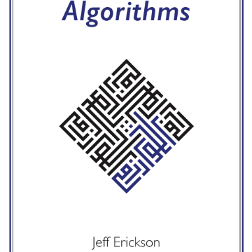

Algorithms by Jeff Erickson

Algorithms by Jeff Erickson

http://jeffe.cs.illinois.edu/teaching/algorithms/

Algorithms by Jeff Erickson 0th edition (prepublication draft), December 2018 This web page contains a free electronic version of my (soon to be) self-published textbook Algorithms , along with other lecture notes I have written for various theoretical computer science classes at the University of Illinois, Urbana-Champaign since 1998. More information Get the book More algorithms lecture notes Models of computation notes Report an error (separate page) Coursework archive (separate page) More Information Publication.