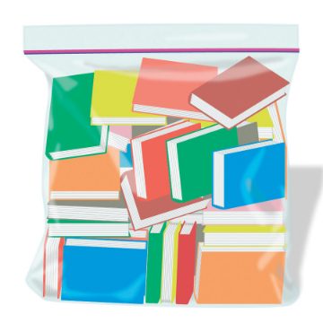

All Those Books You’ve Bought but Haven’t Read? There’s a Word for That

All Those Books You’ve Bought but Haven’t Read? There’s a Word for That

https://www.nytimes.com/2018/10/08/books/review/personal-libraries.html?fallback=0&recId=1BpcDKmXlomndYVj2KqG5eqyQDW&locked=0&geoContinent=EU&geoRegion=RDB&recAlloc=thompson_sampling_home&geoCountry=GB&blockId=home-living-vi&imp_id=691449100&action=click&module=Smarter%20Living&pgtype=Homepage

Most of us own books we’ve read and books we haven’t. Kevin Mims considers the importance of owning books we’ll never get around to finishing.