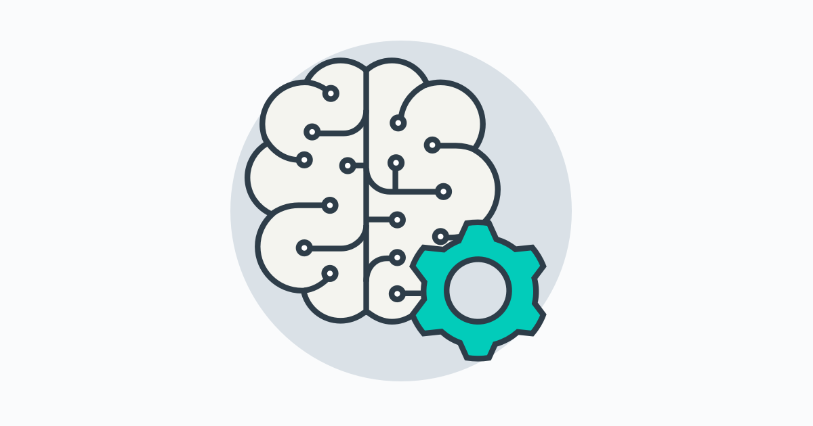
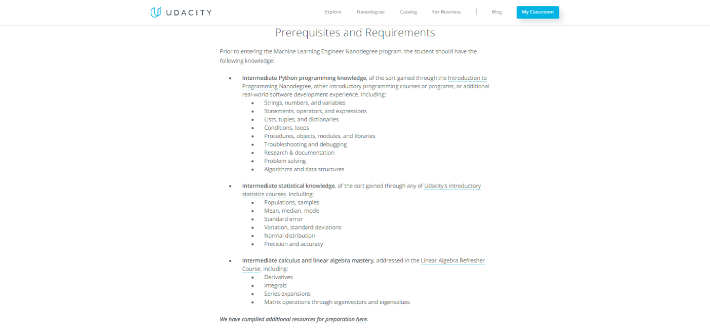
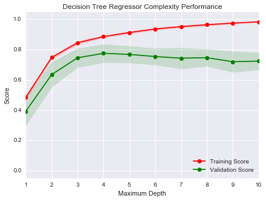
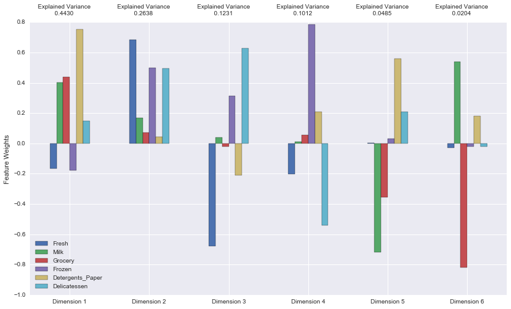
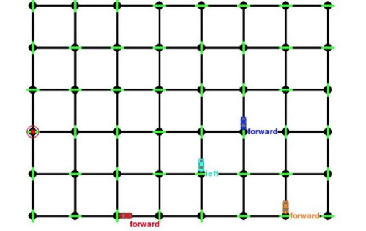
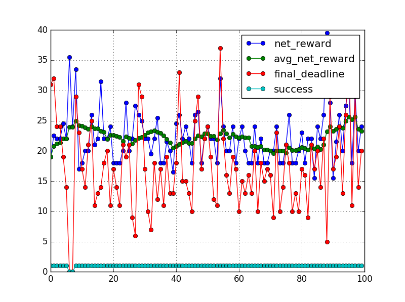
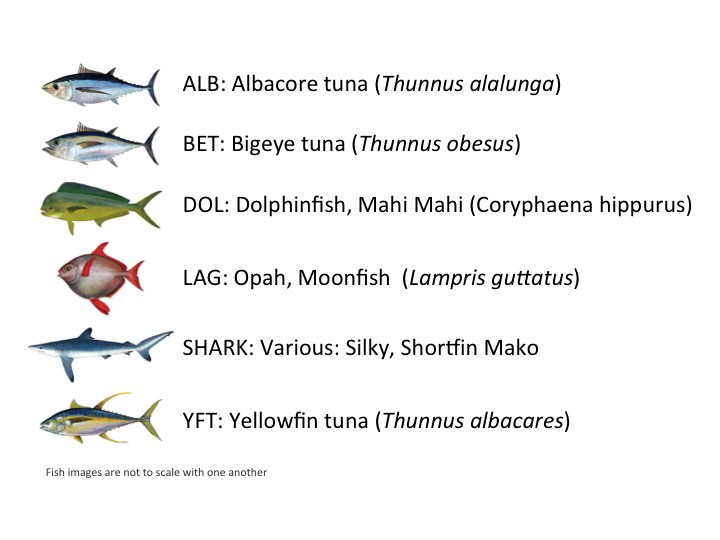
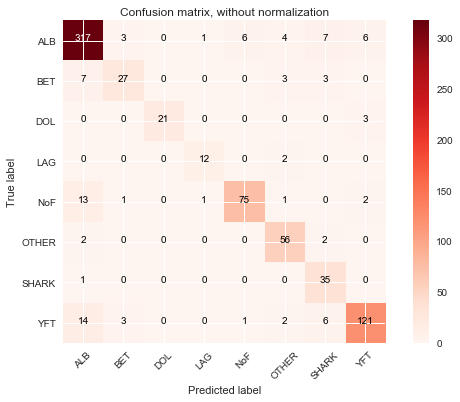
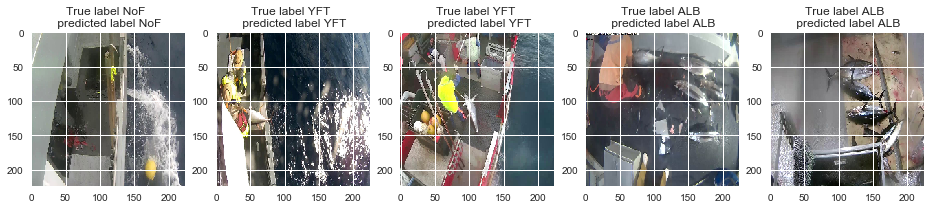
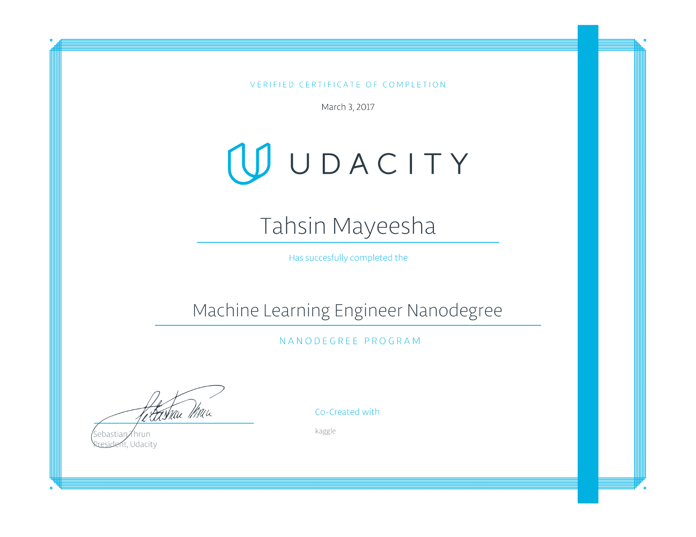

All about the Udacity Machine Learning Nanodegree Program, from a New Graduate!

# All about the Udacity Machine Learning Nanodegree Program, from a New Graduate!

I graduated from Udacity’s [Machine Learning Engineer Nanodegree](https://www.udacity.com/course/machine-learning-engineer-nanodegree--nd009)(MLND) program last March. I will share my experience with the platform and the people in this article to help future students.

### Overview

Udacity is an online education platform focused on teaching technical skills. It has diverse courses like web/mobile development, digital marketing, and product design. Udacity uses interactive bite-size lessons, in-lecture quizzes, and projects for teaching students.

Udacity has a long history of offering education in machine learning. Udacity’s founder Sebastian Thrun also founded Google X, and led their self- driving team. [“Intro to Artificial Intelligence”](https://www.udacity.com/course/intro-to-artificial-intelligence--cs271) was one of their first courses.

A regular degree from a university takes around 4 years to complete. A regular degree also has a few core courses, some electives, and some open-ended projects. Regular degrees provide certification to signal that the student is ready to work in a field.

A Nanodegree program is like a regular degree in the sense that it also has some core parts and electives. But the timeline for a Nanodegree program is much smaller, around 6–12 months. (hence the word ‘nano’). Udacity partners with different companies like [Kaggle](https://www.udacity.com/degrees/machine-learning-engineer-nanodegree--nd009), [Facebook](https://www.udacity.com/course/data-visualization-and-d3js--ud507), and [Google](https://www.udacity.com/course/deep-learning--ud730) for creating courses. Each Nanodegree program finishes with a capstone project. Students apply their knowledge gained in the coursework to the capstone in novel ways. Udacity offers many different tracks including [data analyst](https://www.udacity.com/degrees/data-analyst-nanodegree--nd002), [front end](https://www.udacity.com/degrees/front-end-web-developer-nanodegree--nd001), [machine learning](https://www.udacity.com/degrees/machine-learning-engineer-nanodegree--nd009) and more.

The latest programs are the [Self-Driving Car Engineer](https://www.udacity.com/drive), [Artificial Intelligence Engineer](https://www.udacity.com/ai) and [Robotics Nanodegree](https://www.udacity.com/robotics) programs. I enrolled in the machine learning track because I wanted a good foundation before moving onto the advanced ones.

### My Background

I started undergrad in Software Engineering, University of Waterloo. Then I came back to Bangladesh for family reasons. I took a year long gap before starting university again. I started studying Computer Science in a private university here after the break. I got interested in data science after learning about the field from Quora and other resources.

During my gap year, and prior to enrolling in the Machine Learning Nanodegree program, I took many MOOCs on different topics, offered by providers such as [Coursera](http://coursera.org/), [Udacity](http://udacity.com/), and [EdX](http://edx.org/). I started studying data science from [The Analytics Edge](https://www.edx.org/course/analytics-edge-mitx-15-071x-3)provided by MITx. I also took many other courses including:

- •[Networked Life](https://www.class-central.com/mooc/336/coursera-networked-life)from Upenn.
- •[Networks, crowds and markets](https://www.edx.org/course/networks-crowds-markets-cornellx-info2040x-2) from Cornell.
- •[Social Network Analysis f](https://www.class-central.com/mooc/338/coursera-social-network-analysis)rom UMichigan
- •[Social Psychology](https://www.class-central.com/mooc/555/coursera-social-psychology), [A beginners guide to irrational behavior](https://www.class-central.com/mooc/424/coursera-a-beginner-s-guide-to-irrational-behavior)

as well as many more in arts and humanities. I learned Python from [CodeAcademy](https://www.codecademy.com/learn/python) , Udacity's "[Intro to Computer Science",](https://www.udacity.com/course/intro-to-computer-science--cs101)and “[Intro to Programming.”](https://in.udacity.com/course/intro-to-programming--ud000/) I also studied some additional material from Coursera.

Note that I was a full time student in Computer Science at this point, so I was confident about my coding skills. I had gaps in my stats and math background though.

In June of 2016, I learned of a scholarship for the Machine Learning Nanodegree program (MLND), and decided to apply. I had finished [Dataquest’s](http://dataquest.io/) guided projects, Udacity’s descriptive and inferential statistics, and most of the “Intro to Data Analysis” course before applying, to get better in math.

### Scholarship

I ended up being offered a 6-month scholarship to enroll in the MLND program from Udacity. I started doing the MLND around July 1st. I’ve documented how I got the scholarship in this article linked below.

[**I’m starting Udacity Machine Learning Nanodegree(for free!)** *Udacity recently held a “Udacity Transcend Award” where the scholarship receivers will be able to do their chosen…*medium.com](https://medium.com/learning-machine-learning/im-starting-udacity-machine-learning-nanodegree-for-free-32628763d890)[(L)](https://medium.com/learning-machine-learning/im-starting-udacity-machine-learning-nanodegree-for-free-32628763d890)

### Prerequisites

Udacity lists their prerequisites on the MLND homepage. Students should know fundamentals of Python, linear algebra, and some probability and statistics before starting.

### Program Structure

The Machine Learning Nanodegree program is made up of 6 technical projects including one capstone. Each project has video lectures and in-lecture quizzes for practice. The quizzes can be mathematical or programming-based depending on the lesson. Udacity describes the Nanodegree projects in the syllabus on the homepage.

Each project has its own rubric. Reviewers grade projects based on these rubrics. Students can submit as many times as they like. Project submission is either via Github repository or zipped files. After submitting each project it goes to the queue for review. Students get notification by email after reviewing.

There are also five optional career projects for the Nanodegree students, all of which are mandatory for Nanodegree Plus students; the ‘Plus’ is an enhanced version of the program that includes a job guarantee after graduation. Career projects include resume review, Github, LinkedIn review, and technical interviewing.

I took the general version with the scholarship, so I have not done the career projects. But I’ve studied them and implemented many of the guidelines.

### General Projects

I’ll briefly cover my version of the syllabus, excluding the deep learning project. But my own capstone was on image classification, so it works out. General projects are meant for teaching, so they often contain some template code for beginners.

#### P0 : Titanic Survival Exploration

This is an optional project using the [Titanic dataset](https://www.kaggle.com/c/titanic)from Kaggle. It’s a classification problem where we have to predict the survival outcome of passengers. There are many features like gender, passenger class, and port of embarkation here. It’s supposed to get students familiar with the submission and review cycle.

#### **P1: Predicting Boston Housing Prices**

This is one of the mandatory projects. It uses supervised learning techniques to predict the price of houses in the Boston area. It’s a classic dataset from the [UCI Machine Learning Repository](https://archive.ics.uci.edu/ml/datasets/Housing) . The lessons focus on building familiarity with numpy and pandas for data analysis. Some theory like splitting datasets, cross validation, evaluation metrics for classification, and regression are also discussed here. The goal is to choose the best performing model from many options and get familiar with hyper-parameter tuning.

Decision Tree performance at different depth

#### **P2 : Building a Student Intervention System**

This is a classification problem where the task is to identify students who might need early intervention before they fail to graduate. Lessons cover some popular approaches like naive bayes, decision tree and random forest, nearest neighbor, svm, and neural networks. Students are expected to select and compare different supervised learning models and choose the best performing one.

To complete this project, I opted to rely largely on outside resources, and used the Udacity lessons primarily as a guideline for what to cover. In the current version this project has already been replaced by a new one.

#### P3: Creating Customer Segments

Unsupervised learning techniques like PCA and clustering are explored here with the [wholesale customers dataset](https://archive.ics.uci.edu/ml/datasets/Wholesale+customers)from the UCI repository. The goal is to apply PCA to construct a lower dimensional feature space and use different clustering techniques like Gaussian and k-means clustering to segment the customers.

PCA components after applying transformation

#### P4: Train a Smartcab to Drive

The lessons in this project focus on reinforcement learning. The goal is to take a smartcab from a starting point to an end point by giving it feedback through reinforcement learning. The smartcab operates in a grid-like city with other agents. In each trial the smartcab gets assigned an end point goal and has to move there from a given random start point.

I’ve implemented a Q-learning algorithm to teach the smartcab how to reach the goal state while avoiding other agents and avoiding penalties. A penalty is given when the smartcab violates a traffic law or collides with other agents. Each trial also has a time limit. If the smartcab fails to reach the goal-point within the time limit that trial will be considered a failure.

Cars moving in the grid. Red car is the agent smartcab.

Results for the final implementation of Q-learning after parameter tuning.

### Capstone

The capstone is the final technical project in the MLND. It’s divided into two parts: proposal and project implementation. Students are supposed to choose a technical problem from a domain they are interested in, write-up a proposal, solve the problem using machine learning techniques, and submit a final report for the project.

I worked on the [Kaggle Nature Conservancy Fishery Monitoring competition](https://www.kaggle.com/c/the-nature-conservancy-fisheries-monitoring/) using [Keras](http://keras.io/) for my capstone. It was a multi-class image classification problem.The metric of evaluation was log-loss. The data was collected by the [conservancy](https://www.conserveca.org/campaign/transforming-the-last-tuna-stronghold). They used video cameras in fishing boats to collect footage and converted them to images by taking snapshots.

6 out of 8 classes of fish. The last 2 are “no fish” and “other”

After some research I found transfer learning is a popular method for approaching image classification problems. Transfer learning refers to the process of using the weights of a pre-trained network trained on a large dataset applied to a different dataset. Training a neural network from scratch is computationally expensive. As the pre-trained network already knows how to identify lower level features such as edges, lines, and curves, using the weights from it helps to converge to a good score faster than training from scratch.

I used a modified VGG-16 model for this competition to extract the features from the convolutional layers and trained a fully connected layer on top of it with batch normalization. I ranked around the top 45% in part 1 of the competition.

confusion matrix for the final classification model

This competition had only 3500+ training images in part 1. I had to use data augmentation to generate more images. Data augmentation alters our training data by applying random rotations, cropping, flipping, and shifting to prevent overfitting. Keras interface is easy to use and provides many functionalities for preprocessing and data augmentation during training, so I mostly followed their documentation and tutorials for implementation.

Randomly chosen instances where the model predicted correctly

### Timeline

It took me around eight months to complete the program. The first four projects took four months and the capstone took additional time. I was taking full-time college courses during this period and attended one [hackathon](http://kolpokoushol.org/). I made this project on [network visualization](https://medium.com/learning-machine-learning/network-visualization-of-media-coverage-of-violence-against-women-in-bangladesh-ce13e6112341) in the hackathon.

### Certification

Students who successfully complete all the program requirements earn and receive their Nanodegree credential. Here is mine!

### Support

Each Nanodegree program has its own discussion forums. MLND also has a[Slack channel](http://mlnd.slack.com/) where many former graduates give advice. Some of my peers also made a [wiki](https://github.com/machinelearningnanodegree/MLND/wiki)on Github to support future students.

### Tips for program success

- •Studying the project rubric is very important before starting a project to learn how it will be graded.
- •Writing takes more time than coding. Taking notes during coding, adding useful comments, and keeping track of the performance of each experiment can help a lot to shorten this time.
- •Using the Slack channel, discussion forum, and the wiki, can help to get unstuck. Slack channel and the discussion forums are good for discussing specific issues. The wiki contains broad guidelines for each project.

### Next Steps

Over the course of the program, I’ve learned that I’m most interested in open-ended projects that I devise on my own, so I’m going to pursue more capstone-level projects going forward.

Immediately after graduating, I enrolled in [Fast.ai](http://www.fast.ai/) deep learning course as an [international fellow](http://www.fast.ai/2017/02/27/not-just-silicon-valley/). Fast.ai is a non-profit focused on democratizing deep learning education. l will also participate in Kaggle competitions to challenge myself. And finally, I’ll soon begin hunting for internships and jobs.

My experience with this program has helped me to learn how to research, experiment, and finish an open-ended machine learning project on my own. The reviewers were incredibly helpful and pointed me to many useful books and resources during feedback. This helped me to explore more advanced topics. Overall it was a great experience for me, and I’m hoping it will help me to start my career in machine learning.

If you like this article, please ***Recommend*** it!