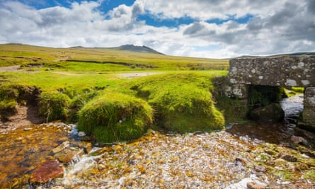
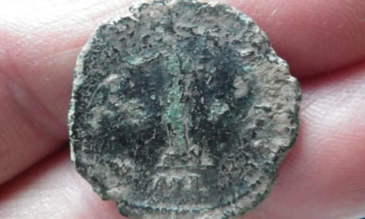
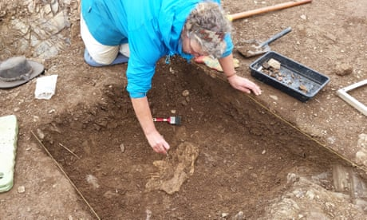
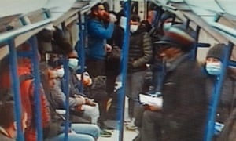
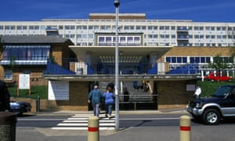

Amateur archaeologists redraw map of Roman Britain – from home | Archaeology | The Guardian

[Archaeology](https://www.theguardian.com/science/archaeology)

# Amateur archaeologists redraw map of Roman Britain – from home

Volunteers find ‘astounding’ number of unknown sites in south-west from aerial surveys

               

Bodmin Moor is one of the places being studied, and the project suggests the area was once much more populous than previously thought. Photograph: Ian Woolcock/Alamy

[Steven Morris](https://www.theguardian.com/profile/stevenmorris)

[@stevenmorris20](https://www.twitter.com/stevenmorris20)

Published on Wed 13 May 2020 00.01 BST

- 
- 
- [](https://www.theguardian.com/science/2020/may/13/amateur-archaeologists-redraw-map-of-roman-britain-from-home?utm_term=RWRpdG9yaWFsX01vcm5pbmdCcmllZmluZ1VLLTIwMDUxMw%3D%3D&utm_source=esp&utm_medium=Email&utm_campaign=MorningBriefingUK&CMP=morningbriefinguk_emailmailto:?subject=Amateur%20archaeologists%20redraw%20map%20of%20Roman%20Britain%20%E2%80%93%20from%20home&body=https%3A%2F%2Fwww.theguardian.com%2Fscience%2F2020%2Fmay%2F13%2Famateur-archaeologists-redraw-map-of-roman-britain-from-home&CMP=share_btn_link)

599

Digging at archaeological sites around the UK[has been brought to a shuddering halt](https://www.theguardian.com/education/2020/apr/28/lost-henge-digging-archaeology-online-during-lockdown) by the coronavirus, but research being undertaken from home by a group of amateurs is helping to redraw the map of the south-west of Britain in Roman times.

Volunteers poring over detailed aerial surveys of the borderlands between Cornwall and Devon spotted telltale signs of dozens of previously unknown settlements and miles of roads linking Roman forts.

The project suggests areas including Bodmin Moor, in Cornwall, and Dartmoor, in Devon, were much more populous than previously had been thought.

So far, less than a tenth of the material available has been studied but already 30 previously unknown settlements believed to date from between 300BC and AD300 have been found, as well as more than 20 miles of Roman road.

[     British Museum says metal detectorists found 1,311 treasures last year    Read more](https://www.theguardian.com/culture/2020/mar/17/british-museum-says-metal-detectorists-found-1311-treasures-last-year)

Once the lockdown ends, the pinpointed sites will be examined in person, but until then their locations are being kept secret for fear that unscrupulous metal detectorists may head there and search for artefacts.

Advertisement

Dr [Chris Smart](https://humanities.exeter.ac.uk/archaeology/staff/smart/)[, a landscape archaeologist at the University of Exeter](https://humanities.exeter.ac.uk/archaeology/staff/smart/)who is guiding the volunteers, said the results were astounding.

“I knew we’d find some things but I didn’t think it would be so many. The types of sites are what you would expect in this region but it’s the number that is so surprising. Dozens of sites have been found already, but it will be hundreds by the time the volunteers are finished. We’re seeing a much greater density of population than we thought.”

The initiative is part of a project funded by the National Lottery Heritage Fund called [Understanding Landscapes.](http://humanities.exeter.ac.uk/archaeology/research/projects/understandinglandscapes/) Usually the project would involve volunteers out in the field carrying out survey work or excavating sites.

Because this could not be done, the volunteers (just eight of them) were asked if they would like to study highly detailed topographical scans of the Tamar Valley – the border between Cornwall and Devon – and surrounding areas.

The scans cover 4,000 sq km (1,540 sq miles) and Smart has broken them up into 1,000 grids. He hands out a number of grids to the volunteers, who then study them at their leisure and try to pick out human-made features hidden in the landscapes, such as enclosed settlements. They cross-refer them to records of known archaeology and historic maps to find sites previously missed.

Smart said: “I knew there would be enthusiasm within our volunteer group to continue working during lockdown, but I don’t think they realised how many new discoveries they would make.”

They have found about 20 prehistoric burial mounds, as well as the remains of hundreds of medieval farms, field systems and quarries.

[     New finds beef up case for redrawing map of Roman empire    Read more](https://www.theguardian.com/uk-news/2019/sep/16/remains-of-ancient-butchers-beef-up-case-for-redrawing-map-of-roman-empire)

But perhaps the most interesting are the settlements and roads believed to come from just before and during Romano-British times.

One of the most exciting discoveries is the remains of a Roman road the researchers believe would have once linked the forts of Calstock, near Tavistock, and Restormel, near Bodmin.

The vestiges of the road appear as faint white marks on the aerial image. Close by is a line of black dots, which would have been quarry pits.

Smart said: “We’ve always known there would be Roman roads connecting major military installations. But we haven’t known exactly where they are.”

He added: “It’s hard for us not to be able to carry out the work we had planned this summer – including an excavation at Calstock – but hopefully this is only a temporary blip and we will be back out in the countryside with volunteers as soon as it is safe to do so.”

The images being used are produced by a technique known as Lidar – a topographical scan using laser light collected by a device connected to a fixed-wing plane.

Among the volunteers taking part in the project is Fran Sperring, 64, a retired nurse from Newquay.

“It has been totally engrossing,” she said. “We simply try to spot anything that looks manmade and has not been accounted for before. If we see something interesting we flag it up to Chris.

“So far I’ve spotted what is apparently a stretch of Roman road and an enclosure complex that could be iron age or Romano-British.”

Sperring has chosen to focus on the west of the area being studied because she lives close by. “It’s fascinating to see how busy Bodmin Moor was. It’s a real eye-opener. It seems to me it was much busier back then than it is now.”

Topics

- [Archaeology](https://www.theguardian.com/science/archaeology)
- [Roman Britain/](https://www.theguardian.com/uk/roman-britain)
- [Cornwall/](https://www.theguardian.com/uk-news/cornwall)
- [Devon/](https://www.theguardian.com/uk-news/devon)
- [University of Exeter/](https://www.theguardian.com/education/universityofexeter)
- [Heritage/](https://www.theguardian.com/culture/heritage)
- [news](https://www.theguardian.com/tone/news)
- 
- 
- [](https://www.theguardian.com/science/2020/may/13/amateur-archaeologists-redraw-map-of-roman-britain-from-home?utm_term=RWRpdG9yaWFsX01vcm5pbmdCcmllZmluZ1VLLTIwMDUxMw%3D%3D&utm_source=esp&utm_medium=Email&utm_campaign=MorningBriefingUK&CMP=morningbriefinguk_emailmailto:?subject=Amateur%20archaeologists%20redraw%20map%20of%20Roman%20Britain%20%E2%80%93%20from%20home&body=https%3A%2F%2Fwww.theguardian.com%2Fscience%2F2020%2Fmay%2F13%2Famateur-archaeologists-redraw-map-of-roman-britain-from-home&CMP=share_btn_link)
- [![](data:image/svg+xml,%3csvg xmlns='http://www.w3.org/2000/svg' width='30px' height='30px' viewBox='0 0 30 30' data-evernote-id='1006' class='js-evernote-checked'%3e%3cpath d='M10.5759782%2c7.98522727 C11.440813%2c7.98522727 12.1437763%2c8.68819053 12.1437763%2c9.55336309 C12.1437763%2c10.4194645 11.440813%2c11.1224278 10.5759782%2c11.1224278 C9.70886352%2c11.1224278 9.00792683%2c10.4194645 9.00792683%2c9.55336309 C9.00792683%2c8.68819053 9.70886352%2c7.98522727 10.5759782%2c7.98522727 L10.5759782%2c7.98522727 Z M9.22265782%2c12.3124411 L11.9290453%2c12.3124411 L11.9290453%2c21.0164351 L9.22265782%2c21.0164351 L9.22265782%2c12.3124411 Z M13.6256988%2c12.3124411 L16.2209632%2c12.3124411 L16.2209632%2c13.5012723 L16.2578635%2c13.5012723 C16.6190979%2c12.8171392 17.5017496%2c12.0954302 18.8178319%2c12.0954302 C21.5552088%2c12.0954302 22.0608357%2c13.8977183 22.0608357%2c16.2421957 L22.0608357%2c21.0164351 L19.3587547%2c21.0164351 L19.3587547%2c16.7838785 C19.3587547%2c15.7738913 19.3389113%2c14.4756258 17.9525749%2c14.4756258 C16.5448751%2c14.4756258 16.3301441%2c15.5752884 16.3301441%2c16.7105846 L16.3301441%2c21.0164351 L13.6256988%2c21.0164351 L13.6256988%2c12.3124411' data-evernote-id='1007' class='js-evernote-checked'%3e%3c/path%3e%3c/svg%3e)](http://www.linkedin.com/shareArticle?title=Amateur%20archaeologists%20redraw%20map%20of%20Roman%20Britain%20%E2%80%93%20from%20home&mini=true&url=https%3A%2F%2Fwww.theguardian.com%2Fscience%2F2020%2Fmay%2F13%2Famateur-archaeologists-redraw-map-of-roman-britain-from-home)
- 
- [Reuse this content](https://syndication.theguardian.com/automation/?url=https%3A%2F%2Fwww.theguardian.com%2Fscience%2F2020%2Fmay%2F13%2Famateur-archaeologists-redraw-map-of-roman-britain-from-home&type=article&internalpagecode=science/2020/may/13/amateur-archaeologists-redraw-map-of-roman-britain-from-home)

Advertisement

### most viewed

- [

#### Live[UK coronavirus live: No 10 rejects Starmer's claim PM misled MPs about care home advice as deaths rise by 494](https://www.theguardian.com/politics/live/2020/may/13/uk-coronavirus-live-millions-health-conditions-return-to-work-pmqs-covid-19-latest-news-updates)](https://www.theguardian.com/politics/live/2020/may/13/uk-coronavirus-live-millions-health-conditions-return-to-work-pmqs-covid-19-latest-news-updates)

- [

#### [Coronavirus has changed Boris Johnson, and that makes Tories nervous](https://www.theguardian.com/commentisfree/2020/may/13/coronavirus-boris-johnson-tories-lockdown)*Rafael Behr*](https://www.theguardian.com/commentisfree/2020/may/13/coronavirus-boris-johnson-tories-lockdown)

- [

#### [PMQs: Keir Starmer presses Boris Johnson over care home deaths](https://www.theguardian.com/politics/2020/may/13/pmqs-keir-starmer-presses-boris-johnson-over-care-home-deaths)](https://www.theguardian.com/politics/2020/may/13/pmqs-keir-starmer-presses-boris-johnson-over-care-home-deaths)

- [

#### [Train union threatens strike action if staff and drivers are not protected](https://www.theguardian.com/world/2020/may/13/packed-tube-trains-prompt-union-anger-at-johnsons-back-to-work-message-coronavirus-lockdown)](https://www.theguardian.com/world/2020/may/13/packed-tube-trains-prompt-union-anger-at-johnsons-back-to-work-message-coronavirus-lockdown)

- [

#### [Three-day-old baby dies after mother catches coronavirus](https://www.theguardian.com/world/2020/may/13/three-day-old-baby-dies-after-mother-catches-coronavirus-south-wales)](https://www.theguardian.com/world/2020/may/13/three-day-old-baby-dies-after-mother-catches-coronavirus-south-wales)