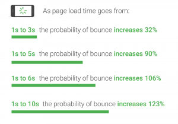
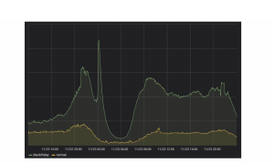

Amazon found every 100ms of latency cost them 1% in sales.

# Amazon Found Every 100ms of Latency Cost them 1% in Sales

 [   Yoav Einav January 20, 2019](https://www.gigaspaces.com/blog/author/yoav-einav/)

   3 minutes read

10 years ago, Amazon found that every 100ms of latency cost them 1% in sales. Google found an extra .5 seconds in search page generation time [dropped traffic by 20%](http://glinden.blogspot.com/2006/11/marissa-mayer-at-web-20.html). A broker could lose [$4 million in revenues per millisecond](https://research.tabbgroup.com/report/v06-007-value-millisecond-finding-optimal-speed-trading-infrastructure) if their electronic trading platform is 5 milliseconds behind the competition.

The expectations of today’s NOW customers continue to grow and the amount of data generated and accessed is mind boggling. Bernard Marr, in his article in [Forbes](https://www.forbes.com/sites/bernardmarr/2018/05/21/how-much-data-do-we-create-every-day-the-mind-blowing-stats-everyone-should-read/#7e6104960ba9) describes how [2.5 quintillion bytes of data](https://www.domo.com/learn/data-never-sleeps-5?aid=ogsm072517_1&sf100871281=1)  are generated every day and that over the last two years alone 90 percent of the data in the world was generated.

It is clear, that the need for speed and scale are escalating and enterprises need to understand how they can support current and future applications to remain competitive from all aspects: optimized operations, regulation adherence and enhanced customer experience.

So, we’ve decided to put together some of the latest statistics discussing not just the cost of latency but also the positive influence on customer satisfaction and growth in sales when a site responds at the desired speed.

**Fast forward 10 years later**

A 2017 [Akamai study](https://www.akamai.com/uk/en/about/news/press/2017-press/akamai-releases-spring-2017-state-of-online-retail-performance-report.jsp) shows that every 100-millisecond delay in website load time can hurt conversion rates by 7% – that is a significant drop in sales – 6% – from the time when Amazon first talked about latency in seconds and milliseconds. This goes to show that things aren’t getting any easier for online retailers as user experience is becoming critical to e-commerce success.

In 2018, [Google](https://www.thinkwithgoogle.com/marketing-resources/data-measurement/mobile-page-speed-new-industry-benchmarks/) shared the following infographic on mobile page load industry benchmarks:

Figure 1: Mobile page load industry benchmarks

**Latency is not an option anymore**

The less interactive a site becomes the more likely users are to simply click away to a competitor’s site. Latency is the mother of interactivity.

Additionally, as enterprises start leveraging real-time analytics for personalized recommendations and dynamic pricing services, speed is becoming even more imperative.

How do we recover that which is most meaningful–sales–and build highly available, low-latency systems that scale and at the same time retain performance?

The first thing to understand is that Tier Based Architectures with their mish-mash of separate cluster implementations are not only state bound at each tier but are also complex to manage and maintain. The ability to unify real-time analytics and extreme transactional processing further simplifies the architecture, leveraging the scalable distributed in-memory fabric for low latency performance.

Figure 2: Peakload of 20X normaltraffic shown for this year’s BlackFriday

A great example can be seen from a customer of ours, PriceRunner, who has designed their architecture to flexibly and quickly scale out when necessary without compromising performance and speed. This past Black Friday, when visitor traffic peaked at 20 times higher, in parallel with 100 million price updates, PriceRunner response time for the 95th percentile of the product page endpoint remained within the 5-8 millisecond range.

If you are interested in learning more about the benefits of a converged real-time data pipeline platform, you can read our whitepaper.

Original Author – Nati Shalom
Updated by Yoav Einav, 2019

## TAGS

[Yoav Einav](https://www.gigaspaces.com/blog/author/yoav-einav/)

###

- 
- 
- 
- 

[All Posts (15)](https://www.gigaspaces.com/blog/author/yoav-einav/)

## YOU MAY ALSO LIKE

[(L)](https://www.gigaspaces.com/blog/tssjs-prague-my-take-aways/)

### June 27, 2008

[TSSJS Prague: my take-aways](https://www.gigaspaces.com/blog/tssjs-prague-my-take-aways/)

12 minutes read
[(L)](https://www.gigaspaces.com/blog/tssjs-prague-my-take-aways/)
[(L)](https://www.gigaspaces.com/blog/it-must-haves-for-e-commerce/)

### February 3, 2016

[IT Must Haves for E-Commerce](https://www.gigaspaces.com/blog/it-must-haves-for-e-commerce/)

4 minutes read
[(L)](https://www.gigaspaces.com/blog/it-must-haves-for-e-commerce/)
[(L)](https://www.gigaspaces.com/blog/our-citrix-integration-demo/)

### October 19, 2010

[Our Citrix Integration Demo](https://www.gigaspaces.com/blog/our-citrix-integration-demo/)

2 minutes read
[(L)](https://www.gigaspaces.com/blog/our-citrix-integration-demo/)