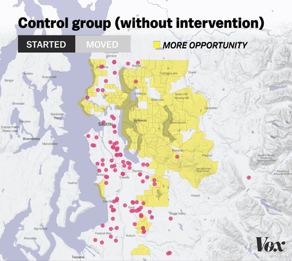
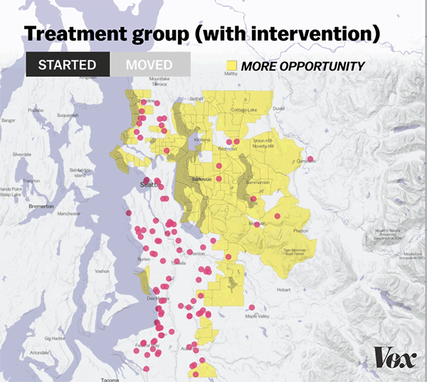

America has a housing segregation problem. Seattle may just have the solution.

 [![](data:image/svg+xml,%3csvg id='Layer_1' xmlns='http://www.w3.org/2000/svg' viewBox='0 0 242 121' data-evernote-id='224' class='js-evernote-checked'%3e%3cpath fill='%23ffffff' d='M110.674 3.528h3.474L114.564 2H71.63l-.418 1.528h6.253c5.418 0 9.726 3.75 9.726 11.255 0 4.168-1.8 9.587-4.72 16.118L54.82 92.32l-6.81-79.756c-.556-6.252 2.5-9.03 9.59-9.03h4.027L62.042 2H1.6l-.557 1.528h3.89c4.725 0 6.532 2.918 7.087 8.615l10.7 103.1h25.427l42.518-90.038c6.392-13.48 13.2-21.677 20.01-21.677zm-5.002 112.27c-3.89 0-6.253-1.25-6.253-7.642 0-8.06 2.91-23.76 6.11-38.072.41 6.67 5 13.2 11.81 13.2 1.67 0 3.06-.138 4.44-.417-6.26 27.236-8.76 32.932-16.12 32.932zm121.024-54.19c8.06 0 13.2-6.67 13.2-14.173 0-6.392-4.585-11.116-11.115-11.116-11.81 0-17.36 9.31-27.09 26.53-2.08-10.7-6.94-24.73-19.45-24.73-14.03 0-30.15 20.01-45.02 32.37-6.67 5.56-14.17 9.17-20.15 9.17-6.11 0-9.72-6.26-9.72-17.23 4.31-17.93 6.67-22.65 13.34-22.65 4.59 0 6.53 2.64 6.53 8.06 0 5.69-1.25 15.42-3.75 27.51 6.67-2.09 16.68-10.42 25.01-19.45-4.44-10.56-13.89-17.79-27.65-17.79-25.42 0-47.66 22.78-47.66 48.35 0 17.65 12.51 30.984 32.1 30.984 32.38 0 45.86-28.066 45.86-47.52 0-2.78-.14-4.86-.42-7.364C155.717 57.14 162.108 52 167.388 52c5.975 0 10.7 15.007 15.423 37.657-4.17 4.58-8.34 13.474-10.42 15.002-.836-8.06-6.115-13.06-13.2-13.06-7.92 0-13.48 7.5-13.48 13.893 0 7.226 5 11.95 11.53 11.95 13.76 0 17.65-13.062 26.265-24.595 2.64 12.363 8.754 24.59 19.313 24.59 12.506 0 24.178-10.7 30.15-18.34l-1.11-1.81c-3.89 3.753-7.642 6.254-11.95 6.254-7.78 0-13.34-16.81-17.645-37.1 2.5-3.47 6.53-12.225 9.31-15.28 1.95 3.612 5.978 10.42 15.15 10.42z' data-evernote-id='225' class='js-evernote-checked'%3e%3c/path%3e%3c/svg%3e)](https://www.vox.com/)

 [SF9A2776.webp](../_resources/81f4d115a1580beb7705d5b633f42dd5.webp)

Monica Rose and her daughter Amina, 10, will soon be moving to a new neighborhood after taking part in a housing project run by a team of Harvard researchers and the Seattle Housing Authority.

 |Jenny Riffle for Vox

# America has a housing segregation problem. Seattle may just have the solution.

Economist Raj Chetty found the program has “the largest effect I’ve ever seen in a social science intervention.”

By   [Dylan Matthews](https://www.vox.com/authors/dylan)[@dylanmatt](https://www.twitter.com/dylanmatt)[dylan@vox.com](https://www.vox.com/future-perfect/2019/8/4/20726427/raj-chetty-segregation-moving-opportunity-seattle-experimentmailto:dylan@vox.com)       Aug 4, 2019, 7:00am EDT

Photographs by Jenny Riffle for Vox

## Share this story

- [Share this on Facebook (opens in new window)](https://www.facebook.com/sharer/sharer.php?text=America+has+a+housing+segregation+problem.+Seattle+may+just+have+the+solution.&u=https%3A%2F%2Fwww.vox.com%2Ffuture-perfect%2F2019%2F8%2F4%2F20726427%2Fraj-chetty-segregation-moving-opportunity-seattle-experiment)

- [Share this on Twitter (opens in new window)](https://twitter.com/intent/tweet?counturl=https%3A%2F%2Fwww.vox.com%2Ffuture-perfect%2F2019%2F8%2F4%2F20726427%2Fraj-chetty-segregation-moving-opportunity-seattle-experiment&text=America+has+a+housing+segregation+problem.+Seattle+may+just+have+the+solution.&url=https%3A%2F%2Fwww.vox.com%2Ffuture-perfect%2F2019%2F8%2F4%2F20726427%2Fraj-chetty-segregation-moving-opportunity-seattle-experiment&via=voxdotcom)

- [![](data:image/svg+xml,%3csvg xmlns='http://www.w3.org/2000/svg' viewBox='0 0 21 20' class='p-svg-icon c-social-buttons__svg js-evernote-checked' data-evernote-id='271'%3e %3cpath d='M18.4%2c12.9c-0.3%2c0-0.6%2c0.3-0.6%2c0.6V17c0%2c1-0.8%2c1.8-1.8%2c1.8H3c-1%2c0-1.8-0.8-1.8-1.8V4C1.2%2c3%2c2%2c2.2%2c3%2c2.2h8.4 c0.3%2c0%2c0.6-0.3%2c0.6-0.6S11.7%2c1%2c11.3%2c1H3C1.3%2c1%2c0%2c2.3%2c0%2c4V17c0%2c1.6%2c1.3%2c3%2c3%2c3H16c1.6%2c0%2c3-1.3%2c3-3v-3.5C19%2c13.2%2c18.7%2c12.9%2c18.4%2c12.9z' data-evernote-id='272' class='js-evernote-checked'%3e%3c/path%3e %3cpath d='M20.9%2c5.3C20.9%2c5.3%2c20.9%2c5.3%2c20.9%2c5.3c0-0.1%2c0-0.1%2c0-0.1c0%2c0%2c0%2c0%2c0-0.1c0%2c0%2c0%2c0%2c0-0.1c0%2c0%2c0%2c0%2c0-0.1c0%2c0%2c0%2c0%2c0%2c0 c0%2c0%2c0%2c0%2c0%2c0c0%2c0%2c0%2c0%2c0%2c0l-4.6-4.6c-0.2-0.2-0.6-0.2-0.8%2c0s-0.2%2c0.6%2c0%2c0.8l3.3%2c3.3c-2.1-0.3-5.5-0.3-8.5%2c1.5 C7.6%2c7.5%2c5.9%2c10%2c5.2%2c13.5c-0.1%2c0.3%2c0.1%2c0.6%2c0.5%2c0.7c0%2c0%2c0.1%2c0%2c0.1%2c0c0.3%2c0%2c0.5-0.2%2c0.6-0.5c0.6-3.1%2c2.1-5.4%2c4.3-6.8 c3-1.8%2c6.7-1.5%2c8.5-1.2l-3.8%2c3.9c-0.2%2c0.2-0.2%2c0.6%2c0%2c0.8c0.1%2c0.1%2c0.3%2c0.2%2c0.4%2c0.2s0.3-0.1%2c0.4-0.2l4.6-4.6c0%2c0%2c0%2c0%2c0%2c0 c0%2c0%2c0%2c0%2c0-0.1c0%2c0%2c0%2c0%2c0%2c0c0%2c0%2c0%2c0%2c0-0.1c0%2c0%2c0%2c0%2c0-0.1c0%2c0%2c0%2c0%2c0%2c0c0%2c0%2c0%2c0%2c0%2c0c0%2c0%2c0%2c0%2c0-0.1C20.9%2c5.4%2c20.9%2c5.4%2c20.9%2c5.3 C20.9%2c5.4%2c20.9%2c5.4%2c20.9%2c5.3z' data-evernote-id='273' class='js-evernote-checked'%3e%3c/path%3e %3c/svg%3e)ShareAll sharing options](https://www.vox.com/future-perfect/2019/8/4/20726427/raj-chetty-segregation-moving-opportunity-seattle-experiment#)

##   This story is part of a group of stories called   

Finding the best ways to do good. Made possible by The Rockefeller Foundation.

Most American cities have a stark racial divide. In Seattle, the divide runs [north to south](https://www.thestranger.com/seattle/white-seattle-and-brown-seattle/Content?oid=8847700): North Seattle is largely white; [South Seattle is largely not](https://www.kuow.org/stories/why-seattle-so-racially-segregated).

And as is usually the case in the US, the racial divide is also an opportunity divide. The north is richer and has [more expensive houses](https://www.trulia.com/real_estate/Seattle-Washington/) and [higher-ranked schools](https://www.sightline.org/2017/05/16/one-tool-for-dismantling-structural-school-segregation-in-seattle-better-zoning/) than the south. Research released by a group of [economists](https://opportunityinsights.org/wp-content/uploads/2018/10/atlas_paper.pdf)last year confirmed this impression in more detail. In some North Seattle neighborhoods (like Broadview), children who grew up there in the 1990s were earning average incomes of around $53,000 by their mid-30s. But if you went farther south, particularly to the Central District (the historic home of Seattle’s black community, pre-gentrification at least), you start to see averages more like $24,000, or $25,000, or $29,000.

[Research by some of the same economists](https://opportunityinsights.org/paper/newmto/) confirmed a causal link: Living in certain neighborhoods seems to expand opportunity, and living in other neighborhoods seems to diminish it.

Now [a new project](https://opportunityinsights.org/wp-content/uploads/2019/08/cmto_paper.pdf), a continuation of those previous studies, seeks to use those lessons to improve American housing policy. A team of researchers — Raj Chetty, Nathaniel Hendren, Larry Katz, Stefanie DeLuca, Peter Bergman, and Christopher Palmer — collaborated with the [Seattle Housing Authority](https://www.seattlehousing.org/) (which distributes Section 8 housing vouchers in the city) and the [King County Housing Authority](https://www.kcha.org/) (which distributes them in surrounding suburbs) to try something new.

 [AP_95110801594.webp](../_resources/b194f3ee586e21d08330802b4bdfd0b3.webp)

Many neighborhoods in the suburb of Bellevue were identified as “high opportunity” zones by the Harvard study, which used block-level data to identify the top third of neighborhoods by income mobility.

The way housing assistance normally works in major cities is that housing authorities have limited budgets that they use to distribute money for rent to a subset of needy families. (These are authorized by Section 8 of the Housing Act of 1937, and known as “Section 8 vouchers.”) The mystery for the researchers was that even after getting a subsidy, many families [chose not to move to a better area](https://nlihc.org/sites/default/files/Encouraging-Residential-Moves-to-Opportunity.pdf) that offered better opportunity. Why was that? And what could be done about it?

So in Seattle, the researchers put a twist on the housing voucher system. For this experiment, a random subset of people receiving vouchers for the first time would get more than just the rental subsidy. They would also be given information on which neighborhoods promise the most opportunity for their kids, based on the research data. They’d also be assigned “navigators” whose job it was to walk them through the apartment application process, and receive additional financial assistance with down payments if necessary.

It’s a simple intervention — and, more than a year in, it looks like it yielded big results.

The experiment found that the additional support raised the share of families moving to high-opportunity neighborhoods from 14 percent to 54 percent. “This is the largest effect I’ve ever seen in a social science intervention,” Chetty said in an email.

It’s also an experiment that has left participants with an overwhelmingly positive experience with a government bureaucracy for once. “People say that Seattleites don’t smile at you, or look up to say hi to you, but these people were really, really nice,” Nikki Manlapaz, a mother who moved from a low- to high-opportunity neighborhood through the program. “They just took all the worry and stress away from me.”

If it can be replicated at scale, the experimenters may have hit on a powerful new tool for dismantling residential segregation in the United States.

 

Monica and her daughter, Amina, walk around Licton Springs school, where Amina will be attending in the fall. Monica moved to Seattle’s Northgate neighborhood, classified as high opportunity, as part of the program.

### The geography of opportunity, explained

The idea of helping people move to “better” areas as a pathway out of poverty is not exactly new. One of the first large-scale tests of the idea came out of a lawsuit filed in 1966 by [Dorothy Gautreaux](http://americanradioworks.publicradio.org/features/housing/a3.html), a black community activist in Chicago who, with three other public housing residents, sued the Chicago Housing Authority and the federal Department of Housing and Urban Development (HUD), alleging that public housing had been built purposely to [“avoid the placement of Negro families in white neighborhoods,”](https://supreme.justia.com/cases/federal/us/425/284/) in violation of the 14th Amendment’s Equal Protection Clause.

While Gautreaux died before the case’s resolution in 1976, the suit ended with an agreement in which she and her co-plaintiffs got most of what they wanted. The housing authority started finding placements for public housing recipients around the Chicago metro area, including in overwhelmingly white suburbs.

 [eyJpdSI6IjZkNzgyM2VlMjFmM2FjZjgxYWE1NjRjNDY0OGQ0ZWMyM2I3YzljYTdkYjRlN2ZjZDdjMDZlNzc0MzMyNzBkYWUiLCJ3IjozNDAsImgiOjM4MCwiZCI6MS41LCJjcyI6MCwiZiI6NH0.webp](../_resources/3e983f6569714f6c0ed85a0ef9cbfadf.webp)

Gautreaux’s case played a key role in the redevelopment of many of Chicago’s public housing complexes including Cabrini Green, seen here being demolished on November 8, 1995.

 |Beth A. Keiser/AP

That made for a pretty good experiment. As [economists Greg Duncan and Jens Ludwig](https://www.brookings.edu/research/can-housing-vouchers-help-poor-children/) explained, it “generated a sample of Chicago public-housing residents who were essentially randomly assigned to both city and suburban neighborhoods.” And because “the family backgrounds of Gautreaux families living in different types of areas should on average be quite similar,” that meant any differences between the outcomes of kids in the suburbs and kids still in segregated city neighborhoods should be the direct result of their different locations.

By a decade or two after the moves, [there were differences — and they were profound](https://go.redirectingat.com/?id=66960X1516588&xs=1&url=https%3A%2F%2Fsmile.amazon.com%2FCrossing-Class-Color-Lines-Suburbia%2Fdp%2F0226730905%3Fsa-no-redirect%3D1). Among students who stayed in the city, 20 percent dropped out of high school and only 21 percent went to college; in the suburbs, only 5 percent dropped out and 54 percent went to college. Kids in families sent to the suburbs were also likelier to earn high wages and to be employed full time once out of school.

 [eyJpdSI6IjMyMjY4MDg4NzgyOGZkMjc2Mzg0ODg2MmY1YTAwZjYyM2Q1NTFlZjA2YWVmODk2NGQ5OTlhODM3YmEyNWFlMzQiLCJ3IjozNDAsImgiOjM4MCwiZCI6MS41LCJjcyI6MCwiZiI6NH0.webp](../_resources/26ac930dd3b487654c31f1dd0dfcefe4.webp)

Timeica Bethel, a soon-to-be Yale University graduate, visits her childhood home at the LeClaire Courts public housing complex on the southwest side of Chicago on March 14, 2011. Former residents were given permission to walk through their family unit before demolition was complete.

 |Alex Garcia/Chicago Tribune/Getty Images

Those results prompted a second large-scale experiment. From 1994 to 1998, the Clinton administration’s HUD tried to replicate the idea in five cities (Chicago, New York, Baltimore, Boston, and Los Angeles), through a program called Moving to Opportunity (MTO). In the first year of the experiment, families in the treatment group were required to use their housing vouchers in areas with poverty rates under 10 percent as of 1990.

The first evaluations of the program found [mixed results](https://scholar.harvard.edu/files/lkatz/files/experimental_analysis_of_neighborhood_effects.pdf). The moves had positive effects on mental health and for adults and girls, but physical health and economic outcomes were unchanged.

That finding then led to a backlash against moving vouchers as a tool for fighting poverty. A divide in the research community emerged between people who trusted the Gautreaux results, which suggested that residential integration could go a long way to alleviating disadvantage, and the more muted MTO results.

But in 2016, Chetty, Hendren, and Katz (the latter of whom was also an author on the more skeptical research on MTO) [reanalyzed the data](https://scholar.harvard.edu/files/lkatz/files/chk_aer_mto_0416.pdf) — and found something totally different. This time around, they linked the experiment to tax records and concluded that people whom MTO had placed in lower-poverty neighborhoods really were likelier to go to college and had higher average earnings than kids who didn’t move. The effect size on income was large: about a 31 percent increase in earnings by their mid-20s.

The new findings had major implications — it meant that there was no longer any conflict between MTO and Gautreaux. What’s more, the findings jibed with [geographic work that Chetty and Hendren](http://www.equality-of-opportunity.org/assets/documents/mobility_geo.pdf) had already been doing with Berkeley’s Patrick Kline and Emmanuel Saez, finding that opportunity (measured as the share of poor kids who wind up in a higher income bracket as adults) varied widely not just from city to city, but from city block to city block.

Chetty, Hendren, and Katz’s exploration of the MTO data suggested the relationship truly was causal: Moving to a better neighborhood really did make kids better off as adults. The fact that the effects were bigger for people who spent more of their childhoods in high-opportunity areas only strengthened that conclusion.

### The Seattle experiment

“I recall it was a Friday afternoon,” Nathaniel Hendren, the Harvard economics professor who co-authored the MTO reanalysis and the new experiment, told me when I asked how Creating Moves to Opportunity — the Seattle experiment — came about. “Greg Russ, who was the president of the Cambridge Housing Authority, walked into Raj’s office with his assistants, and had copies of our MTO paper marked everywhere with questions and comments and thoughts.”

Russ — who has since [taken over the housing authority in New York City](https://www.nytimes.com/2019/06/24/nyregion/nycha-chairman-gregory-russ.html) — had read Chetty, Hendren, and Katz’s paper carefully and wanted to use his power at the Cambridge, Massachusetts, housing authority to generate the kinds of lifelong impacts they detailed. He wanted [Opportunity Insights](https://opportunityinsights.org/), a research group at Harvard directed by Chetty and co-directed by Hendren and John Friedman, to help.

Cambridge proved to be too small a city for an experiment to work. But Seattle and King County’s housing authorities were game, and had existing relationships with the Bill and Melinda Gates Foundation to help fund it. It felt like a natural testing ground: There was a foundation interested in funding a study, enthusiastic housing authorities to work with, and a large enough scale to be able to detect even modest effects.

That just left the most important question: What, exactly, should the intervention be?

 [SF9A2702.webp](:/705955df7b39dd69d376198ff673a1a1)
       Javier Zarracina/Vox

From a research standpoint, Chetty, Hendren, Katz, and their team wanted to know why poor families, when given the chance,**  **weren’t moving to higher opportunity areas.

Higher rent was one obvious answer. But the Section 8 program offers additional support for people who move to higher-rent areas, often to the point of totally offsetting the additional cost, so that couldn’t be the whole story.

A lack of information was another possible explanation. Maybe families just don’t know where the high-opportunity neighborhoods are. But that doesn’t seem to be true in practice. The recipients I talked to generally knew where they wanted to end up.

Gregory Vodolazov, a recent Russian immigrant, was already living in Bellevue with his wife Oxana Demicheva and their sons Semyon (9) and Yaroslav (2) when he qualified for a housing voucher and for CMTO assistance. They knew they wanted to stay, but with Gregory out of work, they were struggling to afford the posh suburb. “I was sure where I wanted to live. Bellevue is the place with expensive homes everywhere,” Gregory told me.

 [eyJpdSI6ImU3MTNkMDkyN2JhYjc0ZjJiYzQ1Y2MwNDM2YjQwMjQxYzU1ODQwZmViZmQ4OWQ4NWU4ZGEzNjdkOWU2Njk4MDciLCJ3IjozNDAsImgiOjM4MCwiZCI6MS41LCJjcyI6MCwiZiI6NH0.webp](../_resources/5ad00ee2b6eb27521ec6ccff41b7ef22.webp)

Greg and Oxana with their son Yaroslav, 2, in their home in the suburb of Bellevue, Washington.

Indeed, Monica Rose, a lifetime Seattleite and mother of one who was part of the experiment’s control group — she received information about high-opportunity neighborhoods from the Seattle Housing Authority but not specialized counseling — told me the list of neighborhoods hardly surprised her. “There were a couple of surprises,” she says. “There are some neighborhoods in Northgate that I didn’t really expect to be areas of opportunity. But in general, I’m familiar with the area.”

So were there other forces keeping these families where they were — like family nearby, or a close-knit social circle? Did they not have the capital they needed to pay for a move? Did discrimination by landlords in rich neighborhoods, or discriminatory zoning laws banning apartments, keep them out?

One option the researchers considered was just giving a cash bonus on top of the housing voucher to families that move to higher-opportunity neighborhoods to see if that spurred more moves — but an earlier study found that even [offering a $500 bonus to Chicago families who moved to higher-opportunity neighborhoods](https://nlihc.org/sites/default/files/Encouraging-Residential-Moves-to-Opportunity.pdf) did nothing.

What’s more, when the economists started talking to housing authority officials, they kept hearing that money wasn’t the main barrier — that “there’s a much richer set of more complex constraints,” as they told Hendren.

That was certainly the experience of Nikki Manlapaz, the working mom who found a home for her and her son Theo through the program. She told me that in previous housing searches, she relied on “what I heard from friends and on Craigslist. I tried Apartments.com, but it was just basically calling the places on your own, looking at the places on your own, applying and just waiting, and usually the answer’s no.” What she needed wasn’t just money but an easier process.

The eventual intervention the researchers settled on involved contracting with a local nonprofit, the [Interim Community Development Association](http://interimicda.org/), to offer counseling through two sets of “navigators”: family navigators, who worked with Section 8 families to help in their housing search; and housing navigators, who met with landlords in high-opportunity neighborhoods and sought to dispel any negative impressions they had about the Section 8 program, and about tenants who might have criminal records or poor credit.

The navigators explain to families the benefits of moving to neighborhoods that seem to produce better outcomes for kids once they grow up, and walk through strategies for overcoming barriers, like poor credit and discrimination against criminal records. “We try to get in a couple meetings before they get their voucher,” Sarah Birkebak, one of the family navigators, told me. “Those initial meetings focus a lot on introducing the opportunity neighborhoods to families.” In many cases, Birkebak says, she advised families to put together “rental résumés” to explain their living situation to landlords.

Meanwhile, the housing navigators worked with landlords to expedite inspections and generally try to cut through red tape that might make landlords not want to deal with Section 8.

It’s a relatively labor-intensive intervention. All told, the intensive counseling cost about $2,700 per family; 141 families total were in the treatment group, and 133 in the control, for 274 total.

But it worked. While only 14 percent of families in the control group wound up in high-opportunity neighborhoods, that $2,700 per family intervention was able to boost the share to 54 percent in the treatment group. It was a high-touch intervention, but one with amazing results.

             Alvin Chang/Vox

             Alvin Chang/Vox

Recipients told me that hands-on support meant everything. Vodolazov said that once he decided he wanted a place in Bellevue, the program “offered to do everything.”

Manlapaz told me that after she told her navigator she wanted to live in the Northgate, an opportunity neighborhood in northern Seattle, her navigator called to tell her about any vacancies. When she picked one she liked, “they pretty much took care of the rest. I gave them my information, they gave my information to the leasing office, they applied for me, and they helped with the first month’s rent and the renter’s insurance for a year.” She and Theo have been living there for more than a year now.

Based on the earlier research, the economic consequences of these moves could be massive. Hendren estimates that the lifetime benefit to a newborn child of moving from a low- to high-opportunity neighborhood is about $210,000 in additional income, or an 8.1 percent increase in lifetime earnings. Compare that to the $2,700 cost of counseling, and an additional $2,500 to $3,000 more per year per family that Section 8 paid due to higher rent in their new neighborhoods, and it looks like a pretty exceptional deal.

The program doesn’t quite pay for itself by increasing future tax revenue, Hendren says — but it comes pretty close.

 [GettyImages_111318705.webp](../_resources/15004568b948449e79b64b536ed66eb9.webp)

Yaroslav plays in his family’s living room.

### Moving on up

The next big question, then, is whether this is the kind of intervention you can easily replicate and scale — especially in a form that pays for itself.

The intervention was a demand-side policy: it operated primarily by changing the behavior and pitches of prospective renters. Stefanie DeLuca, a Johns Hopkins professor of sociology who conducted qualitative interviews with families in the experiment, says a major part of the intervention was training renters to be more confident, to act more like the kind of people that landlords are prepared to rent to.

“One woman said, ‘I just used to get nervous calling landlords, and I’d stutter, and I have a script now that says I’m looking for housing and I have a child,’” DeLuca explains. “It’s less changing behavior to act a different way but acting confident as consumers of housing, not beggars or supplicants.”

That’s wonderful — but it might only go so far. There were some people for whom that training wasn’t enough, and there will surely be some landlords who will discriminate even against poor families who act confident and look like they belong in “good” neighborhoods. It takes nothing away from the experiment’s achievement to note that it doesn’t dismantle the structural causes of segregation, or prevent rich families from using their political power to keep out poor families.

 [eyJpdSI6ImU0MmRkMTRlYzIzMTFhY2VlMGQxMjc4NzJkZGU2YmQ1MTBiYzQyNjQzZjI2N2RmMWQ3ODBjZTlkMGJlYjk4ZTAiLCJ3IjozNDAsImgiOjM4MCwiZCI6MS41LCJjcyI6MCwiZiI6NH0.webp](:/c07be9b66f097ff3922604f9684335b0)

Monica and Amina walk in Seattle’s Northgate neighborhood, where they will be moving soon. “The school was the No. 1 thing” in choosing a neighborhood, Monica says. “To be in the Seattle area, close enough to where we can get her to that school, where she can feel comfortable and be safe.”

The beneficiaries of the study are also, in a perverse way, lucky. They participated because they got off years-long waitlists for public housing. Meanwhile, some [76 percent of low-income families don’t have access to Section 8](https://www.vox.com/2014/5/31/5764262/76-percent-of-people-who-qualify-for-housing-aid-dont-get-it). To reach that 76 percent, you would need much more than a program like Creating Moves to Opportunity. You’d need a version of Section 8 that’s actually an entitlement that every poor family can access — and spend a lot more than the [$23 billion a year](https://www.cbpp.org/blog/2019-bill-largely-sustains-2018-hud-funding-gains) the federal government currently spends.

“The social and structural aspects of segregation are alive and well, and we see that in credit histories, in pessimism about neighborhoods people won’t even consider living in,” DeLuca concedes.

But she’s not a defeatist. “The good news here is we *can* intervene and do it successfully. But we have to intervene.” ■

[***Sign up for the Future Perfect newsletter.***](https://www.vox.com/future-perfect-newsletter)* Twice a week, you’ll get a roundup of ideas and solutions for tackling our biggest challenges: improving public health, decreasing human and animal suffering, easing catastrophic risks, and — to put it simply — getting better at doing good.*

Sponsored Content

- [

 [SEATTLE_KC_NON_WHITE_Map2.webp](:/a3f36066ed620d308e759ddca9bb716c)    Stop Wasting Money - This App Finds Every Discount Code on the Internet  Honey](https://www.joinhoney.com/r/OB_UK_190603_Evergreen_MSN_Broad_None_GhostChromeN4-UK_MultiBoxes_CPC_18-65_All_NA_ASOSCloseup_9750?utm_source=outb&utm_medium=dis&utm_campaign=OB_UK_190603_Evergreen_MSN_Broad_None_GhostChromeN4-UK_MultiBoxes_CPC_18-65_All_NA_ASOSCloseup_9750&utm_content=GhostChromeN4-UK&url=https%3A%2F%2Fwww.joinhoney.com%2Fg-blog%2Fthis-app-applies-every-voucher-on-the-internet-n4-uk&obOrigUrl=true)

- [

 [SF9A2579.0.webp](:/7f1e385eeadeb00aa44930ef03e3f592)    Most wine drinkers in the UK don't know these 5 simple Dos and Don'ts....  Naked Wines](https://www.nakedwines.com/nakdobp16_j?cid=uk&utm_source=outbrain&utm_medium=native&utm_campaign=%24br-naked%24ct-uk%24ba-prospecting%24sa-ob_uk%24ca-ob_nonlal_uk%24ob-conv%24cr-content%24pn-apr2019_5_hacks_d&utm_content=Most+wine+drinkers+in+the+UK+don%27t+know+these+5+simple+Dos+and+Don%27ts.&utm_term=$publisher_name$_$section_name$&obOrigUrl=true)

- [

 [SF9A2018.webp](../_resources/44a2afa98ad3c0d85173c886fb45e727.webp)    Experts Baffled: Simple Tip Relieves Years of Joint Pain (Try Tonight)  Health Reports 24](https://siteloading.com/path/lp.php?trvid=10265&trvx=4d26a51d&clid=$ob_click_id$&caid=00a2ad11a59e80bfad4af6ec11496627bf&cid=009bc271801dbade9cbdc62ca7feba06e6&at=Experts+Baffled%3A+Simple+Tip+Relieves+Years+of+Joint+Pain+%28Try+Tonight%29&dt=JointFuel360&pid=$publisher_id$&pn=$publisher_name$&sn=$section_name$&sid=$section_id$&obOrigUrl=true)

- [

 [SF9A2073.webp](:/0399f14837e4fe6d210ca1a42892f820)    These Cars Will Soon Be Worthless – Cars Plummeting In Value  Buzzdrives.com](http://rzwuwrz.com/path/lp.php?trvid=10044&trvx=81463bd7&utm_source=outbrain&utm_campaign=0098475ac14bdda5db3c6ab8d222fecb26&utm_medium=$publisher_name$_$section_name$&utm_content=0082280bbca8e41bf6dcab5c342cc2645d_These+Cars+Will+Soon+Be+Worthless+%E2%80%93+Cars+Plummeting+In+Value&utm_term=159$section_id$&obOrigUrl=true)

- [      [Gallery] He Escaped Alcatraz 50 Years Ago. FBI Just Received A Letter From HimEditor Choice](https://r1.zemanta.com/r/u1o0dela5szk/b1_outbrainrtb/882873/11084108/XTRDGJ2DSQAIPH5QIOJVGEQIKJSPXUT4EUW3Q7AXH7M2XDY2KE7CX5VQFX7YCS2NJW7R6XC4LWS2A7ZQASEOTSQNPNMHXB6RVUTDAM4B54RUFHIW7GP3UXRME6YD43IBQQMU2UKTQCWGRQEITY7G2Y3D4XR7PO5YSC7WMQMIGK4D3HDAL5OCFYJ7OMMSOL6XI7P52AGFPNGFIQBC5M6G74QR7VMKBG2GYRLRW3KRTWH6V3MMZHFEZDWHH7LSSYJCHJUZJTJGTM7MTNZX5QQLXAIP4SNY3LKJHMJYOID4IZT7OTZ7BAYWFEFIH3NEVDWVSKSLJ65Q5PIEWIPKW7GXHWA23K5FO3Q7VZMB2NCTKBGK5VE7MMGB6WO5NC5NW5CN/?obOrigUrl=true)
- [

 [SF9A2192.webp](../_resources/b413eb1ada9697040df7839fb8d3f027.webp)    This Easy Tip Could Relieve Years Of Joint Pain (Do This)  The Health Reports 24](https://siteloading.com/path/lp.php?trvid=10265&trvx=4d26a51d&clid=$ob_click_id$&caid=00a2ad11a59e80bfad4af6ec11496627bf&cid=0040f3bae7e58ba181671162e72d76ca49&at=This+Easy+Tip+Could+Relieve+Years+Of+Joint+Pain+%28Do+This%29&dt=Joint+Fuel&pid=$publisher_id$&pn=$publisher_name$&sn=$section_name$&sid=$section_id$&obOrigUrl=true)

[Recommended by](https://www.outbrain.com/what-is/default/en)

 

 

 [eyJpdSI6IjZhMzU0OGU3MmFjZTZkNmQzYzUzNTc3MmE5M2ZmZGVhOTRkNzAyNmIyOGZjN2VmYTFhNDBhM2I1YzA5NzRiZGMiLCJ3IjozNDAsImgiOjM4MCwiZCI6MS41LCJjcyI6MCwiZiI6NH0.webp](../_resources/9bb191c6827273aa978cab39a3587950.gif)

 [(L)](https://www.vox.com/future-perfect/2019/8/23/20828842/bernie-sanders-electric-school-buses)    [Future Perfect](https://www.vox.com/future-perfect)

### The surprisingly great idea in Bernie Sanders’s Green New Deal: electric school buses

 [(L)](https://www.vox.com/future-perfect/2019/8/23/20828408/global-catastrophic-risks-national-policy)    [Future Perfect](https://www.vox.com/future-perfect)

### Why governments are bad at facing catastrophic risks — and how they could get better

 [(L)](https://www.vox.com/future-perfect/2019/8/22/20826742/gates-foundation-education-ipass-failed-programs)    [Future Perfect](https://www.vox.com/future-perfect)

### A Gates-funded program meant to keep low-income students pushed them out instead

 [View all stories in Future Perfect](https://www.vox.com/future-perfect)

AD

 [![](data:image/svg+xml,%3csvg id='Layer_1' xmlns='http://www.w3.org/2000/svg' viewBox='0 0 242 121' data-evernote-id='614' class='js-evernote-checked'%3e%3cpath fill='%23444745' d='M110.674 3.528h3.474L114.564 2H71.63l-.418 1.528h6.253c5.418 0 9.726 3.75 9.726 11.255 0 4.168-1.8 9.587-4.72 16.118L54.82 92.32l-6.81-79.756c-.556-6.252 2.5-9.03 9.59-9.03h4.027L62.042 2H1.6l-.557 1.528h3.89c4.725 0 6.532 2.918 7.087 8.615l10.7 103.1h25.427l42.518-90.038c6.392-13.48 13.2-21.677 20.01-21.677zm-5.002 112.27c-3.89 0-6.253-1.25-6.253-7.642 0-8.06 2.91-23.76 6.11-38.072.41 6.67 5 13.2 11.81 13.2 1.67 0 3.06-.138 4.44-.417-6.26 27.236-8.76 32.932-16.12 32.932zm121.024-54.19c8.06 0 13.2-6.67 13.2-14.173 0-6.392-4.585-11.116-11.115-11.116-11.81 0-17.36 9.31-27.09 26.53-2.08-10.7-6.94-24.73-19.45-24.73-14.03 0-30.15 20.01-45.02 32.37-6.67 5.56-14.17 9.17-20.15 9.17-6.11 0-9.72-6.26-9.72-17.23 4.31-17.93 6.67-22.65 13.34-22.65 4.59 0 6.53 2.64 6.53 8.06 0 5.69-1.25 15.42-3.75 27.51 6.67-2.09 16.68-10.42 25.01-19.45-4.44-10.56-13.89-17.79-27.65-17.79-25.42 0-47.66 22.78-47.66 48.35 0 17.65 12.51 30.984 32.1 30.984 32.38 0 45.86-28.066 45.86-47.52 0-2.78-.14-4.86-.42-7.364C155.717 57.14 162.108 52 167.388 52c5.975 0 10.7 15.007 15.423 37.657-4.17 4.58-8.34 13.474-10.42 15.002-.836-8.06-6.115-13.06-13.2-13.06-7.92 0-13.48 7.5-13.48 13.893 0 7.226 5 11.95 11.53 11.95 13.76 0 17.65-13.062 26.265-24.595 2.64 12.363 8.754 24.59 19.313 24.59 12.506 0 24.178-10.7 30.15-18.34l-1.11-1.81c-3.89 3.753-7.642 6.254-11.95 6.254-7.78 0-13.34-16.81-17.645-37.1 2.5-3.47 6.53-12.225 9.31-15.28 1.95 3.612 5.978 10.42 15.15 10.42z' data-evernote-id='615' class='js-evernote-checked'%3e%3c/path%3e%3c/svg%3e)Chorus](https://www.vox.com/)

- [Terms of Use](https://www.voxmedia.com/legal/terms-of-use)•

- [Privacy Policy](https://www.voxmedia.com/legal/privacy-policy)•

- [Cookie Policy](https://www.voxmedia.com/legal/cookie-policy)•

- [GDPR Commitment](https://www.voxmedia.com/legal/gdpr-commitment)•

- [Communications Preferences](https://www.voxmedia.com/communications-preferences)

- [Contact](https://www.vox.com/contact)•

- [Send Us a Tip](https://www.vox.com/contact#tip)•

- [Masthead](https://www.vox.com/masthead)•

- [About Us](https://www.vox.com/pages/about-us)•

- [Editorial Ethics and Guidelines](https://www.vox.com/2018/12/7/18113237/ethics-and-guidelines-at-vox-com)

  All Systems Operational [.Check out our status page for more details.](http://status.voxmedia.com/)

 [Vox Media![](data:image/svg+xml,%3csvg id='Layer_1' xmlns='http://www.w3.org/2000/svg' viewBox='-147 464.2 484 79.5' class='c-footer__vox-logo js-evernote-checked' data-evernote-id='646'%3e%3cg data-evernote-id='647' class='js-evernote-checked'%3e%3cpath fill='%234E4E50' class='vox-media-logo-text js-evernote-checked' d='M-133.2 498l9.9 29 6.4-19.2c1.1-3.3 2.1-6.6 3-9.4h13.3l-13.2 32.4c-2.1 5.3-3.4 8.4-4.6 12l-10 .6-13.2-32c-1.6-4-3.6-9-5.4-12.9l13.8-.5zm38.8 23.6c0-14 9.3-24.4 23.2-24.4 13.3 0 22.1 9.8 22.1 22.1 0 14-9.4 24.4-23.2 24.4-13.4.1-22.1-9.8-22.1-22.1zm33-.9c0-8.4-4.3-13.6-10.3-13.6-6.4 0-10.5 6-10.5 13.2 0 8.4 4.3 13.6 10.3 13.6 6.4 0 10.5-6 10.5-13.2zm19.2 21.9l15.3-22.7-6-8.8-8.6-12.7 13.9-.5 9.1 14.2 3.1-5.3c1.6-2.6 3.8-6.1 5.4-8.6H3.7l-14.6 21.9 5.4 7.9c2.5 3.8 6.8 10.3 9.6 14.4l-14 .5-9.3-15.1-2.9 4.7c-1.4 2.3-4.4 7.2-6.1 9.8h-14v.3zm79.4-15.2l1.9-13.9c.6-4 1.6-12 1.8-15.3l9.6-.4c1.1 2.5 2.7 6.1 4 8.9l8.2 18.2 8-18.5c1.2-2.7 2.6-6 3.7-8.5h9.3c.4 3.7 1.4 11.5 2 15.6l2 13.9c.6 4.1 1.8 11.9 2.5 15.2l-12.4.5c-.1-1.8-.7-7.1-1.1-9.6l-1.8-14c-3.1 7.7-8.6 21.4-9.4 23.6l-6.6.3-9.5-23.3-1.5 13.5c-.3 2.5-.8 7.3-.8 9.1H34.7c.7-3.3 1.9-11.2 2.5-15.3zm96.1 15.5c-4.2-.3-9.3-.3-14.2-.3-5.5 0-11.5.1-16.2.3.3-3 .4-11.3.4-15.4v-14c0-4-.1-12.5-.4-15.6 4.6.2 9.6.3 15.3.3 5.2 0 10-.1 14.3-.3-.3 3.1-.5 6.2-.5 10-3.2-.1-6.4-.1-10.3-.1-1.9 0-4 0-5.8.1-.1.9-.1 2.2-.1 2.8v4.9l13.7-.1c-.1 2.6-.2 5.5-.2 8.8h-13.5v5.7c0 .7 0 2 .1 2.9 1.8 0 3.9.1 5.8.1 4.5 0 8.3-.1 12-.2-.2 3.2-.4 6.2-.4 10.1zm30-.3h-16.6c.3-3 .4-11.1.4-15.2v-13.9c0-4-.1-12-.4-15.1 2.3 0 7.9-.4 14.9-.4 16.7 0 26 8 26 21.5 0 14.2-9.5 23.1-24.3 23.1zm-.2-35c-1.3 0-2.1.1-3.1.2-.1.8-.1 2.1-.1 2.8v19.6c0 .8 0 1.7.1 2.6 1 .1 1.8.2 3.3.2 8.4 0 12-5.5 12-13-.1-7.9-4.7-12.4-12.2-12.4zm37.2 35c.3-3 .4-11.1.4-15.2v-13.9c0-4-.1-12.2-.4-15.2 2.5 0 11.3-.1 13.4-.3-.2 1.8-.3 6.9-.3 9.3v26.2c0 2.4.1 7.3.3 9.1h-13.4zm38.1-32.2c2.2-5.2 3.7-8.5 4.9-12l10.1-.6 13.8 32c1.6 3.9 4 9 5.8 12.9l-13.4.5-3.4-8.4h-15.4c-.8 2.1-2.6 7.1-3 7.9h-13.1l13.7-32.3zm4.9 16.5h10.1l-5.1-13.7-5 13.7z' data-evernote-id='648'%3e%3c/path%3e%3cpath fill='%23F6A01A' d='M337 464.2V498l-30-16.9 30-16.9z' data-evernote-id='649' class='js-evernote-checked'%3e%3c/path%3e%3cpath fill='%23FBE346' d='M276.9 464.2V498l30.1-16.9-30.1-16.9z' data-evernote-id='650' class='js-evernote-checked'%3e%3c/path%3e%3cpath fill='%23F47B20' d='M307 481.1V515l30-17-30-16.9z' data-evernote-id='651' class='js-evernote-checked'%3e%3c/path%3e%3cpath fill='%23F8CC15' d='M307 481.1V515l-30.1-17 30.1-16.9z' data-evernote-id='652' class='js-evernote-checked'%3e%3c/path%3e%3c/g%3e%3c/svg%3e)](http://www.voxmedia.com/)  [Advertise with us](https://www.voxmedia.com/vox-advertising)  [Jobs @ Vox Media](https://jobs.voxmedia.com/) © 2019 [Vox Media](http://www.voxmedia.com/), Inc. All Rights Reserved