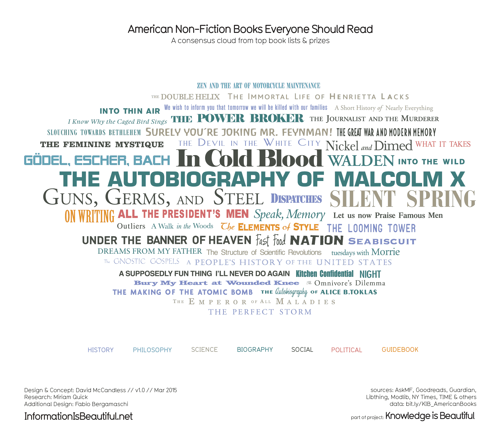
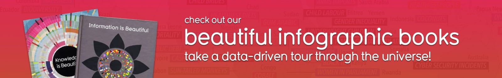

American Non-Fiction Books Everyone Should Read — Information is Beautiful

 

## Share this visualization

 [**  Facebook  51](https://facebook.com/sharer/sharer.php?u=https://informationisbeautiful.net/visualizations/american-non-fiction-books-everyone-should-read/)  [**  Twitter](https://twitter.com/intent/tweet?text=American%20Non-Fiction%20Books%20Everyone%20Should%20Read&via=infobeautiful&url=https://informationisbeautiful.net/visualizations/american-non-fiction-books-everyone-should-read/)  [**  StumbleUpon  6,110]()  [**  Pinterest  42](https://pinterest.com/pin/create/button/?url=https://informationisbeautiful.net/visualizations/american-non-fiction-books-everyone-should-read/&media=&description=American%20Non-Fiction%20Books%20Everyone%20Should%20Read%20%E2%80%94%20Information%20is%20Beautiful)  [**  Reddit](https://www.reddit.com/submit?url=https://informationisbeautiful.net/visualizations/american-non-fiction-books-everyone-should-read/&title=American%20Non-Fiction%20Books%20Everyone%20Should%20Read%20%E2%80%94%20Information%20is%20Beautiful)

From All The President’s Men to Zen And The Art Of Motorcycle Maintenance, which American Non-Fiction Books should be on your shelf, according to the experts? To mark American Independent [Bookstore Day](http://www.cabookstoreday.com/) we created this consensus cloud of recommendations from critics, awards and the public.

 

## Sources

Sources: AskMF, Goodreads, Guardian, Libthing, Modlib, NY Times, TIME & others

## Credits

Concept & design: [David McCandless](http://www.davidmccandless.com/)
Additional design: [Fabio Bergamaschi](http://www.fabiobergamaschi.com/)
Research: [Miriam Quick](https://twitter.com/miriamquick)
Data: http://bit.ly/KIB_AmericanBooks

## See the data

http://bit.ly/KIB_AmericanBooks

## Subjects

- [literature](https://informationisbeautiful.net/subject/literature)
- [pop-culture](https://informationisbeautiful.net/subject/pop-culture)

## Related visualizations

 [  ## Best Albums of 2017: The Consensus: Infographic](https://informationisbeautiful.net/visualizations/best-albums-of-2017-the-consensus-infographic/)  [  ## Who Old Are You?](https://informationisbeautiful.net/visualizations/who-old-are-you/)  [  ## A Taxonomy of Hipster Coffee-Shop Names](https://informationisbeautiful.net/visualizations/a-taxonomy-of-hipster-coffee-shop-names/)  [  ## American Novels Everyone Should Read](https://informationisbeautiful.net/visualizations/american-novels-everyone-should-read/)  [  ## How Much Do Music Artists Earn Online – 2015 Remix](https://informationisbeautiful.net/visualizations/how-much-do-music-artists-earn-online-2015-remix/)  [  ## Novels Everyone Should Read](https://informationisbeautiful.net/visualizations/novels-everyone-should-read/)