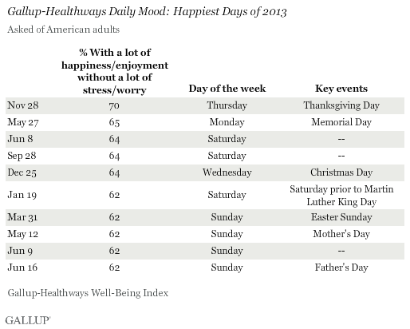
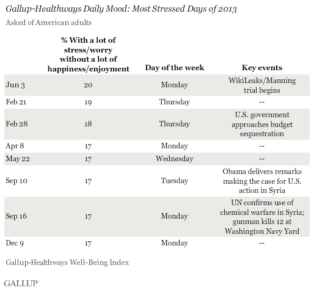
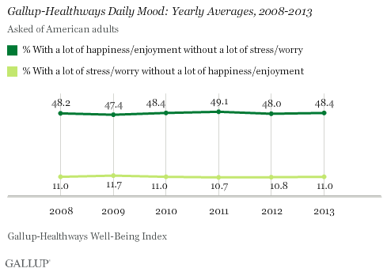

Americans' Moods Still Improve on Holidays and Weekends

Well-Being
 January 28, 2014

- [Share on Twitter](http://twitter.com/share?url=http%3A%2F%2Fnews.gallup.com%2Fpoll%2F167060%2Famericans-moods-improve-holidays-weekends.aspx%3Futm_source%3Dtwitterbutton%26utm_medium%3Dtwitter%26utm_campaign%3Dsharing&text=Americans%27%20Moods%20Still%20Improve%20on%20Holidays%20and%20Weekends&hashtags=)
- [Share on Facebook](http://www.facebook.com/sharer/sharer.php?u=http%3A%2F%2Fnews.gallup.com%2Fpoll%2F167060%2Famericans-moods-improve-holidays-weekends.aspx%3Futm_source%3Dfacebookbutton%26utm_medium%3Dfacebook%26utm_campaign%3Dsharing&t=Americans%27%20Moods%20Still%20Improve%20on%20Holidays%20and%20Weekends)
- [Share on LinkedIn](http://www.linkedin.com/shareArticle?mini=true&url=http%3A%2F%2Fnews.gallup.com%2Fpoll%2F167060%2Famericans-moods-improve-holidays-weekends.aspx%3Futm_source%3Dlinkedinbutton%26utm_medium%3Dlinkedin%26utm_campaign%3Dsharing&title=Americans%27%20Moods%20Still%20Improve%20on%20Holidays%20and%20Weekends&summary=Americans%27%20self-reported%20daily%20happiness%2C%20on%20average%2C%20ticked%20up%20slightly%20in%202013.%20Thanksgiving%20was%20the%20happiest%20day%2C%20while%20the%20most%20stressful%20days%20often%20coincided%20with%20negative%20news%20events%2C%20such%20as%20the%20federal%20budget%20sequestration.&source=news.gallup.com)
- [Share via Email](http://news.gallup.com/poll/167060/americans-moods-improve-holidays-weekends.aspxmailto:?subject=Gallup:%20Americans%27%20Moods%20Still%20Improve%20on%20Holidays%20and%20Weekends&body=http%3A%2F%2Fnews.gallup.com%2Fpoll%2F167060%2Famericans-moods-improve-holidays-weekends.aspx)

# Americans' Moods Still Improve on Holidays and Weekends

by Lindsey Sharpe

## Average daily happiness increased in 2013; stress levels held steady

WASHINGTON, D.C. -- The happiest day of 2013 fell on Thanksgiving Day, Nov. 28, with 70% of Americans reporting that they felt a lot of happiness and enjoyment without a lot of stress and worry. Thanksgiving has been one of the top three happiest days every year since 2008. Following closely last year were Memorial Day and Christmas Day.

****

The results for each year comprise more than 175,000 surveys, conducted daily as part of the Gallup-Healthways Well-Being Index. As part of the survey, interviewers read respondents a series of emotions and ask them to say whether they experienced each one "during a lot of the day yesterday." Gallup's [U.S. Mood Index](http://www.gallup.com/poll/151166/Mood-Weekly.aspx) tracks the percentage of U.S. adults who, reflecting on the day before they were surveyed, say they experienced a lot of happiness and enjoyment without a lot of stress and worry, and vice versa.

As is common, the majority of the year's happiest days fell on holidays and weekends. During these times, Americans are more likely to spend additional hours socializing with friends and family, which can increase enjoyment and decrease stress levels.

**High-Stress Days Often Coincide With Negative News**

Following a typical pattern, high-stress days in 2013 often accompanied high-profile negative news events, though other factors may be more influential in driving daily stress levels.

In 2013, the most stressful day of the year was Monday, June 3. While stress likely stemmed from beginning the workweek, this day also coincided with the beginning of the WikiLeaks trial involving Chelsea Manning (known at the time of the trial as Bradley Manning), who released classified military documents to the anti-secrecy website WikiLeaks in the largest security breach in U.S. history.

Feb. 21 and 28 followed closely in terms of high stress levels, as the U.S. federal government headed toward automatic budget sequestration and associated spending cuts, which negatively affected [Americans' economic confidence](http://www.gallup.com/poll/161243/economic-confidence-improves-post-sequester-slip.aspx).

Later in the year, Americans reported feeling a lot of stress and worry in September amid reports of potential U.S. involvement in the Syrian civil war.

****
**Americans' Daily Happiness Ticked Up Slightly, While Stress Stayed Level**

On average, 48.4% of Americans reported feeling a lot of happiness and enjoyment without a lot of stress and worry in 2013, a slight uptick from 48.0% in 2012. Americans' happiness is down from 2011 and the same as in 2010.

Those experiencing the opposite -- a lot of stress and worry without a lot of happiness and enjoyment -- remained stable at 11.0%, where it has hovered throughout the past six years. Americans' self-reported stress levels peak during the workweek, decline slightly on Fridays, and fall even more on weekends.

****

**Implications**

Despite 2013 being a year filled with economic and political uncertainty in the U.S. and around the world, stress levels remained steady and happiness increased slightly.

While mood is not indicative of a person's well-being, following the daily mood of the nation can provide insight into two of the elements that make up a person's well-being -- social relationships and physical health. When adults spend more time socially, happiness and enjoyment levels increase. Stress, on the other hand, can adversely affect physical health.

The happiest days of 2013 fell on holidays and weekends, when people tend to spend more hours interacting socially with friends and family, while the most stressful days fell within the workweek. Gallup research shows that [engaged employees report lower stress levels and better moods](http://www.gallup.com/poll/155924/Mondays-Not-Blue-Engaged-Employees.aspx) during the workweek than "not engaged" or "actively disengaged" employees. Business leaders can bolster well-being by engaging employees and creating a work environment that is conducive to employees being able to form and develop social relationships. Gallup research also shows that boosting social well-being in the workplace will benefit the employer, as well as the employee, by [increasing productivity](http://news.gallup.com/businessjournal/139373/business-case-wellbeing.aspx#2) and [improving overall well-being](http://thechairmansblog.gallup.com/2014/01/why-companies-are-losing-218-billion.html).

**About the Gallup-Healthways Well-Being Index**

The Gallup-Healthways Well-Being Index tracks well-being in the U.S. and provides best-in-class solutions for a healthier world. To learn more, please visit [well-beingindex.com](http://www.well-beingindex.com/).

##### Survey Methods

Results are based on telephone interviews conducted as part of the Gallup-Healthways Well-Being Index survey Jan. 3-Dec. 29, 2013, with a random sample of 175,000 adults, aged 18 and older, living in all 50 U.S. states and the District of Columbia.

For results based on the total sample of national adults, the margin of sampling error is ±1 percentage point at the 95% confidence level.

Interviews are conducted with respondents on landline telephones and cellular phones, with interviews conducted in Spanish for respondents who are primarily Spanish-speaking. Each sample of national adults includes a minimum quota of 50% cellphone respondents and 50% landline respondents, with additional minimum quotas by time zone within region. Landline and cellular telephone numbers are selected using random-digit-dial methods. Landline respondents are chosen at random within each household on the basis of which member had the most recent birthday.

Samples are weighted to correct for unequal selection probability, nonresponse, and double coverage of landline and cell users in the two sampling frames. They are also weighted to match the national demographics of gender, age, race, Hispanic ethnicity, education, region, population density, and phone status (cellphone only/landline only/both, cellphone mostly, and having an unlisted landline number). Demographic weighting targets are based on the most recent Current Population Survey figures for the aged 18 and older U.S. population. Phone status targets are based on the most recent National Health Interview Survey. Population density targets are based on the most recent U.S. census. All reported margins of sampling error include the computed design effects for weighting.

In addition to sampling error, question wording and practical difficulties in conducting surveys can introduce error or bias into the findings of public opinion polls.

For more details on Gallup's polling methodology, visit [www.gallup.com](http://www.gallup.com/).

## Get Articles in Related Topics:

- [USA](http://news.gallup.com/topic/country_usa.aspx),
- [All Gallup Headlines](http://news.gallup.com/topic/all_gallup_headlines.aspx),
- [Well-Being](http://news.gallup.com/topic/category_wellbeing.aspx),
- [Well-Being Index](http://news.gallup.com/topic/well_being_index.aspx),
- [Northern America](http://news.gallup.com/topic/world_region_northern_america.aspx)

**Subscribe to receive weekly Gallup News alerts.**
Never miss our latest insights.

[Sign Up](http://news.gallup.com/registration/default.aspx?g_source=subscribeblurb&g_medium=newsv9&g_campaign=articlebottom)