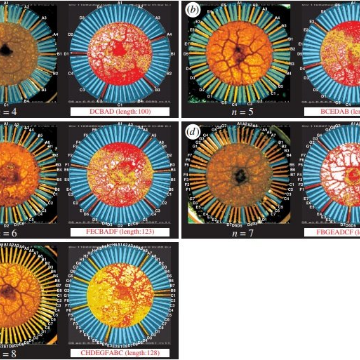

Amoeba finds approximate solutions to NP-hard problem in linear time

Amoeba finds approximate solutions to NP-hard problem in linear time

https://phys.org/news/2018-12-amoeba-approximate-solutions-np-hard-problem.html

Researchers have demonstrated that an amoeba—a single-celled organism consisting mostly of gelatinous protoplasm—has unique computing abilities that may one day offer a competitive alternative to the methods used by conventional computers.