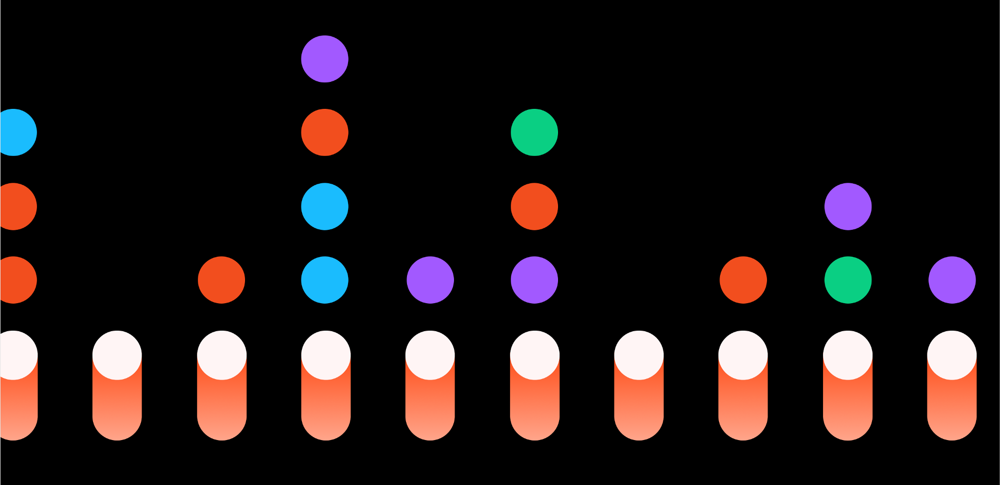
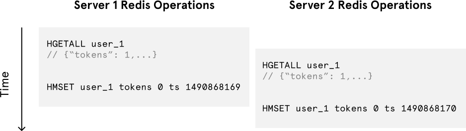
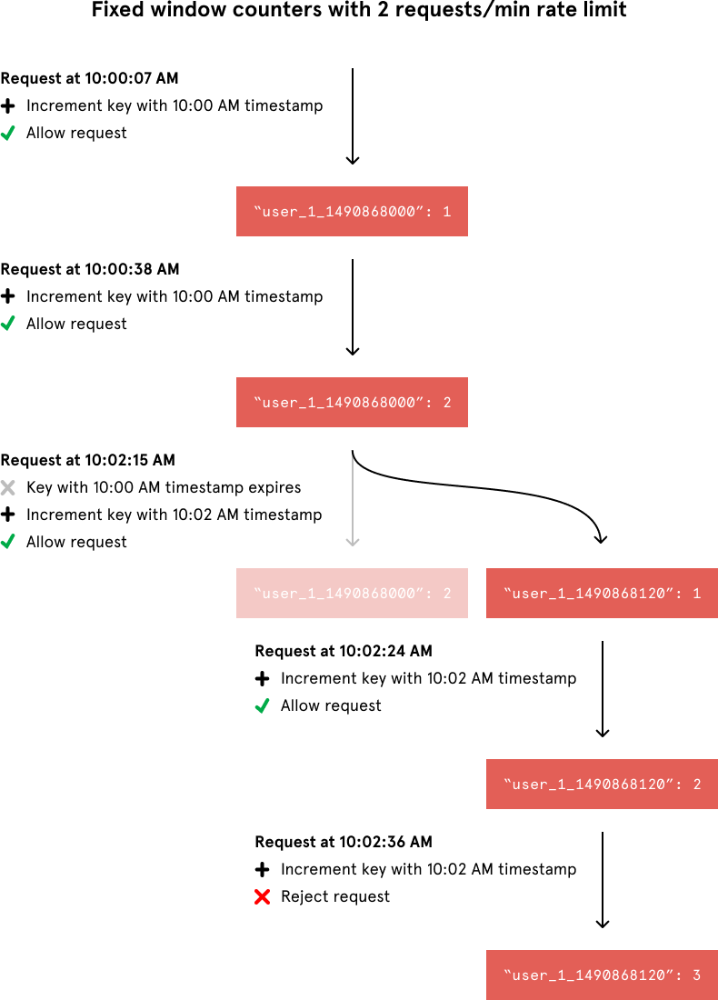
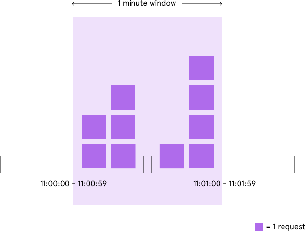
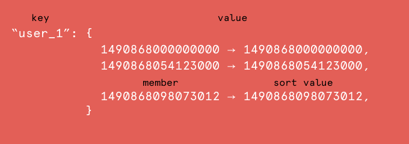
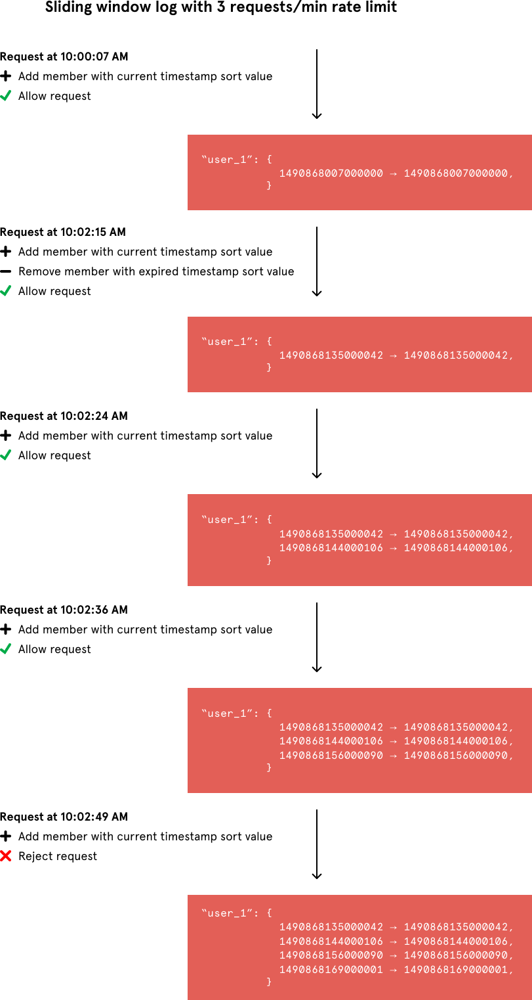
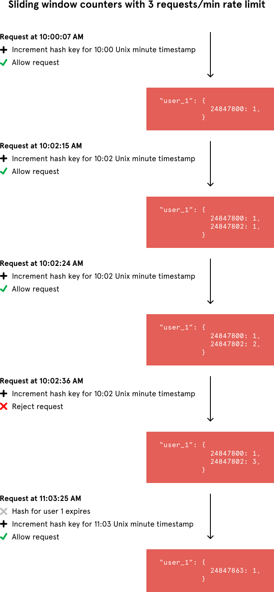
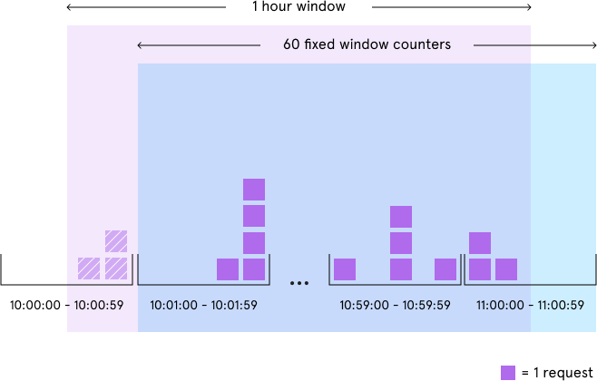

An Alternative Approach to Rate Limiting – Figma Design – Medium

# An Alternative Approach to Rate Limiting

A few weeks ago [at Figma](http://www.figma.com/), we experienced our first-ever spam attack. This proved the value of Figma’s rate limiter and finally put a stop to the longstanding joke that I had built it in vain.

During the attack, the spammers sent unsolicited invitations for documents to scores of email addresses. Had we not discovered the attack, we could have faced a huge surge in our delivery costs and a decline in our email sender reputation. Thankfully, we got wind of the attack early on and avoided this outcome because our rate limiter detected the spammers’ flurry of requests.

Our rate limiting system is homegrown, and I’d like to explain its design in case it’s useful to others. It combines a few standard techniques to control the rate at which people issue requests to your server, and it’s relatively accurate, simple, and space-efficient. If you’re a company building web applications at consumer scale, our rate limiter can prevent users from harming your website’s availability with a spate of requests. It also happens to be great at stopping spam attacks, as we discovered.

For those unfamiliar, a rate limiter caps how many requests a sender — this could be a user or an IP address — can issue in a specific window of time (e.g. 25 requests per minute). In Figma’s case, it also needed to:

- •store data externally so that the multiple machines running our web application could share it
- •not appreciably slow down web requests
- •efficiently eject outdated data
- •accurately limit excessive use of our web application
- •use as little memory as possible

The first three requirements were easy to meet. At Figma, we use two external data stores — Redis and PostgreSQL — and Redis was the better location to save tracking data. Redis is an in-memory data store that offers extremely quick reads and writes relative to PostgreSQL, an on-disk relational database. Even better, it’s simple to specify when Redis should delete expired data.

Finding a way to satisfy the last two requirements — accurately controlling web traffic and minimizing memory usage — was more of a challenge. Here are the existing rate limiter implementations I considered:

- •Token bucket
- •Fixed window counters
- •Sliding window log

Let’s look at how each of them work and compare them in terms of accuracy and memory usage. This will give us some context for the final approach we took to build the rate limiter that spared us from the spammers.

### Token bucket

A simple Google search for “rate limit algorithm” points us to the classic [token bucket algorithm](https://en.wikipedia.org/wiki/Token_bucket#Algorithm) (or [leaky bucket as a meter algorithm](https://en.wikipedia.org/wiki/Leaky_bucket#The_Leaky_Bucket_Algorithm_as_a_Meter)). For each unique user, we would record their last request’s Unix timestamp and available token count within a hash in Redis. We would store these two values in a hash rather than as two separate Redis keys for [memory efficiency](https://redis.io/topics/memory-optimization). An example hash would look like this:

*User 1 has two tokens left in their token bucket and made their last request on Thursday, March 30, 2017 at 10:00 GMT.*

Whenever a new request arrives from a user, the rate limiter would have to do a number of things to track usage. It would fetch the hash from Redis and refill the available tokens based on a chosen refill rate and the time of the user’s last request. Then, it would update the hash with the current request’s timestamp and the new available token count. When the available token count drops to zero, the rate limiter knows the user has exceeded the limit.

*If User 1’s token bucket empties faster than it refills and no tokens are left, User 1 has exceeded the rate limit.*

Despite the token bucket algorithm’s elegance and tiny memory footprint, its Redis operations aren’t atomic. In a distributed environment, the “read-and-then-write” behavior creates a race condition, which means the rate limiter can at times be too lenient.

*If only a single token remains and two servers’ Redis operations interleave, both requests would be let through.*

Imagine if there was only one available token for a user and that user issued multiple requests. If two separate processes served each of these requests and concurrently read the available token count before either of them updated it, each process would think the user had a single token left and that they had not hit the rate limit.

Our token bucket implementation could achieve atomicity if each process were to fetch a [Redis lock](https://redis.io/topics/distlock) for the duration of its Redis operations. This, however, would come at the expense of slowing down concurrent requests from the same user and introducing another layer of complexity. Alternatively, we could make the token bucket’s Redis operations atomic [via Lua scripting](https://gist.github.com/ptarjan/e38f45f2dfe601419ca3af937fff574d#request-rate-limiter). For simplicity, however, I decided to avoid the unnecessary complications of adding another language to our codebase.

### Fixed window counters

As a second approach, I considered fixed window counters. It’s a simple, memory-efficient algorithm that records the number of requests from a sender occurring in the rate limit’s time interval. Unlike the token bucket algorithm, this approach’s Redis operations are atomic. Each request would increment a Redis key that included the request’s timestamp. A given Redis key might look like this:

*User 1 has made 1 request between 10:00:00 AM GMT and 10:00:59 GMT on Thursday, March 30, 2017.*

When incrementing the request count for a given timestamp, we would compare its value to our rate limit to decide whether to reject the request. We would also tell Redis to expire the key when the current minute passed to ensure that stale counters didn’t stick around forever.

*When the value of the latest Redis key exceeds the request threshold, User 1 has exceeded the rate limit.*

Although the fixed window approach offers a straightforward mental model, it can sometimes let through twice the number of allowed requests per minute. For example, if our rate limit were 5 requests per minute and a user made 5 requests at 11:00:59, they could make 5 more requests at 11:01:00 because a new counter begins at the start of each minute. Despite a rate limit of 5 requests per minute, we’ve now allowed 10 requests in less than one minute!

*If we count requests in fixed minute windows, we could let through up to twice the number of allowed requests per minute.*

We could avoid this issue by adding another rate limit with a smaller threshold and shorter enforcement window — e.g. 2 requests per second in addition to 5 requests per minute — but this would overcomplicate the rate limit. Arguably, it would also impose too severe of a restriction on how often the user could make requests.

### Sliding window log

The final rate limiter implementation I considered optimizes for accuracy — it just stores a timestamp for each request. [As Peter Hayes describes](https://engineering.classdojo.com/blog/2015/02/06/rolling-rate-limiter/), we could efficiently track all of a user’s requests in a single sorted set.

*User 1’s three requests on Thursday, March 30, 2017 at 10:00:00, 10:00:54, and 10:01:38 GMT are sorted by Unix microsecond timestamp.*

When the web application processes a request, it would insert a new member into the sorted set with a sort value of the Unix microsecond timestamp. This would allow us to efficiently remove all of the set’s members with outdated timestamps and count the size of the set afterward. The sorted set’s size would then be equal to the number of requests in the most recent sliding window of time.

*When the size of User 1’s sorted set exceeds the request threshold, User 1 has exceeded the rate limit.*

Both this algorithm and the fixed window counters approach share an atomic “write-and-then-read” Redis operation sequence, but the former produces a notable side effect. Namely, the rate limiter continues to count requests even after the user exceeds the rate limit. I was comfortable with this behavior, as it would just extend a ban on a malicious user rather than letting their requests through as soon as the window of time had passed.

While the precision of the sliding window log approach may be useful for a developer API, it leaves a considerably large memory footprint because it stores a value for every request. This wasn’t ideal for Figma. A single rate limit of 500 requests per day per user on a website with 10,000 active users per day could hypothetically mean storing 5,000,000 values in Redis. If each stored timestamp value in Redis were even a 4-byte integer, this would take ~20 MB (4 bytes per timestamp * 10,000 users * 500 requests/user = 20,000,000 bytes).

### Sliding window counters

Ultimately, the last two rate limiter approaches — fixed window counters and sliding window log — inspired the algorithm that stopped the spammers. We count requests from each sender using multiple fixed time windows 1/60th the size of our rate limit’s time window.

For example, if we have an hourly rate limit, we increment counters specific to the current Unix minute timestamp and calculate the sum of all counters in the past hour when we receive a new request. To reduce our memory footprint, we store our counters in a Redis hash — they offer [extremely efficient storage when they have fewer than 100 keys](https://redis.io/topics/memory-optimization). When each request increments a counter in the hash, it also sets the hash to expire an hour later. In the event that a user makes requests every minute, the user’s hash can grow large from holding onto counters for bygone timestamps. We prevent this by regularly removing these counters when there are a considerable number of them.

*When the sum of the counters with timestamps in the past hour exceeds the request threshold, User 1 has exceeded the rate limit.*

Let’s compare the memory usage of this algorithm with our calculation from the sliding window log algorithm. If we have a rate limit of 500 requests per day per user on a website with 10,000 active users, we would at most need to store ~600,000 values in Redis. That comes out to a memory footprint of ~2.4 MB (4 bytes per counter * 60 counters * 10,000 users = 2,400,000 bytes). This is a bit more scalable.

### Practical considerations

Using fixed window counters with a 1:60 ratio between the counter’s time window and the rate limit’s enforcement time window, our rate limiter was accurate down to the second and significantly minimized memory usage. In practice, however, a large enforcement time window — e.g. one hour — slightly reduced the precision of the rate limiter. This is best illustrated through an example: For an hourly rate limit, when the rate limiter checks usage at 11:00:35, it ignores the requests that occurred between 10:00:00 and 10:00:59.

*If we count requests in 60 fixed minute windows and check the number of requests when we’re within a fixed minute window, we may undercount the total number of requests in the last hour. Above, the rate limiter ignores the three requests that occurred between 10:00:00 and 10:00:59.*

This slight degree of variable leniency — up to 59 seconds — may be acceptable depending on your use case. In our situation, however, we preferred for our rate limiter to sometimes be a tad harsher instead of slightly lenient, so I calculated the sum of all counters in the last hour and one minute whenever the current timestamp wasn’t divisible by 60. Variable restrictiveness could even be useful in discouraging programmatic scripting against the site.

Finally, we had to reflect on how to respond to users who exceeded the rate limit. Traditionally, web applications respond to requests from users who surpass the rate limit with a HTTP response code of 429. Our rate limiter initially did so as well. But in the case of Figma’s spam attack, our attackers saw the response code change from 200 to 429 and simply created new accounts to circumvent the rate limiting on their blocked accounts. In response, we implemented a [shadow ban](https://en.wikipedia.org/wiki/Stealth_banning): On the surface, the attackers continued to receive a 200 HTTP response code, but behind the scenes we simply stopped sending document invitations after they exceeded the rate limit.