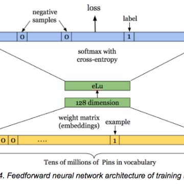

An Introduction to Deep Learning for Tabular Data · fast.ai

An Introduction to Deep Learning for Tabular Data · fast.ai

http://www.fast.ai/2018/04/29/categorical-embeddings/

An Introduction to Deep Learning for Tabular Data Written: 29 Apr 2018 by Rachel Thomas [ technical ] There is a powerful technique that is winning Kaggle competitions and is widely used at Google ( according to Jeff Dean ), Pinterest , and Instacart , yet that many people don’t even realize is possible: the use of deep learning for tabular data , and in particular, the creation of embeddings for categorical variables . Despite what you may have heard, you can use deep learning for the type of data you might keep in a SQL database, a Pandas DataFrame, or an Excel spreadsheet (including time-series data). I will refer to this as