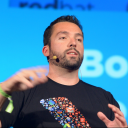

An Introduction to Go (CERN)

# An Introduction to Go (CERN)

A three-parts talk, each of one hour, covering the basic aspects of Go including type system, concurrency, standard library, and tooling.

There was a lot of live coding on days 2 and 3, so those will seem quite light in content. Videos will be published eventually.

 

#### [Francesc Campoy Flores](https://speakerdeck.com/campoy)

February 15, 2019

 [Tweet](https://twitter.com/intent/tweet?url=https://speakerdeck.com/campoy/an-introduction-to-go-cern&text=An+Introduction+to+Go+%28CERN%29)

[Project tracking, teamwork & client reporting like you've never seen before.](https://srv.carbonads.net/ads/click/x/GTND42QMCTAD45QJFT7LYKQMCWYD5K7LF6SD6Z3JCWBIT27ECTAIP53KC6BIPK3UFTSDVK3EHJNCLSIZ?segment=placement:speakerdeckcom;)[ads via Carbon](http://carbonads.net/?utm_source=speakerdeckcom&utm_medium=ad_via_link&utm_campaign=in_unit&utm_term=carbon)