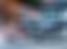
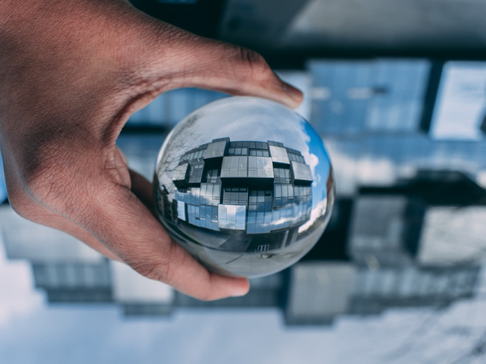
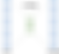
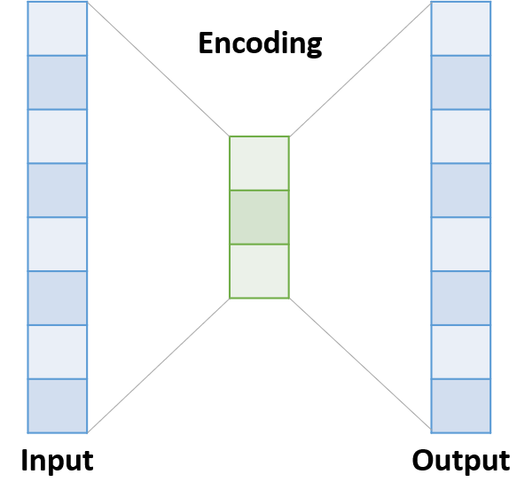
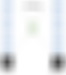
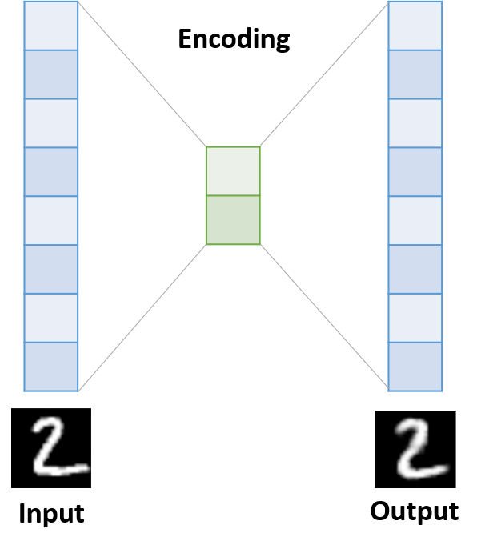
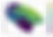
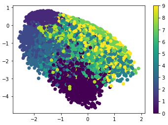

An Intuitive Explanation to AutoEncoders – Towards Data Science

# An Intuitive Explanation to AutoEncoders

## and how to implement them in Keras

[Ali Masri](https://towardsdatascience.com/@alimasri1991)

Jun 4·4 min read

Photo by [Aditya Chinchure](https://unsplash.com/@adityachinchure?utm_source=medium&utm_medium=referral) on [Unsplash](https://unsplash.com/?utm_source=medium&utm_medium=referral)

### **Motivation**

Many of the recent deep learning models rely on extracting complex features from data. The goal is to transform the input from its raw format, to another representation calculated by the neural network. This representation contains features that describe hidden unique characteristics about the input.

Consider a dataset of people faces, where each input is an image of a person. The representation of an image in its raw format is too complex to be used by machines. Instead, why not make the neural network automatically calculate important features for each face, something maybe like: eye type, nose type, distance between eyes, nose position, etc. Well, this sounds interesting… Using these features, we could easily **compare two faces**,** find similar faces**, **generate new faces**, and many other interesting applications.

This concept is called **Encoding** since we are generating an encoded version of the data. In this article, we will learn more about encodings, how calculate them using **AutoEncoders**, and finally how to implement them in** Keras**.

### **AutoEncoders**

An **AutoEncoder **is a strange neural network, because both its input and output are the same. So, it is a network that tries to learn itself! This is crazy I know but you will see why this is useful.

Suppose we have the following neural network:

- •An input layer with 100 neurons
- •A Hidden layer with 3 neurons
- •An output layer with 100 neurons (same as the input layer)

Now what happens if we fit the neural network to take the input and tries to predict the same value in the output? Does not this mean that the network learned how to represent a 100-dimensions-input with only 3-dimensions *(number of neurons in the hidden layer)*, then to reconstruct the same input again? In addition, these 3-dimensions or features seem enough to represent what an input value describes. Well this is very interesting. It is like when compressing files. We reduce the file size, but we can uncompress it again and get the same data. In fact, it is not exactly the same data in AutoEncoders since they are lossy, but you got the point.

### **Objective**

We will use the famous **MNIST **digits dataset to demonstrate the idea. The goal is to generate a 2D encoding from a given 28*28 image. So, we are implementing a dimensionality reduction algorithm using AutoEncoders! Cool right? Let us start…

### **Time to Code**

First, we import the dataset:
from keras.datasets import mnist
(data, labels), (_, _) = mnist.load_data()
Need to reshape and rescale:
data = data.reshape(-1, 28*28) / 255.
Time to define the network. We need three layers:

- •An input layer with size 28*28
- •A hidden layer with size 2
- •An output layer with size 28*28

from keras import models, layers
input_layer = layers.Input(shape=(28*28,))
encoding_layer = layers.Dense(2)(input_layer)
decoding_layer = layers.Dense(28*28) (encoding_layer)
autoencoder = models.Model(input_layer, decoding_layer)

Let us compile and train… We will fit the model using a binary cross entropy loss between the pixel values:

autoencoder.compile('adam', loss='binary_crossentropy')
autoencoder.fit(x = data, y = data, epochs=5)
Did you notice the trick? **X = data** and **y = data** as well.

After fitting the model, the network is supposed to learn how to calculate the hidden encodings. But we still have to extract the layer responsible for this. In the following, we define a new model where we remove the final layer since we do not need it anymore:

encoder = models.Model(input_layer, encoding_layer)

Now instead of predicting the final output, we are predicting only the hidden representation. Look how we use it:

encodings = encoder.predict(data)

That is it! Now your *encodings *variable is an (n, m) array where n is the number of examples and m is the number of dimensions. The first column is the first feature and the second column is the second one. But what are those features? Actually, we do not know. We only know that they are well representatives of each input value.

Let us plot them and see what we get.

Beautiful! See how the neural network learned the hidden features. Clearly it learned the different characteristics for each digit and how they are distributed in a 2D space. Now we could use these features for visualizations, clustering or any other purpose…

### **Final Thoughts**

In this article we learned about AutoEncoders and how to apply them for dimensionality reduction. AutoEncoders are very powerful and used in many modern neural network architectures. In future posts, you will learn about more complex Encoder/Decoder networks.