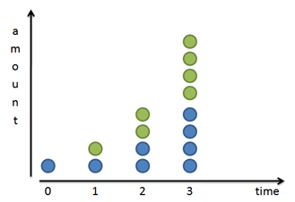
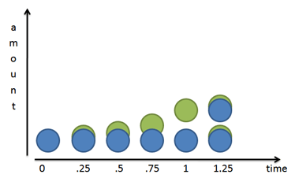
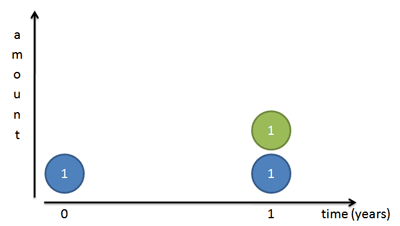
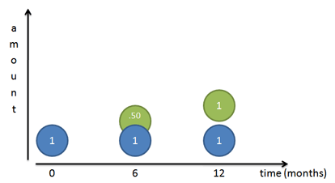
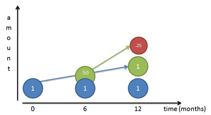
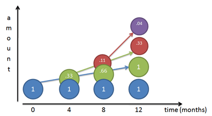
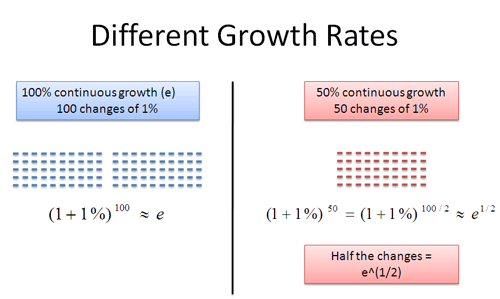

An Intuitive Guide To Exponential Functions & e – BetterExplained

[*Learn Right, Not Rote*](https://betterexplained.com/)

- [Home](https://betterexplained.com/)
- [All Articles](https://betterexplained.com/archives/)
- [Popular](https://betterexplained.com/cheatsheet/)
- [Calculus Guide](https://betterexplained.com/guides/calculus/)
- [Contact](https://betterexplained.com/contact/)
- [Feedback](https://betterexplained.com/feedback/)
- [Newsletter](https://betterexplained.com/newsletter/)
- [About](https://betterexplained.com/about/)

 

## BetterExplained Books for Kindle and Print

Concrete math lessons that slice through the jargon.
 [**Math, Better Explained on Amazon**](https://amzn.to/MathBetterExplained)
 [**Calculus, Better Explained on Amazon**](https://bit.ly/CalcBEAmazonKindle)

# An Intuitive Guide To Exponential Functions & e

[Home](https://betterexplained.com/)›[Math](https://betterexplained.com/articles/category/math/), [Popular](https://betterexplained.com/articles/category/popular/)›

**e** has always bothered me — not the letter, but the **mathematical constant**. What does it really mean?

Math books and even my beloved [Wikipedia](https://en.wikipedia.org/wiki/E_(mathematical_constant)) describe e using obtuse jargon:

>
> The mathematical constant e is the base of the natural logarithm.
And when you look up the natural logarithm you get:
>

> The natural logarithm, formerly known as the hyperbolic logarithm, is the logarithm to the base e, where e is an irrational constant approximately equal to 2.718281828459.

Nice circular reference there. It’s like a dictionary that defines labyrinthine with Byzantine: it’s correct but not helpful. What’s wrong with everyday words like “complicated”?

I’m not picking on Wikipedia — many math explanations are dry and formal in their quest for rigor. But this doesn’t help beginners trying to get a handle on a subject (and we were all a beginner at one point).

No more! Today I’m sharing my **intuitive, high-level** insights about what e is and why it rocks. Save your rigorous math book for another time. Here’s a quick video overview of the insights:

## e is NOT Just a Number

Describing e as “a constant approximately 2.71828…” is like calling **pi** “an irrational number, approximately equal to 3.1415…”. Sure, it’s true, but you completely missed the point.

**Pi is the ratio between circumference and diameter shared by all circles**. It is a fundamental ratio inherent in all circles and therefore impacts any calculation of circumference, area, volume, and surface area for circles, spheres, cylinders, and so on. Pi is important and shows all circles are related, not to mention the trigonometric functions derived from circles (sin, cos, tan).

**e is the base rate of growth shared by all continually growing processes.** e lets you take a simple growth rate (where all change happens at the end of the year) and find the impact of compound, continuous growth, where every nanosecond (or faster) you are growing just a little bit.

e shows up whenever systems grow exponentially and continuously: population, radioactive decay, interest calculations, and more. Even jagged systems that don’t grow smoothly can be approximated by e.

Just like every number can be considered a scaled version of 1 (the base unit), every circle can be considered a scaled version of the unit circle (radius 1), and every rate of growth can be considered a scaled version of e (unit growth, perfectly compounded).

So e is not an obscure, seemingly random number. **e represents the idea that all continually growing systems are scaled versions of a common rate.**

## Understanding Exponential Growth

Let's start by looking at a basic system that **doubles** after an amount of time. For example,

- Bacteria can split and “doubles” every 24 hours
- We get [twice as many noodles](https://www.youtube.com/watch?v=auhHl5-6VdY) when we fold them in half.
- Your money doubles every year if you get 100% return (lucky!)

And it looks like this:

Splitting in two or doubling is a very common progression. Sure, we can triple or quadruple, but doubling is convenient, so hang with me here.

Mathematically, if we have x splits then we get 2x times as much stuff than when we started. With 1 split we have 21 or 2 times as much. With 4 splits we have 24 = 16 times as much. As a general formula:

Said another way, doubling is 100% growth. We can rewrite our formula like this:

It’s the same equation, but we separate 2 into what it really is: the original value (1) plus 100%. Clever, eh?

Of course, we can substitute any number (50%, 25%, 200%) for 100% and get the growth formula for that new rate. So the general formula for x periods of return is:

This just means we use our rate of return, (1 + return), “x” times.

## A Closer Look

Our formula assumes growth happens in discrete steps. Our bacteria are waiting, waiting, and then **boom**, they double at the very last minute. Our interest earnings magically appear at the 1 year mark. Based on the formula above, growth is punctuated and happens instantly. The green dots suddenly appear.

The world isn’t always like this. If we zoom in, we see that our bacterial friends split over time:

Mr. Green doesn’t just show up: he slowly grows out of Mr. Blue. After 1 unit of time (24 hours in our case), Mr. Green is complete. He then becomes a mature blue cell and can create new green cells of his own.

Does this information change our equation?

Nope. In the bacteria case, the half-formed green cells still can’t do anything until they are fully grown and separated from their blue parents. The equation still holds.

## Money Changes Everything

But money is different. As soon as we earn a penny of interest, that penny can start earning micro-pennies of its own. We don’t need to wait until we earn a complete dollar in interest — fresh money doesn’t need to mature.

Based on our *old formula*, interest growth looks like this:

But again, this isn’t quite right: all the interest appears on the last day. Let’s zoom in and split the year into two chunks. We earn 100% interest every year, or 50% every 6 months. So, we earn 50 cents the first 6 months and another 50 cents in the last half of the year:

But this **still** isn’t right! Sure, our original dollar (Mr. Blue) earns a dollar over the course of a year. But after 6 months we had a 50-cent piece, ready to go, that we neglected! That 50 cents could have earned money on its own:

Because our rate is 50% per half year, that 50 cents would have earned 25 cents (50% times 50 cents). At the end of 1 year we’d have

- Our original dollar (Mr. Blue)
- The dollar Mr. Blue made (Mr. Green)
- The 25 cents Mr. Green made (Mr. Red)

Giving us a total of $2.25. We gained $1.25 from our initial dollar, even better than doubling!

Let’s turn our return into a formula. The growth of two half-periods of 50% is:

## Diving into Compound Growth

It’s time to step it up a notch. Instead of splitting growth into two periods of 50% increase, let’s split it into 3 segments of 33% growth. Who says we have to wait for 6 months before we start getting interest? Let’s get more granular in our counting.

Charting our growth for 3 compounded periods gives a funny picture:

Think of each color as shoveling money upwards towards the other colors (its children), at 33% per period:

- **Month 0:** We start with Mr. Blue at $1.
- **Month 4:** Mr. Blue has earned 1/3 dollar on himself, and creates Mr. Green, shoveling along 33 cents.
- **Month 8:** Mr. Blue earns another 33 cents and gives it to Mr. Green, bringing Mr. Green up to 66 cents. Mr. Green has actually earned 33% on his previous value, creating 11 cents (33% * 33 cents). This 11 cents becomes Mr. Red.
- **Month 12:** Things get a bit crazy. Mr. Blue earns another 33 cents and shovels it to Mr. Green, bringing Mr. Green to a full dollar. Mr. Green earns 33% return on his Month 8 value (66 cents), earning 22 cents. This 22 cents gets added to Mr. Red, who now totals 33 cents. And Mr. Red, who started at 11 cents, has earned 4 cents (33% * .11) on his own, creating Mr. Purple.

Phew! The final value after 12 months is: 1 + 1 + .33 + .04 or about 2.37.
Take some time to really understand what’s happening with this growth:

- Each color earns interest on itself and hands it off to another color. The newly-created money can earn money of its own, and on the cycle goes.
- I like to think of the original amount (Mr. Blue) as never changing. Mr. Blue shovels money to create Mr. Green, a steady 33 every 4 months since Mr. Blue does not change. In the diagram, Mr. Blue has a blue arrow showing how he feeds Mr. Green.
- Mr. Green just happens to create and feed Mr. Red (green arrow), but Mr. Blue isn’t aware of this.
- As Mr. Green grows over time (being constantly fed by Mr. Blue), he contributes more and more to Mr. Red. Between months 4-8 Mr. Green gives 11 cents to Mr. Red. Between months 8-12 Mr. Green gives 22 cents to Mr. Red, since Mr. Green was at 66 cents during Month 8. If we expanded the chart, Mr. Green would give 33 cents to Mr. Red, since Mr. Green reached a full dollar by Month 12.

Make sense? It’s tough at first — I even confused myself a bit while putting the charts together. But see that each dollar creates little helpers, who in turn create helpers, and so on.

We get a formula by using 3 periods in our growth equation:

We earned $1.37, even better than the $1.25 we got last time!

## Can We Get Infinite Money?

Why not take even shorter time periods? How about every month, day, hour, or even nanosecond? Will our returns skyrocket?

Our return gets better, but only to a point. Try using different numbers of n in our magic formula to see our total return:

	n          (1 + 1/n)^n
	-----------------------
	1          2
	2          2.25
	3          2.37
	5          2.488
	10         2.5937
	100        2.7048
	1,000      2.7169
	10,000     2.71814
	100,000    2.718268
	1,000,000  2.7182804
	...

The numbers get bigger and converge around 2.718. Hey… wait a minute… that looks like e!

Yowza. In geeky math terms, e is **defined** to be that rate of growth if we continually compound 100% return on smaller and smaller time periods:

This limit appears to converge, and there are [proofs](http://planetmath.org/convergenceofthesequence11nn) to that effect. But as you can see, as we take finer time periods the total return stays around 2.718.

## But what does it all mean?

The number e (2.718…) is the **maximum possible result** when compounding 100% growth for one time period. Sure, you started out expecting to grow from 1 to 2 (that’s a 100% increase, right?). But with each tiny step forward you create a little dividend that starts growing on its own. When all is said and done, you end up with e (2.718…) at the end of 1 time period, not 2. e is the maximum, what happens when we compound 100% as much as possible.

So, if we start with $1.00 and compound continuously at 100% return we get 1e. If we start with $2.00, we get 2e. If we start with $11.79, we get 11.79e.

e is like a speed limit (like c, the speed of light) saying how fast you can possibly grow using a continuous process. You might not always reach the speed limit, but it’s a reference point: you can write every rate of growth in terms of this universal constant.

(Aside: Be careful about separating the *increase* from the final *result*. 1 becoming e (2.718…) is an *increase* (growth rate) of 171.8%. e, by itself, is the final *result* you observe after all growth is taken into account (original + increase)).

## What about different rates?

Good question. What if we grow at 50% annually, instead of 100%? Can we still use e?

Let’s see. The rate of 50% compound growth would look like this:

Hrm. What can we do here? Remember, 50% is the total return, and n is the number of periods to split the growth into for compounding. If we pick n=50, we can split our growth into 50 chunks of 1% interest:

Sure, it’s not infinity, but it’s pretty granular. Now imagine we also divided our regular rate of 100% into chunks of 1%:

Ah, something is emerging here. In our regular case, we have 100 cumulative changes of 1% each. In the 50% scenario, we have 50 cumulative changes of 1% each.

What is the difference between the two numbers? Well, it’s just half the number of changes:

This is pretty interesting. 50 / 100 = .5, which is the exponent we raise e to. This works in general: if we had a 300% growth rate, we could break it into 300 chunks of 1% growth. This would be triple the normal amount for a net rate of e3.

Even though growth can look like addition (+1%), we need to remember that it’s really a multiplication (x 1.01). This is why we use exponents (repeated multiplication) and square roots (e1/2 means “half” the number of changes, i.e. half the number of multiplications).

Although we picked 1%, we could have chosen any small unit of growth (.1%, .0001%, or even an infinitely small amount!). The key is that for any rate we pick, it’s just a new exponent on e:

## What about different times?

Suppose we have 300% growth for 2 years. We’d multiply one year’s growth (e3) by itself:

And in general:

Because of the magic of exponents, we can avoid having two powers and just multiply rate and time together in a single exponent.

## The big secret: e merges rate and time.

This is wild! ex can mean two things:

- x is the number of times we multiply a growth rate: 100% growth for 3 years is e3
- x is the growth rate itself: 300% growth for one year is e3

Won’t this overlap confuse things? Will our formulas break and the world come to an end?

**It all works out.** When we write:

the variable **x** is a combination of rate and time.

Let me explain. When dealing with continuous compound growth, 10 years of 3% growth has the same overall impact as 1 year of 30% growth (and no growth afterward).

- 10 years of 3% growth means 30 changes of 1%. These changes happen over 10 years, so you are growing continuously at 3% per year.
- 1 period of 30% growth means 30 changes of 1%, but happening in a single year. So you grow for 30% a year and stop.

**The same “30 changes of 1%” happen in each case.** The faster your rate (30%) the less time you need to grow for the same effect (1 year). The slower your rate (3%) the longer you need to grow (10 years).

But in both cases, the growth is e.30 = 1.35 in the end. We’re impatient and prefer large, fast growth to slow, long growth but e shows they have the same net effect.

So, our general formula becomes:

If we have a return of **r** for **t** time periods, our net compound growth is ert. This even works for negative and fractional returns, by the way.

## Example Time!

Examples make everything more fun. A quick note: We’re so used to formulas like 2x and regular, compound interest that it’s easy to get confused (myself included). Read more about [simple, compound and continuous growth](https://betterexplained.com/articles/a-visual-guide-to-simple-compound-and-continuous-interest-rates/).

These examples focus on **smooth, continuous growth**, not the jumpy growth that happens at yearly intervals. There are ways to convert between them, but we’ll save that for another article.

**Example 1: Growing crystals**

Suppose I have 300kg of magic crystals. They’re magic because they grow throughout the day: I watch a single crystal, and in the course of 24 hours it sheds off its own weight in crystals. (The baby crystals start growing immediately at the same rate, but I can’t track that — I’m watching how much the original sheds). How much will I have after 10 days?

Well, since the crystals start growing immediately, we want **continuous growth**. Our rate is 100% every 24 hours, so after 10 days we get: 300 · e1 · 10 = 6.6 million kg of our magic gem.

This can be tricky: notice the difference between the *input rate* and the total output rate. The “input” rate is how much a single crystal changes: 100% in 24 hours. The net output rate is e (2.718x) because the baby crystals grow on their own.

In this case we have the input rate (how fast one crystal grows) and want the total result after compounding (how fast the entire group grows because of the baby crystals). If we have the total growth rate and want the rate of a single crystal, we work backwards and use the [natural log](https://betterexplained.com/articles/demystifying-the-natural-logarithm-ln/).

**Example 2: Maximum interest rates**

Suppose I have $120 in an account with 5% interest. My bank is generous and gives me the maximum possible compounding. How much will I have after 10 years?

Our rate is 5%, and we’re lucky enough to compound continuously. After 10 years, we get $120 · e.05 · 10 = $197.85. Of course, most banks aren’t nice enough to give you the best possible rate. The difference between your actual return and the continuous one is how much they don’t like you.

**Example 3: Radioactive decay**

I have 10kg of a radioactive material, which appears to continuously decay at a rate of 100% per year. How much will I have after 3 years?

Zip? Zero? Nothing? Think again.

Decaying continuously at 100% per year is the trajectory we start off with. Yes, we do begin with 10kg and expect to “lose it all” by the end of the year, since we’re decaying at 10 kg/year.

We go a few months and get to 5kg. Half a year left? Nope! Now we’re losing at a rate of 5kg/year, so we have another full year from this moment!

We wait a few more months, and get to 2kg. And of course, now we’re decaying at a rate of 2kg/year, so we have a full year (from this moment). We get 1 kg, have a full year, get to .5 kg, have a full year — see the pattern?

As time goes on, we lose material, but our rate of decay slows down. This constantly changing growth is the essence of continuous growth & decay.

After 3 years, we’ll have 10 · e-1 · 3 = .498 kg. We use a negative exponent for decay — we want a fraction (1/ert) vs a growth multiplier (ert). [Decay is commonly given in terms of "half life" -- we'll talk about converting these rates in a future article.]

**More Examples**

If you want fancier examples, try the [Black-Scholes option formula](https://en.wikipedia.org/wiki/Black-Scholes) (notice e used for exponential decay in value) or [radioactive decay](https://en.wikipedia.org/wiki/Exponential_decay). The goal is to see ert in a formula and understand why it’s there: it’s modeling a type of growth or decay.

And now you know why it’s “e”, and not pi or some other number: e raised to “r*t” gives you the growth impact of rate r and time t.

## There’s More To Learn

My goal was to:

- **Explain why e is important:** It’s a fundamental constant, like pi, that shows up in growth rates.
- **Give an intuitive explanation:** e lets you see the impact of any growth rate. Every new “piece” (Mr. Green, Mr. Red, etc.) helps add to the total growth.
- **Show how it’s used:**  ex lets you predict the impact of any growth rate and time period.
- **Get you hungry for more:** In the upcoming articles, I’ll dive into other properties of e.

This article is just the start — cramming everything into a single page would tire you and me both. Dust yourself off, take a break and learn about e’s evil twin, the [natural logarithm](https://betterexplained.com/articles/demystifying-the-natural-logarithm-ln/).

### Join Over 450k Monthly Readers

Enjoy the article? There's plenty more to help you build a lasting, intuitive understanding of math. Join the newsletter for bonus content and the latest updates.

## Other Posts In This Series

1. An Intuitive Guide To Exponential Functions & e

2. [Demystifying the Natural Logarithm (ln)](https://betterexplained.com/articles/demystifying-the-natural-logarithm-ln/)

3. [A Visual Guide to Simple, Compound and Continuous Interest Rates](https://betterexplained.com/articles/a-visual-guide-to-simple-compound-and-continuous-interest-rates/)

4. [Understanding Exponents (Why does 0^0 = 1?)](https://betterexplained.com/articles/understanding-exponents-why-does-00-1/)

5. [Using Logarithms in the Real World](https://betterexplained.com/articles/using-logs-in-the-real-world/)

6. [How To Think With Exponents And Logarithms](https://betterexplained.com/articles/think-with-exponents/)

#### In This Series

1. An Intuitive Guide To Exponential Functions & e

2. [Demystifying the Natural Logarithm (ln)](https://betterexplained.com/articles/demystifying-the-natural-logarithm-ln/)

3. [A Visual Guide to Simple, Compound and Continuous Interest Rates](https://betterexplained.com/articles/a-visual-guide-to-simple-compound-and-continuous-interest-rates/)

4. [Understanding Exponents (Why does 0^0 = 1?)](https://betterexplained.com/articles/understanding-exponents-why-does-00-1/)

5. [Using Logarithms in the Real World](https://betterexplained.com/articles/using-logs-in-the-real-world/)

6. [How To Think With Exponents And Logarithms](https://betterexplained.com/articles/think-with-exponents/)

#### About The Site

BetterExplained helps 450k monthly readers with friendly, insightful math lessons ([more](https://betterexplained.com/about/)).

#### Calculus Course

Calculus insights within minutes. Free to [read online](https://betterexplained.com/calculus).

#### Math, Better Explained

  A dozen [math essentials](https://betterexplained.com/ebook/math). Amazon bestseller.

“If you can't explain it simply, you don't understand it well enough.” —Einstein ([more](https://betterexplained.com/philosophy)) | [Privacy](https://betterexplained.com/privacy) | [CC-BY-NC-SA](https://betterexplained.com/about)

[Twitter](https://twitter.com/betterexplained)[Youtube](https://www.youtube.com/user/betterexplained)[Reddit](https://reddit.com/r/betterexplained)[Rss](https://betterexplained.com/feed/)