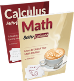
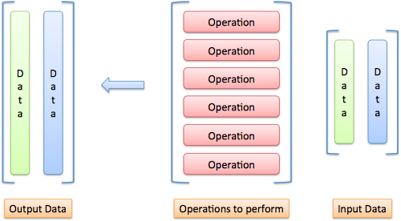
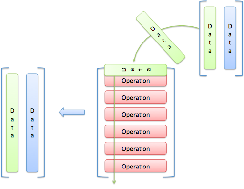
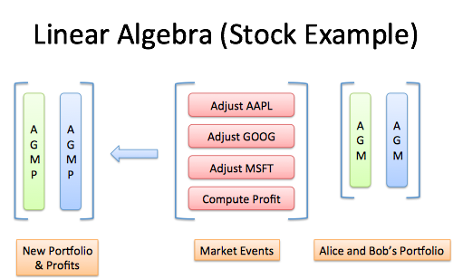
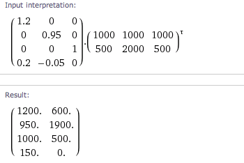
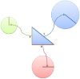

An Intuitive Guide to Linear Algebra – BetterExplained

[*Learn Right, Not Rote*](https://betterexplained.com/)

- [Home](https://betterexplained.com/)
- [All Articles](https://betterexplained.com/archives/)
- [Popular](https://betterexplained.com/cheatsheet/)
- [Calculus Guide](https://betterexplained.com/guides/calculus/)
- [Contact](https://betterexplained.com/contact/)
- [Feedback](https://betterexplained.com/feedback/)
- [Newsletter](https://betterexplained.com/newsletter/)
- [About](https://betterexplained.com/about/)

 

## BetterExplained Books for Kindle and Print

Concrete math lessons that slice through the jargon.
 [**Math, Better Explained on Amazon**](https://amzn.to/MathBetterExplained)
 [**Calculus, Better Explained on Amazon**](https://bit.ly/CalcBEAmazonKindle)

# An Intuitive Guide to Linear Algebra

[Home](https://betterexplained.com/)›[Math](https://betterexplained.com/articles/category/math/), [Popular](https://betterexplained.com/articles/category/popular/)›

Despite two linear algebra classes, my knowledge consisted of “Matrices, determinants, eigen something something”.

Why? Well, let’s try this course format:

- Name the course *Linear Algebra* but focus on things called matrices and vectors
- Teach concepts like Row/Column order with mnemonics instead of explaining the reasoning
- Favor abstract examples (2d vectors! 3d vectors!) and avoid real-world topics until the final week

The survivors are physicists, graphics programmers and other masochists. We missed the key insight:

**Linear algebra gives you mini-spreadsheets for your math equations.**

We can take a table of data (a matrix) and create updated tables from the original. It’s the power of a spreadsheet written as an equation.

Here’s the linear algebra introduction I wish I had, with a real-world stock market example.

## What’s in a name?

“Algebra” means, roughly, “relationships”. Grade-school algebra explores the relationship between unknown numbers. Without knowing x and y, we can still work out that (x + y)2 = x2 + 2xy + y2.

“Linear Algebra” means, roughly, “line-like relationships”. Let’s clarify a bit.

Straight lines are predictable. Imagine a rooftop: move forward 3 horizontal feet (relative to the ground) and you might rise 1 foot in elevation (The slope! Rise/run = 1/3). Move forward 6 feet, and you’d expect a rise of 2 feet. Contrast this with climbing a dome: each horizontal foot forward raises you a different amount.

Lines are nice and predictable:

- If 3 feet forward has a 1-foot rise, then going 10x as far should give a 10x rise (30 feet forward is a 10-foot rise)
- If 3 feet forward has a 1-foot rise, and 6 feet has a 2-foot rise, then (3 + 6) feet should have a (1 + 2) foot rise

In math terms, an operation F is linear if scaling inputs scales the output, and adding inputs adds the outputs:

In our example, F(x) calculates the rise when moving forward x feet, and the properties hold:

## Linear Operations

An operation is a calculation based on some inputs. Which operations are linear and predictable? Multiplication, it seems.

Exponents (F(x) = x2) aren’t predictable: 102 is 100, but 202 is 400. We doubled the input but quadrupled the output.

Surprisingly, regular addition isn’t linear either. Consider the “add three” function:

We doubled the input and did not double the output. (Yes, F(x) = x + 3 happens to be the equation for an *offset* line, but it’s still not “linear” because F(10) isn’t 10 * F(1). Fun.)

Our only hope is to multiply by a constant: F(x) = ax (in our roof example, a=1/3). However, we can still combine linear operations to make a new linear operation:

G is made of 3 linear subpieces: if we double the inputs, we’ll double the output.

We have “mini arithmetic”: multiply inputs by a constant, and add the results. It’s actually useful because we can split inputs apart, analyze them individually, and combine the results:

If the inputs interacted differently (like exponents, say), we couldn’t separate them — we’d have to analyze everything at once.

## Organizing Inputs and Operations

Most courses hit you in the face with the details of a matrix. “Ok kids, let’s learn to speak. Select a subject, verb and object. Next, conjugate the verb. Then, add the prepositions…”

**No!** Grammar is not the focus. What’s the key idea?

- We have a bunch of inputs to track
- We have predictable, linear operations to perform (our “mini-arithmetic”)
- We generate a result, perhaps transforming it again

Ok. First, how should we track a bunch of inputs? How about a list:

	x
	y
	z

Not bad. We could write it (x, y, z) too — hang onto that thought.

Next, how should we track our operations? Remember, we only have “mini arithmetic”: multiplications, with a final addition. If our operation F behaves like this:

We could abbreviate the entire function as (3, 4, 5). We know to multiply the first input by the first value, the second input by the second value, etc., and add the result.

Only need the first input?

Let’s spice it up: how should we handle multiple sets of inputs? Let’s say we want to run operation F on both (a, b, c) and (x, y, z). We could try this:

But it won’t work: F expects 3 inputs, not 6. We should separate the inputs into groups:

	1st Input  2nd Input
	--------------------
	a          x
	b          y
	c          z

Much neater.

And how could we run the same input through several operations? Have a row for each operation:

	F: 3 4 5
	G: 3 0 0

Neat. We’re getting organized: inputs in vertical columns, operations in horizontal rows.

## Visualizing The Matrix

Words aren’t enough. Here’s how I visualize inputs, operations, and outputs:

Imagine “pouring” each input through each operation:

As an input passes an operation, it creates an output item. In our example, the input (a, b, c) goes against operation F and outputs 3a + 4b + 5c. It goes against operation G and outputs 3a + 0 + 0.

Time for the red pill. A matrix is a shorthand for our diagrams:

A matrix is a single variable representing a spreadsheet of inputs or operations.

**Trickiness #1: The reading order**

Instead of an input => matrix => output flow, we use function notation, like y = f(x) or f(x) = y. We usually write a matrix with a capital letter (F), and a single input column with lowercase (x). Because we have several inputs (A) and outputs (B), they’re considered matrices too:

**Trickiness #2: The numbering**

Matrix size is measured as RxC: row count, then column count, and abbreviated “m x n” (I hear ya, “r x c” would be easier to remember). Items in the matrix are referenced the same way: aij is the ith row and jth column (I hear ya, “i” and “j” are easily confused on a chalkboard). Mnemonics are ok *with context*, and here’s what I use:

- RC, like Roman Centurion or RC Cola
- Use an “L” shape. Count down the L, then across

Why does RC ordering make sense? Our operations matrix is 2×3 and our input matrix is 3×2. Writing them together:

	[Operation Matrix] [Input Matrix]
	[operation count x operation size] [input size x input count]
	[m x n] [p x q] = [m x q]
	[2 x 3] [3 x 2] = [2 x 2]

Notice the matrices touch at the “size of operation” and “size of input” (n = p). They should match! If our inputs have 3 components, our operations should expect 3 items. In fact, we can *only* multiply matrices when n = p.

The output matrix has m operation rows for each input, and q inputs, giving a “m x q” matrix.

## Fancier Operations

Let’s get comfortable with operations. Assuming 3 inputs, we can whip up a few 1-operation matrices:

- Adder: [1 1 1]
- Averager: [1/3 1/3 1/3]

The “Adder” is just a + b + c. The “Averager” is similar: (a + b + c)/3 = a/3 + b/3 + c/3.

Try these 1-liners:

- First-input only: [1 0 0]
- Second-input only: [0 1 0]
- Third-input only: [0 0 1]

And if we merge them into a single matrix:

	[1 0 0]
	[0 1 0]
	[0 0 1]

Whoa — it’s the “identity matrix”, which copies 3 inputs to 3 outputs, unchanged. How about this guy?

	[1 0 0]
	[0 0 1]
	[0 1 0]

He reorders the inputs: (x, y, z) becomes (x, z, y).
And this one?

	[2 0 0]
	[0 2 0]
	[0 0 2]

He’s an input doubler. We could rewrite him to `2*I` (the identity matrix) if we were so inclined.

And yes, when we decide to treat inputs as vector coordinates, the operations matrix will transform our vectors. Here’s a [few examples](http://blog.stata.com/2011/03/03/understanding-matrices-intuitively-part-1/):

- Scale: make all inputs bigger/smaller
- Skew: make certain inputs bigger/smaller
- Flip: make inputs negative
- Rotate: make new coordinates based on old ones (East becomes North, North becomes West, etc.)

These are geometric interpretations of multiplication, and how to warp a vector space. Just remember that vectors are *examples* of data to modify.

## A Non-Vector Example: Stock Market Portfolios

Let’s practice linear algebra in the real world:

- Input data: stock portfolios with dollars in Apple, Google and Microsoft stock
- Operations: the changes in company values after a news event
- Output: updated portfolios

And a bonus output: let’s make a new portfolio listing the net profit/loss from the event.

Normally, we’d track this in a spreadsheet. Let’s learn to think with linear algebra:

- The input vector could be ($Apple, $Google, $Microsoft), showing the dollars in each stock. (Oh! These dollar values could come from *another* matrix that multiplied the number of shares by their price. Fancy that!)
- The 4 output operations should be: Update Apple value, Update Google value, Update Microsoft value, Compute Profit

Visualize the problem. Imagine running through each operation:

The key is understanding *why* we’re setting up the matrix like this, not blindly crunching numbers.

Got it? Let’s introduce the scenario.

Suppose a secret iDevice is launched: Apple jumps 20%, Google drops 5%, and Microsoft stays the same. We want to adjust each stock value, using something similar to the identity matrix:

	New Apple     [1.2  0      0]
	New Google    [0    0.95   0]
	New Microsoft [0    0      1]

The new Apple value is the original, increased by 20% (Google = 5% decrease, Microsoft = no change).

Oh wait! We need the overall profit:
Total change = (.20 * Apple) + (-.05 * Google) + (0 * Microsoft)
Our final operations matrix:

	New Apple       [1.2  0      0]
	New Google      [0    0.95   0]
	New Microsoft   [0    0      1]
	Total Profit    [.20  -.05   0]

Making sense? Three inputs enter, four outputs leave. The first three operations are a “modified copy” and the last brings the changes together.

Now let’s feed in the portfolios for Alice ($1000, $1000, $1000) and Bob ($500, $2000, $500). We can crunch the numbers by hand, or use a Wolfram Alpha ([calculation](https://www.wolframalpha.com/input/?i=++++%7B%7B1.2%2C0%2C0%7D%2C%7B0%2C0.95%2C0%7D%2C%7B0%2C0%2C1%7D%2C%7B.2%2C+-.05%2C+0%7D%7D+.+Transpose%28%5B%7B1000%2C+1000%2C+1000%7D%2C%7B500%2C2000%2C500%7D%5D%29)):

(Note: Inputs should be in columns, but it’s easier to type rows. The Transpose operation, indicated by t (tau), converts rows to columns.)

The final numbers: Alice has $1200 in AAPL, $950 in GOOG, $1000 in MSFT, with a net profit of $150. Bob has $600 in AAPL, $1900 in GOOG, and $500 in MSFT, with a net profit of $0.

What’s happening? **We’re doing math with our own spreadsheet.** Linear algebra emerged in the 1800s yet spreadsheets were invented in the 1980s. I blame the gap on poor linear algebra education.

## Historical Notes: Solving Simultaneous equations

An *early* use of tables of numbers (not yet a “matrix”) was bookkeeping for linear systems:

becomes

We can avoid hand cramps by adding/subtracting rows in the matrix and output, vs. rewriting the full equations. As the matrix evolves into the identity matrix, the values of x, y and z are revealed on the output side.

This process, called Gauss-Jordan elimination, saves time. However, linear algebra is mainly about matrix transformations, not solving large sets of equations (it’d be like using Excel for your shopping list).

## Terminology, Determinants, and Eigenstuff

Words have technical categories to describe their use (nouns, verbs, adjectives). Matrices can be similarly subdivided.

Descriptions like “upper-triangular”, “symmetric”, “diagonal” are the shape of the matrix, and influence their transformations.

The **determinant** is the “size” of the output transformation. If the input was a unit vector (representing area or volume of 1), the determinant is the size of the transformed area or volume. A determinant of 0 means matrix is “destructive” and cannot be reversed (similar to multiplying by zero: information was lost).

The **eigenvector** and **eigenvalue** represent the “axes” of the transformation.

Consider spinning a globe: every location faces a new direction, except the poles.

An “eigenvector” is an input that doesn’t change direction when it’s run through the matrix (it points “along the axis”). And although the direction doesn’t change, the size might. The eigenvalue is the amount the eigenvector is scaled up or down when going through the matrix.

(My intuition here is weak, and I’d like to explore more. Here’s a [nice diagram](https://en.wikipedia.org/wiki/File:Eigenvectors.gif) and [video](https://www.youtube.com/watch?v=wXCRcnbCsJA).)

## Matrices As Inputs

A funky thought: we can treat the operations matrix as inputs!

Think of a recipe as a list of commands (*Add 2 cups of sugar, 3 cups of flour…*).

What if we want the metric version? Take the instructions, treat them like text, and convert the units. The recipe is “input” to modify. When we’re done, we can follow the instructions again.

An operations matrix is similar: commands to modify. Applying one operations matrix to another gives a new operations matrix that applies *both* transformations, in order.

If N is “adjust for portfolio for news” and T is “adjust portfolio for taxes” then applying both:

TN = X

means “Create matrix X, which first adjusts for news, and then adjusts for taxes”. Whoa! We didn’t need an input portfolio, we applied one matrix directly to the other.

The beauty of linear algebra is representing an entire spreadsheet calculation with a single letter. Want to apply the same transformation a few times? Use N2 or N3.

## Can We Use Regular Addition, Please?

Yes, because you asked nicely. Our “mini arithmetic” seems limiting: multiplications, but no addition? Time to expand our brains.

Imagine adding a dummy entry of 1 to our input: (x, y, z) becomes (x, y, z, 1).

Now our operations matrix has an extra, known value to play with! If we want `x + 1` we can write:

	[1 0 0 1]

And `x + y - 3` would be:

	[1 1 0 -3]

Huzzah!

Want the geeky explanation? We’re pretending our input exists in a 1-higher dimension, and put a “1” in that dimension. We *skew* that higher dimension, which looks like a *slide* in the current one. For example: take input (x, y, z, 1) and run it through:

	[1 0 0 1]
	[0 1 0 1]
	[0 0 1 1]
	[0 0 0 1]

The result is (x + 1, y + 1, z + 1, 1). Ignoring the 4th dimension, every input got a +1. We keep the dummy entry, and can do more slides later.

Mini-arithmetic isn’t so limited after all.

## Onward

I’ve overlooked some linear algebra subtleties, and I’m not too concerned. Why?

These metaphors are helping me *think* with matrices, more than the classes I “aced”. I can finally respond to “Why is linear algebra useful?” with “Why are spreadsheets useful?”

They’re not, unless you want a tool used to attack nearly every real-world problem. Ask a businessman if they’d rather donate a kidney or be banned from Excel forever. That’s the impact of linear algebra we’ve overlooked: efficient notation to bring spreadsheets into our math equations.

Happy math.

### Join Over 450k Monthly Readers

Enjoy the article? There's plenty more to help you build a lasting, intuitive understanding of math. Join the newsletter for bonus content and the latest updates.

## Other Posts In This Series

1. [A Visual, Intuitive Guide to Imaginary Numbers](https://betterexplained.com/articles/a-visual-intuitive-guide-to-imaginary-numbers/)

2. [Intuitive Arithmetic With Complex Numbers](https://betterexplained.com/articles/intuitive-arithmetic-with-complex-numbers/)

3. [Understanding Why Complex Multiplication Works](https://betterexplained.com/articles/understanding-why-complex-multiplication-works/)

4. [Intuitive Guide to Angles, Degrees and Radians](https://betterexplained.com/articles/intuitive-guide-to-angles-degrees-and-radians/)

5. [Intuitive Understanding Of Euler's Formula](https://betterexplained.com/articles/intuitive-understanding-of-eulers-formula/)

6. [An Interactive Guide To The Fourier Transform](https://betterexplained.com/articles/an-interactive-guide-to-the-fourier-transform/)

7. [Intuitive Understanding of Sine Waves](https://betterexplained.com/articles/intuitive-understanding-of-sine-waves/)

8. An Intuitive Guide to Linear Algebra

9. [A Programmer's Intuition for Matrix Multiplication](https://betterexplained.com/articles/matrix-multiplication/)

#### In This Series

1. [A Visual, Intuitive Guide to Imaginary Numbers](https://betterexplained.com/articles/a-visual-intuitive-guide-to-imaginary-numbers/)

2. [Intuitive Arithmetic With Complex Numbers](https://betterexplained.com/articles/intuitive-arithmetic-with-complex-numbers/)

3. [Understanding Why Complex Multiplication Works](https://betterexplained.com/articles/understanding-why-complex-multiplication-works/)

4. [Intuitive Guide to Angles, Degrees and Radians](https://betterexplained.com/articles/intuitive-guide-to-angles-degrees-and-radians/)

5. [Intuitive Understanding Of Euler's Formula](https://betterexplained.com/articles/intuitive-understanding-of-eulers-formula/)

6. [An Interactive Guide To The Fourier Transform](https://betterexplained.com/articles/an-interactive-guide-to-the-fourier-transform/)

7. [Intuitive Understanding of Sine Waves](https://betterexplained.com/articles/intuitive-understanding-of-sine-waves/)

8. An Intuitive Guide to Linear Algebra

9. [A Programmer's Intuition for Matrix Multiplication](https://betterexplained.com/articles/matrix-multiplication/)

#### About The Site

BetterExplained helps 450k monthly readers with friendly, insightful math lessons ([more](https://betterexplained.com/about/)).

#### Calculus Course

Calculus insights within minutes. Free to [read online](https://betterexplained.com/calculus).

#### Math, Better Explained

  A dozen [math essentials](https://betterexplained.com/ebook/math). Amazon bestseller.

“If you can't explain it simply, you don't understand it well enough.” —Einstein ([more](https://betterexplained.com/philosophy)) | [Privacy](https://betterexplained.com/privacy) | [CC-BY-NC-SA](https://betterexplained.com/about)

[Twitter](https://twitter.com/betterexplained)[Youtube](https://www.youtube.com/user/betterexplained)[Reddit](https://reddit.com/r/betterexplained)[Rss](https://betterexplained.com/feed/)