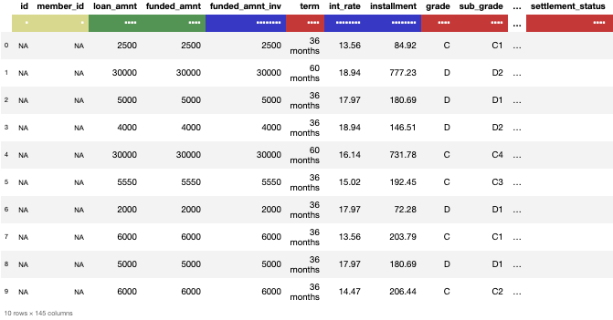
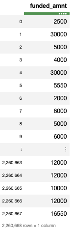
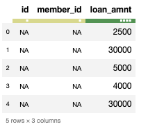

An Overview of Python’s Datatable package – Towards Data Science

# An Overview of Python’s Datatable package

## Python library for efficient multi-threaded data processing, with the support for out-of-memory datasets.

[Parul Pandey](https://towardsdatascience.com/@parulnith)
Jun 1·7 min read

Photo by [Johannes Groll](https://unsplash.com/@followhansi?utm_source=medium&utm_medium=referral) on [Unsplash](https://unsplash.com/?utm_source=medium&utm_medium=referral)

***> “There were 5 Exabytes of information created between the dawn of civilization through 2003, but that much information is now created every 2 days”:Eric Schmidt***

If you are an R user, chances are that you have already been using the `data.table` package. `[Data.table](https://cran.r-project.org/web/packages/data.table/data.table.pdf)` is an extension of the `[data.frame](https://www.rdocumentation.org/packages/base/versions/3.6.0/topics/data.frame)` package in R. It’s also the go-to package for R users when it comes to the fast aggregation of large data (including 100GB in RAM).

The R’s `data.table` package is a very versatile and a high-performance package due to its ease of use, convenience and programming speed. It is a fairly famous package in the R community with over 400k downloads per month and almost 650 CRAN and Bioconductor packages using it([source](https://github.com/Rdatatable/data.table/wiki)).

So, what is in it for the Python users? Well, the good news is that there also exists a Python counterpart to the`data.table` package called `datatable `which has a clear focus on big data support, high performance, both in-memory and out-of-memory datasets, and multi-threaded algorithms. In a way, it can be called as [***data.table***](https://github.com/Rdatatable/data.table)***’s ***younger sibling.

* * *

*...*

### Datatable

Modern machine learning applications need to process a humongous amount of data and generate multiple features. This is necessary in order to build models with greater accuracy. Python’s `datatable` module was created to address this issue. It is a toolkit for performing big data (up to 100GB) operations on a single-node machine, at the maximum possible speed. The development of datatable is sponsored by [H2O.ai](https://www.h2o.ai/) and the first user of `datatable` was [Driverless.ai](https://www.h2o.ai/driverless-ai/).

This toolkit resembles [pandas](https://github.com/pandas-dev/pandas) very closely but is more focussed on speed and big data support.*  *Python’s*  *`datatable` also strives to achieve good user experience, helpful error messages, and a powerful API. In this article, we shall see how we can use datatable and how it scores over pandas when it comes to large datasets.

* * *

*...*

### Installation

On MacOS, datatable can be easily installed with pip:
pip install datatable
On Linux, installation is achieved with a binary distribution as follows:

# If you have Python 3.5

pip install https://s3.amazonaws.com/h2o-release/datatable/stable/datatable-0.8.0/datatable-0.8.0-cp35-cp35m-linux_x86_64.whl

# If you have Python 3.6

pip install https://s3.amazonaws.com/h2o-release/datatable/stable/datatable-0.8.0/datatable-0.8.0-cp36-cp36m-linux_x86_64.whl

*Currently, datatable does not work on Windows but work is being done to add support for Windows also.*

For more information see [Build instructions](https://datatable.readthedocs.io/en/latest/install.html).

* * *

*...*

The code for this article can be accessed from the associated [Github Repository](https://github.com/parulnith/An-Overview-of-Python-s-Datatable-package) or can be viewed on my binder by clicking the image below.

* * *

*...*

### Reading the Data

The dataset being used has been taken from Kaggle and belongs to the [*Lending Club Loan Data Dataset*](https://www.kaggle.com/wendykan/lending-club-loan-data#loan.csv)*. *The dataset consists of complete loan data for all loans issued through the 2007–2015, including the current loan status (Current, Late, Fully Paid, etc.) and latest payment information. The file consists of **2.26 Million rows **and **145 columns**. The data size is ideal to demonstrate the capabilities of the datatable library.

# Importing necessary Libraries

import numpy as np
import pandas as pd
import datatable as dt

Let’s load in the data into the `Frame` object. The fundamental unit of analysis in datatable is a `Frame`. It is the same notion as a pandas DataFrame or SQL table: data arranged in a two-dimensional array with rows and columns.

**With datatable**
%%time
datatable_df = dt.fread("data.csv")
____________________________________________________________________
CPU times: user 30 s, sys: 3.39 s, total: 33.4 s
Wall time: 23.6 s

The `fread()` function above is both powerful and extremely fast. It can automatically detect and parse parameters for the majority of text files, load data from .zip archives or URLs, read Excel files, and much more.

Additionally, the datatable parser :

- •Can automatically detect separators, headers, column types, quoting rules, etc.
- •Can read data from multiple sources including file, URL, shell, raw text, archives and glob.
- •Provides multi-threaded file reading for maximum speed
- •Includes a progress indicator when reading large files
- •Can read both [RFC4180](https://tools.ietf.org/html/rfc4180)-compliant and non-compliant files.

**With pandas**
Now, let us calculate the time taken by pandas to read the same file.
%%time
pandas_df= pd.read_csv("data.csv")
___________________________________________________________
CPU times: user 47.5 s, sys: 12.1 s, total: 59.6 s
Wall time: 1min 4s

The results show that datatable clearly outperforms pandas when reading large datasets. Whereas pandas take more than a minute, datatable only takes seconds for the same.

* * *

*...*

### Frame Conversion

The existing Frame can also be converted into a numpy or pandas dataframe as follows:

numpy_df = datatable_df.to_numpy()
pandas_df = datatable_df.to_pandas()

Let’s convert our existing frame into a pandas dataframe object and compare the time taken.

%%time
datatable_pandas = datatable_df.to_pandas()
___________________________________________________________________
CPU times: user 17.1 s, sys: 4 s, total: 21.1 s
Wall time: 21.4 s

It appears that reading a file as a datatable frame and then converting it to pandas dataframe takes less time than reading through pandas dataframe. ***Thus, it might be a good idea to import a large data file through datatable and then convert it to pandas dataframe.***

type(datatable_pandas)
___________________________________________________________________
pandas.core.frame.DataFrame

* * *

*...*

### Basic Frame Properties

Let’s look at some of the basic properties of a datatable frame which are similar to the pandas’ properties:

print(datatable_df.shape) # (nrows, ncols)
print(datatable_df.names[:5]) # top 5 column names
print(datatable_df.stypes[:5]) # column types(top 5)
______________________________________________________________
(2260668, 145)
('id', 'member_id', 'loan_amnt', 'funded_amnt', 'funded_amnt_inv')
(stype.bool8, stype.bool8, stype.int32, stype.int32, stype.float64)
We can also use the `head` command to output the top ‘n’ rows.
datatable_df.head(10)

A glimpse of the first 10 rows of the datatable frame

The colour signifies the datatype where **red** denotes string,** green** denotes int and **blue** stands for float.

* * *

*...*

### Summary Statistics

Calculating the summary stats in pandas is a memory consuming process but not anymore with datatable. We can compute the following per-column summary stats using datatable:

datatable_df.sum() datatable_df.nunique()
datatable_df.sd() datatable_df.max()
datatable_df.mode() datatable_df.min()
datatable_df.nmodal() datatable_df.mean()

Let’s calculate the **mean** of the columns using both datatable and pandas to measure the time difference.

**With datatable**
%%time
datatable_df.mean()
_______________________________________________________________
CPU times: user 5.11 s, sys: 51.8 ms, total: 5.16 s
Wall time: 1.43 s
**With pandas**
pandas_df.mean()
__________________________________________________________________
Throws memory error.

The above command cannot be completed in pandas as it starts throwing memory error.

* * *

*...*

### Data Manipulation

Data Tables like dataframes are columnar data structures. In datatable, the primary vehicle for all these operations is the **square-bracket notation** inspired by traditional matrix indexing but with more functionalities.

datatable’s **square-bracket notation**

The same DT[i, j] notation is used in mathematics when indexing matrices, in C/C++, in R, in pandas, in numpy, etc. Let’s see how we can perform common data manipulation activities using datatable:

#### #Selecting Subsets of Rows/Columns

The following code selects all rows and the `funded_amnt` column from the dataset.

datatable_df[:,'funded_amnt']

Here is how we can select the first 5 rows and 3 columns
datatable_df[:5,:3]

#### #Sorting the Frame

**With datatable**

Sorting the frame by a particular column can be accomplished by `datatable` as follows:

%%time
datatable_df.sort('funded_amnt_inv')
_________________________________________________________________
CPU times: user 534 ms, sys: 67.9 ms, total: 602 ms
Wall time: 179 ms
**With pandas:**
%%time
pandas_df.sort_values(by = 'funded_amnt_inv')
___________________________________________________________________
CPU times: user 8.76 s, sys: 2.87 s, total: 11.6 s
Wall time: 12.4 s
Notice the substantial time difference between datable and pandas.

#### #Deleting Rows/Columns

Here is how we can delete the column named `member_id`:
del datatable_df[:, 'member_id']

#### #GroupBy

Just like in pandas, datatable also has the groupby functionalities. Let’s see how we can get the mean of `funded_amount` column grouped by the `grade` column.

**With datatable**
%%time
for i in range(100):
datatable_df[:, dt.sum(dt.f.funded_amnt), dt.by(dt.f.grade)]
____________________________________________________________________
CPU times: user 6.41 s, sys: 1.34 s, total: 7.76 s
Wall time: 2.42 s
**With pandas**
%%time
for i in range(100):
pandas_df.groupby("grade")["funded_amnt"].sum()
____________________________________________________________________
CPU times: user 12.9 s, sys: 859 ms, total: 13.7 s
Wall time: 13.9 s
**What does .f stand for?**

`f `stands for `frame proxy`, and provides a simple way to refer to the Frame that we are currently operating upon. In the case of our example, `dt.f` simply stands for `dt_df`.

#### #Filtering Rows

The syntax for filtering rows is pretty similar to that of GroupBy. Let us filter those rows of `loan_amnt`for which the values of `loan_amnt` are greater than `funded_amnt`.

datatable_df[dt.f.loan_amnt>dt.f.funded_amnt,"loan_amnt"]

* * *

*...*

### Saving the Frame

It is also possible to write the Frame’s content into a `csv` file so that it can be used in future.

datatable_df.to_csv('output.csv')

For more data manipulation functions, refer to the [**documentation**](https://datatable.readthedocs.io/en/latest/using-datatable.html) page.

* * *

*...*

### Conclusion

The datatable module definitely speeds up the execution as compared to the default pandas and this definitely is a boon when working on large datasets. However, datatable lags behind pandas in terms of the functionalities. But since datatable is still undergoing active development, we might see some major additions to the library in the future.

* * *

*...*

### References

- •R’s [data.table](https://github.com/Rdatatable/data.table/wiki)
- •[Datatable documentation](https://datatable.readthedocs.io/en/latest/index.html)
- •[Getting started with Python datatable](https://www.kaggle.com/sudalairajkumar/getting-started-with-python-datatable): A wonderful Kaggle Kernel on the usage of datatable